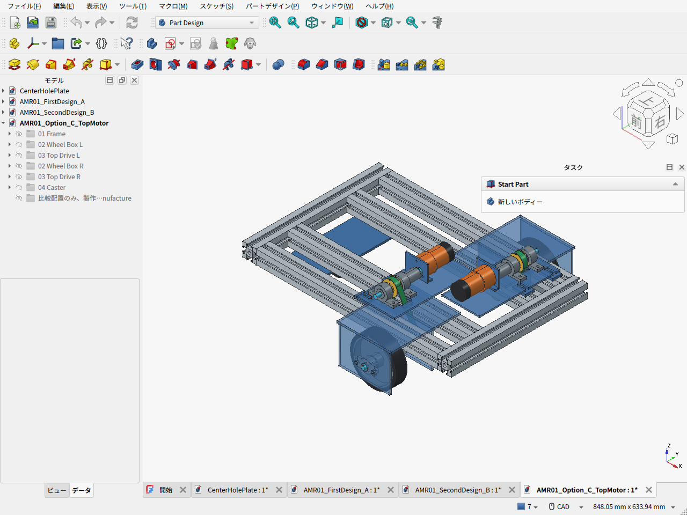

# amr-pj — 家庭向け小型AMR / 将来MoMa

家庭内用の小型AMRから、将来の移動マニピュレータ化を目指す設計プロジェクト。意匠用の外装より、荷重支持・機器配置・整備性と費用を優先する。

現行の比較設計は **第二案B（v0.5.0）：フレーム下の同軸モーター＋車輪を内外軸受で挟む金属箱形支持**。第一案の下置きも有効な比較案として残し、上置きベルト駆動CもCADで検討した。三担当の議論と設計理由を記録している。

- [第二案の説明・CAD・費用・検証](cad/amr02/README.ja.md)
- [設計要件と案の比較・判断理由](cad/amr02/DESIGN_REVIEW.ja.md) / [部材の簡易曲げ比較](cad/amr02/STRUCTURAL_SCREENING.ja.md)
- [部品表](cad/amr02/BOM.csv) / [費用根拠](cad/amr02/cost_summary.json) / [重量・CAD検査](cad/amr02/validation_results.json)
- [第一案AのCAD・実画面・費用](cad/amr01/README.ja.md)
- [第一案の基礎設計書 v0.4.1](docs/amr-01/DESIGN.ja.md) / [同資料ZIP](archives/amr_v0_4_1.zip) / [変更履歴](docs/amr-01/CHANGELOG.ja.md)
- [FreeCAD環境とサンプル](cad/)

| 共通の要求・比較条件 | 内容 |
|---|---|
| 主フレーム | AmazonのMISUMI 3030、300/400mm定尺。組立460×300mm |
| 台車質量 | 電池・電装込み10kg以下。6kgへ抑える要求は撤回 |
| 荷物・将来アーム | 荷物2kgとアーム系2kgは別枠。最大構成14kgで計算 |
| 駆動 | 100mm左右駆動輪＋後方50mmキャスター、初期0.15m/s |
| 第二案外形 | 骨格CAD 460×414×115.6mm。機器・ガード込み500×420×180mmを配置目標 |
| 第二案質量 | 骨格概算6.05kg＋電装等2.05kg枠＝8.10kg。実測前 |
| PLA活用 | P1Sで200×180mmトレイと軸端カバー。主車輪支持は金属 |

| 機械骨格の費用 | 第一案A | 第二案B |
|---|---:|---:|
| 自加工の購入・材料・送料予算 | 34,159円 | 49,763円 |
| 加工外注の仮枠も含む予算 | 40,159円 | 64,763円 |

第二案は支持配置を改善する代わりに、板材と締結部品・加工が増える。費用面で第一案より有利とはしていない。電池・電装・ガード・荷台・アームは別で、上表には未見積の枠を含む。純正金具・KFL08の個人調達や許容荷重、実部品の適合、加工条件は未確定で、製作・運用を保証する設計確定版ではない。


上置き比較Cは、別支持の上軸とベルトのためBに8,000〜15,000円を加える未見積枠。整備性・下部空間を得る利点と、部品・調整作業の増加を比較している。



## 再計算

Python 3.10以降、追加パッケージ不要。

```sh
python3 cad/amr02/calculate_design.py
python3 -m unittest discover -s cad/amr02 -p 'test_calculate_design.py' -v
python3 docs/amr-01/check_design.py
python3 -m unittest discover -s docs/amr-01 -p 'test_check_design.py' -v
python3 tools/build_design_archive.py
```

CAD再生成は[第二案README](cad/amr02/README.ja.md)を参照。`build_design_archive.py`は第一案v0.4.1の基礎設計資料ZIPを生成する。第二案のCAD・画像・部品表は`cad/amr02/`に収録する。
