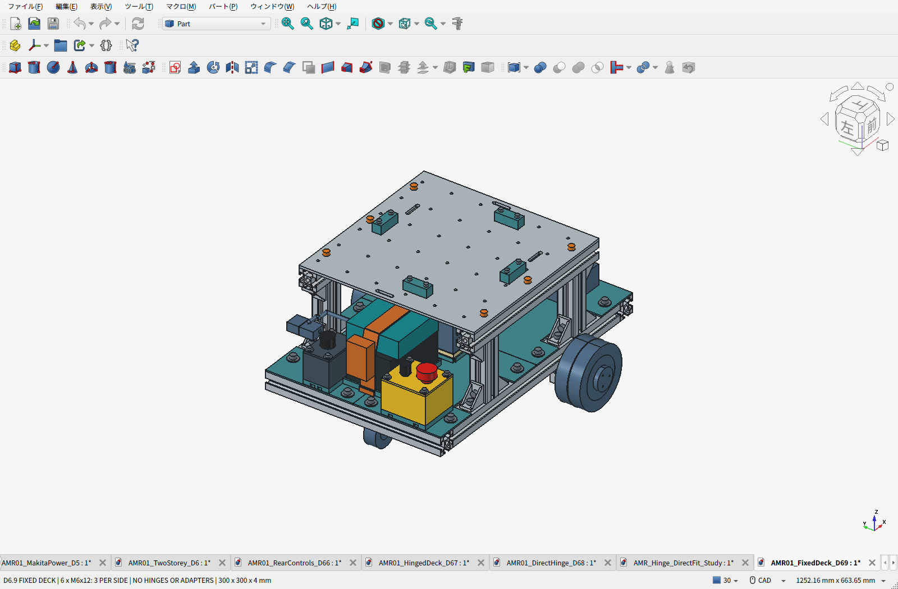
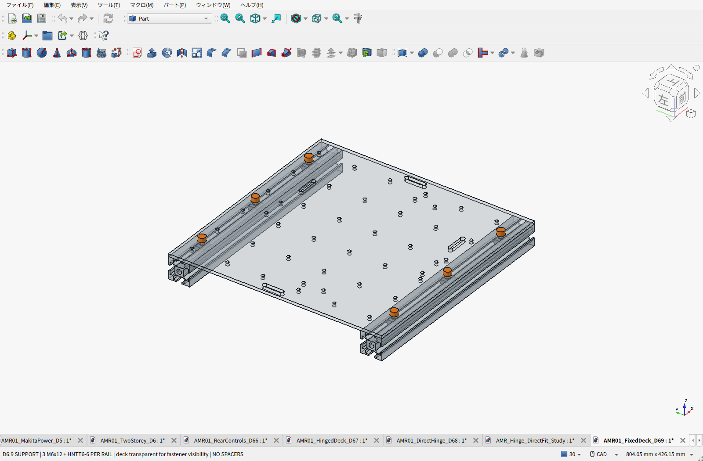
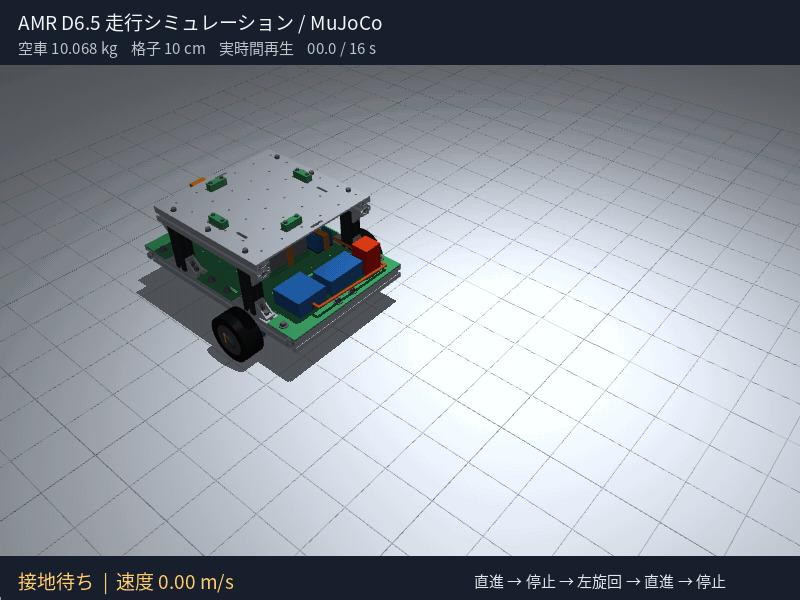

# AMR-01：D6.9 6点固定のアルミ天板

**天板を左右の上段3030へ、M6×12ボルト3本ずつ・計6本で固定しました。** 300×300×4mmの格子穴アルミ板を直接載せ、ヒンジと専用L金具は廃止。後方の非常停止・主電源箱はPLA床で支持し、各4本のM4で固定します。

**電装は再設計中です。** 回路製作設備なしの条件により専用基板案を撤回し、完成済みモジュールと加工済み配線を優先します。完成した回路図・配線図はまだなく、CAD内の電装予約形状だけでは組み立てられません。はんだ端子の非常停止も再選定対象です。[製作条件とBOMの訂正](cad/amr07/electrical-buildability/README.ja.md)。

**BOM：[費用割合・購入リスト](cad/amr07/fixed-deck/BOM.ja.md) ／ [全明細Markdown](cad/amr07/fixed-deck/BOM-details.ja.md) ／ [CSV](cad/amr07/fixed-deck/BOM.csv)**

| 項目 | 現行構成 |
|---|---|
| 荷台 | アルミ300×300×4mm、上面233mm。36格子穴を維持 |
| 固定 | M6×12＋HNTT6-6を各6個、左右3点ずつ。上段3030へ直接固定 |
| 組立・整備 | 上から六角レンチで締結。天板全体は6本を抜いて持ち上げる |
| 電池交換 | 天板を残したまま、8mm持ち上げて後方へ220mm抜く |
| 操作部 | 後方のPLA箱を床の一体座へ各4本のM4で固定 |
| 重量・積載 | 車体推計10.384kg（ヒンジ案から−0.231kg）。通常荷物10kg、静的比較15kg／SF2の設計条件、実機確認前 |
| 費用 | 計上済み小計73,004円＋120.90 USD＝参考92,018円＋未計上分。旧電装候補6,519円の除外は節約ではなく、代替電装・配線は未計上 |
| 天板加工 | 元のD3と同じ製造形状。既存実自動見積28.67 USD＋日本送料9.98 USDを再使用 |

橙色が固定ボルト6本です。固定部を見やすくするため、次の画像では天板とレールを半透明にしています。

変更部を含む静的干渉、電池・計算機・天板の取り外し、ボルトの工具空間、操作部への接近をCADで確認。格子穴36か所の取付空間、保存FCStdとSTEP、既存PLA試作14個も照合済みです。実品公差・締付・印刷強度・走行試験は未完了です。

費用は記録済みの2026-09-21参考為替で換算し、既計上価格は今回再取得していません。PC・その電源・完成済み電装・代替非常停止・加工済み配線等は未計上、モーター価格は仮予算を含みます。購入パック全額を計上した途中小計です。機械部分でのヒンジ撤去による約15,663円減と、電装を未選定へ戻したことによる減額は区別します。

- [設計理由・固定方法・組立順序・CAD画像](cad/amr07/fixed-deck/README.ja.md)
- [重量・荷重計算と検証範囲](cad/amr07/fixed-deck/PAYLOAD_REVIEW.ja.md)
- [再使用した実加工見積・投入STEP・証拠画面](cad/amr07/fixed-deck/MACHINING_QUOTE.ja.md)
- [FCStd](cad/amr07/fixed-deck/AMR01_FixedDeck_D69.FCStd) ／ [機器外形付きSTEP](cad/amr07/fixed-deck/AMR01_FixedDeck_D69.step) ／ [PLA試作14個ZIP](cad/amr07/fixed-deck/D69-print-prototypes.zip)
- [要件](cad/amr07/fixed-deck/requirements.json) ／ [干渉検査](cad/amr07/fixed-deck/validation.json) ／ [保存物検査](cad/amr07/fixed-deck/saved_artifact_validation.json)
- [制御・電源保護・停止試験](cad/amr07/ELECTRICAL_AND_VALIDATION.ja.md) ／ [製造・既製モジュール比較](cad/amr07/control-layout/ELECTRONICS_OPTIONS.ja.md)
- [旧ヒンジ案D6.8](cad/amr07/direct-hinge/README.ja.md) ／ [ヒンジ直付け調査の履歴](cad/amr07/hinge-search/README.ja.md)

## 継承した機械構成とシミュレーション

D6.5の各床4点固定、中央支持梁、四隅の連続したPLA床、計算機下の絶縁用カバーは維持しています。[床の設計](cad/amr07/two-story/README.ja.md)／[PLA床解析と限界](cad/amr07/two-story/pla-strength/README.ja.md)／[ロボコン等の参考設計](cad/amr07/two-story/REFERENCE_DESIGNS.ja.md)。

[Isaac Sim 5向けURDF・取込手順](sim/isaac_sim/README.ja.md)と[データZIP](sim/isaac_sim/amr_d65_isaac5.zip)は**D6.5時点**のモデルです。D6.9の後方操作部・最新重量は未反映。URDF検査とMuJoCo補助走行は実施済み、Isaac Sim本体での実行は未確認です。

## 比較履歴・共通資料

- [A5：5案の実加工費・強度比較](cad/amr06/README.ja.md) / [修正元の設計レビュー](cad/amr06/DESIGN_REVIEW_2026-09-21.ja.md)
- [A4：M0601C_111と専用低背金具](cad/amr05/README.ja.md)
- [メーカーCAD・モーター仕様・タイヤ交換](cad/amr05/M0601C_INTERFACE.ja.md)
- [実加工サイト見積のスキル](skills/cnc-quote/SKILL.md)
- [A3：DDSM115](cad/amr04/README.ja.md) / [A2：FIT0185](cad/amr03/README.ja.md)
- [第二案B・却下したベルト案C](cad/amr02/README.ja.md) / [第一案](cad/amr01/README.ja.md)
- [初期基礎設計書](docs/amr-01/DESIGN.ja.md) / [FreeCAD環境](cad/README.md)
