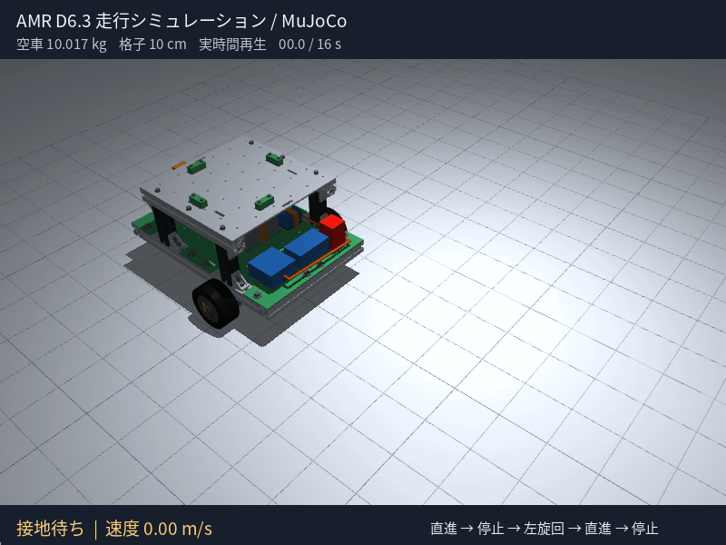
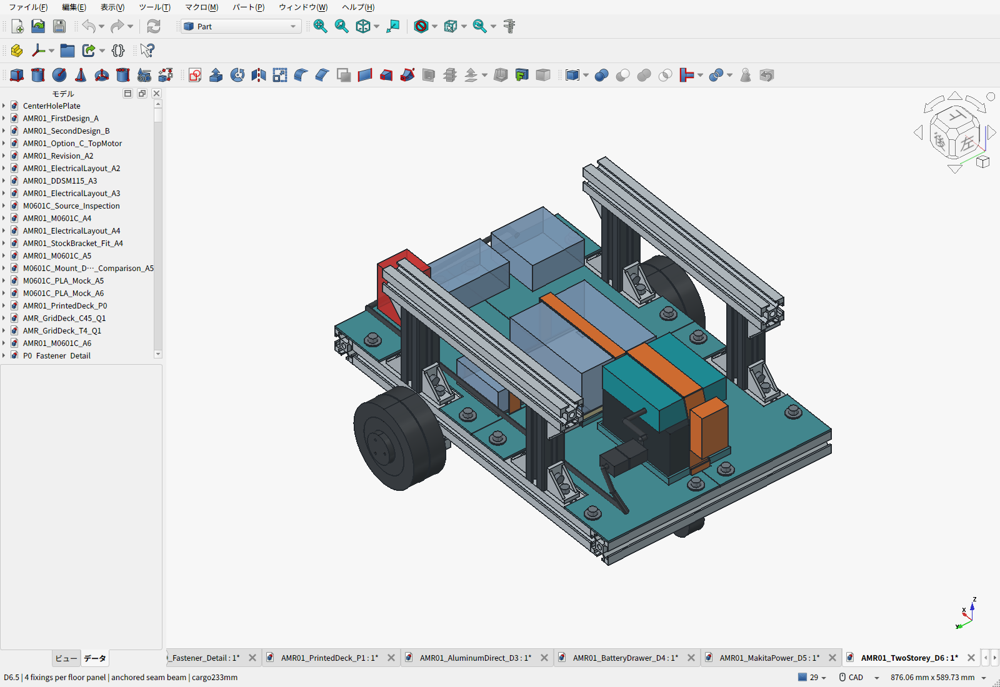

# AMR-01：D6.3 1階電装・2階荷台

**電池・計算機・電源回路を基礎フレーム上の1階へ、格子穴アルミ荷台を2階へ配置しました。** 計算機を床下へ吊る案を撤回。RoboMaster、学生ロボコン、公開ロボットの設計資料を参照し、4支柱支持と部品ごとの交換経路を設計しています。

**[費用の割合と読みやすいBOM](cad/amr07/two-story/BOM.ja.md)** — 部位別の金額・購入数・購入先・未計上品を確認できます。

**[Isaac Sim 5向けURDF・取込手順](sim/isaac_sim/README.ja.md)** — 空車／積載10kg、左右駆動輪と受動キャスター。 [データ一式ZIP](sim/isaac_sim/amr_d63_isaac5.zip)。URDF検査とMuJoCo補助走行は実施済み、Isaac Sim本体での実行は未確認です。

MuJoCoでの走行GIF（空車・16秒・等速）：直進→停止→左旋回→直進→停止。

荷台は300×300×4mm・上面233mm。100mm溝付き支柱4本と、購入予定4本セットに含まれる300mmレール2本を使います。電池は8mm持上げ後に後方へ220mm、計算機は側方へ230mm抜き出せます。荷台を残した交換経路と干渉をCADで検査しました。接続金具の拡大画面も保存しています。

車体は**推計10.017kg**。D6.3では四隅の切欠きを廃止し、平面三角板を廃止して床をボルト固定しました。各床4点固定と中央の両端支持・裏リブは継続します。車体10kgは目安とし、必要な支持を優先します。**通常荷物10kgの設計目標は維持**し、車体10.5kgまでの範囲で足回りを再計算しています。[四隅の設計比較](cad/amr07/two-story/CORNER_REVIEW.ja.md)／[重量と積載](cad/amr07/two-story/PAYLOAD_REVIEW.ja.md)

構造比較15kg・静的安全率2も設計目標で、実物の固定・剛性・電源保護・走行試験前です。電池はBL1860B6Ah＋接続アダプターを選定済み、PCは120×100×60mm・0.5kgの予約モデルです。

全車の途中小計は73,633円＋120.90USD＋未計上分、記録済み参考為替では約92,647円。今回の四隅変更は28部品削減、追加0個。PLA材料参考は90円増、三角板の素材仮枠500円を削除し、計上小計は410円減です。従来からの未計上品は残り、完成車購入総額ではありません。

- [PLA床の実形状解析・たわみ画像・締付けの課題](cad/amr07/two-story/pla-strength/README.ja.md)
- [現行D6：配置・固定・交換・費用・検証範囲](cad/amr07/two-story/README.ja.md)
- [参照したロボコン機体と設計理由](cad/amr07/two-story/REFERENCE_DESIGNS.ja.md)
- [組立FCStd](cad/amr07/two-story/AMR01_TwoStorey_D6.FCStd)／[機器外形付きSTEP](cad/amr07/two-story/AMR01_TwoStorey_D6-with-equipment-envelopes.step)
- [全車BOM](cad/amr07/two-story/BOM.csv)／[費用・未確定分](cad/amr07/two-story/cost_summary.json)
- [電装床4枚＋支持梁の印刷ZIP](cad/amr07/two-story/D6-first-floor-print-files.zip)／[保存物再検査](cad/amr07/two-story/saved_artifact_validation.json)
- [設計要件](cad/amr07/requirements.json)／[電源・停止・回生と試験仕様](cad/amr07/ELECTRICAL_AND_VALIDATION.ja.md)
- [同じ天板の実加工見積](cad/amr07/aluminum-direct-deck/README.ja.md)／[モーター金具の実見積](cad/amr07/MACHINING_QUOTE.ja.md)
- [電源選定と旧D5配置](cad/amr07/makita-power/README.ja.md)／[旧D4：薄型電池の横引出し](cad/amr07/battery-drawer/README.ja.md)

## 比較履歴・共通資料

- [A5：5案の実加工費・強度比較](cad/amr06/README.ja.md) / [修正元の設計レビュー](cad/amr06/DESIGN_REVIEW_2026-09-21.ja.md)
- [A4：M0601C_111と専用低背金具](cad/amr05/README.ja.md)
- [メーカーCAD・モーター仕様・タイヤ交換](cad/amr05/M0601C_INTERFACE.ja.md)
- [実加工サイト見積のスキル](skills/cnc-quote/SKILL.md)
- [A3：DDSM115](cad/amr04/README.ja.md) / [A2：FIT0185](cad/amr03/README.ja.md)
- [第二案B・却下したベルト案C](cad/amr02/README.ja.md) / [第一案](cad/amr01/README.ja.md)
- [初期基礎設計書](docs/amr-01/DESIGN.ja.md) / [FreeCAD環境](cad/README.md)
