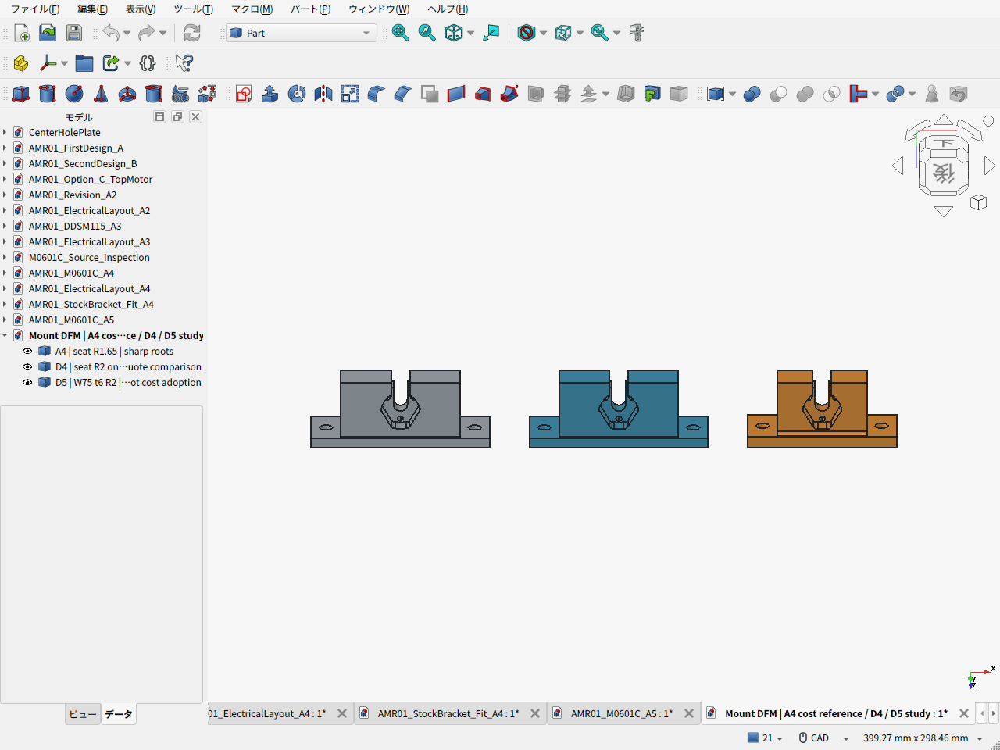
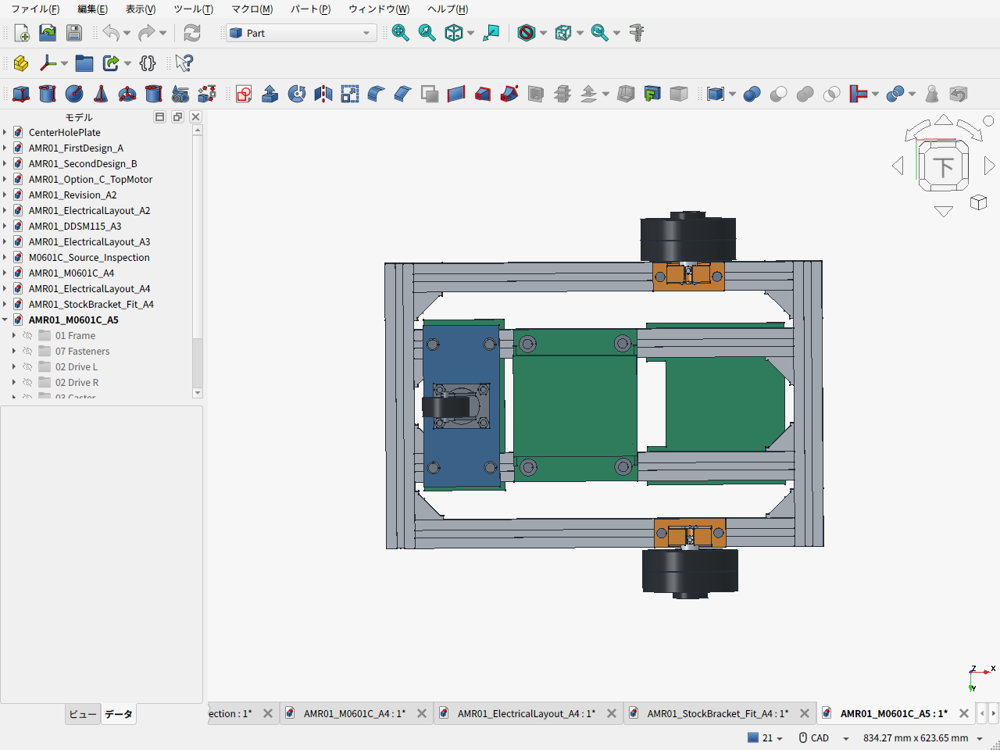

# amr-pj — 家庭向け小型AMR / 将来MoMa

最新の検討は**A5：可搬15kg・安全率2に向けた車輪固定金具の加工費・強度比較**。5案の実STEP・寸法図でJLCCNC自動見積を取得したが、今回は旧A4より安くならなかった。A4を価格比較の基準に残し、小型D5は組付けCAD・PLA仮合わせ用に保存した。どちらも新しい荷重要件への適合は未認定。

骨格はM0601C_111二輪＋後方キャスター。Amazonの3030・300/400mm定尺、元のフレーム配置、低床電池を維持する。公開ブラケットのモーター受け形状を基に、3030下面へ直接留める一体の金属金具を比較した。

- [A5の結果・設計理由・CAD実画面](cad/amr06/README.ja.md)
- [全5案の実加工見積と証拠](cad/amr06/MACHINING_QUOTE.ja.md) / [費用差分表](cad/amr06/BOM_cost_comparison.csv)
- [15kg可搬に向けた荷重・強度・駆動の検討](cad/amr06/STRENGTH_REVIEW.ja.md)
- [D5比較車体FCStd](cad/amr06/AMR01_M0601C_A5.FCStd) / [STEP](cad/amr06/AMR01_M0601C_A5.step)
- [P1S用PLAモックZIP](cad/amr06/print-mock/M0601C_A5_PLA_mock_files.zip) / [印刷・仮合わせ手順](cad/amr06/print-mock/PRINT_GUIDE.ja.md)

従来のA4資料と購入品の根拠：

- [A4の設計・CAD・実画面](cad/amr05/README.ja.md)
- [車体FCStd](cad/amr05/AMR01_M0601C_A4.FCStd) / [車体STEP](cad/amr05/AMR01_M0601C_A4.step)
- [金具の見積用STEP](cad/amr05/M0601C_custom_mount_quote.step) / [寸法図PDF](cad/amr05/M0601C_custom_mount_quote.pdf) / [加工依頼仕様](cad/amr05/MANUFACTURING_RFQ.ja.md)
- [BOM](cad/amr05/BOM.csv) / [費用の根拠と比較](cad/amr05/COST_REVIEW.ja.md) / [費用集計](cad/amr05/cost_summary.json)
- [加工サイトの実見積・画面・条件](cad/amr05/MACHINING_QUOTE.ja.md)
- [同じ方法で加工見積を取得するCodexスキル](skills/cnc-quote/SKILL.md)
- [金具の独立レビュー](cad/amr05/MOUNT_REVIEW.ja.md) / [公開CADの抽出根拠](cad/amr05/BRACKET_SOURCE_REVIEW.ja.md)
- [本体・タイヤ・交換](cad/amr05/M0601C_INTERFACE.ja.md) / [電池・配線・整備空間](cad/amr05/ELECTRICAL_PACKAGING.ja.md)

| 設計条件・現在の扱い | 内容 |
|---|---|
| 主フレーム | 3030・400mm×4本＋300mm×2本、外形460×300mm、純正接合HBLFSN6-SET |
| 台車質量 | 電池・電装込み10kg以下。A4推計6.79kg、D5比較6.74kg、未実測 |
| 新しい荷重条件 | 暫定で荷物15kg＋車体最大10kg＝総25kg。安全率2は目標、達成未確認。将来アーム追加分・15kg荷台は別検討 |
| 駆動 | M0601C_111×2、100.7mm適合タイヤ、後方50mm自在キャスター |
| 取付金具 | A6061-T6、同形2個。A4は90×30×34mm・厚5、小型D5比較は75×30×34mm・厚6 |
| 高さ | フレーム下面69mm、金具35mm、固定骨格最低32mm。配線予約は約28.35mm |
| 骨格外形 | 仮のタイヤ組付け位置で460×406.6×109.6mm、輪距349mm |
| PLA活用 | 低床電池クレードルと前後トレイ。主輪支持は金属 |
| 配置検査 | 161部品・12,880ペアで公称体積干渉なし。工具軸・配線・整備空間も別検査 |
| 駆動の制約 | 総25kg・5°・加速度0.2m/s²・余裕1.5では1.272N·m/輪が必要で、公表定格0.96N·mを超える。平地候補も熱・偏積み等は未確認 |

**費用は途中小計42,282円＋専用金具と送料のサイト自動見積81.73 USD＋残る未確定分。** Taobao本体約7,000円/個、適合タイヤ2個を別購入する仮定。タイヤと必要付属品の同梱を確認できれば円小計33,042円。JLCCNCの製造10日・金具2個74.50 USD＋日本宛OCS送料7.23 USDを原通貨で計上した。図面審査後の価格、税・住所別送料・決済換算、Taobao諸費は未確定。共通板材を自加工する条件で、板材も外注する場合は追加見積。電池・主計算機・電源保護・実配線等は別予算であり、完成機総額ではない。

小型D5は2個80.08 USD＋表示送料7.23 USD＝87.31 USDとなり、A4より5.58 USD高かった。受けRの拡大や根元Rの統一だけでは値下げにならないという結果を、[形状比較](cad/amr06/candidates/ROOT_FILLET_DFM_REVIEW.ja.md)に記録した。旧14kg計算は比較履歴とし、25kg条件へ読み替えない。





茶色の半透明箱は未選定電池の予約空間。本体は販売元案内のSTEP、タイヤとカバーは公開外形の簡略形状。タイヤの軸方向組付け位置が未確認のため全幅・輪距は暫定。公称CADの合格は、製作公差・衝撃・熱・寿命の認定ではない。

## 再計算

```sh
python3 cad/amr05/fetch_vendor_cad.py
python3 cad/amr05/calculate_cost.py --require-cad --self-test
python3 cad/amr05/calculate_design.py
python3 cad/amr06/calculate_mount_loads.py --check-only
python3 cad/amr06/record_quote_results.py
python3 cad/amr06/calculate_cost_comparison.py
```

FreeCADでの再生成は[A5 README](cad/amr06/README.ja.md)と[A4 README](cad/amr05/README.ja.md)を参照。

## 比較履歴

- [A3：DDSM115・一体ホイール検討](cad/amr04/README.ja.md)
- [A2：FIT0185・スペーサー撤去](cad/amr03/README.ja.md)
- [第二案B・却下したベルト案C](cad/amr02/README.ja.md)
- [元の第一案A](cad/amr01/README.ja.md)
- [第一案の基礎設計書](docs/amr-01/DESIGN.ja.md) / [同資料ZIP](archives/amr_v0_4_1.zip)
- [FreeCAD環境](cad/README.md)
