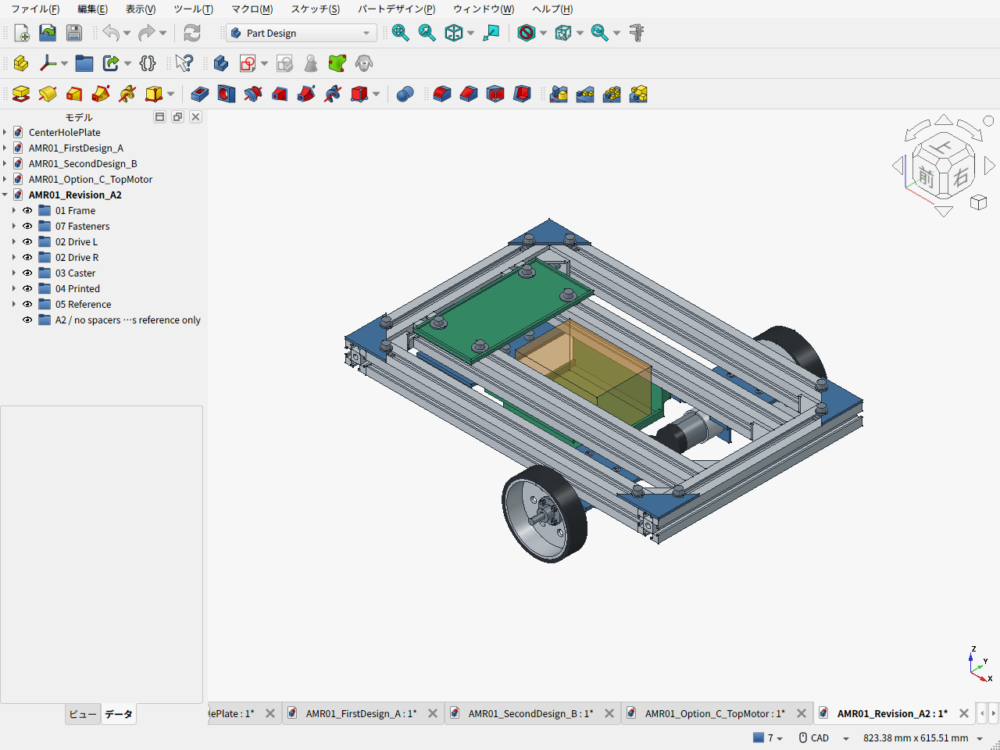
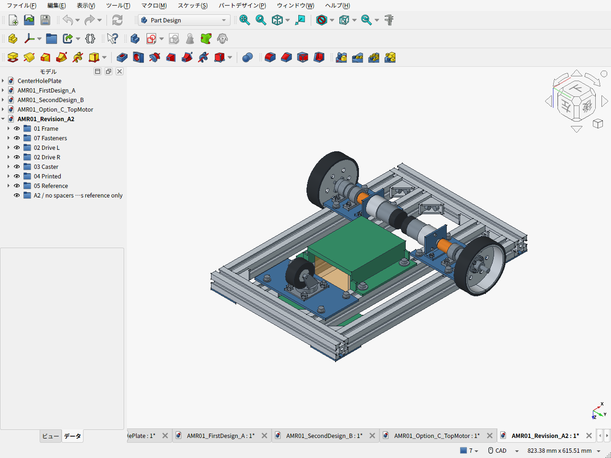

# amr-pj — 家庭向け小型AMR / 将来MoMa

家庭内用の小型AMRから、将来の移動マニピュレータ化を目指す設計プロジェクト。荷重支持・機器配置・整備性と費用を優先する。

現行案は**第一案改A2（v0.6.0）：同軸駆動を維持し、スペーサー12本を撤去、軸受支持板を3030へ直結**。ユーザーの指示でベルト案Cを却下し、箱形支持の第二案Bも比較記録へ移した。フレームを6mm下げ、電池をフレーム内の低いPLAクレードルへ置く。

- [現行案の説明・CAD・実画面](cad/amr03/README.ja.md)
- [部品表](cad/amr03/BOM.csv) / [費用根拠と第一案との差](cad/amr03/cost_summary.json)
- [重量・CAD検査](cad/amr03/validation_results.json) / [駆動・軸・重心感度](cad/amr03/calculation_results.json)
- [モーター仮選定の理由・候補比較](cad/amr03/MOTOR_SELECTION.ja.md)
- [車輪支持のレビュー](cad/amr03/WHEEL_REVIEW.ja.md) / [低重心化のレビュー](cad/amr03/CG_REVIEW.ja.md)
- 比較履歴：[元の第一案A](cad/amr01/README.ja.md) / [旧第二案B・却下したベルト案C](cad/amr02/README.ja.md)
- [第一案の基礎設計書 v0.4.1](docs/amr-01/DESIGN.ja.md) / [同資料ZIP](archives/amr_v0_4_1.zip) / [FreeCAD環境](cad/)

| 設計条件・現行案 | 内容 |
|---|---|
| 主フレーム | AmazonのMISUMI 3030、300/400mm定尺。組立460×300mm |
| 台車質量 | 電池・電装込み10kg以下。現行推計6.68kg、実測前 |
| 荷物・将来アーム | 荷物2kgとアーム系2kgは別枠、最大構成14kgで計算 |
| 駆動 | FIT0185×2、100mm左右駆動輪＋後方50mmキャスター、初期0.15m/s |
| 高さ | フレーム下面69mm、電池搭載面35mm、固定部の最低地上高25mm |
| 骨格の外形 | 460×394×109.6mm。電装・ガード込み500×400×180mmは配置目標 |
| PLA活用 | 電池クレードル130×160×37mm、電装トレイ85×180×4.4mm。主車輪支持は金属 |

| 機械骨格の予算 | 元の第一案A | 現行A2 |
|---|---:|---:|
| 自加工：購入・材料・送料 | 34,159円 | **34,519円** |
| 加工外注の仮枠込み | 40,159円 | **40,519円** |

FIT0185は低価格の試作候補で、必要な連続トルクへの適合は未確認。モーターの選定確定とは扱わない。

差額は+360円。参考価格・未見積枠を含み、電池・電装・完成用ガード・荷台・アームは別。純正接合金具の個人購入経路と現物適合、加工見積は未確定。

電池0.75kgの仮中心を72mm下げる場合、他を固定した全体重心への寄与は総質量6.68kgで約8.08mm。機体全体の重心差を確定した数字ではない。車軸の32mm張出しは第一案から維持し、軸受反力まで改善したとは扱わない。





茶色の半透明箱は未選定電池の予約空間。CAD・計算は公称形状の設計検討で、製作・運用を保証する確定版ではない。

## 再計算

```sh
python3 cad/amr03/calculate_cost.py
python3 cad/amr03/calculate_design.py
python3 -m unittest discover -s cad/amr02 -p 'test_calculate_design.py' -v
```

CAD再生成は[現行案README](cad/amr03/README.ja.md)を参照。従来の`docs/amr-01/`と`archives/amr_v0_4_1.zip`は第一案の基礎資料として保存する。現行CAD・画像・部品表・検証結果は`cad/amr03/`に収録する。
