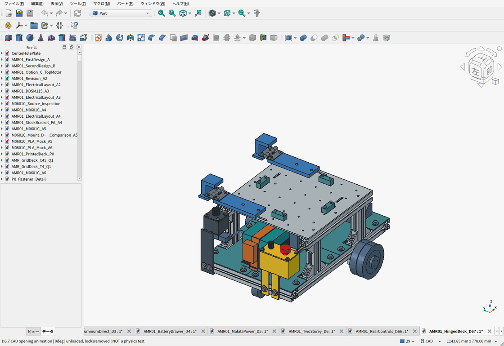

# AMR-01：D6.7 開閉天板・後方操作部

**格子穴のアルミ天板をトルクヒンジで横へ0〜90°開き、閉じたら蝶ボルト2本で固定する構成にしました。** 非常停止・手動ARM・主電源は後方へ配置。1階に電池・計算機、2階に荷物を置きます。

**BOM：[Markdown概要](cad/amr07/hinged-deck/BOM.ja.md) ／ [全明細Markdown](cad/amr07/hinged-deck/BOM-details.ja.md) ／ [CSV](cad/amr07/hinged-deck/BOM.csv)** — 費用割合、購入パック、使用数、購入先を同じCSVから生成しています。

このGIFはCADの配置アニメーションです。動力学・強度・実機試験ではありません。

| 項目 | 現行構成 |
|---|---|
| 天板 | 6061-T6、300×300×4mm、上面233mm。見積済み加工形状を維持 |
| 開閉 | スガツネHG-TS15×2。溝固定用PLAアダプター、90°開き止め。空の天板のみ開く |
| 閉鎖固定 | M6×15蝶ボルト2本＋金属座金。工具なしで外すねじ式。荷重は既存アルミレールで受ける |
| 拡張用の穴 | 50mmピッチ36穴。ヒンジ取付が4穴を使用、2穴を覆い、30穴を残す |
| 後方操作部 | IDEC XA1E-BV302R、amon3212 ARM、amon3214主電源。各ケースを4点固定 |
| 電池交換 | 天板を閉じたまま、8mm持上げ後に後方220mm抜出し |
| 計算機 | 1階の120×100×60mm・0.5kg予約。機種は未選定、取付面110mm |
| 車体重量 | 推計10.927kg。10kgは目安。通常荷物10kgの設計目標を維持 |
| 開閉天板の追加費用 | D6.6から4,188円増。ヒンジ、蝶ボルトと追加購入パック、PLA材料参考を含む |
| 車体の途中小計 | 83,868円＋120.90 USD、記録済み参考為替で約102,882円＋未計上分 |

空の天板一式約1.302kgに対し、最大重力モーメント1.923N·m、ヒンジ2個の初期下限2.4N·mを比較しています。荷物・固定ベルト・ロックを外して開閉します。PLA取付部の強度、クリープ、経年の保持力は実機検証前のため、印刷データは試作版です。

CADの0〜90°の開閉、荷物・配線予約、電池と計算機の交換、操作する手・工具の経路を検査しました。保存FCStd・STEP・18個のSTLも再検査済み。通常荷物10kg＋車体11.5kgまでの比較計算で、必要トルクは余裕込み0.401N·m/輪。平坦な屋内床、追加機械ブレーキなし。実機の積載走行・電源保護・停止試験は未実施です。

Picoは手持ちを流用。Amazonを優先しつつ送料込みで比較し、他店が安い品は残しました。Primeの個別適用は会員カートで未確認です。PC・専用基板・配線などは未計上、モーター価格も仮予算を含むため、小計を完成車の確定額とは扱いません。

- [設計理由・保持トルク・操作手順・追加費用](cad/amr07/hinged-deck/README.ja.md)
- [重量・輪荷重・天板とPLAの計算範囲](cad/amr07/hinged-deck/PAYLOAD_REVIEW.ja.md)
- [FCStd](cad/amr07/hinged-deck/AMR01_HingedDeck_D67.FCStd)／[機器外形付きSTEP](cad/amr07/hinged-deck/AMR01_HingedDeck_D67.step)／[試作STL一式ZIP](cad/amr07/hinged-deck/D67-print-prototypes.zip)
- [設計要件](cad/amr07/hinged-deck/requirements.json)／[干渉検査](cad/amr07/hinged-deck/validation.json)／[保存物再検査](cad/amr07/hinged-deck/saved_artifact_validation.json)
- [後方操作部・取付と配線経路](cad/amr07/control-layout/README.ja.md)
- [Amazonと送料込み比較・価格証拠](cad/amr07/control-layout/PROCUREMENT.ja.md)／[既製モジュールと専用基板の製造比較](cad/amr07/control-layout/ELECTRONICS_OPTIONS.ja.md)
- [制御・電源保護・停止試験](cad/amr07/ELECTRICAL_AND_VALIDATION.ja.md)
- [同じ天板の実加工見積](cad/amr07/aluminum-direct-deck/README.ja.md)／[モーター金具の実見積](cad/amr07/MACHINING_QUOTE.ja.md)

## 継承した機械構成とシミュレーション

D6.5の各床4点固定、中央支持梁、四隅の連続したPLA床、計算機下の絶縁用カバーは維持しています。[床の設計](cad/amr07/two-story/README.ja.md)／[PLA床解析と限界](cad/amr07/two-story/pla-strength/README.ja.md)／[ロボコン等の参考設計](cad/amr07/two-story/REFERENCE_DESIGNS.ja.md)。

[Isaac Sim 5向けURDF・取込手順](sim/isaac_sim/README.ja.md)と[データZIP](sim/isaac_sim/amr_d65_isaac5.zip)は**D6.5時点**のモデルです。今回の後方操作部・ヒンジ・重量増は未反映。URDF検査とMuJoCo補助走行は実施済み、Isaac Sim本体での実行は未確認です。

## 比較履歴・共通資料

- [A5：5案の実加工費・強度比較](cad/amr06/README.ja.md) / [修正元の設計レビュー](cad/amr06/DESIGN_REVIEW_2026-09-21.ja.md)
- [A4：M0601C_111と専用低背金具](cad/amr05/README.ja.md)
- [メーカーCAD・モーター仕様・タイヤ交換](cad/amr05/M0601C_INTERFACE.ja.md)
- [実加工サイト見積のスキル](skills/cnc-quote/SKILL.md)
- [A3：DDSM115](cad/amr04/README.ja.md) / [A2：FIT0185](cad/amr03/README.ja.md)
- [第二案B・却下したベルト案C](cad/amr02/README.ja.md) / [第一案](cad/amr01/README.ja.md)
- [初期基礎設計書](docs/amr-01/DESIGN.ja.md) / [FreeCAD環境](cad/README.md)
