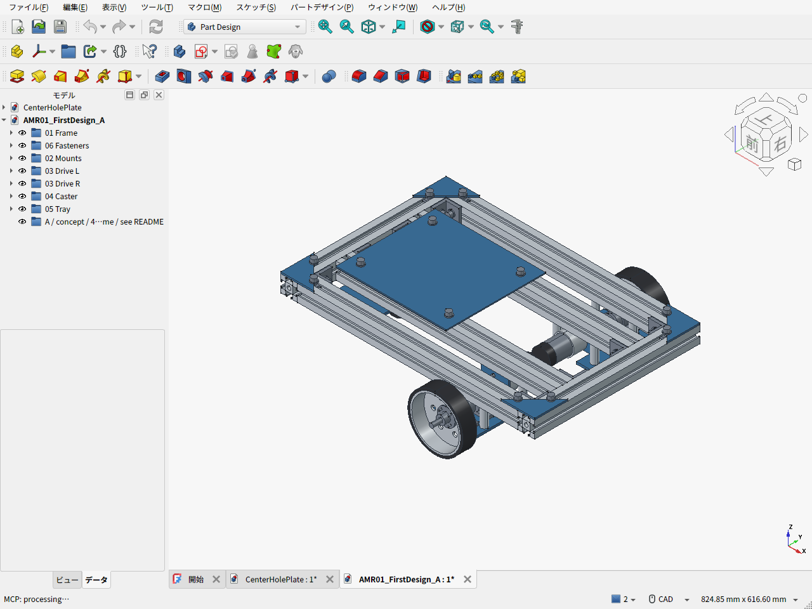
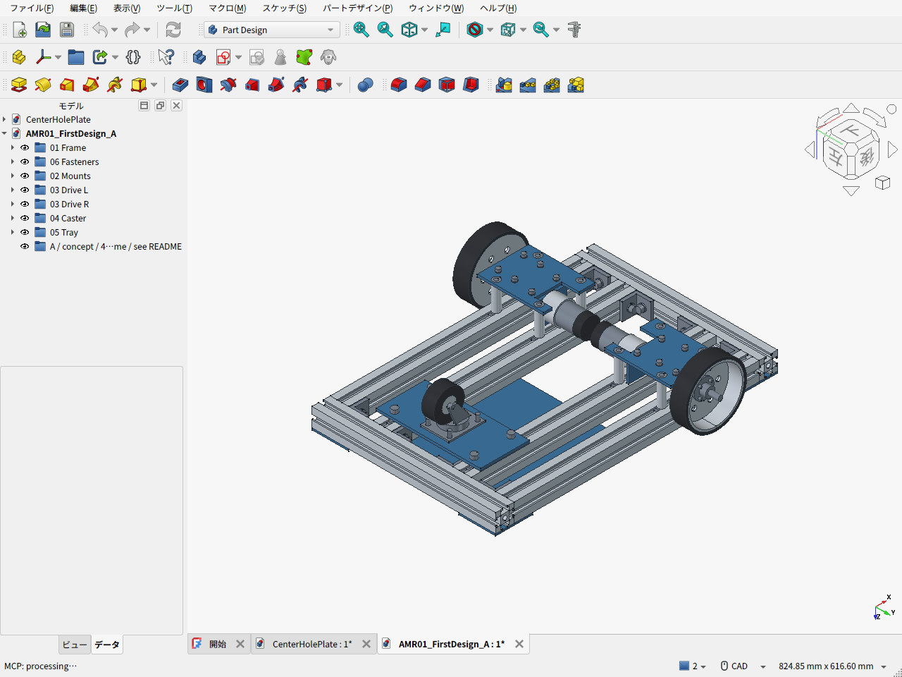

# AMR-01 第一案 A — 3030フレームの機械骨格

[第二案B・上置き比較C](../amr02/README.ja.md)を追加した。このページは第一案Aの比較基準を保存している。

2026-09-20 / FreeCAD 1.1.3 / 形状v0.4.0・重量条件v0.4.1。**部品を選定して組付けを検討する第一案。購入品の未公開寸法、連続運転、実測重量は未確認で、製作図の確定版ではない。**

フレームはユーザー指定のAmazon定尺、300mm・400mmの3030を使用する。外寸460×300mm、400mm材4本・300mm材2本。追加の減速ベルトを使わず、左右のFIT0185からカップリングで独立した8mm車輪軸を駆動する。各軸をKP08で2点支持し、荷重を取付板・4本のスペーサから内外の長手フレームへ伝える。外周4隅はt3ガセットを追加する。

## 実際のCAD画面

FreeCADで実モデルを開いた画面のキャプチャ。画像生成による完成予想図ではない。





- [編集可能なFreeCADファイル](AMR01_FirstDesign_A.FCStd)
- [STEP](AMR01_FirstDesign_A.step)
- [再生成コード](build_chassis.py) / [機構パラメータ・未確認項目](mechanical_parameters.json)
- [部品表 CSV](BOM.csv) / [元データ・購入URL・確認日](bom.json) / [必要ねじ一覧](fasteners.csv)
- [検証結果](validation_results.json) / [検証コード](validate_chassis.py)

## 費用

税込・2026-09-20確認。使用した本数だけの按分ではなく、**予備やパックの余りも含む購入額**を計上した。発注はしていない。

| 項目 | 金額 |
|---|---:|
| 3030フレーム：300mm・400mm 各4本組 | 3,419円 |
| コーナー金具20個・M6ナット等のセット | 2,580円 |
| FIT0185モーター2個 | 6,039円 |
| 100mm駆動輪2個 | 5,210円 |
| ハブ・軸・KP08・カップリング・軸カラー | 6,788円 |
| 420G-R50キャスター1個 | 373円 |
| **確認済み商品の小計** | **24,409円** |
| 板材・アングル・スペーサ素材の予算 | 4,100円 |
| 追加ねじ・ナット・ワッシャの予算 | 1,800円 |
| 送料の予算（本州配送を仮定） | 3,850円 |
| **自分で加工する場合の現金支出目安** | **34,159円** |
| 切断・穴あけ等の外注追加枠 | +6,000円 |
| **外注加工を含む目安** | **40,159円** |

価格確認済みと予算枠は[BOM](bom.json)の`price_kind`で区別する。予備費10%込みなら自加工約3.8万円、外注約4.5万円を見込む。板材・加工の正式見積は未取得で、通販送料も住所・注文の組み合わせによって変わる。工具を既に持っている自加工ケースには、自分の作業時間と新規工具購入代を含めない。

**これは機械骨格の費用。電池、モータードライバ、制御基板、センサー、非常停止回路、機能ガード、アームは含まない。走行可能な完成機の総額ではない。**

コストを抑えるため、全面4040化・追加の外部減速機・装飾外装は採用しない。比較したFIT0403は2個で10,615円、FIT0185より商品代で4,576円高い。FIT0403側が送料無料になる場合、送料込みの差は約2,376円まで縮まる。第一案は低速試験を優先してFIT0185を選んだ。再選定時は単価だけでなく加工・送料を含めて比較する。

## 選定と配置

| 部品 | 第一案の仕様・位置 |
|---|---|
| モーター | DFRobot FIT0185 ×2、12V、131:1、無負荷83rpm、エンコーダ付き、メーカー公称205g/個 |
| 車輪 | Amazon B0B23WBLBK ×2、直径100mm・幅25.4mm・穴8mm、金属ホイール＋ネオプレン、販売者記載約300g/個 |
| 車輪ハブ | uxcell B07PTPFX35、穴8・H13・フランジ32・PCD24。車輪に合わせた取付穴加工が必要 |
| 支持軸・軸受 | C45クロムメッキ8×100mm ×2、KP08 ×4。モーター出力軸に車重を直接負担させない |
| 継手 | 6→8mm、外径20×長25のジョーカップリング ×2 |
| キャスター | ハンマー420G-R50。高さ65、座59×47、穴ピッチ46×35、トレール16、メーカー許容荷重300N |
| フレーム高さ | 床から下面75、上面105mm |
| 駆動輪中心 | x=90、y=±177、z=50mm。輪距354mm |
| 後方キャスター | 旋回軸x=-150、y=0。図では車輪軸x=-166、z=25 |
| 機械骨格の包絡 | 約460×394×115.6mm。現物差・ガード・配線・電装は含まない |

従来の輪距350mmから各輪を2mm外へ移し、ハブ取付ねじ頭と軸カラーの公称隙間0.8mmを確保した。0.8mmは現物公差を吸収する保証値ではなく、実測で再確認する箇所。軸は切らずに100mmのまま使用し、両軸端を含め幅394mm。完成時500×400mmの目標に対し、側面の軸端ガードの余地は片側3mmしかなく、ガード方式は要再検討。

CADの青色部品は加工するアルミ材。2枚の車輪支持板、2個のモーターアングル、キャスター取付板、4枚のガセット、機器トレイをモデル化している。ねじ・溝ナットの主要位置も表示。ねじ山、六角穴、一部のナット・ワッシャ・止めねじは省略した。

## 駆動性能の扱い

FIT0185の45kgf·cm（約4.41N·m）は**拘束トルク**で、連続定格ではない。連続トルクはメーカー公表値を確認できていない。従来の「0.8〜1N·m、負荷時80rpm」という探索目標を満たした製品とは扱わない。

- 初期目標0.15m/s・0.3rad/sの同時指令では外輪38.8rpm。
- 第一案の各輪指令上限を暫定65rpmとする。これは制御上限であり、負荷時に保証された性能ではない。
- 0.3m/s・0.6rad/sを同時に出すには外輪77.6rpmで、この案の指令上限を超える。`|v| + 0.177 |ω| ≤ 0.3403 m/s`として組合せを制限する。0.3m/s時の旋回上限は約0.228rad/s。
- 総質量14kg・5度の計算における余裕込み0.708N·mを、無負荷点と拘束点の直線補間に当てはめると約69.7rpm・1.42A。これは選定の粗い見当で、連続運転・温度・低電圧性能の保証ではない。

まず水平な硬い床の低速試験用。モータードライバの電流制限を設け、温度・電流・実回転数・継手の滑りを測定する。段差・坂道・アーム操作の運転条件はこのCADでは確定していない。

## 自重上限10kgと現案の見込み

メーカー・販売者の公称質量と、加工板等のCAD体積からの概算を合わせると、**骨格約4.73kg**。従来の電池・電装・計算機・配線/ガードの予算2.05kgを加えると**約6.78kg**で、台車自重上限10kgに対して約3.22kgの余裕がある。

ユーザーの指定により6kg目標を撤回し、電池・電装込み10kg以内とした。約6.78kgは現案の概算で、10kgまで重量を増やす目標ではない。未選定の保持機構、補強、電装変更は残りの枠で管理する。軽量化だけを目的とした費用増は優先しない。静的計算に6.78kg・10kgの質量ケースを追加したが、重心位置は実測ではない。

## 寸法と実部品の確認が必要な点

1. モーター図面はメーカーがFIT0185からリンクする共通図。減速部L24mm・エンコーダ長12mmでモデル化したが、中国語注記ではエンコーダ10mmとも読め、減速比でLが変わると記載される。131:1現物の長さと配線突出を確認する。軸径6、偏心7、PCD31、M3固定は同図に基づく。M3×5をt3台座に使い、ねじ込みは2mm（メーカー本文の最大3mm以内）。
2. 車輪の外径・幅・穴径以外は簡略形状。ウェブをt3と仮置きし、ハブのPCD24・4穴を45度ずらして設計した。既存穴の位置、肉厚、凹部の奥行き、穴径を実測してから加工する。既存穴と干渉する場合は穴の位相・取付方式を修正する。
3. KP08の軸心高15mm、PCD42mmと足厚を実測する。安価な軸受の型名だけでは寸法公差と許容荷重の保証にならない。
4. 3030金具セットのナットがミスミ6シリーズの溝に適合するか、ボルトが底突きせず十分ねじ込めるかを確認する。CADの押出断面はT溝の概略であり、メーカー金型断面の複製ではない。
5. 車輪、ハブ、カップリングの連続トルク・輪荷重の仕様は不足している。初期受入試験で確認し、未検証のまま2kg可搬を認定しない。

## 実施した確認

217個の形状の妥当性、主要67部品の2,211組の公称形状干渉、フレーム外寸、3輪の床面接触、駆動系固定部の最低地上高26.2mm、車輪のねじ頭とカラーの隙間、CADとBOMの使用数、M6溝ナット40個を確認した。

ねじを除く公称モデルの干渉検査であり、全ねじ締結の強度、現物公差、キャスター全旋回の厳密干渉、ガード、ケーブル、たわみ、耐久・実機制動を検証した結果ではない。重量の概算判定は`estimated_base_within_upper_budget: true`。完成実機の測定結果ではない。

再生成はFreeCADのPythonコンソールで、リポジトリ内の実パスに置き換えて実行する。

```python
p = '/path/to/amr-pj/cad/amr01/build_chassis.py'
exec(compile(open(p).read(), p, 'exec'), {'__file__': p})
p = '/path/to/amr-pj/cad/amr01/validate_chassis.py'
exec(compile(open(p).read(), p, 'exec'), {'__file__': p})
```

部品位置の大半は`build_chassis.py`内の寸法で定義し、輪距は設計パラメータから読む。自由な寸法変更を自動解決するアセンブリ拘束モデルではない。変更時は配置・穴・部品選定も合わせて修正する。

費用の再集計は通常のPythonで`python3 cad/amr01/calculate_cost.py`。画面保存はFreeCAD内で[capture_screens.py](capture_screens.py)を実行する。

## 主な根拠

- [DFRobot FIT0185 仕様](https://wiki.dfrobot.com/fit0185/) / [メーカーの製品ページと共通寸法図へのリンク](https://www.dfrobot.com.cn/goods-706.html) / [共通寸法図](https://www.dfrobot.com.cn/image/data/FIT0186/GB37Y3530-251R-dimensions.jpg)
- [FIT0185国内購入価格](https://www.digikey.jp/ja/products/detail/dfrobot/FIT0185/6588527) / [FIT0403比較価格](https://www.digikey.jp/ja/products/detail/dfrobot/FIT0403/6588578)
- [ハンマー公式カタログ](https://www.hammer-caster.co.jp/common/pdf/company/CTLG_420GR_s44_06.pdf) / [420G-R50販売価格・寸法・送料](https://www.tanaka-km.com/view/item/000000036665)
- [KP08寸法の比較用供給元](https://www.motedis.es/en/Pillow-blocks-8mm-KP08)。採用Amazon品の寸法画像も照合した。
- Amazon購入品のURLは[BOM](bom.json)に記載。商品名・選択ASIN・価格・注文ボタンをページ取得で確認。第三者の商品写真や図面そのものはリポジトリへ複製していない。
