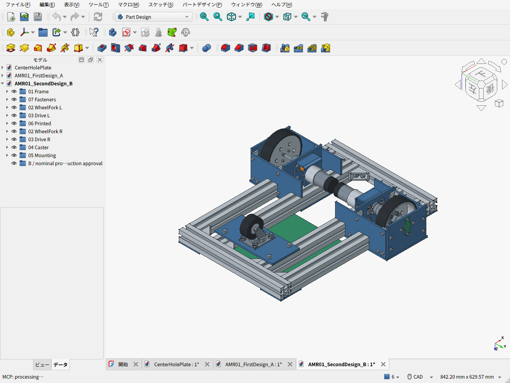

# 第二案 B：下置き同軸駆動と内外軸受の箱形支持

2026-09-20 / v0.5.0。**下置きのまま車輪の支持方法を変える第二案**と、上置きベルト駆動の比較配置Cを作成した。第一案の下置きを不適切と判断したものではない。三担当で要求・車輪支持・上置き配置を検討し、改善効果と増費を分けて比較している。

第二案は3030の300/400mm定尺、フレーム高さ、モーター、100mm車輪、50mmキャスターを維持する。車輪の両側に軸受を置き、40mmの丸スペーサ8本に代えて金属板と角金具で荷重をフレームへ伝える。**費用は第一案より上がるため、第二案を無条件の最終採用とはしていない。** 購入品の実寸・荷重定格、加工見積、現物試験が残る比較試作設計である。

## 実CAD画面とデータ

以下はFreeCADの実画面。下面図は車体を裏側から見ている。



- [通常の斜視画面](cad-screen-isometric.png) / [上面](cad-screen-top.png) / [支持板を半透明にした画面](cad-screen-drive-visible.png)
- [第二案B・FreeCAD](AMR01_SecondDesign_B.FCStd) / [STEP](AMR01_SecondDesign_B.step)
- [上置き比較C・FreeCAD](AMR01_Option_C_TopMotor.FCStd) / [STEP](AMR01_Option_C_TopMotor.step) / [実画面](cad-screen-option-c-top-motor.png)
- [設計要件・三担当の議論・採否理由](DESIGN_REVIEW.ja.md) / [部材の簡易曲げ比較](STRUCTURAL_SCREENING.ja.md)
- [BOM](BOM.csv) / [価格根拠・加工費・送料・差額](cost_summary.json) / [CADから数えた締結部品](fasteners.csv)
- [CAD検証結果と重量内訳](validation_results.json) / [軸・駆動・支持領域の計算](calculation_results.json)

## 同じ要件での比較

| 項目 | 第一案A | 第二案B | 上置き比較C |
|---|---|---|---|
| モーター位置 | フレーム下・同軸 | フレーム下・同軸 | フレーム上・ベルト1:1 |
| 車輪支持 | 二軸受の外側へ32mm張出し | 車輪を内外軸受で挟む | Bと同じ支持配置を仮定 |
| フレームへの取付 | 板＋長さ40mmスペーサ | 内外壁・前後ウェブ・上板、二本のレールと上面/側面へ固定 | 箱支持に加え上軸・調整台 |
| 利点 | 既存案で部品・加工が少ない | 上置き案の伝動部品が不要 | 下部空間・上からの整備性を得る |
| 代償 | 張出しによる軸受反力、スペーサ部の剛性確認 | 新規板材と多数のねじ、芯合わせ、幅拡大 | プーリー・ベルト・別支持上軸・張力調整・ガード |
| 自加工の機械骨格予算 | 34,159円 | **49,763円（+15,604円）** | Bにさらに8,000〜15,000円の未見積枠 |
| 加工外注を含む予算 | 40,159円 | **64,763円（+24,604円）** | 正式見積なし |

価格は購入済み金額ではなく、確認価格・参考価格・未見積枠の合計。電池・電装・ドライバ・センサー・非常停止回路・完成用ガード・荷台・アームは別。自加工は工具を既に持ち、切断・穴あけ・曲げ等を自分で行う条件で、工具購入代と作業費は含まない。外注枠はこれらを加工業者へ依頼する追加予算であり、注文や見積依頼はしていない。

Bの増費の中心は金属素材で、Aの4,100円枠に対して14,842円。Aは素材枠が多く、Bではt4板2枚の販売参考価格を計上しているため、最終見積同士の比較ではない。PLAトレイを使っても、車輪支持の金属板増加を相殺できない。10%予備費は別表示で、自加工54,740円、外注込み71,240円。

## 寸法と選定理由

| 項目 | 第二案B |
|---|---|
| フレーム | NFSL6-3030、400mm×4と300mm×2、外寸460×300mm、床上75〜105mm |
| 純正接合 | HBLFSN6-SET×8。セット付属ナット16＋追加28＝計44個 |
| 機械骨格のCAD外寸 | 460×414×115.6mm。機器・ガード込み目標は500×420×180mm |
| 車輪・軸 | 直径100mm、幅25.4mm、輪距340mm、8×100mm軸 |
| 片側の位置 | 軸受中心y=115/192、車輪中心170mm。右側は鏡像 |
| 駆動 | FIT0185×2、6→8mm継手、車重は別の車輪軸とKFL08で支持 |
| キャスター | Hammer 420G-R50、二駆動輪＋一キャスターを維持 |
| 固定部の最低地上高 | 25mm |
| タイヤ隙間 | 側面金具4.3mm、3030本体7.3mm、上板5mm。公差・変形前の公称値 |
| 重量概算 | 機械骨格6.05kg＋電池・電装等2.05kg枠＝**8.10kg**。10kgまで約1.90kg |

100Nの車輪中央集中荷重を置く同一の梁計算では、第一案の最大軸受反力約219Nに対して第二案は約71N、8mm軸の曲げ応力は約63.7から31.3MPaになる。荷重が軸受の間へ入るためであり、モーター位置を上げた効果ではない。100Nは比較条件で、許容輪荷重や試験荷重を認定した数字ではない。板・角金具・ねじ接合の変形と疲労は別途確認が必要。

車輪支持の改善に対して、輪距は354から340mmへ縮まり、外幅は増える。支持三角形も更新した。電池・アーム等の実重心は未確定で、8.10kgは部品積上げ値、10kgは質量上限である。静的計算にはA相当6.78kg、8kg、B相当8.10kg、上限10kgを使い、各姿勢についてキャスター720方位を比較した。

最大構成14kg、計算条件5度・加速度0.2m/s²・転がり抵抗0.03・余裕1.5では、必要トルクは約0.708N·m/輪。FIT0185の約4.41N·mは拘束値で、連続トルクの裏付けには使わない。初期同時指令の外輪38.39rpmに対し、後期の0.3m/s＋0.6rad/sは76.78rpmとなり、設定する65rpm上限を超える。速度と旋回を組み合わせて制限する必要がある。

## PLAで作る部品

- [機器トレイSTL](EquipmentTrayPLA.stl)：200×180×10.4mm、1個。
- [軸端カバーSTL](ShaftEndCapL.stl)：約20×48×2mm、同じものを2個。

底面をz=0に置いたmm単位のSTLで、両方とも閉じたメッシュを確認した。P1Sの公称256mm角以内。トレイはリブを上にして造形し、軽い電装品用とする。金属スリーブと大径座金で締結部のPLAを直接圧縮し続けない構成。電池や荷物、アームの主固定は金属フレームへ別途設ける。形状・温度・反り・穴公差はスライスと試し刷りで確認する。

## 確認したことと残る条件

369形状が有効で、全67,896組の公称形状検査に体積干渉はなかった。ねじ同士・ナットとの交差も対象に含む。キャスターを5度刻み72方位で回して固定部との衝突がないこと、3輪の接地、地上高、上記隙間、STLの閉鎖性とサイズを確認した。詳細と検査範囲は[検証JSON](validation_results.json)に記録している。

実購入品の形状・公差、工具の進入、角材の内隅R、締結剛性、タイヤ変形、配線はこの検査に含まれない。特に内側上部のM4ナットは対辺をレールに平行に保持する配置で隙間0.5mmとなり、工具厚さを現物で確認する。M4座金はモデルにも数量にも含めていない。緩み止め方法と締付条件は現物部材に合わせて確定する。

純正金具とKFL08は仕様候補を設計へ反映したが、**個人向け購入経路をすべて確定した状態ではない**。フレームは指定のAmazon商品を維持している。KFL08は供給元で穴間隔・寸法・定格が異なり、参考図面と国内販売品の同一性が未確認。ハブ穴・軸嵌合・継手の差込長・モーター連続性能も受入確認対象となる。購入確定用BOMや加工確定図として使わない。

上置きCは軸間90mm、30歯同士、270mmベルトの空間比較。支持台・独立した上軸・ベルト通し窓まで配置したが、部品の確定選定と全締結・全干渉検証は行っていない。Bと同じ検証水準とは扱わない。

## 再生成

通常のPythonで計算する。

```sh
python3 cad/amr02/calculate_design.py
python3 -m unittest discover -s cad/amr02 -p 'test_calculate_design.py' -v
```

FreeCADのPythonコンソールでは、リポジトリの実パスへ読み替えて順に実行する。

```python
for filename in ('build_chassis.py', 'validate_chassis.py', 'capture_screens.py'):
    p = '/home/sadasue/amr-pj/cad/amr02/' + filename
    exec(compile(open(p).read(), p, 'exec'), {'__file__': p})
```

`build_top_motor_comparison.py`は比較Cの別生成コード。各コードは同名の生成ドキュメントを作り直すため、その中の手編集は保存してから実行する。多くの部品位置は生成コード内で定義しており、任意の寸法変更を自動解決する拘束アセンブリではない。変更時は設定・穴位置・BOM・計算を合わせ、再検証する。
