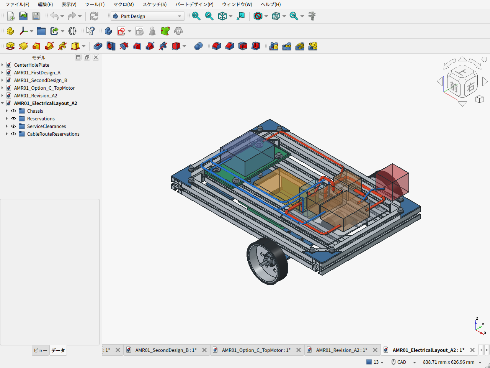
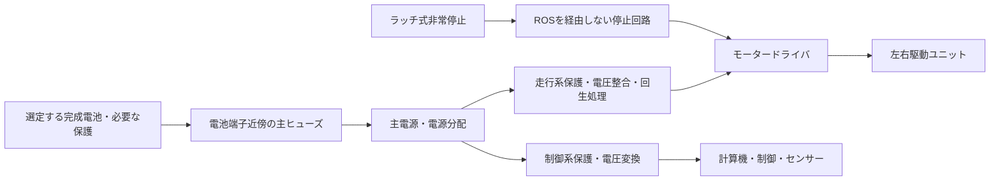

# 電池位置・配線・交換空間の検討

2026-09-20。第一案改A2の骨格に、機器の予約領域と配線経路、電池交換時の空間を追加した。**追加形状は配置検討用で、選定済みの電池・基板・ハーネスではない。** 元の骨格CADとその機械部品表を保存し、別のFreeCAD文書で検討する。



- [電装配置検討FCStd](AMR01_ElectricalLayout_A2.FCStd) / [上面の実画面](cad-screen-electrical-top.png) / [電池を抜く空間の実画面](cad-screen-electrical-battery-removal.png)
- [配置パラメータ](electrical_layout_parameters.json) / [公称干渉検査結果](electrical_layout_validation.json)
- [独立した配置レビュー](BATTERY_PACKAGING_REVIEW.ja.md) / [AMR実例](DRIVE_PRECEDENTS_AMR.ja.md) / [ロボコン実例](DRIVE_PRECEDENTS_ROBOCON.ja.md)

赤系の経路は動力・電源、青は信号。茶色は前方のヒューズ・分配・電源整合・ドライバの予約領域、後方の青い箱は計算機等の予約領域、赤い箱は非常停止の操作・取付領域。中央の黄色が電池本体の予約空間。小さな水色は電池コネクターの作業空間。表示寸法は搭載候補を選ぶための条件であり、特定製品が必ず収まる保証ではない。

## なぜこの電池位置か

中央寄りの低い位置は、左右の重量差を小さくし、重い電池を上へ積むのを避けられる。加えて、現在の3輪配置では後部キャスターと前部モーターの間に低い区画を確保できる。

| 配置上の理由 | 寸法と注意 |
|---|---|
| キャスターの旋回を避ける | 仮の旋回包絡前端x=−105mmに対し、クレードル後端x=−95mmで10mm離す |
| 前部モーターを避ける | モーターケース後端x≈66.55mmに対し、クレードル前端x=35mmで約31.55mm離す |
| 電池を低く置く | 搭載面は床上35mm。フレーム上面99mmより64mm低い |
| 上から交換する | 後方の電装トレイはx=−105mmまで。電池本体x=−90〜30mmの真上を空ける |
| 左右の偏りを避ける | 予約箱の中心y=0mm。前後位置x=−30mmは重心最適化の確定値ではない |

ただし、従来の電池予約120×80×65mmに対してクレードル内寸は前後124mm、左右100mm。**前後各2mm、左右各10mmはプラグを扱う余地として十分とは言えない。** 従来は足回りとの干渉と低い搭載面を確認した段階で、配線・端子・着脱が成立した設計ではなかった。

今回の配置検討では、端子が前上方へ出る条件を仮置きした。前方x=35〜60、y=±25、z=75〜140mmをコネクターの手作業空間として別に確保する。選ぶ電池の端子向きやアダプターがこの条件に合わなければ、電池またはクレードル配置を変える。箱寸法120×80×65mmは固定要件にしない。

## 交換と保持

電池上方はx=−100〜40、y=±50の140×100mmを空け、恒久部品や固定配線を横切らせない。図の交換空間は床上190mmまで描いた。電池底をレール上面99mmより高くする必要があるため、底35mmから少なくとも64mm超、余裕5mmを取れば約69mm持ち上げる。このとき高さ65mmの箱の上端は約169mmになる。取手・手指・ケーブル・カバーの余裕はさらに必要で、190mmは配置検討用の値。運転中の機体外形とは区別する。

基本手順は、停止して主電源を切る→電池コネクターを外し車体側ケーブルを前方へ退避→2本の保持ストラップを外す→電池を上へ抜く。赤い電池接続経路だけは接続中に作業空間へ入るため、検証でも明示的に例外としている。交換画面ではこの接続経路を非表示にした。

保持部はまだ製品・締結方法が未確定。レビューでは内側3030の側面に付ける金属アイと着脱式ストラップを提案した。クレードルのフランジがレール下面に接するため、単純に帯をレール全周へ巻けばよいとはしない。PLA床の荷重負担・熱・クリープの検証も残る。

旧基礎設計書にはマキタ18V電池の流用案があるが、パックとアダプターは未選定。採用するなら両者の実寸とスライド着脱を照合する。今回の上抜きが成立するのは、直接上抜きできるパック、または電池とアダプターを一緒に外すカセット構成等である。マキタパック単体をこの箱からそのまま上へ抜けると確認したわけではない。

## 配線と機器の分け方

前方へ駆動ドライバと電源保護・分配、後方へ計算機・制御を置く予約配置にした。従来の後方85×180mmトレイへ全電装が載る前提を外し、前方に追加支持板の仮形状を示した。この板の締結・放熱・価格は未確定で、実部品表には含めていない。

電源幹線は主に+y側、信号幹線は−y側へ回す。右モーターへの動力分岐は−y側も通るため、高さと通過位置を分けた。交差箇所を含めて幾何干渉を確認したが、色分け・離隔だけでEMI耐性が確認できたとは扱わない。動力の往復配線をまとめ、エンコーダ等は採用機器の推奨配線・接地方法に従う。

経路を選んだ後に、3030へ固定するPクリップ等の張力止め、板端のエッジ保護、コネクター直近の固定と脱着余長を加える。今の管は束の外形予約であり、実ケーブルの線径・本数・被覆・最低曲げ半径・配線長は未確定。仮の曲げ半径8/10mmを描いたことをケーブルの適合証明にはしない。

特に**左右のモーター背面間は18mm**で、実際のエンコーダ端子・電源線の出口を含めた収容は未確認。CADのモーター配線は作業用の接近点で止めており、端子まで接続した図ではない。向かい合う直線プラグを勝手に成立とせず、選び直す駆動系の実コネクターで配置を更新する。

## 電源系統の設計条件

次図は機能構成であり、端子番号や部品定数を決めた製作用回路図ではない。



12Vモーター候補と18V電池案をそのまま直結しない。採用電池の満充電から使用下限までの電圧、連続・起動・拘束時の電流、回生電流、保護遮断時の挙動をドライバと一緒に照合する。24V候補へ進む場合も電源構成を更新する。現時点ではヒューズ値、配線断面積、遮断部品、昇降圧器・回生処理を確定していない。

参考にした[ROSbot XL公式マニュアル](https://husarion.com/manuals/rosbot-xl/)は、電池11.1V・7.8Ahだけでなく、放電上限8A、専用Power Board、制御基板と接続をまとめて記載する。このように電池・保護・駆動・制御を一緒に選ぶ。パック寸法だけを流用する資料とは扱わない。

ユーザーへの容量希望の質問が未回答のため、連続走行1時間を仮の設計目安とし、電池の購入候補はまだ固定しない。仮に負荷側平均30〜50W、電源効率90%、使用可能エネルギー80%なら、必要な公称エネルギーは`30〜50×1/(0.9×0.8)≒42〜69Wh`。これは消費電力を測定した予測ではなく、容量と搭載空間を検討する感度計算。最終的に電池の実寸・質量で低い搭載位置と配線を見直す。

## 今回の確認と費用

骨格226部品に対し、電池・機器の予約領域、追加支持板の仮形状、配線10経路の公称干渉を検査した。機器領域同士、配線経路同士、交換空間を塞ぐ恒久領域にも干渉なし。電池接続経路は外してから交換する条件を設定した。電源回路の成立、端子接続、線径、EMI、固定、温度、ヒューズの協調はこの幾何検査の対象外。

機械骨格34,519円の既存予算は、電池・ドライバ等の電装を除外している。今回の予約形状を加えても電装の価格がゼロになるわけではない。前方支持板、配線・コネクター・ヒューズ・固定材・電源保護・電池・充電器・制御器の選定後に、機械と電装を合わせて再集計する。モーター候補比較もドライバや置換される車輪・軸受を含む範囲で行う。

FreeCAD内の再生成：

```python
for filename in ('build_electrical_layout.py', 'capture_electrical_layout.py'):
    p = '/path/to/amr-pj/cad/amr03/' + filename
    exec(compile(open(p).read(), p, 'exec'), {'__file__': p})
```
