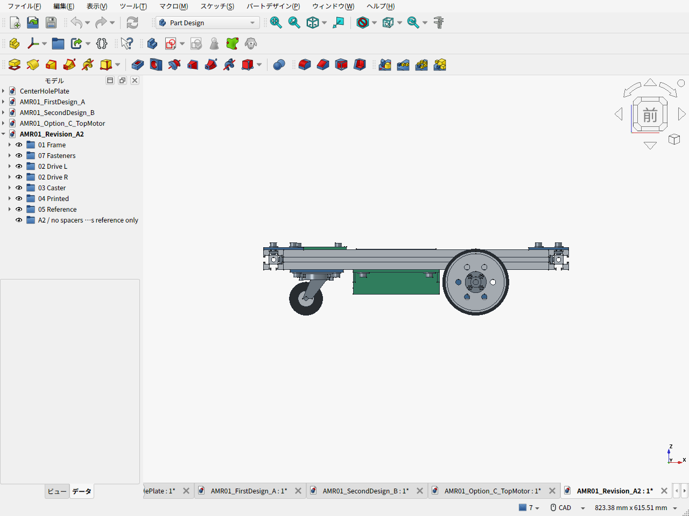

# 第一案改 A2：スペーサー撤去と低い電池配置

2026-09-20 / v0.6.0。**第一案Aを基に、駆動部の40mmスペーサー8本とキャスター側の6mmスペーサー4本を撤去した。** KP08を上下反転して支持板を3030の下面へ直接固定する。100mm輪・同軸駆動・3030定尺300/400mmを維持し、ベルト案Cは却下、箱形支持の第二案Bも現行案から外す。

狙いは第一案の簡素さと費用を保ち、搭載物を低く置くこと。フレームを6mm下げ、電池用PLAクレードルをフレーム内へ設けた。**40mmスペーサーの撤去が、そのまま40mmの車体下降になる構成ではない。**

**追記：** [電池位置・配線・交換空間の検討CAD](ELECTRICAL_PACKAGING.ja.md)を追加した。駆動系は[実機採用例を起点に再選定](DRIVE_RESELECTION.ja.md)し、DDSM115一体ホイールを次の取付検討の優先候補とする。以下の骨格CAD・費用はFIT0185構成の比較基準で、新駆動系へ変更済みではない。

## 実際のFreeCAD画面とデータ




茶色の半透明箱は未選定電池の予約空間120×80×65mm。購入済みの電池や重量保証を表すものではない。緑がPLA部品、青が加工する金属部品。

- [FreeCAD本体](AMR01_Revision_A2.FCStd) / [STEP](AMR01_Revision_A2.step) / [上面の実画面](cad-screen-top.png)
- [部品表](BOM.csv) / [購入URL・価格区分](bom.json) / [費用集計と第一案との差額](cost_summary.json)
- [CADから集計した締結部品](fasteners.csv) / [CAD検証・重量](validation_results.json)
- [設計条件](design_parameters.json) / [駆動・軸・重心感度計算](calculation_results.json)
- [実機採用例からの駆動系再選定](DRIVE_RESELECTION.ja.md) / [従来のモーター候補比較](MOTOR_SELECTION.ja.md)
- [車輪担当の検討](WHEEL_REVIEW.ja.md) / [低重心化の独立レビュー](CG_REVIEW.ja.md) / [150mm輪の調達検討・今回は不採用](wheel-shopping-notes.ja.md)
- 印刷用STL：[電池クレードル](BatteryCradlePLA.stl) / [電装トレイ](ElectronicsTrayPLA.stl)

## 変更点と設計理由

| 項目 | 第一案A | 第一案改A2 |
|---|---|---|
| 3030フレーム | 外寸460×300、400mm材4本＋300mm材2本 | 同じ定尺・本数 |
| フレーム下面／上面 | 床から75／105mm | **69／99mm：6mm低下** |
| 駆動輪 | 径100、幅25.4、輪距354mm | 維持 |
| KP08軸受 | 支持板の上に置く | 支持板の下で上下反転 |
| 軸受支持板 | z=31〜35mm、40mmスペーサーで吊る | z=65〜69mm、フレームへ直接固定 |
| キャスター支持板 | z=65〜69mm、6mmスペーサー付き | 同じ高さでフレームへ直接固定 |
| モーター | 下置き、ケース中心z=50mm | 下置き、偏心を45度回し中心z=45.05mm |
| 電池搭載面 | 上トレイ上面z=107mmを仮定 | **クレードル床上面z=35mm** |
| フレーム接合 | 汎用金具セット | MISUMI HBLFSN6-SET×8、純正溝ナット計44個 |
| 骨格の外形 | 460×394×115.6mm | **460×394×109.6mm** |

車軸は床上50mm、KP08の軸心から取付面までは仮寸法15mm。反転すると取付面が床上65mmになり、t4支持板を介してフレーム下面69mmへ直結できる。これでキャスターも同じ高さのまま直結でき、長い支持柱が不要になる。100mm輪のまま従来の配置を40mm下げるだけでは、車軸・モーターとレールが重なる。

モーターの出力軸中心はx=90/z=50mmで維持する。ケースの偏心7mmを45度回し、ケース中心をx=85.05/z=45.05mmへ移した。ケースとフレームの公称隙間は5.45mm。90度回すとケースが地上高25mmの設計目標を割るため、45度を選ぶ。モーター金具は第一案と同じ40×20×t3アングルを反転し、PCD31の固定穴も回転後の15/135/255度へ移している。

150mm輪ならフレームをさらに下げる配置は可能だが、同じ駆動力で必要トルクが1.5倍になり、ハブ・キャスター周辺の変更が増える。今回は第一案の足回りを維持して具体化した。ベルト案の再検討は行わない。

## 重量と重心の扱い

骨格概算**4.63kg**＋電池・電装等の枠2.05kg＝**約6.68kg**。自重上限10kgまで約3.32kg。購入品の公称・参考質量と加工部品のCAD体積を合わせた推計で、実測ではない。荷物2kgと将来アーム系2kgは別枠、最大14kgで駆動を計算する。

電池・アダプター0.75kgの枠を、同じ高さ65mmの箱として旧トレイ上から新クレードルへ移す仮定では、その中心高さは139.5→67.5mmとなる。**72mm下がるのは電池の仮中心で、機体全体の重心ではない。** 他を同じにした感度計算では、電池移動だけの全体重心への寄与は総質量6.68kgで約8.08mm低下、10kgなら5.40mm低下。

フレーム1.672kgの6mm低下は別に約1.50mm／1.00mmの寄与を持つ。ただし、支持板は上がり、スペーサー等の質量も変わるため、これらの和を実機A→A2の全体重心差とは扱わない。電池・電装・荷台の現物配置が決まってから全体重心を更新する。平らな床での静的な支持余裕は重心の水平位置で決まり、高さを下げただけでは増えない。

電池を避けて後方に85×180×4.4mmの電装トレイを置く。電池クレードルは130×160×37mm。両方とも[P1S公式の256mm立方の造形範囲](https://us.store.bambulab.com/products/p1s)に収まり、PLAを中実として約174g、支持材等込みの予算は250g以内を仮置きする。クレードル上部の張出しにはサポート等が必要で、印刷条件はスライサーで確認する。

PLAクレードルは電池荷重を受ける暫定支持部品。大径ワッシャを使うが、底・フランジのクリープや熱の影響は未検証。3030へ固定するストラップ2本を費用・質量枠に入れたものの、製品と取回しは未選定でCADには含めていない。ストラップを加えてもPLA床のクリープがなくなるとは扱わない。主車輪の支持板・金具は金属を維持する。

## 費用

第一案と同じ購入単位を基準にする。候補品は未発注。価格区分は、第一案の同日確認価格を引継ぐもの、メーカー参考価格、未見積の予算枠を区別した。

| 機械骨格の費用 | 第一案A | 第一案改A2 | 差額 |
|---|---:|---:|---:|
| 自加工：部品・材料・送料 | 34,159円 | **34,519円** | +360円 |
| 加工外注の仮枠込み | 40,159円 | **40,519円** | +360円 |

スペーサー素材と金属トレイの削減に対し、純正金具・追加ナット、PLA消費、ストラップ、締結材と送料を加えた結果。詳細は[差額内訳](cost_summary.json)。自加工34,519円は部品・消費材料30,169円＋送料枠4,350円。10%予備費は別枠で、自加工37,971円、外注込み44,571円となる。

外注6,000円は金属部品の切断・穴あけ・皿もみ等を依頼する場合の未見積枠で、必要な購入部品ではない。自加工するなら加算しない。工具を所有している前提で、工具購入費と自己作業時間は含まない。**電池・電装・ドライバ・制御基板・センサー・非常停止回路・完成用ガード・荷台・アームは別途。** 純正HBLFSN6-SETは指定したが、個人向け購入経路と送料は未確定なので購入確定額とは扱わない。

## 足回りの選定と組立

| 部品 | 採用候補と理由 |
|---|---|
| モーター | DFRobot FIT0185×2。第一案を流用、12V・131:1・無負荷83rpm、205g/個。連続定格は未確認 |
| 駆動輪 | Amazon B0B23WBLBK、100×25.4mm・穴8mm。第一案を流用し必要トルクを増やさない |
| 車輪軸／軸受 | 8×100mm軸×2、KP08×4。各車輪の荷重を独立軸で受ける |
| ハブ／継手 | 第一案の穴8mmハブと6→8mmジョーカップリング。車輪側の穴加工が必要 |
| キャスター | Hammer 420G-R50。高さ65mm、第一案と同じ接地位置 |
| 接合金具 | HBLFSN6-SET×8。付属M6ねじ／HNTT6-6各16個、溝ナット追加28個 |

軸受用M4×16皿ねじ8本とモーター金具用M4×12皿ねじ4本は支持板上面へ埋める。反対側にM4ナットを置き、板上面がレールへ直接接触できるようにした。固定M6も旧スペーサー用の長さを残さず選び直している。

基本の組立順は、溝ナットを入れる→フレームを組む→支持板へ軸受・モーター金具を皿ねじで固定する→車軸の芯と手回しを確認する→支持板ごとフレーム下面へ取り付ける。レールに隠れる皿ねじがあるため、フレームへ固定してから全ねじを締める前提にはしない。純正金具はメーカー指定のねじ挿入順に従う。

車輪中心y=177mm、軸受中心y=118/145mmを維持するので、**32mmの車輪張出しは第一案と同じ**。比較用100N荷重で最大軸受反力218.5N、8mm軸の曲げ応力63.7MPaも同じで、スペーサー撤去による改善とは主張しない。反転したKP08の保持能力、板の曲げ、ねじの引張・締結、溝接合の滑りは現物仕様を確認する。

14kg・加速度0.2m/s²・5度・転がり抵抗係数0.03・余裕1.5の計算では、一輪0.708N·mが必要。FIT0185の4.41N·mは拘束トルクで連続定格ではない。初期0.15m/s＋0.3rad/sは外輪38.8rpm。暫定指令上限65rpmに対し、0.3m/s＋0.6rad/sは77.6rpmとなるため同時指令を制限する。

## CADで確認した範囲

- 実部品形状226個、別に電池の予約空間1個。全形状が有効。
- ねじ・ナットを含む実部品25,425組で、0.001mm³超の公称形状干渉なし。電池予約空間との干渉もなし。
- 支持板・キャスター板とフレームの接触、スペーサー0本、3輪の接地、最低固定部地上高25mmを確認。
- キャスターを5度刻み72方位で回して固定部との干渉なし。
- 必要溝ナット44個をCADとBOMで照合。STEP再読込の228ソリッドと体積一致、STLの閉鎖性と造形範囲を確認。

公称モデルでの確認であり、部品定格・公差・工具アクセス・変形を保証するものではない。特にKP08実寸、反転時の取付、車輪ウェブとハブ穴、モーター金具の隅RとM3工具アクセス、カラーとハブねじ頭の0.8mm隙間、皿頭規格、電池配線・保持を現物で詰める。モーター金具の内R3は今回CADへ含めた。幅394mmに対し完成目標400mmでは側面ガードの余裕が片側3mmしかなく、ガード形状も残る確認事項。

## 再生成

通常のPythonで費用・計算を更新する。設計計算は既存の`cad/amr02/calculate_design.py`の共通計算関数を再利用する。

```sh
python3 cad/amr03/calculate_cost.py
python3 cad/amr03/calculate_design.py
python3 -m unittest discover -s cad/amr02 -p 'test_calculate_design.py' -v
```

FreeCADのPythonコンソールでは、パスを配置先へ置き換える。

```python
for filename in ('build_chassis.py', 'validate_chassis.py', 'capture_screens.py'):
    p = '/path/to/amr-pj/cad/amr03/' + filename
    exec(compile(open(p).read(), p, 'exec'), {'__file__': p})
```

寸法の一部は[再生成コード](build_chassis.py)に定義している。寸法を変えるだけで各部の成立を自動解決する拘束アセンブリではない。変更後は部品配置・穴・公差と費用を一緒に見直す。

## 主な一次資料

- [DFRobot FIT0185](https://wiki.dfrobot.com/fit0185/) / [メーカー共通寸法図](https://www.dfrobot.com.cn/image/data/FIT0186/GB37Y3530-251R-dimensions.jpg)
- [MISUMI HBLFSN6](https://jp.misumi-ec.com/vona2/detail/110300442340/)
- [Hammer 420G-R50公式カタログ](https://www.hammer-caster.co.jp/common/pdf/company/CTLG_420GR_s44_06.pdf)
- 購入候補のURLと価格記録は[BOM元データ](bom.json)。第三者の商品写真・寸法図そのものは転載していない。
