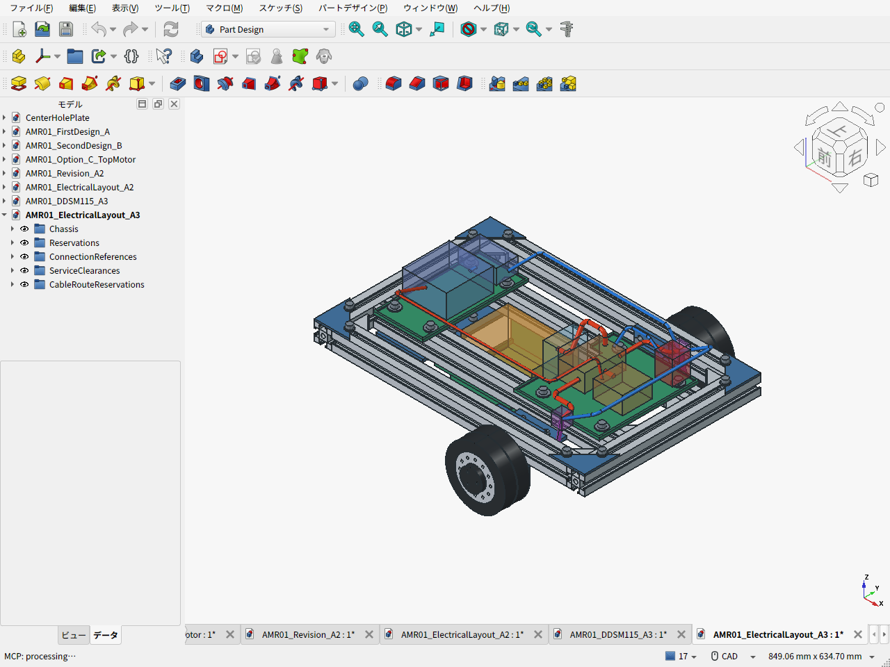

# A3の電池・電装配置と配線・保守空間

2026-09-20。DDSM115を使うA3の物理形状をコピーし、別文書 `AMR01_ElectricalLayout_A3` に電装の予約領域、11本の配線経路、保守空間を加える。**追加形状は配置検討用であり、実部品・ハーネスの選定完了を示さない。** 前方の `FrontElectronicsTrayPLA` とその締結ねじはA3の実部品としてコピーする。



- [電装配置FCStd](AMR01_ElectricalLayout_A3.FCStd) / [上面](cad-screen-electrical-top.png)
- [電池交換空間](cad-screen-electrical-battery-removal.png) / [タイヤ保守空間](cad-screen-electrical-tire-service.png)
- [配置パラメータ](electrical_layout_parameters.json) / [実行時の幾何検査結果](electrical_layout_validation.json)
- [DDSM取付・ケーブルの一次資料確認](DDSM115_INTERFACE.ja.md) / [タイヤ摩耗](TIRE_WEAR.ja.md) / [費用の範囲](COST_REVIEW.ja.md)

赤は電力・電源、青は通信・停止指令、紫は電力と信号を含むDDSM付属ハーネス。紫の小箱はコネクター接続付近の予約領域で、選定済みの複合コネクターではない。黄色の電池箱も、電池本体だけの仮寸法である。

## 電装の配置

前方トレイへ主ヒューズ・分配、電源整合、非常停止、後方トレイへ計算機とUSB–RS485変換器を置く条件で検討する。DDSMはモータードライバーとエンコーダーを内蔵するため、車体上に外付け駆動ドライバーの箱や独立エンコーダー配線を追加しない。

すべての箱は未検証の実装予約。Devantech USB-RS485Bは通信部の価格候補として選定したが、予約箱65×37×25 mmは実測外形や端子込み寸法を保証しない。USB変換器と非常停止の予約底面は床上111 mmとし、デッキのねじ頭を避ける。**予約箱をその高さで支持するスタンドオフ、ブラケット、非常停止用の操作パネルは未選定で、今回のCADには含まれない。** コネクター、放熱、基板固定位置も選定後に照合する。

電池本体の予約は `x=−90〜30、y=±40、z=35〜100 mm`。車体中央寄り、左右対称、フレーム上面99 mmより低い床上35 mmに置く意図を維持する。18 V工具電池は候補で、パック、アダプター、容量、保持方法は未選定。現物のスライド着脱や端子方向がこの配置に合うかは未確認である。

## DDSM付属ハーネスの経路長

メーカー資料では固定端中央から配線が出て、ハーネス全長は175±10 mm。左側の配置経路は次の4点を通る折線を、中心線の曲げ半径8 mmで丸めたもの。右側はYを反転する。束の予約半径は3 mm。[一次資料と不明点](DDSM115_INTERFACE.ja.md)

```text
(90, 138, 50.35) → (90, 115, 50.35)
                  → (142, 115, 50.35) → (142, 100, 115) mm
```

固定金具の中央φ10開口から内側へ出し、上側アングルの下面z=69 mmの下を通り、アングルの前端x=130 mmより前のx=142 mmで上へ逃がす。終点の左右接続予約箱で、付属ケーブルから延長の電力線とRS485線へ分ける想定である。

| 片側の中心線長・余り | 計算値 |
|---|---:|
| 元の折線 | 141.367 mm |
| 半径8 mmで丸めた中心線 | **134.500 mm** |
| 最短全長165 mmとの差 | **30.500 mm** |
| 公称全長175 mmとの差 | 40.500 mm |

この差は寸法計算上の余り。メーカーの全長基準に含まれるコネクター本体、分岐、実際の出口位置、必要な緩みと張力止めをまだ反映していない。**165 mm以内に中心線が収まったことを、現物ハーネスが届き、曲げ条件も満たす保証にはしない。** 束半径3 mmと曲げ半径8 mmも配置用の仮値である。

## 延長配線と接続領域

主ヒューズ・分配の予約から左右のDDSM接続領域へ電力を配る。RS485は `USB変換器→左接続領域→右接続領域` の1本のバスとして2区間を描く。各DDSMの付属ケーブル内に電力と信号が含まれるので、付属部分を色だけで別経路に分けない。

電力とRS485の延長は通過位置と高さを分ける。接続箱付近では複数の束が同じ参照点に到達するが、これは別々の端子を配置するための共通領域で、電力と信号を電気的に短絡する指定ではない。ピン配置、終端抵抗、信号基準GND、分岐長、USBケーブルは未確定。配線の形状的な離隔だけでEMIや通信品質が確認できたとは扱わない。

検証では、許可した経路の交差部分でも**接続箱の内側にある体積だけ**を「意図した接続付近の重なり」に分類する。箱外の交差や、無関係な経路の交差はエラーとして残す。箱全体・経路全体を一括して干渉検査から除外しない。

主電池からヒューズへの線、電源整合から制御系への線、計算機からUSB変換器への線、非常停止から主分配への指令経路も含めて11経路。非常停止の描画は停止回路の接続意図を示すだけで、ROS非依存の遮断回路、ラッチ、遮断定格、復帰条件を設計済みとはしない。

## 電池交換とタイヤ保守

電池上方の `x=−100〜40、y=±50、z=69〜190 mm` と、前上方のコネクター作業領域を維持する。上抜き前に電池線を外して前へ退避し、保持ストラップを外す前提。電池線による作業領域の占有は、外す必要がある線として検査結果に別記する。稼働時間1時間は引き続き検討用の目安で、電池容量や稼働時間の保証ではない。

左右タイヤの前面カバー外面 `y=±203.5 mm` から、外側へ80 mm、半径55 mmの円筒を工具・作業領域として予約する。**これは実際のタイヤ嵌合・カバー取り外し・抜取り軌跡を検証した形状ではない。** 円筒は半径55 mmに対して軸高が50.35 mmなので、床面下4.65 mmを含む。車体を持ち上げ、支持した保守状態で使う仮領域とする。

外側のねじへの工具アクセスとタイヤを抜く余地を保ち、ガード等を追加した際には再確認する。交換タイヤの適合と調達は[TIRE_WEAR.ja.md](TIRE_WEAR.ja.md)に従って別に確認する。

## 検証の範囲と実行

スクリプトは、A3物理部品に対する全予約領域・配線の干渉、機器同士、保守空間を塞ぐ恒久領域、無関係な機器を通る配線、接続箱外の配線交差、各形状の有効性を検査する。丸めた中心線長を独立した数式とFreeCADのWire長で照合し、付属ハーネス最短長との比較も出す。

実行結果は `electrical_layout_validation.json` の `nominal_geometry_checks_passed` と各衝突リストを確認する。意図的な接続重なりは `intentional_route_connection_overlaps` に別記する。異常があっても確認用FCStdとJSONを保存してからエラーを返すため、**ファイルが存在するだけでは検査合格を意味しない。** 実部品寸法、公差、配線施工、電気定格、温度、保持部品の強度は検査範囲外。

2026-09-20の最終検証は **PASS**（A3物理203部品・配線11経路、意図した接続重なり9件を別記し、それ以外の干渉・無効形状・中心線長照合エラーは0件）で、等角・上面・電池交換・タイヤ保守の4枚の実FreeCAD画面を保存し、上面と保守領域を目視確認した。

前方トレイとそのねじはA3機械部品表に含まれる。USBケーブルは部品表E02に500円の仮枠を計上し、実購入単位で更新する。電池、基板固定部品、線材、コネクター、クランプ、ヒューズ、電源整合、非常停止部材は未見積で、選定後に費用へ追加する。予約形状を作ったことを調達・費用確定としない。

FreeCAD内で生成し、GUI所有者が画面取得を実行する。

```python
from pathlib import Path
folder = Path('/path/to/amr-pj/cad/amr04')
for filename in ('build_electrical_layout.py', 'capture_electrical_layout.py'):
    p = folder / filename
    exec(compile(p.read_text(), str(p), 'exec'), {'__file__': str(p), '__name__': '__main__'})
```

FreeCADを使わずにコードをインポートし、`planning_report(config)` で経路長・曲げの成立・参照先だけを検査することもできる。その検査だけでは物理干渉を判定できない。
