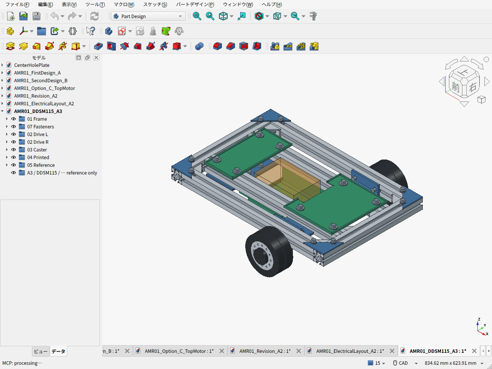
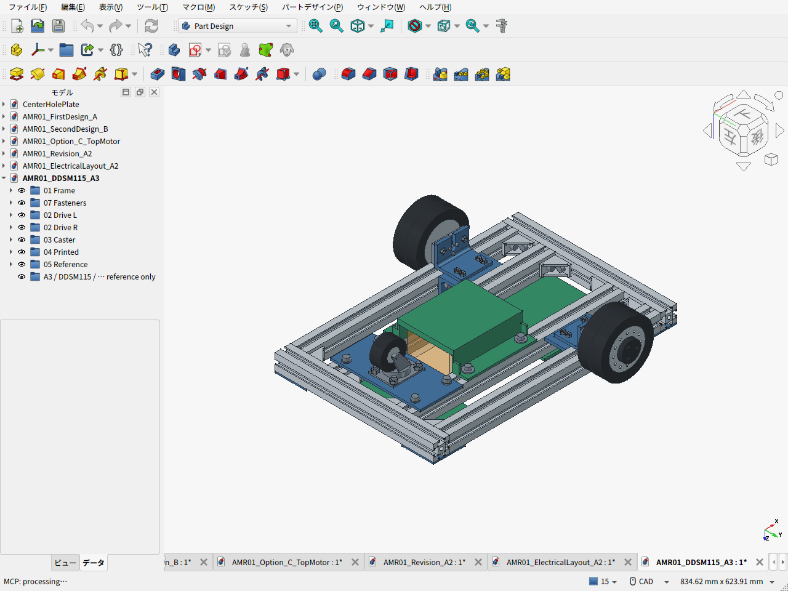
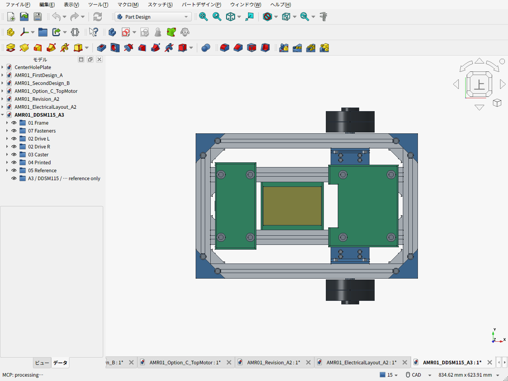

# 第一案改 A3 — DDSM115一体ホイール

> 比較履歴です。現行案は[M0601C_111のA4](../amr05/README.ja.md)。

2026-09-20 / v0.7.0。走行余裕を優先して、第一案改A2のFIT0185・継手・長い車軸・外付け軸受をDDSM115へ置き換えたCAD案。Amazonで扱う3030の300/400mm定尺、低い電池位置、スペーサーなしの方針を維持する。ベルトは使わない。

**タイヤの摩耗寿命と交換タイヤの確実な調達先は未確認。** ゴムタイヤを脱着できることはメーカー資料で確認したが、補修品が安く買えるとまでは判断できない。[タイヤ摩耗・保守レビュー](TIRE_WEAR.ja.md)を採用判断に追加した。

## CADと実画面

- [FreeCAD本体](AMR01_DDSM115_A3.FCStd) / [機械部品STEP](AMR01_DDSM115_A3.step)
- [電装・配線・整備空間のCAD](AMR01_ElectricalLayout_A3.FCStd) / [配置の説明](ELECTRICAL_PACKAGING.ja.md)
- [部品表](BOM.csv) / [購入単位と価格区分](bom.json) / [費用集計](cost_summary.json)
- [設計条件](design_parameters.json) / [形状・重量検査](validation_results.json) / [駆動・静的反力・摩耗感度](calculation_results.json)
- [モーターの費用・性能比較](MOTOR_COMPARISON.ja.md) / [取付インターフェース根拠](DDSM115_INTERFACE.ja.md) / [金属マウントの独立レビュー](MOUNT_REVIEW.ja.md)

以下はFreeCADの実ウィンドウを保存した画像。モーターは公式外形・取付寸法に基づく簡略形状で、内部の軸受やタイヤの詳細嵌合を再現していない。茶色の半透明箱は未選定電池の予約空間。





[駆動モジュールの拡大実画面](cad-screen-drive-module.png)



## 要件と結果

| 項目 | 現行案 |
|---|---|
| 主フレーム | MISUMI NFSL6-3030、400mmを4本・300mmを2本使用。外形460×300mm |
| 接合 | MISUMI HBLFSN6-SETを8組。純正品指定だが個人向け調達経路・最終送料は未確定 |
| 駆動 | DDSM115×2、タイヤ径100.7mm・幅43mm、輪距349mm |
| 支持 | 駆動二輪＋Hammer 420G-R50自在キャスター1個 |
| 機械骨格外形 | 460×407×109.6mm。前蓋の突出込みでA2の幅394mmから13mm増 |
| 完成外形の配置目標 | 500×420×180mmへ改定。元の幅400mmでは、フレーム幅300mmとタイヤ内側3mmすきまを保ったDDSM115の前蓋が収まらない |
| 高さ | フレーム下面69mm、電池搭載面35mm、固定部最低地上高29mm |
| 質量 | 機械約4.989kg＋電池/電装仮枠2.10kg＝約7.09kg。実測前、台車上限10kg |
| 最大構成の計算 | 台車10kg＋荷物2kg＋将来アーム系2kg＝14kg。可搬実証ではない |
| PLA部品 | 電池クレードル130×160×37、後部トレイ85×180×4.4、前部トレイ145×170×4.4mm。P1S公称256mm角以内 |

### 駆動と取付理由

14kg、勾配5度、加速度0.2m/s²、転がり抵抗係数0.03を仮定すると、一輪の必要トルクは0.475N·m。比較用余裕1.5倍込みで0.713N·mとなり、DDSM115の18V公表定格0.96N·mを下回る。初期0.15m/s・角速度0.3rad/sを同時に指令した外輪は38.38rpm、将来0.3m/s・0.6rad/sでは76.75rpm。低電圧や低速連続時の温度、旋回抵抗、段差は実機確認が残る。拘束トルク2N·mを使用可能な連続値にしていない。

モーター固定面から車輪中心まで36.5mm。旧FIT0185構成の103mmに対し、外付けの継手・8mm軸・KP08軸受を撤去できる。これらを省略した分だけ材料が減る一方、DDSM115本体価格と通信部品は増える。

取付は、上下のアルミアングルt5と鋼のキー板t5を使う。キー板が固定端の三平面外形を受け、M2.5ねじ3本だけに荷重を任せない方針。キーと小ねじの実際の荷重分担は公差・締付けに依存するため、無荷重になるとは扱わない。主支持をPLAにはしない。

上側アングルは3030の内側面へM6で固定する。下側アングルとの接合はM4を4本、鋼キー板はM4を2本使用。公称形状の干渉はないが、局所肉厚・予圧維持・こじり・溝ナットの引抜き・横方向荷重を含む強度の認定は未了。粗い曲げ比較でt3よりt5を選んだ理由と限界は[独立レビュー](MOUNT_REVIEW.ja.md)に記録した。

### 加工が必要な箇所

| 材料・購入枠 | 使用形状・加工 |
|---|---|
| 40×40×t5アルミアングル、L200 | L80を2個。片脚を30mmへ切詰め、M6・M4穴 |
| 50×50×t5アルミアングル、L150 | L60を2個。片脚を40mmへ切詰め、M4・M2.5穴、中央φ10・幅7下開きスリット |
| 下角材の内R | 上側M2.5頭に干渉するR付加部だけφ5.2で局所逃げ。壁厚5mmは保持 |
| SS400 t5板 | 60×33を2枚、固定端の三平面キー輪郭とM4穴。公称片側0.05mmの嵌合すきまは加工公差の指定・検証前 |
| A5052 t4板 | キャスター取付板80×170を1枚 |
| A5052 t3板 | 60角直角三角ガセット4枚 |

市販材からの切断・穴加工・輪郭加工が必要で、組立だけでは完成しない。「外注」はこの金属加工を依頼する場合の追加費用を指す。自加工案でも工具・技能を別に要する。上下をボルトで結ぶためt5板の曲げ加工は不要だが、キー輪郭と局所逃げを未加工のまま省略しない。

### 費用

| 範囲 | A2 | A3 |
|---|---:|---:|
| 自加工の購入・材料・送料枠 | 34,519円 | **47,824円** |
| 加工外注6,000円の未見積追加枠込み | 40,519円 | **53,824円** |
| さらに10%予備費を置く場合 | — | 52,607円 / 59,207円 |

A3にはDDSM115二輪25,982円、USB-RS485B 4,400円、同店送料660円、USBケーブル500円枠を含む。A2は外付けモータードライバ・制御器を含まない旧骨格予算であり、この表は完成走行車同士の総額比較ではない。増額13,305円の内訳を[費用レビュー](COST_REVIEW.ja.md)に示す。

価格は確認価格・引継ぎ参考値・未見積仮枠が混在する。電池・充電器・主計算機・電源保護・非常停止回路・実配線/コネクター/クランプ・完成ガード・荷台・アームは別途未見積。自己作業、工具購入、印刷電気代も含まない。PLAは既所有材の消費分600円で、新規スプールが必要なら購入単位全額へ更新する。

タイヤ交換費は初期BOMに含めないが、寿命費用がゼロという意味ではない。単体調達が確認できずユニット交換が必要なら、現在の国内販売価格で一輪12,991円がかかる。[保守費の未確定事項](TIRE_WEAR.ja.md)

## 検証と再生成

機械部品203オブジェクト・全20,503ペアで公称体積干渉なし。ねじ/ナットも含み、未選定電池の予約空間を別に照合した。キャスターは5度刻み72姿勢、STEP再読込は205ソリッドで元モデルと一致、PLAの3メッシュは閉じた形状で印刷範囲内。ねじ山、公差、変形、実工具、実電池適合を保証する検査ではない。

平床の静的計算は推計7.09kgと上限10kgの台車を別ケースとして扱い、荷物/将来アームの12ケース、各キャスター720方位を評価する。台車CG=(0,0,85)mmは未測定の仮定。運搬姿勢の駆動一輪最大は約4.76kg相当で、段差衝撃やアーム動作の定格には使わない。

```sh
python3 cad/amr04/calculate_cost.py
python3 cad/amr04/calculate_design.py
python3 cad/amr04/calculate_maintenance.py
python3 -m unittest discover -s cad/amr02 -p test_calculate_design.py -v
```

FreeCAD GUIのPython実行環境で、順に以下の各ファイルを実行する。`__file__`を対象パスとして渡す。

1. `build_chassis.py` — FCStd・STEP・STLを作成。
2. `validate_chassis.py` — 干渉・質量・STL・STEPを検査し`fasteners.csv`を生成。
3. `capture_screens.py` — FreeCADの実ウィンドウとビューポートを保存。
4. `build_electrical_layout.py` — 予約機器・配線・整備空間を別文書へ作成・検査。
5. `capture_electrical_layout.py` — 電装配置の実画面を保存。

過去案は[第一案A](../amr01/README.ja.md)、[第二案Bと却下したベルト案C](../amr02/README.ja.md)、[第一案改A2](../amr03/README.ja.md)に保存する。
