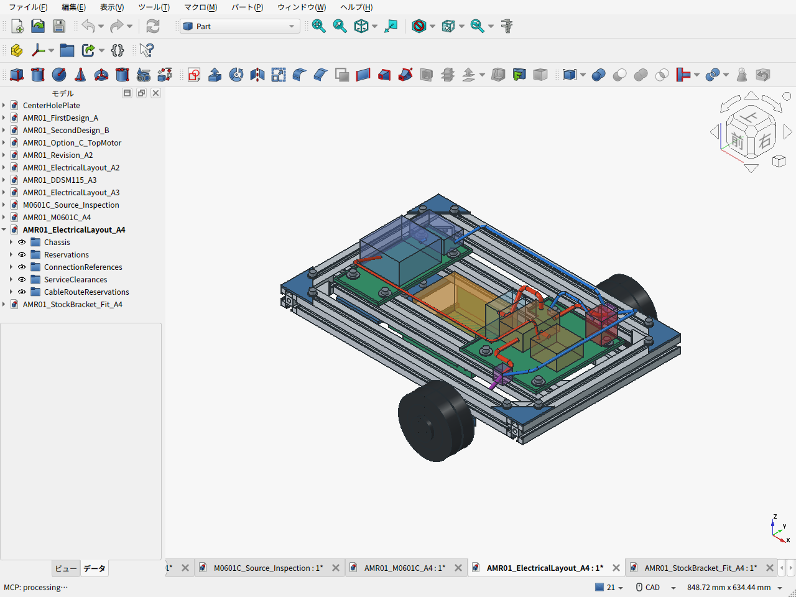

# A4 — 低床電池、配線、整備空間

M0601C_111はドライバ・エンコーダ内蔵として配置し、電源とRS485を左右へ引く。電池、電源保護、DC/DC、主計算機、センサ、非常停止支持部は未選定。色付きの機器箱と配線は予約空間であり、実部品の寸法保証や回路完成を意味しない。

電池は中央の低床クレードルへ置き、搭載面z35、予約箱120×80×65mm。上方へ抜く空間と前側端子へのアクセスを維持した。前後トレイはPLA、電池の保持帯は金属フレームへ固定する方針。保持帯、端子、アダプタは未選定で、PLAのクリープを保持帯だけで解決したとは扱わない。

左右モーターの線は特殊固定端の開放溝から下向きに出し、車体内側へ曲げて側方の接続予約位置へ導く。線束予約はφ6、曲げR8。形状上の最下端は約28.35mmで、金具35mm・電池底32mmより低い。実機では金具との接触保護と保持点を設け、タイヤ変形・摩耗時にも床へ接触しないよう確認する。線束を受け金具の荷重支持へ使わない。

公表ハーネス175±10mmに対し、経路133.62mm＋固定端付近の10mm枠で143.62mm。最小長から21.38mm残る計算だが、端子形状と実際の曲げ余長は未確認。ピン配置は資料と受入個体を照合し、線色だけで決めない。回生電力、保護回路、停止動作、RS485終端は電装設計で決める。

[配置検査](electrical_layout_validation.json)は11経路と機器予約箱について、モデル化した車体との干渉、電池の取出し空間、接続部以外の配線交差を確認した。接続箱の内部だけは端子周辺として重なりを許容する。実配線・クランプ・熱・ノイズの検証ではない。

タイヤの外側へ80mmの作業空間を確保し、カバーを外した後の仮タイヤ形状を外へ移動して干渉を確認した。M2.5は内側から、M6は下面からの工具軸を検査した。[工具/移動検査](mount_service_validation.json)。実工具の柄、タイヤのはめあい、抜き力は含まない。整備は車体を支持して輪荷重を抜く。

[配線CAD](AMR01_ElectricalLayout_A4.FCStd) / [上面実画面](cad-screen-electrical-top.png) / [電池取出し](cad-screen-electrical-battery-removal.png) / [タイヤ整備](cad-screen-electrical-tire-service.png)
