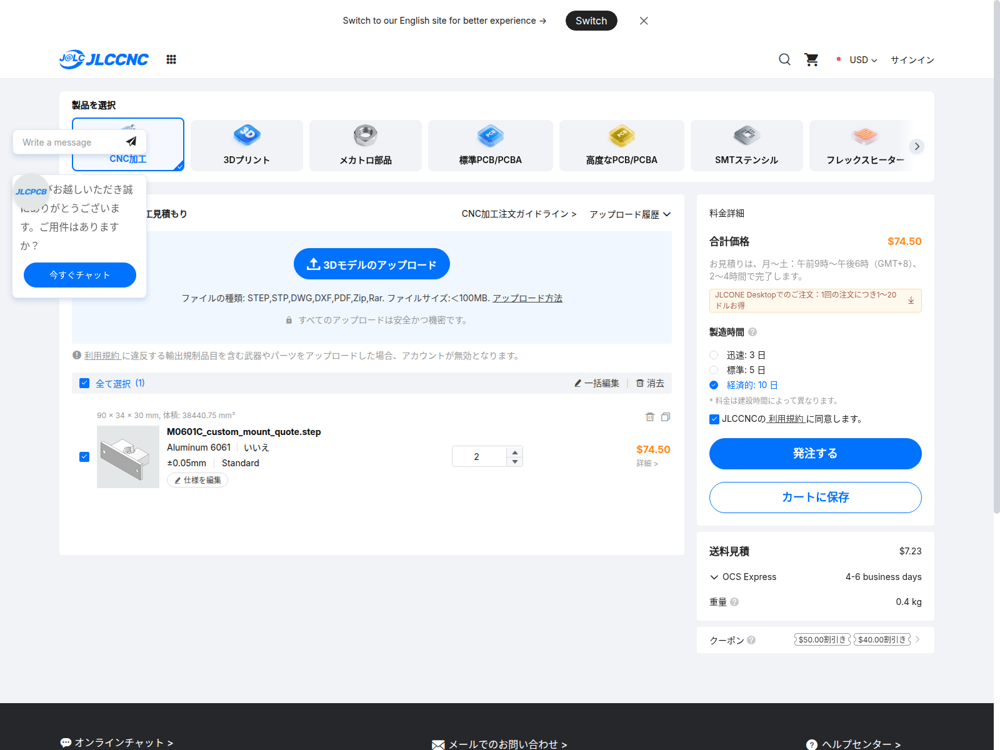

# 専用金具2個の加工サイト自動見積

2026-09-21、[JLCCNCの見積画面](https://jlccnc.com/jp/cnc-machining-quote)へ、このリポジトリの[実STEP](M0601C_custom_mount_quote.step)と[寸法図PDF](M0601C_custom_mount_quote.pdf)をアップロードした。**費用優先の製造10日で、同形2個74.50 USD、日本向け送料表示7.23 USD、表示額の和は81.73 USD**。加工時間からの独自推定や別部品の価格例ではない。

| 選択条件 | 金具2個の材料・加工 | 日本向けOCS送料 | 表示額の和 |
|---|---:|---:|---:|
| 経済的：製造10日 | **74.50 USD** | **7.23 USD** | **81.73 USD** |
| 標準：製造5日 | 84.06 USD | 7.23 USD | 91.29 USD |

標準との差は2個で9.56 USD。数量欄を2として取得した一式価格なので、74.50を再び2倍しない。クーポン・アプリ特典は適用していない。表示通貨はUSDで、JPY換算レートや決済手数料を仮定していない。

**この段階はサイトの自動見積で、審査後の確定見積・税等を含む着荷総額ではない。** [公式の注文ガイドライン](https://jlccnc.com/help/article/cnc-machining-ordering-guidelines)は、最終価格と納期を手動審査後に確定するとしている。正式な審査依頼・発注・支払いは実施していない。自動見積画面の表示を正式見積番号のある回答へ読み替えない。

## 加工条件と対象データ

| 項目 | 実際の入力・認識内容 |
|---|---|
| 数量 | 同一部品2個、左右別形状ではない |
| 材料 | Aluminum 6061。画面の材質説明は6061-T6、熱処理T6 |
| 表面仕上げ | いいえ：ブラスト・アルマイトなし、切削面のまま |
| 最も厳しい公差 | ±0.05mm。PDFの受け部平面8.25±0.05mmを対象に指定 |
| その他の公差 | 見積用にISO 2768-mを備考へ記入。製作公差の最終承認ではない |
| 外観 | Standard |
| ねじ・組立 | タップなし、サブアセンブリなし。全5穴は通し穴 |
| 寸法図 | STEPと同名のPDFを公差欄へ添付 |
| サイト認識寸法 | 90×34×30mm（軸の表示順が異なるだけで90×30×34と一致） |
| サイト認識体積 | 38,440.75mm³。CADの38,440.752513mm³と丸め一致 |
| STEP SHA-256 | `399ed21399d2bd237d12dbfafdfe6a5f079422efe9abbdf7c02c84a8c2138d13` |

[設定画面](quote-evidence/jlccnc-settings.png) / [数量・備考画面](quote-evidence/jlccnc-settings-notes.png) / [標準納期の画面](quote-evidence/jlccnc-standard.png)。備考には「見積のみ」、形状変更前の照会、内隅Rの提案、現物とのはめあい未確認を記入した。選択した公差は全形状へ一律適用する意味ではなく、添付図面で指定する領域が対象となる。

## 送料と残る確認

[日本宛の配送候補画面](quote-evidence/jlccnc-japan-shipping.png)では、梱包重量0.4kg、OCS Express 7.23 USD／4〜6営業日、UPS 9.78 USD／2〜4営業日、DHL 17.06 USD／1〜3営業日が表示された。OCSを選択し、納期変更で配送選択が初期値へ戻った後も、再選択して価格を確認した。「My UPS Account」等の2.02 USDは自己契約運送口座向けの金額で、配送総額として比較しない。

この見積画面で指定できるのは国で、郵便番号入力欄はなかった。**提供された郵便番号は入力・照合できておらず、住所別の送料確定は未実施**。郵便番号・連絡先・ブラウザの認証情報は公開資料へ保存しない。税・輸入諸費・住所別追加送料・決済時の円換算は未確認であり、81.73 USDへ含まれるとは扱わない。

製造10日と配送4〜6営業日は別の期間。公式案内では工場から配送拠点への移送期間もあるため、単純な足し算を到着日の保証にしない。最終審査では工具の内隅R、受け輪郭の加工可否、公差、検査範囲、必要な追加費用を確認する。実際のモーターとの照合後に製作図を確定する。

## BOMへの反映

[BOM元データ](bom.json)のQ01に**2個一式74.50 USD**、S08に**送料7.23 USD**を記録した。円の参考価格・仮枠小計42,282円とドルの自動見積小計81.73 USDを別々に集計し、決済換算やTaobao諸費が未確定の間は円総額を`null`にする。タイヤ一式の付属確認時は円小計33,042円、ドル小計は同じ。

既製金具2個12,100円に対し、専用品の81.73 USDを換算・税・送料条件なしで安いと断定しない。既製案には車体側取付板と配置変更の費用も残る。専用品は、今のフレーム位置と低床配置を維持できる点を価格と合わせて評価する。

[機械可読の記録](machining_quote.json)には、入力ファイルのSHA-256、観測条件、各通貨の金額、証拠画面と未確定項目を保存した。番号`JLCCNC-AMR05-20260921`はリポジトリ内の記録IDであり、業者の正式見積番号ではない。
