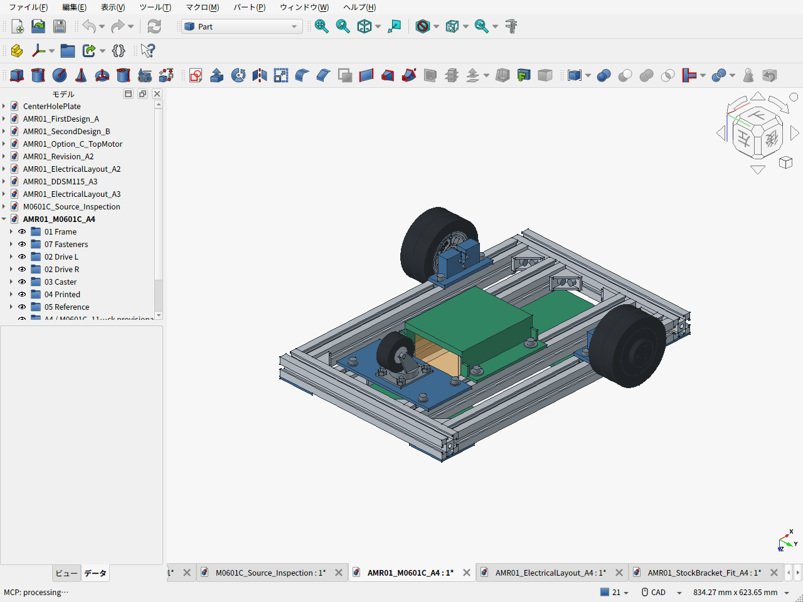
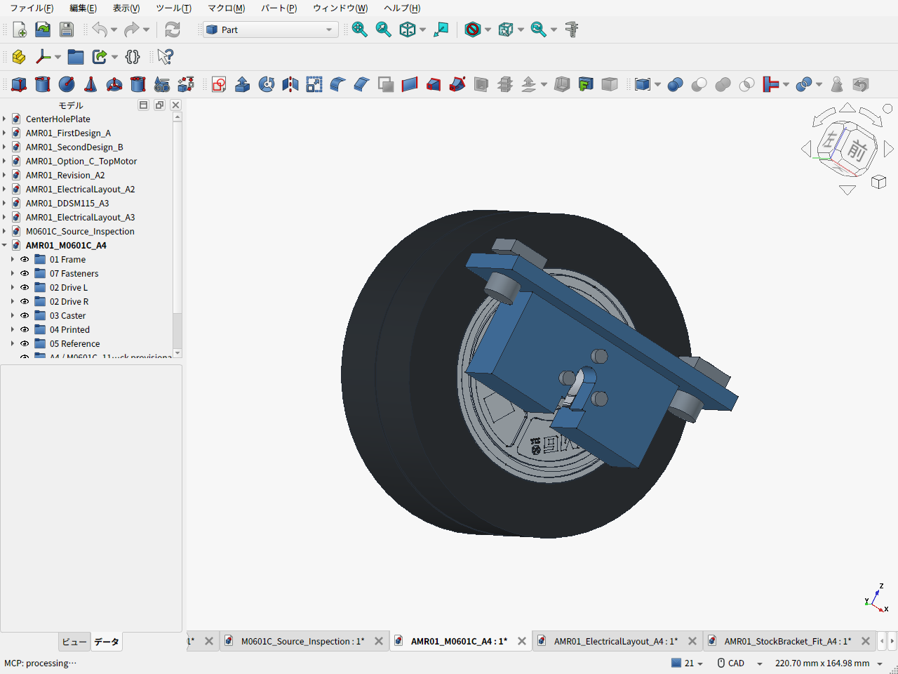

# 第一案改A4 — M0601C_111と専用金属ブラケット

2026-09-21。**M0601C_111を採用し、公開ブラケットのモーター受けを参照した低背の一体金属金具へ設計を変更した。** 通常の既製金具を使う案もCADに配置したが、現フレームでは干渉する。ユーザーの「公開設計を基に製作依頼してもよい」という方針に沿い、専用品を見積候補とした。加工費・現物のはめあい・実荷重の検証は未完了。





## 配置と設計理由

| 項目 | A4 |
|---|---|
| 骨格 | Amazonの3030・400mm×4本、300mm×2本。460×300mm、元のレール位置を維持 |
| フレーム接合 | MISUMI HBLFSN6-SET×8。個人購入経路と納入額は引き続き未確定 |
| 駆動 | M0601C_111×2、適合DDT-M0601C-TIRE×2、後方420G-R50キャスター |
| 金具 | A6061-T6候補、一体90×30×34mm。同一部品2個、左右は180°回転して使用 |
| 受け | 公開CADの16曲線を参照。輪郭を0.15mm拡張、支持深さ3→9mm、背肉8mm |
| モーター締結 | M2.5×12を3本/輪。公称ねじ込み4mm、資料の穴深さ5mmに対し1mm余裕 |
| 3030締結 | 厚さ5mmのフランジを下面へ直接固定。M6×12を2本/輪、溝ナット。スペーサーなし |
| 配線 | 背面の幅7mm溝から組付け、前面/下側を9.5mmに拡幅。小ねじ頭の座面を残す |
| 高さ | フレーム下面69mm、電池搭載面35mm、金具下端35mm、固定骨格最低32mm |
| 車体質量 | 電装2.10kgの枠を含む推計6.79kg。目標10kg以下、未実測 |
| 走行計算 | 最大構成14kg、5°、加速0.2m/s²、仮の転がり係数0.03、余裕1.5で0.713N·m/輪。公表定格0.96N·m/18V |
| 外形 | 仮のタイヤ組付け位置で460×406.6×109.6mm、輪距349mm |

金具を3030の直下へ置き、車輪からの力を受けポケット・金具・フランジ・M6/溝ナットへ短く伝える。A3の二つのアングルと別体キー板の組合せを廃止した。PLAは電池クレードルと電装トレイに使用し、主輪の支持には使わない。

受け深さを増やすと短い固定端の曲げ支持に使える距離を増やせる。ただし、ポケットは隙間ばめで、小ねじが無荷重になるわけではない。部材・小ねじ・レール接合の力の比較は[独立レビュー](MOUNT_REVIEW.ja.md)に記載。FEM・衝撃・疲労・締付条件の認定はしていない。

## 既製ブラケットの配置結果

元SLDPRTの保存表示メッシュを抽出して配置した。**全体を厳密なSTEPへ変換したものではない。** 受け部だけは元の解析曲線を再構築し、座面メッシュと数値照合した。[抽出根拠](BRACKET_SOURCE_REVIEW.ja.md)

| 姿勢 | 最下端 | 元の外レール |
|---|---:|---|
| 通常 | −39.65mm | 干渉 |
| 90°回転 | 15.35mm | 干渉、目標地上高25mm未達 |
| 上下反転 | 25.35mm | 干渉。地上高の公称余裕も0.35mm |

固定端面をy138に保ちt5取付板を使うなら、外レールを24mm内側へ移す必要がある。既存の内レールとの間隔と純正接合金具の配置も変わるため、今回は専用品を優先する。既製品自体が不適切な製品という判断ではない。[配置CAD](AMR01_StockBracket_Fit_A4.FCStd) / [検査値](stock_bracket_fit_results.json) / [実画面](cad-screen-stock-bracket-fit.png)

## 費用と見積資料

約7,000円/個のTaobao本体にタイヤが含まれるかは未確認。下表は参考価格と材料等の仮枠を含む**途中小計**で、完成機価格ではない。

| 購入条件 | 途中小計 |
|---|---:|
| 本体のみと仮定、適合タイヤキット2個を別購入 | **42,282円** |
| タイヤ・必要なカバー/ねじの付属を注文先で確認できた場合 | **33,042円** |

専用金具2個の材料込み加工費、製作送料、Taobao納入諸費は見積待ち。共通のキャスター板/ガセットを自加工する条件であり、これらも外注する場合は別の見積項目が加わる。電池・主計算機・電源保護・車内配線等は別予算。旧取付材2,800円と旧未見積加工枠6,000円は重複計上していない。

既製金具は2個12,100円＋車体側取付板等で比較する。専用品が安いという仮定で採用しておらず、見積結果で調達方法を確定する。[BOM](BOM.csv) / [計算結果](cost_summary.json) / [価格の根拠と比較](COST_REVIEW.ja.md)

加工業者へ渡す資料：

- [金具の見積用STEP](M0601C_custom_mount_quote.step)
- [寸法図PDF](M0601C_custom_mount_quote.pdf) / [SVG](M0601C_custom_mount_quote.svg)
- [数量・材料・重要寸法・見積範囲](MANUFACTURING_RFQ.ja.md)

これらは見積用。購入ロットの取付端寸法、輪郭全体のはめあい、加工R、公差、締付条件を確定してから製作へ進む。

## CADと検証

- [車体FCStd](AMR01_M0601C_A4.FCStd) / [車体STEP](AMR01_M0601C_A4.step)
- [配線・機器予約空間FCStd](AMR01_ElectricalLayout_A4.FCStd) / [配線・整備説明](ELECTRICAL_PACKAGING.ja.md)
- [本体CADと取付寸法の扱い](M0601C_INTERFACE.ja.md)
- [161部品・12,880ペアの形状検査](validation_results.json)：公称体積干渉なし、電池空間干渉なし、キャスター72姿勢干渉なし
- [工具軸・タイヤ移動の空間検査](mount_service_validation.json)
- [電装配置検査](electrical_layout_validation.json)：11経路に未許容の車体干渉・配線交差なし
- [駆動/静的支持/摩耗感度](calculation_results.json)
- [PLAクレードル](BatteryCradlePLA.stl) / [後部トレイ](ElectronicsTrayPLA.stl) / [前部トレイ](FrontElectronicsTrayPLA.stl)：各1個、P1Sの256mm角へ収まる

モーター本体は販売元が案内するSTEPを使用した。元データの柔軟なケーブル姿勢は剛体の干渉対象から外し、別文書で経路を作り直した。ねじ山の谷径は、ねじ外形の検査用に局所的に開いている。タイヤとカバーは公開外形に基づく簡略形状で、**キットの軸方向組付け位置が未確認**。全幅406.6mmと輪距349mmはその仮定を含む。

配線予約の最下端は約28.35mmで、固定骨格32mmとは別。タイヤの荷重変形・摩耗・取付公差を含めた地上高25mmの実機保証ではない。ケーブル保持、電池保持、車輪荷重・衝撃、低速発熱も実機確認が必要。

## 再生成

```sh
python3 cad/amr05/fetch_vendor_cad.py
python3 cad/amr05/calculate_cost.py --require-cad --self-test
python3 cad/amr05/calculate_design.py
```

FreeCADのPython環境で、`__file__`と`__name__='__main__'`を与えて順に実行する：`build_chassis.py` → `validate_chassis.py` → `build_electrical_layout.py` → `validate_mount_service.py` → `build_stock_bracket_study.py` → `capture_screens.py` → `capture_electrical_layout.py`。寸法図の再生成は`make_mount_drawing.py`を参照。

[旧A3](../amr04/README.ja.md)は比較履歴として保存している。
