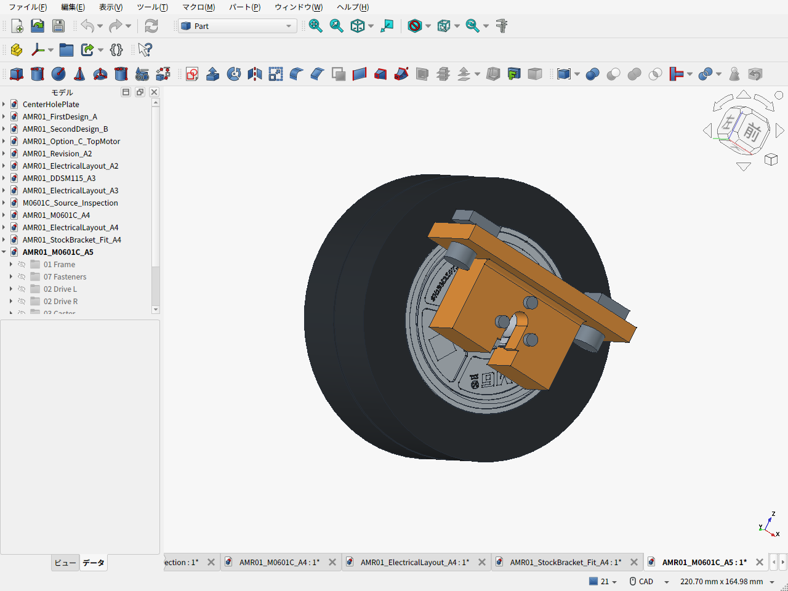
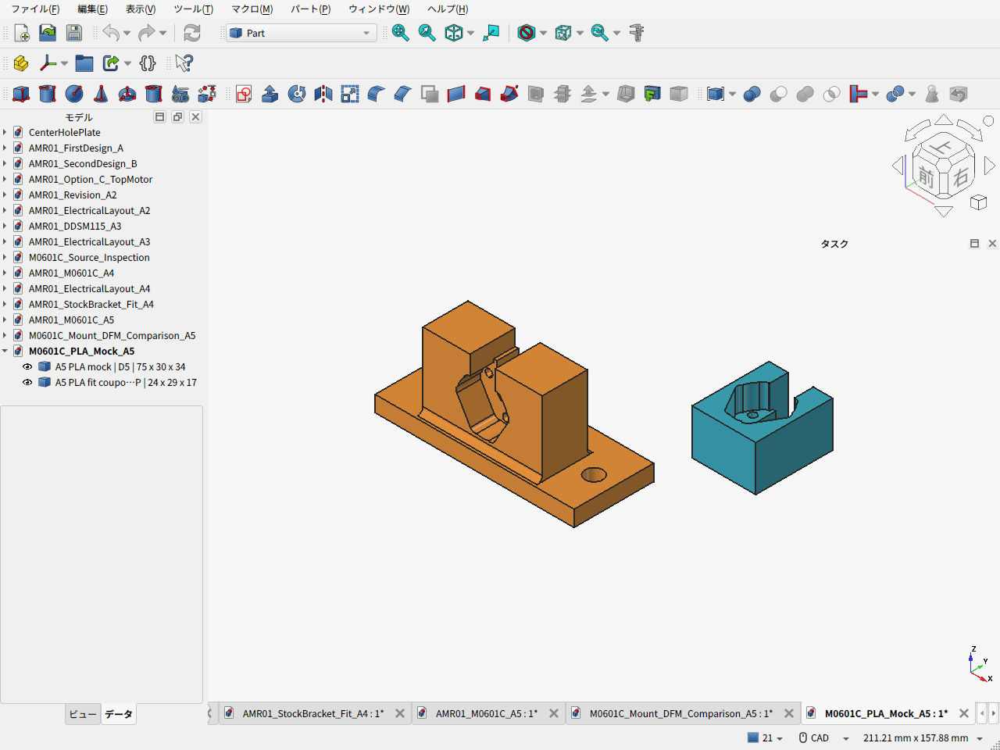

# A5：車輪固定金具の加工費・強度比較

2026-09-21。**5案のSTEPと寸法図をJLCCNCで実見積した結果、今回の変更では加工費を下げられなかった。** 旧A4を価格比較の基準に残す。小型のD5は組付けCADとPLA仮合わせモックまで作成したが、製作用の採用は確定しない。A4もD5も、新しい可搬15kg・安全率2の達成は未確認である。

「可搬15kg」は暫定的に**荷物15kg＋車体上限10kg＝総25kg**と解釈する。安全率2は強度の目標とし、剛性は別に評価する。軸変位0.1mmは比較用の候補値で、受入条件は未確定。将来アームの追加重量や15kg荷台の設計は、この金具変更に含まない。

[2026-09-21の設計レビュー](DESIGN_REVIEW_2026-09-21.ja.md)で、計算と見積図の円弧公差の不一致、荷台・固定部・運用条件の未確定事項を整理した。特に隙間計算の円弧R9.7±0.05mmは見積図の指定ではなく、加工後の保証値として使用できない。

## 比較結果と採否

同形2個、Aluminum 6061-T6、表面処理なし、受け平面8.25±0.05mm、その他ISO2768-m、製造10日のサイト自動見積。送料は日本宛OCSの国単位表示7.23 USD。税・住所別費用・図面審査後の価格を含む最終決済額ではない。

| 案 | 変更内容 | 2個の加工費 USD | 表示送料込み USD | 扱い |
|---|---|---:|---:|---|
| A4 | 幅90/t5、受け小R1.65、根元追加Rなし | **74.50** | **81.73** | 最安の比較基準。新荷重要件は未認定 |
| D1 | 受け小R2、根元4辺R2 | 81.40 | 88.63 | 値下げなし |
| D2 | 受け小R2.5、根元4辺R2 | 81.92 | 89.15 | 最も高い。受け円弧も減る |
| D3 | 受け小R2、根元の長辺2本だけR2 | 80.36 | 87.59 | D1より安いがA4より高い |
| D4 | 受け小Rだけ2へ変更 | 75.02 | 82.25 | R拡大単独でも値下げなし |
| D5 | 幅75/t6、ウェブ45、M6ピッチ60、受けと長辺根元R2 | 80.08 | 87.31 | 比較CAD・仮合わせ用。加工費低減案として未採用 |

[見積条件・全証拠画面](MACHINING_QUOTE.ja.md) / [機械可読の実見積](machining_quotes.json) / [BOMへの費用差分](BOM_cost_comparison.csv) / [集計](cost_comparison.json)

円の途中小計は従来の42,282円。A4ではこれに81.73 USD、D5へ変更する場合は87.31 USDと残る未確定分が加わる。為替を仮定して合計せず、完成機総額は未確定とした。新しい荷台、電池・主計算機・電源保護・実配線、輸入諸費、PLA印刷費等も確定していない。D5を採用済みとしないため、[A4のBOM](../amr05/BOM.csv)は変更していない。

## 加工を考慮して変えた箇所

受け輪郭の6か所の小Rを揃え、深さ9mmに対して工具を太くできるかを比較した。JLCCNCの工具表ではR2/φ3の通常加工深さは12mm、R2.5/φ4は15mm。ただし実際の使用工具・加工時間は見積画面に出ないため、これは工具選定の仮説である。今回の実価格はR拡大で安くならなかった。[加工指針](https://jlccnc.com/help/article/cnc-machining-design-guideline)

水平な床と壁の根元に付けるRは、受け輪郭の内隅Rとは加工上の意味が異なる。固定Rの追加は曲面仕上げを増やす可能性がある。根元4辺、長辺2本、追加なしを実ファイルで比較した。強度上必要なRを単に価格で削る判断もしていない。[形状と実曲面の比較](candidates/ROOT_FILLET_DFM_REVIEW.ja.md)

穴はモーター側のM2.5用φ2.8×3、フレーム側のM6用φ6.6×2を維持した。役割と相手部品が異なるので同じ径へ統一しない。金具側にねじ加工・座ぐり・不要な精密公差は追加していない。この点はA4と共通で、新たな値下げ効果として計上しない。モーター受けの主円弧R9.7も適合形状なので、小R2へ揃える対象ではない。

D5では材料と外形を減らし、フランジを5→6mmにした。質量は左右合計で約44.1g減る。穴なし梁に置き換えた幅60/t5→45/t6の比較では、曲げ応力は0.926倍、たわみは0.772倍となる一方、M6間隔75→60mmでモーメントによるボルト荷重増分は1.25倍になる。完成金具の剛性が向上したという判定には使わない。

## 強度計算で分かった範囲

- 総25kgの片輪全重量ケース245.17N、全外力2倍の強度比較490.33Nを設定。通常走行の三輪反力とは区別した。
- D5の穴なし幅45/t6断面は、横力ゼロの使用荷重で35.87MPa、全外力2倍で71.73MPa。これには受け接触、M2.5母材、締付予圧、根元・孔の局所応力、3030溝の変形は含まれず、部品の安全率2は未判定。
- 25kgで旧条件の5°登坂・加速度0.2m/s²・駆動余裕1.5を維持すると1.272N·m/輪が必要で、公表定格0.96N·mを超える。同条件の平地は0.467N·m/輪だが、低速の連続温度は未確認。
- メーカー現行の許容ラジアル120Nは、偏積み例の151Nより小さい。購入ロットへの適用と荷重点・寿命条件の確認が必要で、金具だけを強くして解決する条件ではない。

[要求・全計算・接合部の未確認事項](STRENGTH_REVIEW.ja.md) / [入力](requirements.json) / [計算結果](load_calculations.json) / [メーカー現行仕様](https://shop.directdrive.com/pages/m0601c-111-specs)

## 比較CADと公称組付け検査

[車体FCStd](AMR01_M0601C_A5.FCStd) / [車体STEP](AMR01_M0601C_A5.step) / [金具3案の比較FCStd](M0601C_Mount_DFM_Comparison_A5.FCStd) / [D5単品STEP](candidates/M0601C_mount_D5_Compact_R2.step) / [D5寸法図](candidates/M0601C_mount_D5_Compact_R2.pdf)

組立はD5の金具2個と、それに伴うM6・溝ナットの位置だけを変更した。3030フレーム、モーター、タイヤ、キャスター、低床電池配置を維持する。

| 検査 | 結果 |
|---|---|
| 部品干渉 | 161部品、12,880組。包絡で絞った332組を体積検査し、干渉なし |
| 地面 | 左右タイヤ・キャスターとも公称接地点z=0 |
| 高さ・外形 | 軸高50.35、フレーム下面69、金具最低35、骨格460×406.6×109.6mm |
| 整備空間 | 工具軸とタイヤ引抜き6位置、計22条件で干渉なし |
| 配線・電池 | A4の予約空間と変更金具の干渉なし |
| M2.5頭と根元R | 公称最短距離0.8mm |
| M6×12 | 先端z75、簡略ナットz71〜75。面取り・不完全ねじを含む有効食込みは未確認 |
| STEP再読込 | valid、165 solid、体積差0.1023mm³ |

[全検査記録](assembly_validation.json)。これは公称配置の検査であり、変形・公差・衝撃・寿命の検証ではない。タイヤの軸方向位置はA4同様に暫定で、実物との照合が残る。





## P1SでのPLA仮合わせ

[印刷用ZIP](print-mock/M0601C_A5_PLA_mock_files.zip) / [印刷・仮合わせ手順](print-mock/PRINT_GUIDE.ja.md) / [STL検証](print-mock/validation_results.json)

D5の等倍本体75×30×34mmと、受け確認片24×29×17mmを作成した。P1Sの公称造形範囲256mm角内に収まる。まず小さい確認片で受け、穴、配線逃げを確かめ、本体で3030・工具・モーターの配置を仮合わせする。PLAは強度試験や15kg積載走行用の主支持金具にはしない。スライス・印刷・現物合わせは未実施で、印刷時間と費用も未計上。



## 再計算・再生成

```sh
python3 cad/amr06/calculate_mount_loads.py --check-only
python3 cad/amr06/record_quote_results.py
python3 cad/amr06/calculate_cost_comparison.py
python3 cad/amr06/build_mount_candidates.py --candidates D1 D2 D3 D4 D5
python3 cad/amr06/make_quote_drawings.py --candidates D1 D2 D3 D4 D5
```

見積記録スクリプトは保存済みサイト証拠を照合し、価格を再取得するものではない。見積に使ったSTEP/PDFはハッシュで固定し、形状変更時は新候補として再見積する。

`build_assembly.py` と `build_print_mock.py` はFreeCAD Pythonで実行する。例えばリポジトリのルートから次で車体を再生成できる。

```sh
freecadcmd -c 'p="cad/amr06/build_assembly.py"; exec(compile(open(p).read(), p, "exec"), {"__name__":"__main__", "__file__":p})'
```

GUIで開いた生成対象は保存要否を確認して閉じてから再生成し、ディスク上の最新FCStdを開いて `capture_screens.py` で実画面を撮影する。モックは `build_print_mock.py` の `finalize_gui_preview()` で表示を保存し、ZIP内のCAD・画像・ハッシュを同期する。
