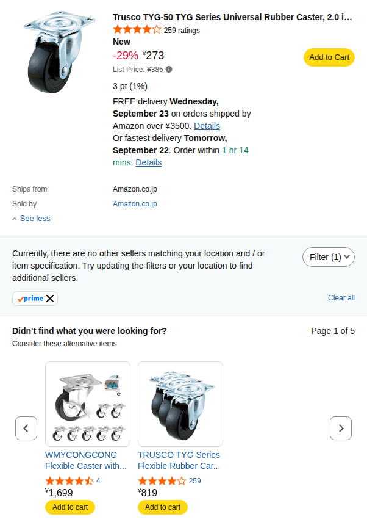
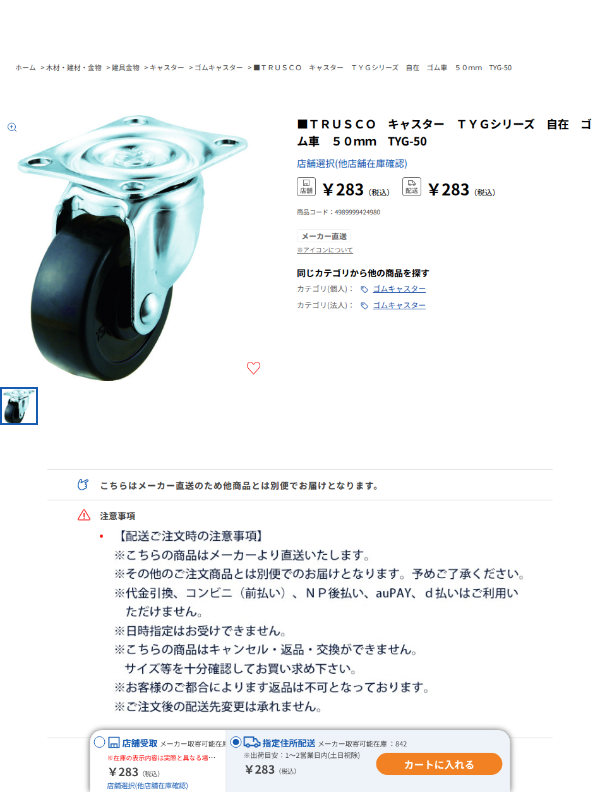

# キャスターの選定・耐荷重・購入経路

2026-09-21確認。**TRUSCO TYG-50を1個、Amazon.co.jp販売・発送の税込273円を第一候補**とします。送料は既存Prime会員の対象配送条件で0円。**コーナン店舗受取283円＋受取送料0円**も代替経路として確認しました。近隣店舗がないナフコは現行の購入候補から外します。

## 耐荷重の判断

[メーカー仕様](https://www.orange-book.com/ja/c/products/index.html?itemCd=TYG50+++++++++++++++++++++++++4600)の許容荷重は1個30daN＝300N（約30.6kgf）。車体重量は10kg以下、通常積載は10kg、構造検証用積載は15kgという現行要件で比較します。総重量をそのままキャスター1個の負担とはせず、駆動輪2輪とキャスター1輪の反力を計算しています。

| 条件 | 公称偏心16mmでの最大キャスター荷重 | 位置づけ |
| --- | --- | --- |
| 車体10kg＋通常積載10kg | 99.3N（約10.1kgf） | 重心の許容範囲、加減速・横加速度・旋回方向を含む |
| 車体10kg＋構造検証用積載15kg | 122.6N（約12.5kgf） | 静的な構造確認条件。15kgの通常運転許可ではない |

さらに図面の偏心16±1.5mmの両端でも再計算すると、最大は**123.41N**、その2倍は**246.82N＜300N**です。[再計算結果](caster_load_check.json) / [再現スクリプト](check_caster_substitution.py)。許容荷重との比較には余裕があります。ただしカタログの許容荷重を破壊荷重や降伏荷重として扱うことはできず、この比だけで車体全体の安全率2を認証しません。段差衝撃、疲労、実荷重での変形は未検証で、初号機は平坦な屋内床の条件を維持します。

## 取付寸法の照合

| 項目 | 旧Hammer 420G-R50 | 今回のTRUSCO TYG-50 |
| --- | --- | --- |
| 車輪 | ゴム、径50×幅20mm | 同じ |
| 取付高さ | 公称65mm | 65±1.5mm |
| 取付座 | 59×47mm | 同じ |
| 穴ピッチ／穴径 | 46×35mm／φ6.5 | 同じ |
| 偏心 | 公称16mm | 16±1.5mm |
| 旋回半径 | 42mm | 図面R41 |
| 許容荷重 | 30daN＝300N | 同じ |
| 質量計上 | 旧CADは150gの仮枠 | メーカー165g、15g増 |
| ストッパー | なし | なし |

TYG-50の[メーカー図面](https://image.trusco-sterra2.com/pdf/zumen/TYG50_4600__ZM.pdf)と旧型の[ハンマー仕様](https://www.hammer-caster.co.jp/products/detail/3119)を照合しました。TYG-50のJANは**4989999424980**です。

既存の80×170×4mmキャスター取付板は穴位置・公称取付高さを維持できます。公称値では駆動輪とキャスターの接地面はいずれもZ=0です。既存CADのキャスターは簡略形状で、TYG-50のメーカーCADではありません。部品名・出典を変更し、質量をメーカー値へ訂正しました。高さ公差による車体傾斜や実荷重でのタイヤ変形は上の反力計算に含まないため、受入時に接地高さを確認・調整し、旋回時の金具・ねじとの隙間を確認します。

## Amazonとコーナンの購入条件

[AmazonのTYG-50](https://www.amazon.co.jp/dp/B0795CNFLR)は、273円・在庫あり・Amazon.co.jp販売発送の表示を確認。Prime絞り込み検索にも掲載されています。[Amazon公式配送案内](https://www.aboutamazon.jp/news/guide/answer-to-7-questions-about-shopping-at-amazon)では、Prime会員がAmazon.co.jp発送品を購入する場合は金額によらず通常配送料無料です。BOMの0円はこの条件を適用した値で、会員ログイン後の最終注文画面を取得した値ではありません。既存会員を前提とし、新規会費は計上しません。非会員画面に出る「3,500円以上で送料無料」を、単品無条件の送料無料と読み替えていません。

Amazon説明欄には別サイズ32mmの仕様が混在していたため、その欄の寸法は採用していません。購入・受入時は型式TYG-50とJANを照合します。

[コーナン商品ページ](https://www.kohnan-eshop.com/shop/g/g4989999424980/)では、検証用に店舗を選択し、店舗受取欄のメーカー取寄可能在庫842・283円を確認しました。棚在庫842個という意味ではなく、利用者の受取店の決定・在庫確保・注文もしていません。[公式店舗受取案内](https://www.kohnan-eshop.com/shop/pages/uketori.aspx)は受取送料無料、準備は通常2～10日程度で延びる場合あり。個人でも利用でき、注文には会員登録が必要です。価格はネット注文・店舗受取の表示で、店頭価格・交通費・自宅配送費は別です。

## 不採用候補

| 商品・経路 | 確認価格 | 判断 |
| --- | --- | --- |
| [ユーエイE-50R／コーナン](https://www.kohnan-eshop.com/shop/g/g4562182572028/) | 338円 | 高さ65mmは合うが穴ピッチ56×28mm。板の穴変更が必要で、TYG-50より高いため不採用 |
| [420G-R50／Amazon](https://www.amazon.co.jp/dp/B000TGHARG) | 確認できた最安着荷表示367円＋送料600円 | Prime対象を確認できず、今回の優先経路にしない |
| 420G-R50／ナフコ | 旧確認498円、店舗受取送料0円 | 近隣店舗がないため除外。旧証拠は履歴として保存 |

## BOMへの反映

C01＝273円、S02＝既存Prime会員条件の0円。A6-D2の途中小計は**50,468円＋120.90USD＋未確定分**。コーナン店舗受取を選ぶ場合は10円増。荷台板はD2のCNC見積へ置換済みで、車体の最新推計は**8.514kg**。[BOM](BOM.ja.md)。キャスター変更自体の減額は旧タナカ金物経路に対して750円、直前のAmazon498円に対して225円。

[取得条件JSON](caster_procurement.json) / [Amazon表示記録](procurement-evidence/amazon-TYG-50-offer.txt) / [コーナン表示記録](procurement-evidence/kohnan-TYG-50.txt) / [メーカー図面保存](procurement-evidence/TYG50-manufacturer-drawing.pdf)
