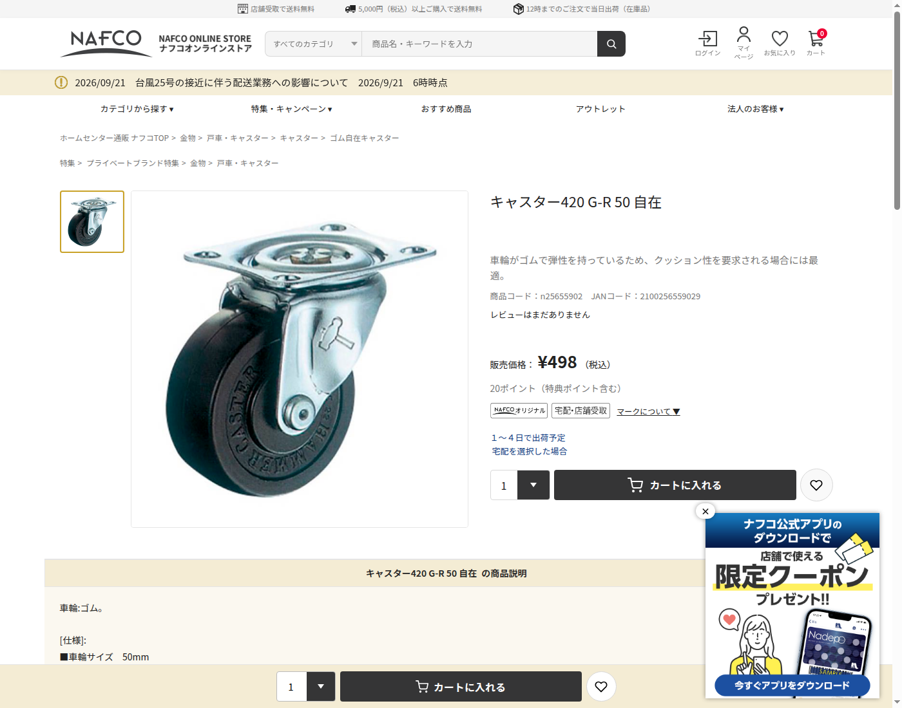

# キャスターの個人購入経路

2026-09-21確認。**現行420G-R50を維持し、ナフコの店舗受取を第一候補**にします。必要数は完成品1個です。価格は税込498円、店舗受取なら送料0円。従来のタナカ金物373円＋送料650円＝1,023円に対して、受取できる場合は525円減です。受取にかかる交通費は含みません。

[ナフコ商品ページ](https://nafco-online.com/products/detail.php?product_id=25655902)には「宅配・店舗受取」、個数選択、店舗受取送料無料の記載があります。個人向けの通常購入経路で、法人専用口座やメーカーへの直接発注は不要です。これはオンライン注文して店舗で受け取る価格で、近隣店の棚在庫や店頭価格を確認したものではありません。受取店・在庫・準備日は未確定です。

## 型式を維持する理由

| 項目 | 現行420G-R50 |
| --- | --- |
| 車輪 | ゴム、径50mm、幅20mm |
| 取付高さ | 65mm |
| 取付座／穴ピッチ | 59×47mm／46×35mm |
| 取付穴径 | 6.5mm |
| 偏心／旋回半径 | 16mm／42mm |
| 許容荷重 | 30daN＝300N／個（メーカーの使用条件による） |
| ストッパー | なし |

[メーカー寸法・仕様](https://www.hammer-caster.co.jp/products/detail/3119)。現行CADの型式・高さ・取付穴を変えず、調達先を変えるため、接地高さや旋回包絡を再設計する必要がありません。「50mmキャスター」という車輪径だけで別型式へ置き換えないこと。許容荷重300Nは、AMR全体の安全率2や衝撃を認証する数値ではありません。

ナフコ掲載名は「420 G-R 50」、掲載写真にHAMMER CASTER刻印、径50・高さ65・穴6.5・荷重30kg・ストッパーなしの記載を確認しました。ただしナフコ包装JANは**2100256559029**、ハンマー公式JANは**4956237000046**と異なります。注文・受入時には名称と現品の**高さ65mm、穴ピッチ46×35mm**を照合します。ナフコの独自包装JANを、公式JANと同一として登録しません。

## 他の販売経路

| 販売先 | 確認結果 | 今回の扱い |
| --- | --- | --- |
| ナフコ | 税込498円／1個、店舗受取対象・受取送料0円 | 第一候補。受取店の在庫・準備日は未確認 |
| [カインズ](https://www.cainz.com/g/4956237000046.html) | 型式の掲載あり。選択店条件で購入不可表示、価格・在庫未確認 | 店舗で取扱いを確認できた場合の代替経路 |
| [コーナン](https://www.kohnan-eshop.com/shop/g/g4956237000046/) | 検索掲載は残っていたが、実ページは販売終了／取扱い不可 | 現在買える経路には数えない |
| Amazon | 同型の購入可能なPrime対象出品を確認できず | Prime送料込み価格をBOMへ推定登録しない |
| [タナカ金物](https://www.tanaka-km.com/view/item/000000036665) | 旧確認373円＋送料650円 | 店舗受取できない場合の従来候補。注文時再確認 |

今回はホームセンター経由で同型を個人購入できるため、安さだけで寸法不明の4個セットへ変更しません。店舗受取が難しい場合は、配送先に対してPrime対象・必要1個の購入総額が確認できる出品を比較します。

## BOMへの反映

C01を498円、S02を店舗受取条件の0円へ変更。途中小計は**54,414円＋82.25 USD＋未確定分**です。旧54,939円から525円減。CNCの格子穴上板は比較見積の段階で、現行板材代と重複計上していません。

[取得条件JSON](caster_procurement.json) / [販売ページの取得テキスト](procurement-evidence/nafco-420G-R50.txt) / [BOM](BOM.ja.md)
