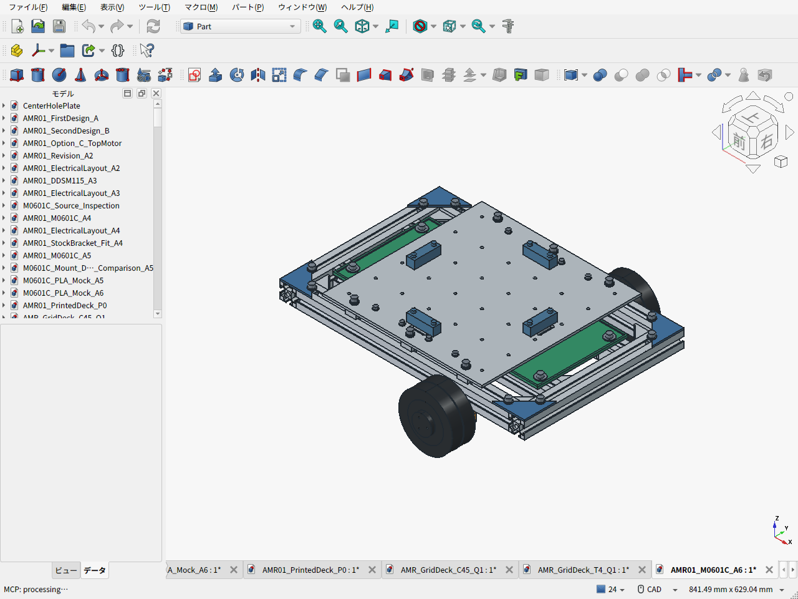
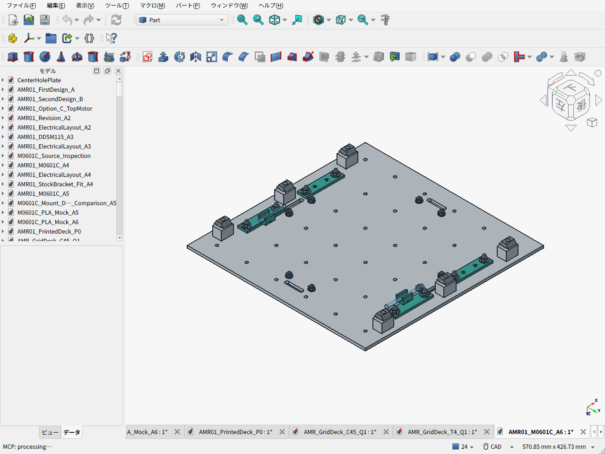
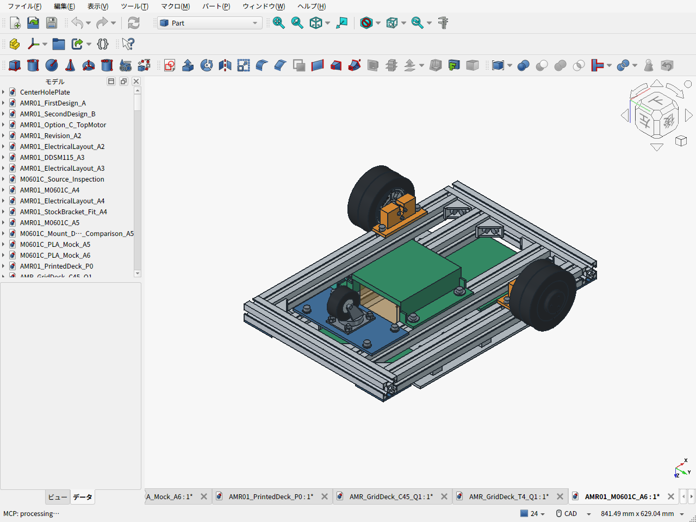
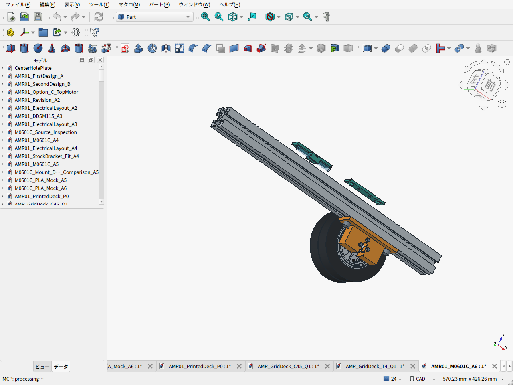
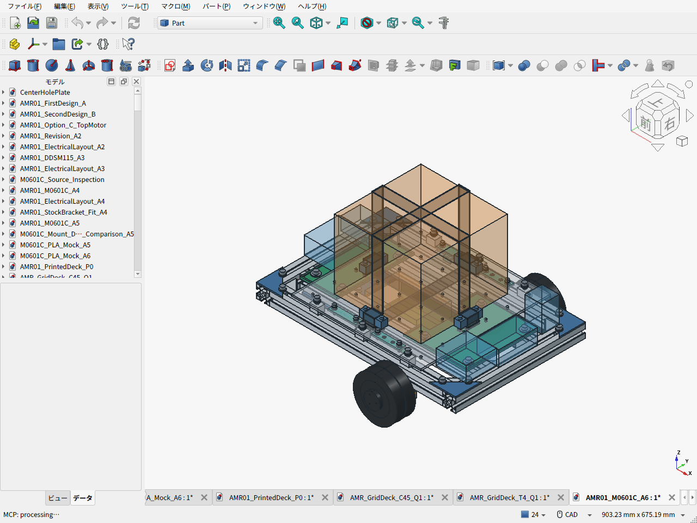

# AMR-01 A6-D2：格子穴アルミ荷台とPLA小物

**平坦な屋内床で通常積載10kg、追加の機械ブレーキなし、構造検証は荷物15kg・静的安全率2。車体は電池・電装・荷台込み10kg以下を目標とする。** 25kgは構造検証時の総重量で、荷物25kgを載せる設計ではない。金具の機能公差・ねじ座面・ナットと溝の実寸、荷台と固定具、荷物CG範囲、停止回路構成と試験仕様を修正した。

追加機械ブレーキはユーザー方針により不採用とし、坂道走行・停電時の坂道保持を初号機の運用範囲から外した。通常の減速・停止はモーター制御、非常停止は駆動電源遮断で行う。3担当によるレビューを反映したが、**実機のSF2成立、低速連続出力、平地停止は未確認**。[指摘ごとの対応と残る確認](REVIEW_RESPONSE.ja.md)。



| 項目 | A6 |
|---|---|
| 駆動・骨格 | M0601C_111×2、100.7mmタイヤ、TYG-50、Amazon3030の400mm×4/300mm×2 |
| フレーム | 外形460×300、下面69/上面99mm。モーター支持スペーサーなし |
| 荷台 | 6061-T6 300×300×4mm、50mmピッチ36穴、上面118mm、20×15×15支持ブロック6個、金属ストッパ4個、ベルト2本 |
| 荷物 | 中央200×200mmの連続した平底。容器も荷物重量に算入。CGは前後/左右±30mm・高さ220mm以下 |
| 運用範囲 | 平坦な屋内床、通常積載10kg。追加機械ブレーキなし。8kg/5°は参考計算のみ |
| 金具 | A4相当の幅90/厚5/穴ピッチ75を維持。受け位置・φ3.2穴・小径座金と浅座ぐり・機能公差を変更 |
| ナット・溝 | HNTT6厚6.3、NFSL6入口8/最大幅16.5/深さ9の公称断面へ修正。細部は図面から再構成 |
| 重量 | **推計8.514kg**、10kgまで約1.486kg。購入部品の実測値ではない |
| CAD検査 | **298物理部品、44,253ペア、体積干渉なし**。工具、タイヤ抜出し、荷台撤去後の電池抜出し、配線予約も確認 |
| 接地 | 無変形・公称寸法で駆動輪2個とキャスターの床面z=0。実物では着座公差・タイヤたわみを調整 |
| 加工費 | A6金具2個75.02 USD＋日本宛表示送料7.23 USD＝**82.25 USD**、自動見積・手動審査前 |
| 上板実見積 | D2板1枚28.67 USD＋日本向けUPS9.98 USD＝38.65 USD、参考約6,080円。自動見積・手動審査前 |
| 板の解析 | 穴付き6支持のS6シェル、15kg＋自重・張力で最大たわみ0.207mm、全外力2倍の応力比較60.98MPa。材質条件付き、車体全体の認定とは別 |
| 費用全体 | 途中小計**50,468円＋120.90 USD＋未確定分**。キャスターはAmazon.co.jp発送・既存Prime会員の送料無料条件。完成車総額ではない |

D2で荷台支持と格子穴を修正し、PLA小物4個と締結材を加えた。新規CAD部品の質量は約1.349kg、ベルト・端保護0.280kg、ナット補正0.083kg、キャスター補正0.015kgなどを旧A4推計6.788kgへ反映した。電装2.10kg枠を1回だけ含む。全体は8.514kgで、機器実装・実測・CGの確認は残る。[質量と幾何検査](assembly_validation.json)。

- [PLA小物のSTLと組立手順](printed-accessories/README.ja.md) / [荷台・電池・キャスターの移動範囲検査](service_envelope_validation.json)
- [組立FCStd](AMR01_M0601C_A6.FCStd) / [組立STEP](AMR01_M0601C_A6.step)
- [金具STEP](M0601C_mount_A6_R1.step) / [見積図面PDF・2ページ](M0601C_mount_A6_R1.pdf) / [金具・ねじの公差と設計理由](MOUNT_INTERFACE_REVIEW.ja.md)
- [荷台の材料・穴位置・支持・固定・着脱・計算](DECK_REVIEW.ja.md)
- [拡張用格子穴・4分割PLA上板の試作CADと比較](printed-deck-concept/README.ja.md)
- [穴あき板の切り売り・Amazon板材と3Dプリントの価格比較](deck-procurement/README.ja.md)
- [D2格子穴アルミ上板のJLCCNC実見積・シェル解析](aluminum-grid-deck/README.ja.md) / [キャスターの耐荷重・Amazon／コーナン調達](CASTER_PROCUREMENT.ja.md)
- [駆動・輪荷重の計算入力](requirements.json) / [計算結果](load_calculations.json)
- [電源・停止回路の構成、候補部品、故障・熱試験](ELECTRICAL_AND_VALIDATION.ja.md)
- [BOM一覧・未選定品](BOM.ja.md) / [Excel](BOM.xlsx) / [購入品CSV](BOM.csv)
- [実加工見積と証拠](MACHINING_QUOTE.ja.md) / [費用台帳](bom.json)
- [P1S用PLA仮合わせモック](print-mock/M0601C_A6_PLA_mock_files.zip) / [印刷・仮合わせ手順](print-mock/PRINT_GUIDE.ja.md)









半透明の荷物・電装・電池は予約形状。ベルトも経路例で、完成品の詳細形状ではない。電装予約は既存ねじ頭と荷台を避けたが、汎用PLAアダプタ・局所配線ガイドを追加したが、実機器の取付・筐体・全配線の設計は残る。8kg/5°の荷重・トルクは比較用の参考値で、初号機の使用可能条件には含めない。追加機械ブレーキは従来のCAD・重量・費用小計にも含めていなかったため、今回の不採用による減額や軽量化は計上しない。

## 再生成と検査

```sh
python3 cad/amr07/calculate_design.py --check-only
python3 cad/amr07/cargo_deck.py
python3 cad/amr07/record_cost.py
python3 cad/amr07/build_bom.py
```

Excelも更新する場合は、openpyxl 3.1.5を入れたPython環境で`python3 cad/amr07/build_bom.py --xlsx`を実行する。[BOMの入力と生成物](BOM.ja.md#データと更新)を参照。

FreeCADの独立したheadlessプロセスで`aluminum-grid-deck/build_part.py`→`build_assembly.py`（モーター金具は見積済みA6-R1を維持）を実行する。`make_quote_drawing.py`は通常のPythonから実STEP投影の2ページ図面を作る。GUIでは`capture_screens.py`を実行し、保存済みファイルを開き直した上で実画面を保存する。既に開いている文書の未保存編集を上書きしない。

見積済みSTEP/PDFの変更は新改訂として再見積する。旧[A4](../amr05/README.ja.md)・[A5](../amr06/README.ja.md)の成果物は比較履歴として保持した。
