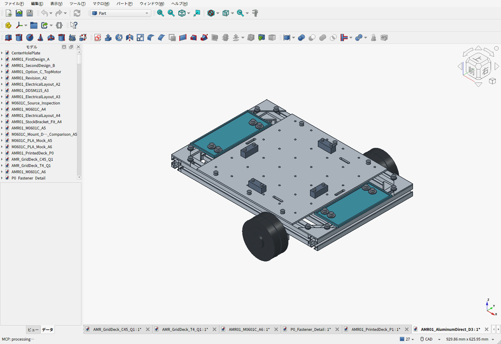
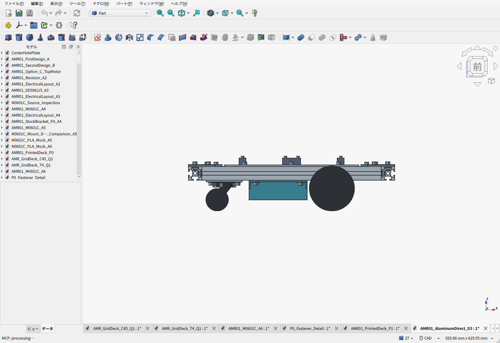
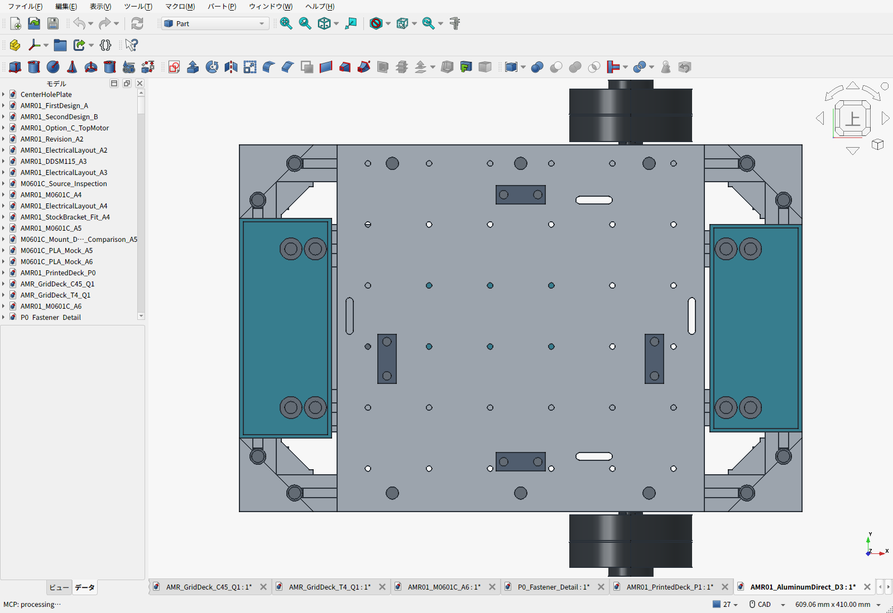
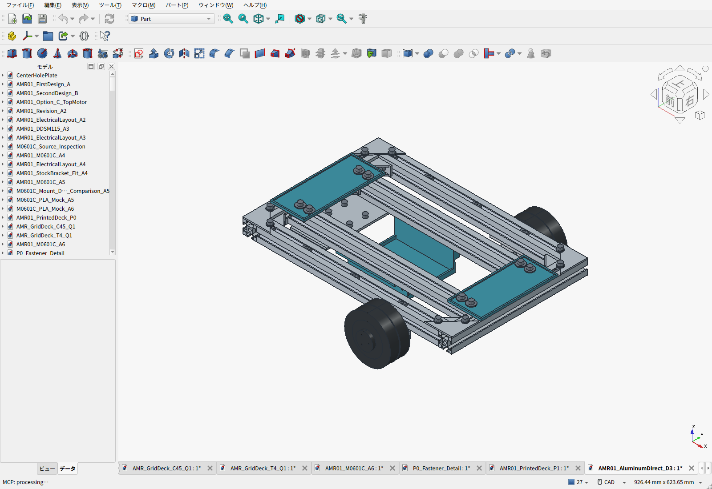
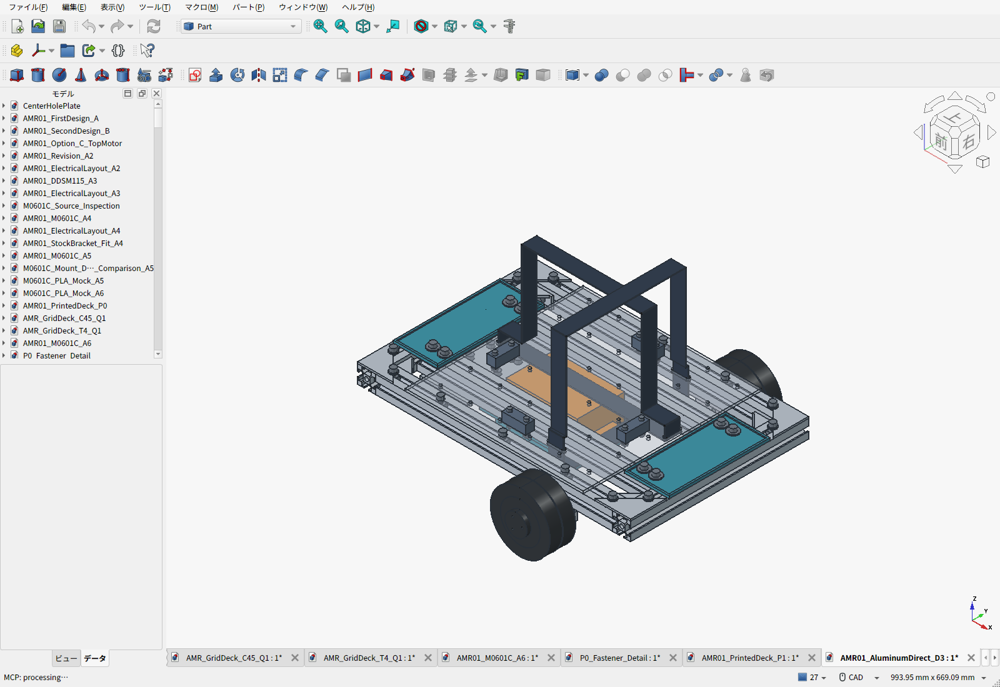

# D3：一枚アルミ天板を下段3030へ直接固定

> 現行案は[D6：1階電装・2階荷台](../two-story/README.ja.md)。D3製造用天板は同じ加工形状で継承し、配置・支持・電装床を変更した。以下は旧案の記録。

2026-09-22。ユーザーの「アルミ板へ戻す」「嵩上げ不要」「干渉を修正」を反映した現行案。**300×300×4mmの一枚アルミ板を、既存の下段3030へM6×12と溝ナット6組で直接固定する。天板下のスペーサー、上段フレーム、分割板の継ぎ目はない。**

| 項目 | D3 |
|---|---|
| 天板 | 6061-T6、300×300×4mm、約0.955kg |
| 高さ | 下面99／上面103mm。直前のPLA P1上面141mmから38mm低下 |
| 支持 | 元の400mm材4本の上面へ接触。荷物→アルミ板→下段3030の経路 |
| 固定 | 外側2本の上面溝へM6×12、HNTT6-6を各6個。X=-105/0/105、Y=±135 |
| 拡張穴 | φ4.5通し穴36個、50mm格子。天板にタップなし |
| 車体 | 推計8.246kg。10kgまで約1.754kg。電池・電装2.10kg枠、ベルト等0.280kgを含む |
| 地上高 | 電池受け床25mm。既存の最低固定部地上高25mm要件を維持 |
| 荷重条件 | 通常積載10kg、構造検証15kg・静的安全率2の目標を維持。実機認定前 |

## 低くするために修正した箇所

旧D2アルミ板を単に15mm下げると、電池上端、前後トレイ、格子穴の裏ナット、ベルト経路が成立しない。旧D2の穴配置へ完全に巻き戻すのではなく、外形・材質・板厚を戻し、下記をD3として修正した。加工見積済みD2のファイルは履歴として保存する。

- 電池の120×80×65mm予約外形を維持し、電池受けの床だけ32→25mmへ7mm下げた。フレーム固定部の高さと4本のねじは変えず、PLAの側壁を延ばす。電池上端93mmと天板下面99mmに6mmの隙間がある。
- 前後の電装トレイを天板外へ移動。前X=155～230、後X=-230～-155で、天板端から5mm離した。各4本のM6固定を保ち、X方向20mm間隔の2列で固定する。実際の基板・端子台・筐体は未選定で、CADの予約外形は取付けの確定図ではない。
- 拡張格子をY方向だけ+10mm移し、X=-125/-75/-25/25/75/125、Y=-115/-65/-15/35/85/135とした。縦横50mmピッチと36穴を維持する。Y=-65/+135の12穴はフレーム溝中心に一致し、M4溝ナットで使える。残り24穴はフレームの間にあり、通常のM4裏ナットを使う。
- 荷物用の交差ベルトは、X方向をY=10、Y方向をX=60へ配置。X方向は電池の上を通り、電池上端からベルト下面まで3.5mm。Y方向は電池の横を通って内側3030の下へ回し、フレーム下面との隙間1.5mmを確保した。駆動用ベルトではない。
- PLAの位置決めストッパ4個を40×15×15mmに縮小。X側はY=-25中心へ移し、ベルトとねじ頭・裏ナットを離した。主荷物保持はベルトで行い、PLAストッパを吊り金具や認定された拘束具として扱わない。

フレーム上の拡張穴には[メーカーのHNTT6-4](https://jp.misumi-ec.com/vona2/detail/110302610850/)の外形を使って空間を確認した。**この拡張用M4ナットは標準車体に未装着で、個人向け購入先・価格の確認が残る。** 機器を追加するときに必要数を手配し、先入れならフレームを閉じる前に入れるか、横材を外して追加する。標準車体の天板固定用M6ナット50個分とは別。

検査用の拡張機器は「取付板厚3mm＋上側M4座金0.8mm」を想定した。空間のある24穴ではM4×12と通常ナットを使い、ナットをアルミ板へ直接当てる。裏座金は使わない。フレーム上12穴ではM4×14と溝ナットを使う。実物の取付板厚に応じて長さを選び直し、電池上のねじ先端を延ばさない。公称の最小ねじ先端隙間は電池に対し1.8mm、通常ナット平面と隣のフレームは1.5mm。

天板のM6は4mmアルミへ頭を直接当て、公称の溝内突出し8mm／溝底隙間1mmとなる。頭の座面、ねじ実長、実際の溝深さ、ナットの面取りを受入確認し、突出し7.5～8.0mmと底付きしないことを確認する。締付けトルクやゆるみ止めは実物で検証する。余分な長さを天板下のスペーサーで吸収する構成には戻さない。

## 干渉・整備確認

[validation.json](validation.json)は、同じ生成スクリプトで作った最終CADを使って検査した結果。

- 208物理部品、21,528ペアで公称体積干渉0件。
- 電池・電装予約・荷物例・ベルト・コネクタ予約と物理部品の干渉0件。
- 36穴それぞれのM4ねじ・ナット、天板M6の工具進入を確認。拡張機器を付けるときは荷物を降ろす。自由空間の裏ナットは天板を外した状態で組み付ける。
- 荷物・ベルトを取り外してM6を抜き、天板を上へ取り外す180mmの連続包絡と、電池の上向き180mmの連続包絡を確認。
- 変更部品とキャスターの旋回包絡R43×高さ65mm、タイヤの外向き交換経路を確認。車輪・モーター・キャスターの取付高さは変更していない。

天板は分割せず、荷物の下に継ぎ目が残らない。荷物CG条件は従来どおりXY±30mm、床上220mm以下。例示した200×200×160mmの均一密度の荷物なら、天板上面103mmに対してCGは183mmとなる。

CAD上の体積干渉0件は、公差、たわみ、タイヤ変形、ベルトの縁保護、バックル、全配線の実装完了を意味しない。電池側面には15mmのコネクタ予約を設け、上面を配線で塞がない方針とした。実機の電池固定ベルト、端子方向、曲げ半径、電装固定具は選定品に合わせて確認する。

## 加工費とBOM

**修正したD3のSTEPと同名PDFをJLCCNCに投入し直した実自動見積**。旧D2の金額の推定流用ではない。材質指定6061-T6、無処理、数量1、タップなし、寸法指定±0.10mm、厚さ4±0.10mm、平面度0.5mm。図面とSTEPの対応、数量、材料、タップ設定、配送国Japanを照合した。

| 製造納期 | 加工費・材料込み | 日本向けUPS表示送料 | 合計 | 参考円換算 |
|---|---:|---:|---:|---:|
| 経済的10日 | 28.67 USD | 9.98 USD | **38.65 USD** | **約6,080円** |
| 標準5日 | 30.69 USD | 9.98 USD | 40.67 USD | 約6,400円 |

円換算は比較のためECB 2026-09-21の約157.267円/USDを使用。国単位の送料で、住所別・税・決済手数料は未確定。[自動見積とハッシュ](quote-evidence/D3-observed.json) / [実見積画面](quote-evidence/C45-economic.png) / [配送画面](quote-evidence/C45-shipping.png) / [円換算](jpy_conversion.json)。担当者の図面審査・確定見積は未完了で、製造注文・支払いはしていない。

上段3030を外しても300mm材は4本パック購入を保ち、使用2本・予備2本とする。HBLFSN6は16→8個で10個パック1組917円、M6溝ナットは68→50個で50個パック1組2,556円へ減らした。PLAは車体の全7部品で中実約259g、2円/gの消費参考518円。これらのAmazon価格は同日にP1で確認した商品表示を引き継ぐ。

現行の途中小計は**46,212円＋120.90 USD＋未確定分**。同じ参考レートでは約65,226円で、P1の既知小計より約1,784円減る。ねじ等の未確定分、電池・電装の未選定部品、輸入費などを含む完成価格ではない。[全車BOM](BOM.csv) / [小計・未価格項目・拡張用金具の留保](cost_summary.json)。見積済みモーター専用金具と、既存の下段ガセット・キャスター取付板の加工留保も継承する。

## 板単体の参考解析と残る検証

穴位置を更新して板の線形シェル解析を再実行した。15kg＋板上の死荷重1.6kg＋ベルト相当80N、最小板厚3.9mm、E=69GPa、Rp0.2≥240MPaを条件とし、**6固定点の理想支持パッチのみをモデル化**。4本のフレームの連続接触面は省略している。実車の接触圧や局所応力の上限を保証するモデルではない。

粗細メッシュの最大下向き変位は0.1807→0.1826mm、差約1%。細メッシュの応力スクリーニング値は表面補正と荷重係数2を含み36.36MPa。ただし支持端のピーク応力はメッシュ間で約22%変わり、収束済みとはしない。[解析結果と適用範囲](fea/summary.json)。接合部・フレーム・駆動金具を含む実機の安全率2、積載走行、停止距離、PLA電池受けの保持・温度試験は別途必要。現時点で15kgの運用定格を付与しない。

## ファイルと再生成

- [組立FCStd](AMR01_AluminumDirect_D3.FCStd) / [組立STEP](AMR01_AluminumDirect_D3.step)
- [加工用天板STEP](AMR_GridDeck_C45_D3.step) / [対応PDF](AMR_GridDeck_C45_D3.pdf) / [同名ペアZIP](AMR_GridDeck_C45_D3.zip)
- [印刷STL一覧](print_manifest.json) / [7部品のZIP](D3-print-files.zip)。全品P1Sの256mm角以内。中実形状であり、スライス設定・印刷方向・保持強度は未確定。
- [設計値](parameters.json) / [CAD検査・質量内訳](validation.json) / [成果物ハッシュ](release_manifest.json)
- FreeCAD Pythonで[build_d3.py](build_d3.py)、GUIで[capture_screens.py](capture_screens.py)を実行。部品表は`python3 cad/amr07/aluminum-direct-deck/build_bom.py`で生成。

同じ形状の天板STEPは既存見積のハッシュを保つ。穴位置などを変更したときは図面・見積・ハッシュを揃え直す。旧P1/P0/D2は比較履歴で、現行製作参照先はこのD3。
