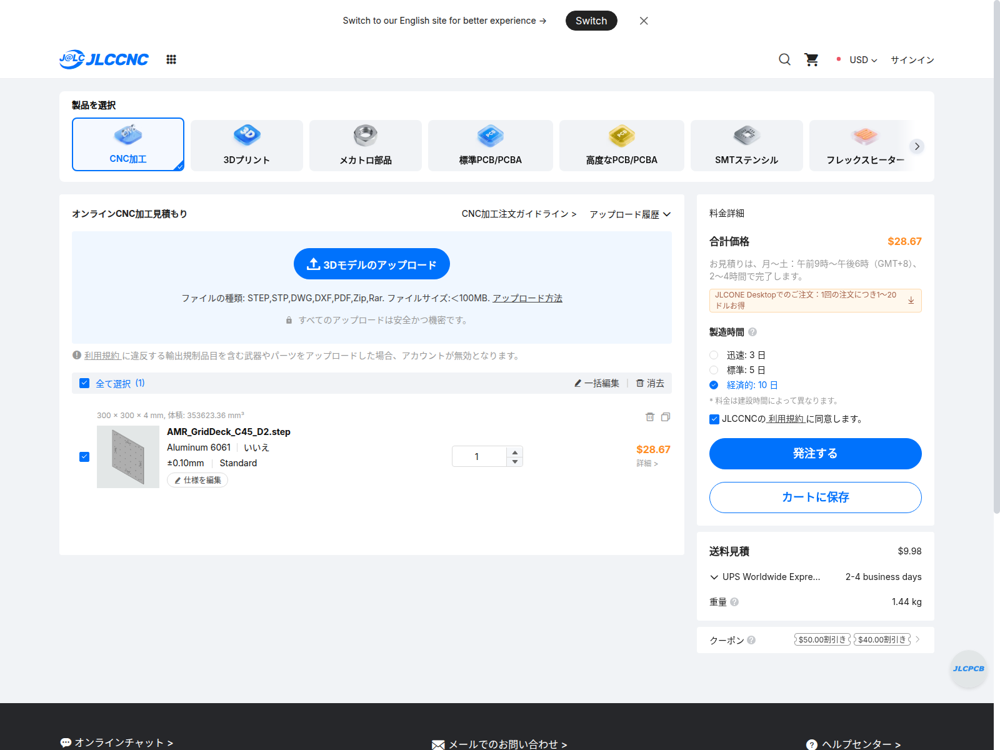
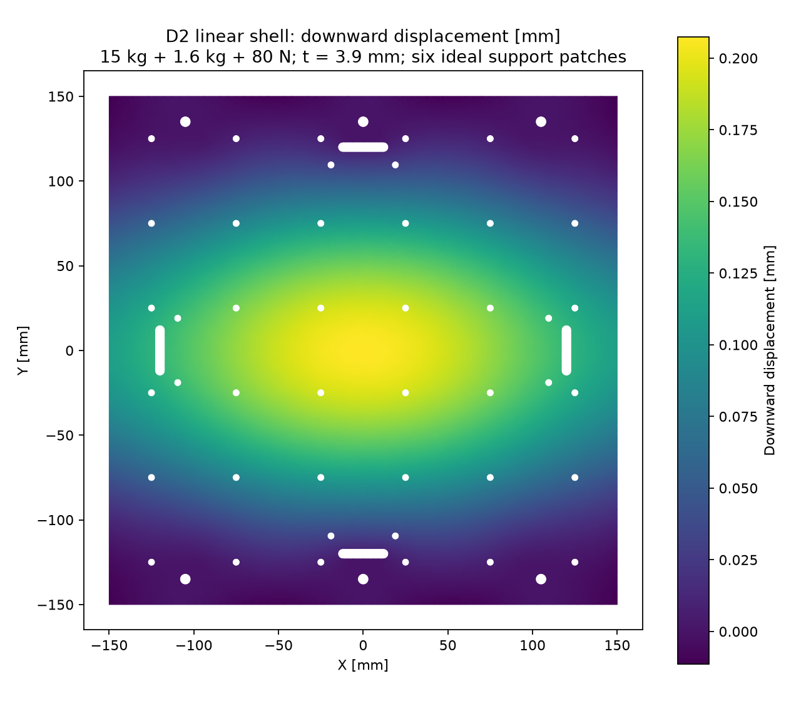

# D2：採用する格子穴アルミ荷台

2026-09-22。**6061-T6・300×300×4mmの一枚板を現行CADへ組み込み、6個の金属支持ブロックと小型PLA固定具を配置した。** 格子は50mmピッチ、6×6のφ4.5貫通穴で、ねじ加工はない。旧Q1で残っていた支持棒と裏ナットの干渉を解消した改訂である。

[STEP](AMR_GridDeck_C45_D2.step) / [加工図面PDF](AMR_GridDeck_C45_D2.pdf) / [同名STEP＋PDFの見積ZIP](AMR_GridDeck_C45_D2.zip) / [FreeCAD](AMR_GridDeck_C45_D2.FCStd) / [組立・支持・強度・整備手順](../DECK_REVIEW.ja.md)。


## JLCCNCの実見積

このD2のSTEPとPDFを同名でZIPにまとめ、[JLCCNCの見積サイト](https://jlccnc.com/jp/cnc-machining-quote)へ投入した。認識外形300×300×4mm、認識体積353623.36mm³、数量1、Aluminum 6061、表面処理なし、最高公差±0.10mm、ねじ加工なしを確認。図面・備考に6061-T6、耐力240MPa以上の材質確認を要求した。

| 納期選択 | 材料・全加工 | 日本宛UPS送料 | 合計USD | 参考円換算 |
|---|---:|---:|---:|---:|
| 経済的・製造10日 | 28.67 | 9.98 | **38.65** | **約6,080円** |
| 標準・製造5日 | 30.69 | 9.98 | 40.67 | 約6,400円 |

経済的の内訳は加工約4,510円＋送料約1,570円。旧Q1とは取付穴の位置が異なるため見積を取り直した結果、表示額は同じだった。材料、36格子穴、6フレーム穴、8ストッパ穴、4長穴を含む。支持材・締結材・ベルトは含まない。モーター金具との同梱値引きは仮定せず、それぞれの送料をBOMに残した。

**自動見積であり、図面の手動審査と材質・公差条件の受諾は未完了。** 日本という国を指定した送料で、住所別確定額ではない。注文・決済は行っていない。税・決済手数料・換算差は別。[取得記録](quote-evidence/D2-observed.json)、[STEP/PDFの紐付け記録](quote-evidence/C45-file-association.json)、[仕様画面](quote-evidence/C45-settings.png)、[図面備考](quote-evidence/C45-settings-notes.png)、[送料画面](quote-evidence/C45-shipping.png)。



円換算は[ECBの2026-09-21基準](https://www.ecb.europa.eu/stats/eurofxref/eurofxref-daily.xml)、1EUR＝1.1490USD・180.70JPYから、1USD＝157.2671888599JPYを計算した参考値。10円単位に丸めている。[換算データ](jpy_conversion.json)。[取得XML](quote-evidence/ecb-2026-09-21.xml)のSHA256と各レートは換算JSONに記録している。

## 改訂内容と一致確認

板厚・外形・格子・ストッパ穴・ベルト長穴は維持し、フレーム穴6個をx=−105,0,105・y=±135へ配置した。旧Q1のx=±120位置ではない。支持は20×15×15mmを6個とする。組立の荷台板を単品見積STEPへ重ね、形状差の体積が0mm³であることを確認した。[検査記録](../service_envelope_validation.json)。


板1枚の公称質量は0.954783kg。図面下限は3.9mmで、外形・板厚以外の公差と材質はPDFを正本とする。旧[Q1比較案](../aluminum-grid-quote/README.ja.md)と[分割PLA案](../printed-deck-concept/README.ja.md)は履歴資料。

## シェル解析

[全結果](fea/summary.json)、[粗メッシュ結果](fea/coarse/result.json)、[細メッシュ結果](fea/fine/result.json)。計算の目的は6支持・穴付き板の線形静的比較で、車体全体の安全率認定ではない。

荷物15kg＋板側自重枠1.6kg＋ベルト4脚×20N＝242.79039Nを中央200×200mmの実材料面へ分配。t=3.9mm、E=69000MPa、ν=0.33、6個の20×15mm支持領域を鉛直拘束した。荷重は二次三角形の整合節点荷重へ変換し、合計力と支持反力を照合した。実接触、ボルト予圧、滑り、面のばらつきは理想化している。

[CalculiX公式](https://www.dhondt.de/)の2.21、S6シェル（内部では二次の15節点くさびに展開）と、[Triangle](https://www.cs.cmu.edu/~quake/triangle.html)の制約付き二次メッシュを用いた。円周は24/48分割の直線近似で、細メッシュの面積誤差はCADに対し約0.0033%。11,627/19,750要素で最大たわみ0.20683/0.20740mm、変化0.27%。表面外挿余裕1.3を掛けた応力は29.341/30.487MPa、変化3.91%。細メッシュの2倍荷重比較は60.975MPaで、要求耐力240MPa以下となった。

通常10kgの同じ分布条件では約0.166mm、2倍検証荷重の線形換算では約0.415mm。これをそのまま実機隙間の保証値にはしない。点脚・機器の格子穴荷重、上向きベルト固定力の接触、板と支持の離間、締結とフレーム、衝撃・疲労は別途確認が必要。材料ロットの6061-T6と耐力も受入条件である。



ソルバーの入力・DAT出力・使用時のパラメータ・ログを圧縮保存した：[粗メッシュ](fea/coarse/solver-input-output.zip)、[細メッシュ](fea/fine/solver-input-output.zip)。JSONのSHA256はZIP内の元ファイルと対応する。パラメータは解析時点のスナップショットで、その後の価格・検査状態の更新は構造入力を変えていない。

```sh
# numpy・matplotlib、Triangle、CalculiX2.21が必要。実行ファイルは明示する。
python3 cad/amr07/aluminum-grid-deck/analyze_plate.py \
  --triangle /path/to/triangle --ccx /path/to/ccx \
  --area 30 --segments 24 --name coarse
python3 cad/amr07/aluminum-grid-deck/analyze_plate.py \
  --triangle /path/to/triangle --ccx /path/to/ccx \
  --area 15 --segments 48 --name fine
```

STLと機器固定具の説明は[PLA小物](../printed-accessories/README.ja.md)。CAD再生成はFreeCADのheadlessで`build_part.py`と`../build_assembly.py`、PDF再生成はReportLab環境で`make_drawings.py`。見積STEP/PDFを再生成・変更したときはSHAと加工先へ送ったデータの一致を取り直す。
