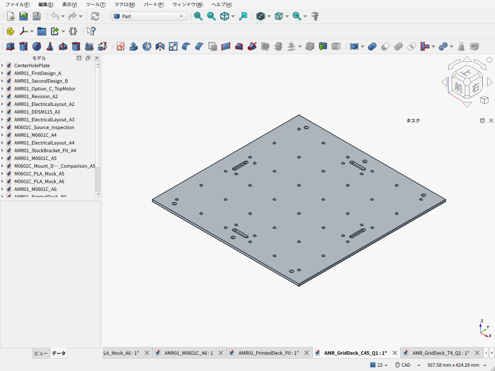

# 格子穴付きアルミ上板 — JLCCNC実サイト見積

2026-09-21、実際のSTEPと同名PDFをJLCCNCへアップロードして確認しました。**通し穴案は1枚28.67 USD＋日本向け表示送料9.98 USD＝38.65 USD**です。経済納期10日を選択した自動見積で、図面の手動審査・輸入諸費・決済換算前の金額です。発注・支払いはしていません。

## 日本円での参考換算

**300×300×厚4mm・6061-T6の一枚板、M4用φ4.5通し穴36個を持つC45案は、経済納期10日で送料込み約6,080円。** 既存見積のSTEP/PDF・証拠のハッシュを照合した上で円換算したもので、別形状の新規見積や決済額の確定ではない。

ECBの2026-09-21公表値は1 EUR＝1.1490 USD、1 EUR＝180.70 JPY。180.70÷1.1490から**1 USD＝約157.2672円**として計算し、下表は10円単位に丸めた。[ECB米ドル公表値](https://www.ecb.europa.eu/stats/policy_and_exchange_rates/euro_reference_exchange_rates/html/eurofxref-graph-usd.en.html) / [ECB日本円公表値](https://www.ecb.europa.eu/stats/policy_and_exchange_rates/euro_reference_exchange_rates/html/eurofxref-graph-jpy.en.html) / [換算記録](jpy_conversion.json)

| 費目・C45を1枚 | 経済納期10日・USD | 参考円換算 |
| --- | ---: | ---: |
| 材料・全穴加工・バリ取り | 28.67 USD | 約4,510円 |
| 日本向けUPS表示送料 | 9.98 USD | 約1,570円 |
| 上記合計 | **38.65 USD** | **約6,080円** |

標準納期5日は40.67 USD、同じレートで約6,400円。製造日数と配送日数は別で、到着保証ではない。決済会社の換算レート・手数料、課税される場合の輸入税や通関関連費は未確定で、この円換算には含めない。支持棒・締結材・ストッパ・ベルトも別。材料費は加工見積に含まれるため、元BOMの板材4,521円を重ねて加算しない。

厚4mmは現行荷台の金属支持構成を基準とした比較仕様で、50mm格子の追加後に強度を保証した値ではない。格子は端から25mm、6×6。既存のフレーム取付穴・ストッパ穴・ベルト長穴も含む。薄板化する場合は支持・強度を再検討し、変更した形状で見積り直す。現時点では、後述の外側列の裏ナットと支持棒の干渉も解消してから採用する。

## 同じ条件で比較した2案

| 格子穴の仕様 | 経済納期10日：材料・加工 | 日本宛UPS表示送料 | 表示合計 | 標準納期5日の表示合計 |
| --- | ---: | ---: | ---: | ---: |
| C45：M4ボルト用φ4.5通し穴×36 | 28.67 USD | 9.98 USD | **38.65 USD** | 40.67 USD |
| T4：M4×0.7ねじ穴×36を指定 | 28.46 USD | 9.98 USD | **38.44 USD（参考）** | 40.42 USD |

**T4の38.44 USDを「36か所のタップ加工込みの確定価格」として採用しません。** サイトでThreadsを「はい」、図面・備考で36か所のM4×0.7-6H貫通ねじを指定し、保存後も設定とPDFを確認しました。ただし自動見積にはタップ加工の独立した明細や36穴の工数確認がなく、全穴の加工費が反映されているかは手動審査が必要です。通し穴案との差0.21 USDから、タップ案の方が安いとは結論しません。

[公式注文ガイド](https://jlccnc.com/help/article/cnc-machining-ordering-guidelines)でも、最終価格・納期は手動審査で確定するとされています。上の数字はサイトから取得した自動表示で、こちらの工賃推定ではありません。国だけをJapanに設定した送料で、特定住所の最終着荷額や関税込み価格ではありません。製造日数とは別に、UPSの配達表示は2～4営業日です。

## 見積した形状・加工条件

| 項目 | 条件 |
| --- | --- |
| 数量 | 各案1枚。2案を同時購入する合算見積ではない |
| 外形 | 300×300×4mm |
| 材料 | Aluminum 6061選択、6061-T6を図面・備考に明記 |
| 表面 | 切削のまま、ブラスト・アルマイトなし、バリ取り |
| 格子 | 50mmピッチ、6×6＝36穴、端から25mm |
| C45 | φ4.5貫通。M4ボルト＋裏ナット等で固定 |
| T4 | M4×0.7-6H貫通タップ。STEPはφ3.3下穴、仕上がりねじは図面指定 |
| 既存取付形状 | フレーム用φ6.6×6、荷物ストッパ用φ4.5×8、ベルト用30×6・R3長穴×4を含む |
| 公差 | サイト±0.10mm。図面では穴・長穴の座標±0.10、板厚4±0.10、平面度0.5、その他ISO2768-m |
| 荷台以外 | 支持棒・ねじ・ナット・ストッパ・ベルトは含まない |

単なる36穴のサンプルではなく、現行荷台の固定穴・ベルト穴を残した完成形状で比較しています。材料費は見積に含まれるので、既存のA5052素材4,521円を加算しません。現行の国内板材A5052と今回の6061-T6は材質が異なります。JLCCNCの見積画面で選べたアルミは6061と7075でした。

UPS9.98 USDは、今回表示された自己契約口座不要の配送手段で最安です。OCS10.09 USDより0.11 USD低いためUPSを選択しました。「My UPS Account」等の2.02 USDは契約運賃が別途必要な自前口座用で、安い送料として採用していません。[配送画面](evidence/C45-shipping.png)

## 設計上の扱い

これは価格比較用のQ1です。既存A6車体の荷台やBOMをCNC品へ置き換えた状態ではありません。現行BOMの板素材代4,521円は維持し、この比較価格を追加加算していません。採用する場合は板素材代と対象送料を外注費へ置換して再集計します。

C45のCAD質量は約0.955kg。T4は下穴モデルで約0.958kgで、ねじ切削による僅かな減量を含みません。PLA案の4分割・板厚10mm・追加支持棒とは加工方法と構成が異なるため、板1枚の金額だけで完成荷台の安さを決めません。

両案とも格子追加後の強度認定は未実施です。また、外側2列（Y＝±125）の裏ナット・座金は、既存の支持棒（Y＝±135）の側面に干渉するため、そのまま全36穴を裏ナットで使える状態ではありません。アクセサリを付ける位置と支持棒・ナットの逃げを確認してから実装します。T4は板厚4mmのねじ掛かりなので、抜け・繰返し脱着・締付トルクの検証が別途必要です。

## データと証拠

| 案 | CAD・図面 | 実見積画面・取得値 |
| --- | --- | --- |
| C45 | [STEP](AMR_GridDeck_C45_Q1.step) / [PDF](AMR_GridDeck_C45_Q1.pdf) / [同名2ファイルZIP](AMR_GridDeck_C45_Q1.zip) / [FCStd](AMR_GridDeck_C45_Q1.FCStd) | [経済納期](evidence/C45-economic.png) / [設定](evidence/C45-settings.png) / [備考](evidence/C45-settings-notes.png) / [JSON](evidence/C45-observed.json) |
| T4 | [STEP](AMR_GridDeck_T4_Q1.step) / [PDF](AMR_GridDeck_T4_Q1.pdf) / [同名2ファイルZIP](AMR_GridDeck_T4_Q1.zip) / [FCStd](AMR_GridDeck_T4_Q1.FCStd) | [経済納期](evidence/T4-economic.png) / [設定](evidence/T4-settings.png) / [備考](evidence/T4-settings-notes.png) / [JSON](evidence/T4-observed.json) |

±0.10mmの公差選択では個別図面欄が表示されないため、同名STEP/PDFをZIPで投入しました。C45の2D/3D対応は見積カードに結び付いた部品データの`fileName2D`、`fileName3D`、`drawFileVOS`を読み取り確認し、[名前だけの確認記録](evidence/C45-file-association.json)に保存しています。T4は同じZIPに加えてThreads欄にもPDFを添付し、保存後の画面で再確認しました。公差を±0.05にして図面を表示させる方法は、今回の最終見積条件には使っていません。

SHA256、形状体積、STEP再読込の検査結果は[図面マニフェスト](drawing_manifest.json)と[検証記録](validation.json)。2案とも有効な単一ソリッド、STEP往復の体積差0mm³を確認しています。見積取得後にSTEP/PDFを書き換えていません。

再生成はFreeCAD Pythonで`build_quote_parts.py`、通常Python＋reportlabで`make_drawings.py`。再生成するとファイルのハッシュが変わる場合があるため、再見積は別改訂として扱います。[キャスター購入経路](../CASTER_PROCUREMENT.ja.md) / [現行BOM](../BOM.ja.md)
