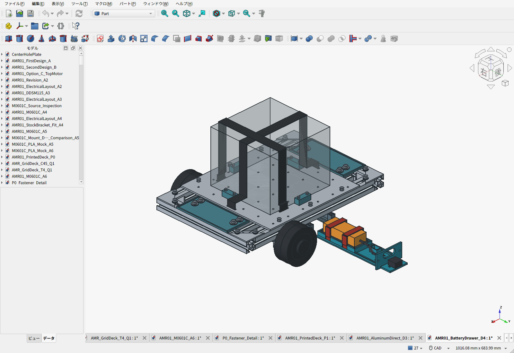
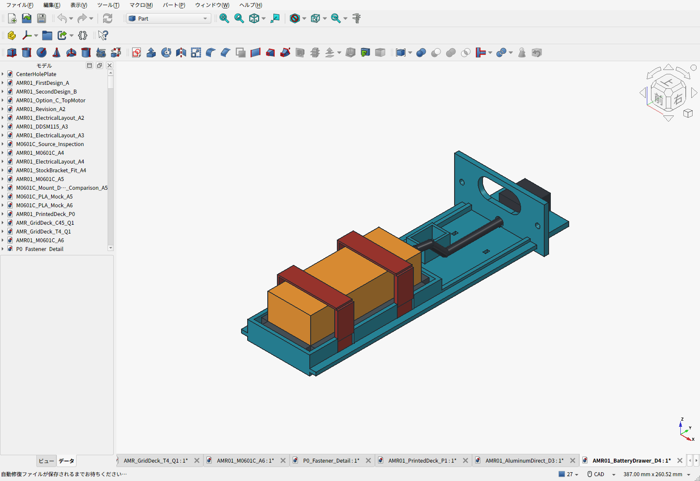

# D4：天板を外さず交換できる電池受け皿

> 現行案は[D5：BL1860B6Ah・後端交換](../makita-power/README.ja.md)。D4の電池厚36mm条件は撤回した。以下は薄型電池を想定していた旧案の記録。

D3は、電池交換のたびに荷物・ベルト・天板を外す必要があり、日常のアクセスが悪かった。D4では下段3030の下を横へ引き出す電池受け皿に変更し、**電池の固定と、受け皿の車体への固定を両方CADに入れた**。天板は300×300×4mm、上面103mmのD3そのまま。嵩上げはない。

**電池の製品選定はまだ完了していない。** 旧120×80×65mmは購入品ではなく寸法予約だった。65mm厚の電池はこの側方経路を通らない。今回は公開寸法のある薄型5S電池を仮合わせし、交換性が成立する条件を明示した機械試作案である。厚い電池・別サイズの電池を決めた場合は、この受け皿をそのまま購入適合品として扱わない。

## 固定方法と荷重の流れ

| 接続 | 固定方法 | 役割 |
|---|---|---|
| 電池→受け皿 | 底の1mmパッド、四辺の軟質当て材、15mm幅のベルト2本 | 底で重量を受け、四辺でずれを抑え、浮上りをベルトで抑える。小ねじを電池へ直接当てない |
| ベルト→受け皿 | 底・側面の専用溝に通す | 電池だけを一周して受け皿から離れる構成にしない。ベルト下面は床上25.2mm、床下へ出さない |
| 受け皿→固定ガイド | 左右の段付きフランジと上下のガイド面 | 荷重を受け、横ずれと持上がりを制限。抜出し方向の保持は摩擦に頼らない |
| 抜け止め | M4×16六角穴付2本、座金2枚、ゆるみ止めナット2個 | 車体の外側から3mm六角レンチで脱着。ナットは固定ガイドのポケットに残る |
| 固定ガイド→3030 | 元のM6ボルト・大径座金・溝ナット4組を再使用 | X=-80/+20、Y=±65の既存位置。フレームの穴あけ・追加の金属加工なし |

当て材は電池の実寸に合わせて厚さを調整する。パックを強く圧縮して隙間を合わせる設計ではない。ベルトの重なり25mmは上面ではなく側面に置く。受け皿・ガイド・ベルト・当て材は電池用であり、10kgの荷物を支える部品ではない。

## 交換手順と空間

1. 平坦な床で停止し、主電源を切る。
2. 車体外側の主コネクタを切り離し、車体側の線を抜出し経路からよける。
3. 正面のM4ボルト2本と座金を外す。3030に固定した4本のM6は触らない。
4. 受け皿を+Yへ220mm引き、下面を手で支えて取り出す。天板・荷物・荷物ベルトは残せる。
5. 車外で電池固定ベルトを外す。電池の充電も車体から分離して行う。

ガイドが保持するのは挿入中の受け皿であり、引出し終端を自立する作業台として扱わない。最後はガイドから完全に抜けるため手で支える。車体フレーム側面から約251mmの抜出し空間に加え、手を動かす余裕が要る。

主電源線とバランス線は受け皿に沿わせ、引出し時は電池と一緒に動く。主コネクタ前の結束穴と一体のバランス端子収納部を設けた。ケーブルをつないだまま引く設計ではない。図の電線・コネクタは経路と包絡形状で、実際のケーブル曲げ半径、端子の向き、絶縁キャップ、結束材、電池直近のヒューズは電池・電装選定後に確定する。

## 対応する電池の寸法と選定状況

機械仮合わせには[ラジコン1のVANT 5S 18.5V 2200mAh](https://www.radicon1.com/item/VANT2200-45c-5sG/)の掲載寸法104×34.5×40mm、295gを使った。**34.5mmの辺を高さに、104mmの辺を引出し方向に向ける**。掲載の通常価格は税込9,020円、会員価格6,765円。2026-09-22確認、送料・在庫・会員条件の適用は未確定。

| 項目 | D4の条件 |
|---|---|
| パック本体の受入れ上限 | 設置時X50×Y112×Z36mm。配線・コネクタは別の予約空間に収める |
| 電池座面 | 床上30mm。公称候補の上端64.5mm、ベルト上端66mm |
| 引出し時のフレームとの隙間 | 候補ベルト上端から3mm。最大許容厚さ36mmでは1.5mm |
| 地上高 | 固定ガイド・受け皿の最低部25mm |
| 容量 | 候補は2.2Ah・公称40.7Wh。1時間駆動を確認した容量ではない |
| 電装への適合 | 18V級・満充電21V以下の従来方針と比較可能。セル単位の保護と適合充電器は未選定 |

VANTを最安品・最終採用品とはしていない。Turnigyの同等寸法品は販売ページに廃番表示、CNHL品は欠品と寸法ばらつき等の留保があり、安い表示価格だけで購入候補に確定しなかった。[候補・不採用理由と出典](battery_candidates.json)。価格・実稼働時間・保護・充電器の総額をそろえて選定する。

## CAD確認と未確認事項

検査対象は保存した車体形状、最大寸法の電池、ベルトとその重なり、工具、連続した引出し経路である。天板・荷物例・荷物ベルトを残す。旧D3の天板、下段フレーム、モーター金具、キャスター、格子穴には変更を加えていない。[検査結果](validation.json) / [保存物を開き直した検査](saved_artifact_validation.json)。

検査に通る公称寸法でも、PLAの積層、たわみ、摩耗、熱・クリープと現物寸法は残る。0.75kgのダミー電池で、両方のベルト、受け皿、ガイド、抜け止めまで組み付けて確認する。保持部の試験計画では、電池・可動部を合わせて最低1kgとして、2g相当×係数2＝**39.3N**を上下・前後・左右それぞれに加える。これは試作の受入れ荷重設定であり、実施結果でも材料許容値から求めた安全率でもない。保持の外れ・割れ・滑り、ねじの緩み、50回の着脱、予定使用温度での24時間保持を確認してから実電池へ進む。

車体全体の通常積載10kg／構造検証15kg・静的安全率2の要件は継承し、電池固定部のCADだけで車体の耐荷重を認定しない。

## 印刷・費用・変更範囲

新規印刷はガイド2個と受け皿1個。STLは印刷方向の候補で、P1Sの造形範囲に収まる。最長部は受け皿243mm、ガイド227mm。底のベルト溝、ガイド溝、ナット挿入口にサポートが残らないようスライサで確認する。受け皿は床面を下向きに印刷し、243mm方向のブリム幅は片側6mm以下とする。ガイドはサポートと積層方向の確認が必要で、無条件にサポート不要とはしない。ベルトが通る印刷縁を滑らかに仕上げる。

- [変更する3部品のSTL一式](D4-battery-print-files.zip) / [寸法・中実材料量](print_manifest.json)
- [全車BOM](BOM.csv) / [費用小計と未価格品](cost_summary.json)
- [組立FCStd](AMR01_BatteryDrawer_D4.FCStd) / [STEP](AMR01_BatteryDrawer_D4.step)
- [D3の天板図面・実見積](../aluminum-direct-deck/README.ja.md) / [継承した加工ファイルのハッシュ](release_manifest.json)

車体推計は**8.338kg**、10kgまで約1.662kg。PLAは全車で中実換算約332g・参考664円、旧D3比の材料評価増は**146円**。全車の途中小計は**46,358円＋120.90 USD＋未確定分**であり、完成価格ではない。

旧電池受けは除外し、ガイドと受け皿の材料量へ置き換える。電池ベルト2本の従来500円枠は重複計上しない。追加のM4ねじ・ナット・座金、軟質パッド、結束材は別行に明記し、購入額が未確認の項目をゼロ円で完成費用に見せない。電池・保護・充電器の価格も全車小計に未算入である。

D3アルミ板のSTEP/PDFを変更していないため、板の実加工見積は同一ファイルとして参照する。新しい金属加工見積を取得したという意味ではない。電池のカタログ質量295gへ見積重量を減らさず、従来の電池枠0.75kg・電装枠合計2.10kgを維持する。

再生成はFreeCAD Pythonで`build_d4.py`、通常のPythonで`build_bom.py`、FreeCAD GUIで`capture_screens.py`。保存物の検査後に`release_manifest.json`を更新する。
