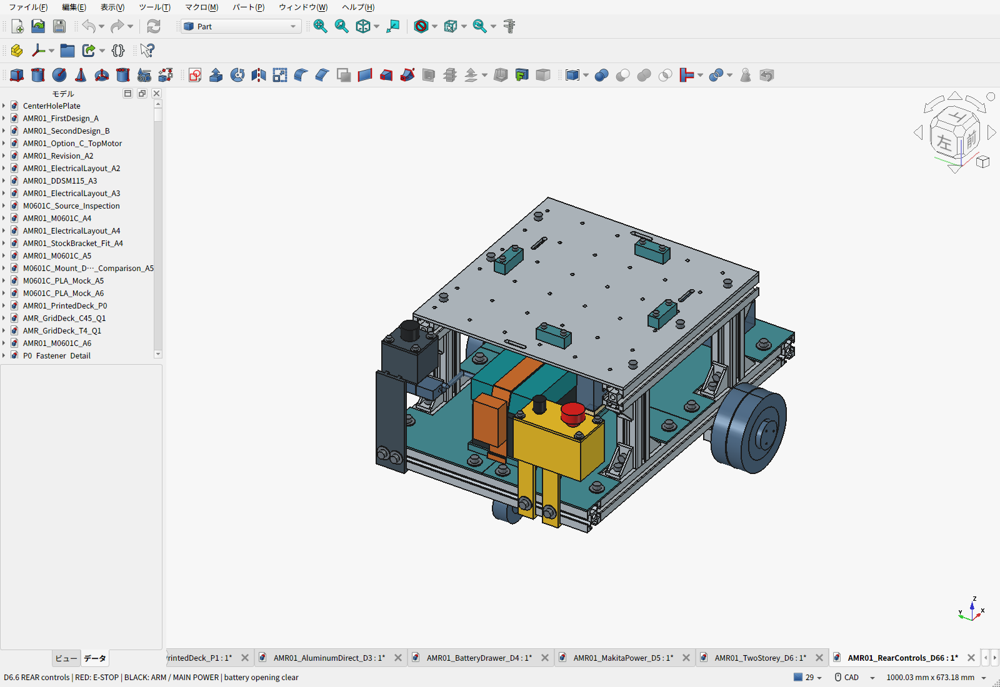

# D6.6：後方の非常停止・ARM・主電源

**非常停止を後ろ側へ移し、電池口を塞がない左右の操作ケースへ分けた。** 現行の天板開閉を含む組立は[D6.7](../hinged-deck/README.ja.md)。このフォルダは後方操作部の設計基礎・調達記録である。



前進は+X、後ろは−X。座標はmm、Z=0が床。後方からの作業を前提にした配置であり、すべてのAMRで後ろが正しいという一般論ではない。

| 操作 | 型式 | パネル中心X,Y,Z | 役割 |
|---|---|---|---|
| 非常停止 | IDEC XA1E-BV302R、2NC | −213, −119, 206 | 押下でモーター給電リレーを無励磁。解除だけでは再走行しない |
| 手動ARM | amon3212、黒、自動戻りNO | −213, −71, 206 | 故障解消後の新しい押下で運転許可。走行指令とは別 |
| 主電源 | amon3214、ON/OFF | −203, +120, 237 | モーター・計算機を含む全負荷の手動遮断 |

後方から見て非常停止とARMを一方の角、主電源を既存電池コネクタに近い反対の角へ配置。中央の電池取り出し口を残し、電池は従来どおり8mm上げて後方へ220mm引く。電池コネクタの取り出しに当たった支えを修正し、主電源ケースはその経路の上へ逃がした。最小の図上隙間だけで現物公差やケーブルの柔らかさを保証しない。

## ケースと固定

- 非常停止・ARMケースと主電源ケースを非導電PLAで印刷する。蓋は板厚3mm。IDECの適合板厚0.5〜3.7mmに収め、黄色い蓋そのものを背景とする。
- 各ケースを3030の**後面2点＋下面2点**で固定。M6×12、OD18×t1座金、HNTT6-6を使い、フレームへ追加穴を開けない。蓋も各4本のM4×16で固定する。
- 押しボタンの裏側と端子を覆う。ケーブル口はφ9の仮設計で、実ケーブル外径に合うグロメット・引張り止めを選定する。穴だけで配線保護を完成としない。
- 新規印刷は4部品。支え・穴・ナット溝を実機で確認するための試作版。IDECの直接開路動作力60Nを踏まえ、取付状態で押下荷重120Nの静的確認を行う受入目標とし、試験済みとは扱わない。

メーカー資料：[IDEC製品](https://www.idec.com/ja-jp/switches-indicator-lights/switches-pushbuttons/emergency-stop-switches/xa-16mm-estop/xa1e-bv302r)／[IDECメーカー寸法・力のカタログ（販売店配布、pp.4,6）](https://asset.conrad.com/media10/add/160267/c1/-/en/000178685DS02/fiche-technique-178685-idec-xw1e-bv413r-arret-durgence-250-vac-3-a-3-nf-r-1-no-t-ip65-boite-de-derivation-1-pc-s.pdf)／[amon3212](https://www.amon.jp/products2/detail.php?product_code=3212)／[amon3214](https://www.amon.jp/products2/detail.php?product_code=3214)。購入品は公開寸法から作った保守的な外形モデルで、メーカーSTEPや実測ではない。

## 配線方針

```text
BL1860B＋アダプター → 電池直近F0 → 後方着脱コネクタ
                                    ↓
                            後方の主スイッチ3214
                                    ↓
                          独立全負荷UVLO → 分配
                            ├ 計算機用電源
                            ├ 監視用5V → 手持ちPico等
                            └ 逆流防止 → K1/K2 → モーター
                                                 └ 自立回生クランプ
```

F0は長い車体配線・コネクタより電池側に置く。アダプター付属ヒューズホルダの形式を受入確認し、30Aヒューズをそのまま今回の10A出発値と扱わない。主電源をコネクタ近くへ配置し、太い線を後ろの左右に往復させない。制御線は反対側の低い経路を通し、計算機の側方引き抜きを避ける。

非常停止2NCの4線とARMの2線を前方の保護回路へ引く。CADの線は経路予約で、線径束ね・曲げ半径・端子番号・切断長・固定点まで確定した製造ハーネスではない。主電源はDC24V10A表示だが、モーターやDC/DCの突入と遮断過渡の適合は実測する。

## 検査結果と費用

[検査JSON](validation.json)：実体同士・機器外形・電池引き抜き・計算機引き抜き・操作する手の進入・8本の取付工具・タイヤ交換経路・キャスター回転を検査し、定義した形状の干渉なし。D6.5から継承した物理形状は変更なし。公差、配線の実挙動、印刷強度や電気回路の完成を意味するものではない。

車体推計10.409kg。ケース・追加金属締結材で約0.341kg増、うちPLA約194g。0.4kgの電源保護部品枠、0.4kgの配線枠、Pico等0.05kgは元の重量見込みを維持し、Pico所有を軽量化とは数えない。

[BOM概要](BOM.ja.md)／[全明細Markdown](BOM-details.ja.md)／[CSV](BOM.csv)。D6.6の途中小計は79,680円＋120.90USD、記録済み為替で約98,694円＋未計上分。今回から旧版で空欄だったM6ねじ等も計上したため、全差額を操作部の追加費用とみなさない。

[モジュールと基板外注の比較](ELECTRONICS_OPTIONS.ja.md)／[Amazon・送料込み比較](PROCUREMENT.ja.md)／[現在の開閉天板版](../hinged-deck/README.ja.md)。
