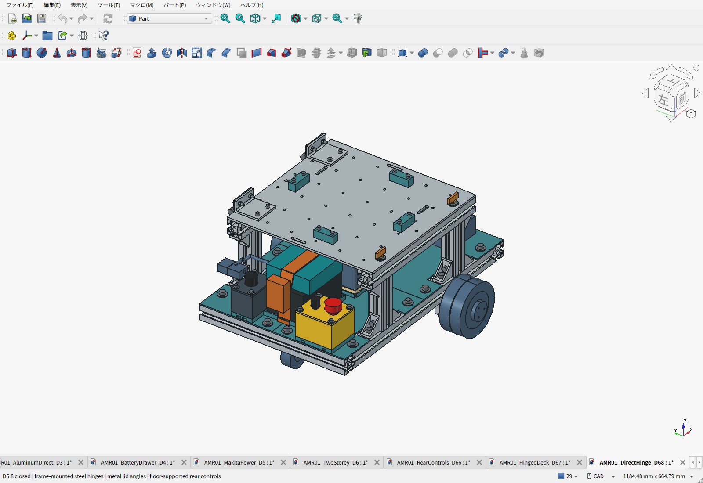
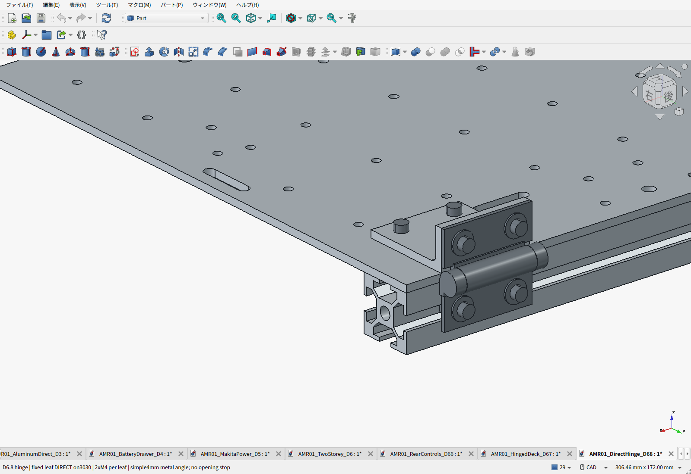
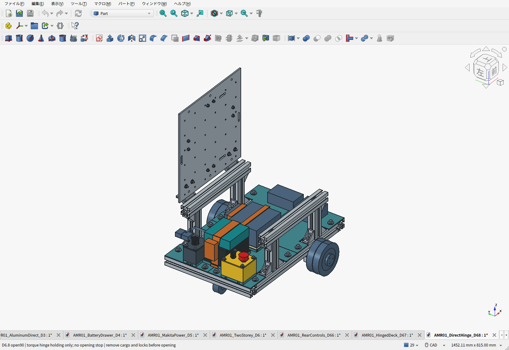
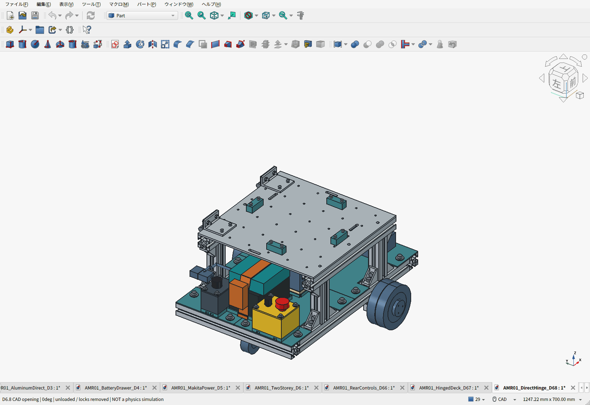
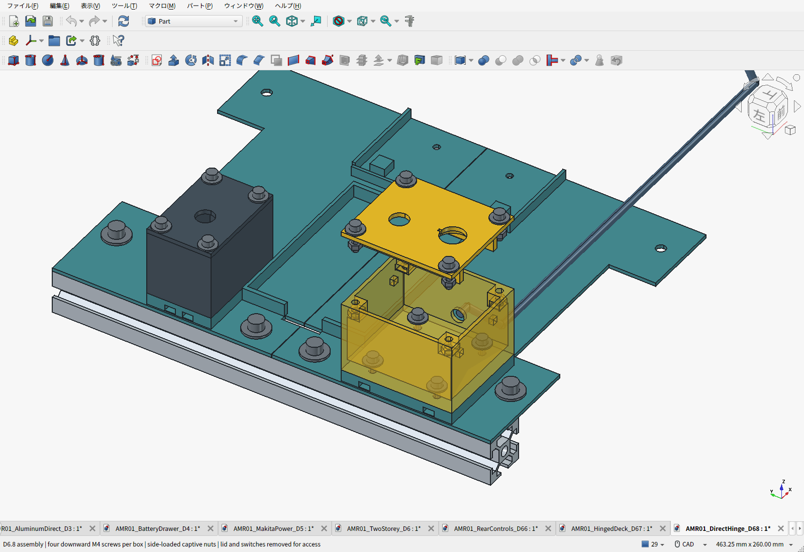
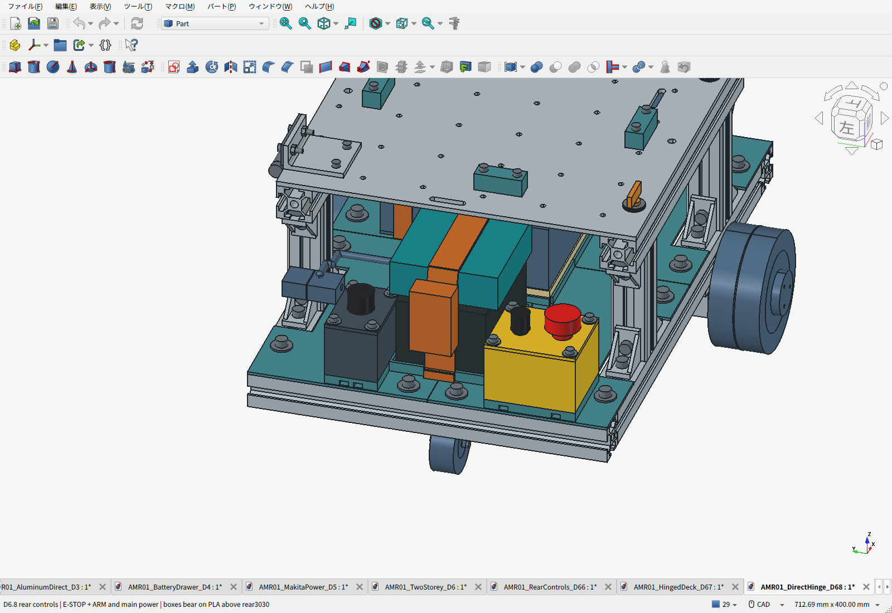
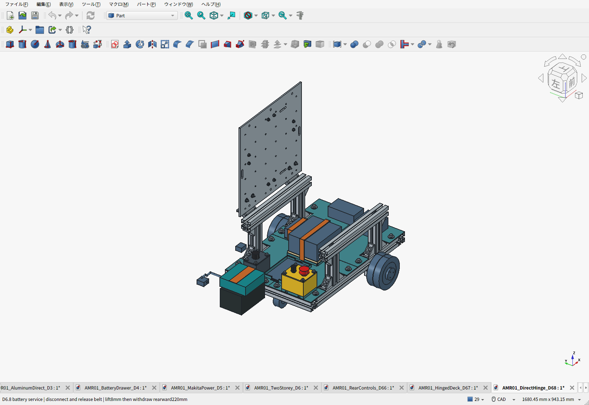

# D6.8：フレーム直付けヒンジと床で支える操作部

**トルクヒンジを3030へ直接固定し、天板側だけ金属L金具で接続しました。開き止めは設けません。** 非常停止箱と主電源箱はPLA床の一体座に載せ、各4本のM4で上から固定します。

[費用割合・購入リスト](BOM.ja.md) ／ [全明細MD](BOM-details.ja.md) ／ [CSV](BOM.csv) ／ [重量・強度計算](PAYLOAD_REVIEW.ja.md) ／ [実加工見積](MACHINING_QUOTE.ja.md)

| 部位 | D6.8の構成・理由 |
|---|---|
| 固定側 | スガツネHG-TP20×2を上段3030の外側溝へ直接固定。各ヒンジM4×10を2本、金属座金とM4溝ナット。樹脂を挟まない |
| 天板側 | 6061-T6の同形L金具2個。50×50×22mm、壁4mm、内隅R3を1本、D4.5通し穴4個。左右共通でタップなし |
| 天板 | 300×300×4mm。従来の36格子穴と長穴を維持し、ヒンジ用通し穴4個を追加。ヒンジ金具が格子穴2か所を覆い、M4取付空間の公称検査では34か所が空く |
| 開閉 | 空天板の0〜90°を検査。トルクヒンジだけで保持し、開き止めは追加しない。90°は物理的な停止位置ではない |
| 閉鎖固定 | 反対側のM6×15蝶ボルト2本。各3枚のt1金属座金、既存溝ナット。荷物の下向き荷重は天板→上段レール→支柱で受ける |
| 非常停止・ARM | 後方−X側の黄色PLA箱。床と一体の8mm座、箱底7mm、壁2.5mm。押下力を床・後方3030へ伝える |
| 主電源 | 反対側の黒いPLA箱。同じ上方締結方法。両箱は電池の後方抜出し経路を空ける |
| 重量・積載 | 車体推計10.615kg。10kgは車体の目安。通常荷物10kg、静的構造比較15kgを維持。実機積載試験前 |

HG-TP20は30mm角のアルミフレームへの取付と溝幅6/8/10mm対応がメーカー資料に示されています。トルク2.0N·m±25%/個、質量60g/個を使用しました。[メーカー](https://global.sugatsune.com/global/en/arch/products/21690_a)／[寸法・取付図](https://www.sugatsune.com/content/site-assets/201B_PDF/HGTP-Hinge-042020.pdf)。Amazonでは1,309円/個を確認し、2個2,618円を計上。[商品](https://www.amazon.co.jp/dp/B08PYP16SL)／[価格証拠](research/HGTP20-price.png)。

旧HG-TS15の購入記録は2個2,344円。新型は274円増で初期下限保持トルクが2.4→3.0N·mとなるため採用しました。**メーカーの詳細CADはログインが必要で未取得**です。外形・穴位置は公開寸法図を再構成し、葉厚2mm、溝ナットの鼻・テーパーは公称仮定を含みます。メーカーのフレーム対応表示だけで選んだ溝ナットとの実締結を保証するものではなく、実品の座り・ねじ突出を確認する段階は残ります。

## 保持力と開閉

空天板一式1.201kg、最大重力モーメント1.621N·mに対して、2個の初期下限3.0N·mは**1.85倍**。最大側5.0N·mで計算した反対端の開操作力は約21.6Nです。荷物と固定ベルトを外し、停止・主電源OFFの状態で開閉します。閉鎖ロックも外します。開放状態での走行、荷物を載せた開閉は計算範囲外です。初期カタログ値による比較であり、経年・温度変化後の保持試験は未実施です。

GIFはCADの配置アニメーションです。動力学シミュレーションや実機試験ではありません。

## 組立順序

1. 下段・上段の金属フレームを組む。各PLA床の既存4点固定（外周M6×3＋中央梁M4×1）を維持する。既存の中央支持梁とPC下の非導電カバーを取り付ける。
2. 後方床の一体座へM4ナットを横から差す。箱を座に載せ、**箱の蓋・スイッチと電池を外した状態で**、箱内からM4×16を4本締める。床板を車体から外す必要はない。
3. ケース蓋のスイッチと配線を先に組み、ケース角のナットを横から差す。蓋裏の2本のリブを箱内4か所の支持座へ載せ、上からM4×16を4本締める。リブと非常停止周囲の環状補強で押下力を分散する。
4. 机上でヒンジの可動葉をL金具へ各2本のM4×16で組む。ねじ頭は外側、ナットは内側。次にL金具を天板へ各2本のM4×16で固定し、裏側ナットへ工具を入れる。左右は同じ部品・穴配置。
5. 天板を上段レールに載せ、蝶ボルト2本で位置を決める。ヒンジの固定葉を外側からM4×10とM4溝ナットで固定する。左右の軸をそろえてから本締めし、空天板の開閉抵抗・座り・保持を確認する。
6. 制御箱の側面穴からハーネスを通し、クランプ等で拘束してから電池を載せる。穴は経路の予約で、ブッシュ・端子・引張保護の詳細製作は未完。電気試験は[共通計画](../ELECTRICAL_AND_VALIDATION.ja.md)に従う。

固定側M4には外側から、天板側M4には上から、ナットには内側／裏側から工具が入ります。[工具経路検査](assembly_access.json)。ヒンジは主にM4へ統一し、既存のフレームM6と共用ケースM4×16を利用。天板の反対側ロックは工具なしで操作します。締付けトルクは実品の材質・ねじ強度・溝ナット条件を照合して決めるため、未検証の値を指定していません。

電池は配線を切り離し、保持ベルトを外して8mm上げ、後ろへ220mm抜きます。天板を閉じた状態でも抜出し検査を通過しています。

## 検査と試作データ

新規・変更形状に関係する閉鎖時干渉、機器・配線予約との干渉、電池・計算機の連続直線抜出し空間、ケースとヒンジの工具経路、操作する手の進入空間を検査しました。開閉は5°区間の包絡で候補を絞り、近接する組合せを1°刻みで実形状検査。全公差を含む連続運動の証明ではありません。[検査](validation.json)／[保存CAD・STEP・STLの一致確認](saved_artifact_validation.json)。

D6.5から変更していないフレーム・足回り・床固定はBRep一致を確認。後方床2枚は一体座を追加しているため、旧床FEAをそのまま追加座の強度証明には使いません。通常荷重・静的15kg・安全率2の比較範囲と未検証事項は[計算書](PAYLOAD_REVIEW.ja.md)に分けています。

- [組立FCStd](AMR01_DirectHinge_D68.FCStd)／[機器外形付きSTEP](AMR01_DirectHinge_D68.step)／[構造だけのSTEP](AMR01_DirectHinge_D68-structure.step)
- [天板STEP](AMR_GridDeck_D68.step)／[天板図面](AMR_GridDeck_D68.pdf)／[L金具STEP](AMR_LidAngle_D68.step)／[L金具図面](AMR_LidAngle_D68.pdf)
- [14個のPLA試作STL一式](D68-print-prototypes.zip)／[印刷部品台帳](print_manifest.json)
- [要件](requirements.json)／[設計値](parameters.json)／[重量台帳](geometry.json)／[生成スクリプト](build_d68.py)

印刷14部品の最大外形は各256mm未満。STLは組立向きの形状を正座標へ移したもので、印刷向き・サポート・スライス条件の決定済みデータではありません。床は下面をベッドへ、ケースは底を下へ、蓋は平らな外面を下へ置く方向を試作候補とし、ナット差込口を支持材で塞がないよう確認します。強度計算は荷重を受ける壁・リブ・座が中実相当で、非導電・無充填PLAを使用する前提です。

D6.7の樹脂ヒンジ支持と開き止めを含むデータは履歴として保存。現行の取付構成は本フォルダです。Isaac Sim向けURDFはD6.5のままで、今回の形状・重量は未反映です。
