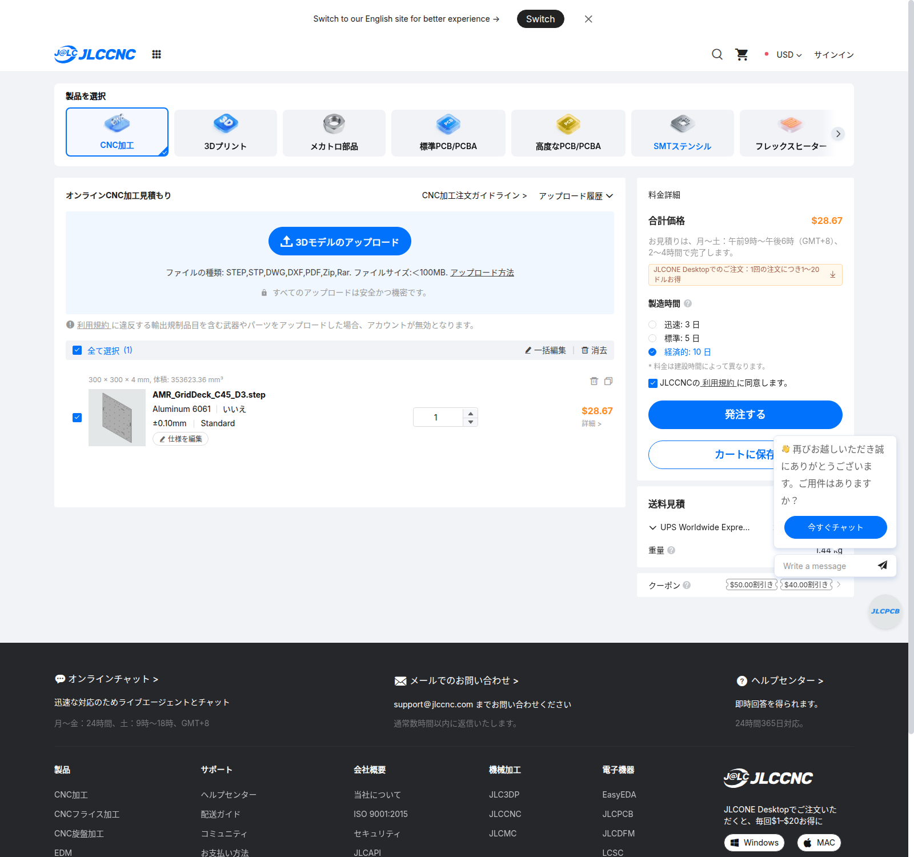

# D6.9：同一形状の天板見積を再使用

今回、新たな見積操作・製造発注は行っていません。**ヒンジ穴のないD3天板へ戻し、以前取得したJLCCNCの実自動見積を同じ製造形状へ再使用**しています。概算の加工単価から算出したものではありません。

| 条件 | 記録された内容 |
|---|---|
| 取得時刻 | 2026-09-21 22:55 UTC（日本時間9月22日7:55） |
| 部品 | AMR_GridDeck_C45_D3、300×300×4mm、1枚 |
| 材料 | サイト選択Aluminum 6061、図面・備考で6061-T6指定 |
| 加工 | 50丸穴、4長穴。全て通し穴、タップなし、生地 |
| 公差 | 指定寸法±0.10mm、他ISO2768-m。詳細は元PDF |
| 納期選択 | 経済的10日 |
| 天板 | 28.67 USD |
| 日本宛送料 | 9.98 USD、UPS Worldwide Express Saver |
| 天板＋送料 | **38.65 USD＝参考6,078円** |
| 状態 | 自動見積、手動図面審査前、未発注・未払い |

住所別送料・輸入税・決済費用は未確定。円換算は記録済みの2026-09-21参考為替157.26718886円/USDで、現在の決済額ではありません。

[取得データ](../aluminum-direct-deck/quote-evidence/D3-observed.json) ／ [実価格画面](../aluminum-direct-deck/quote-evidence/C45-economic.png) ／ [配送画面](../aluminum-direct-deck/quote-evidence/C45-shipping.png) ／ [STEP/PDFのひも付け確認](../aluminum-direct-deck/quote-evidence/C45-file-association.json)

## CADとの照合

元見積の[STEP](../aluminum-direct-deck/AMR_GridDeck_C45_D3.step)をZ方向へ229mm移し、D6.9保存CADの`AluminumDeckD3`と比較しました。両方向の差分体積は検査閾値0.001mm³未満で、製造形状は一致しています。STEP/PDFのSHA256も元の価格記録と一致しています。[結果](saved_artifact_validation.json)

旧D6.8の追加ヒンジ穴4個とL金具2個は今回の製造対象に含めません。モーター専用金具2個の既存見積・別送料は引き続きBOMへ計上します。

## D6.8からの費用差

| 削除・変更する購入品 | 減額 |
|---|---:|
| HG-TP20×2 | 2,618円 |
| ヒンジ用M4溝ナット1パック | 906円 |
| ヒンジ用M4×10ボルト1パック | 661円 |
| 蝶ボルト1パック | 527円 |
| 蝶ボルト用M6座金1パック | 968円 |
| 専用L金具2個 | 63.38 USD |
| 天板だけの配送に戻す差 | 0.10 USD |
| 合計削減 | **5,680円＋63.48 USD＝参考15,663円** |

6点固定へ戻すM6×12の6本・溝ナットの追加4個は、既計上の購入パック内で賄います。旧案から残る溝ナット2個と合わせて6個を使います。共通M4類は使用数を減らしましたが、パック単位の購入額は維持しています。[BOM](BOM.ja.md)
