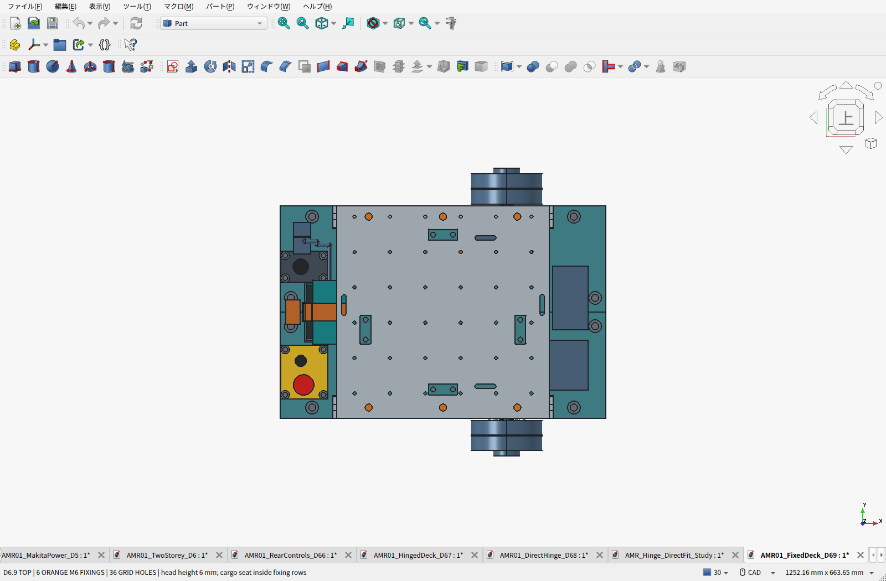
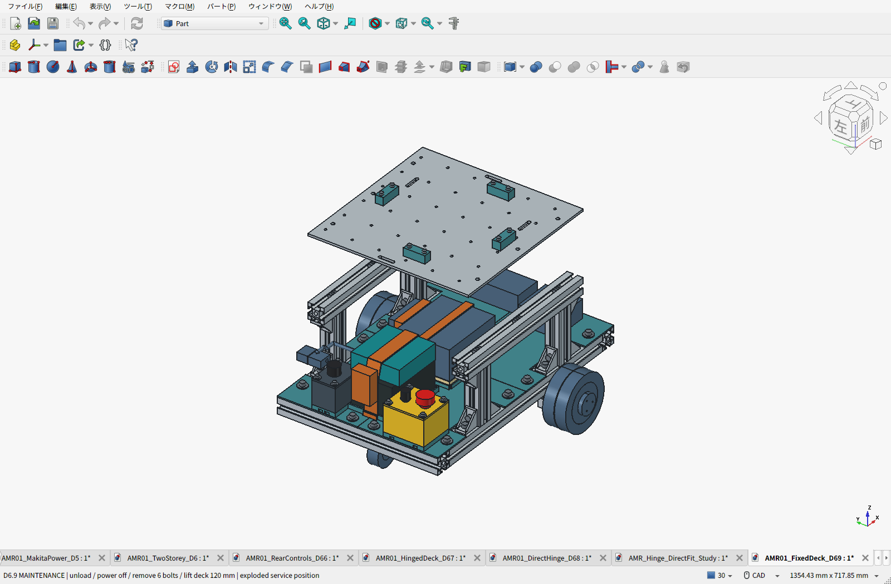
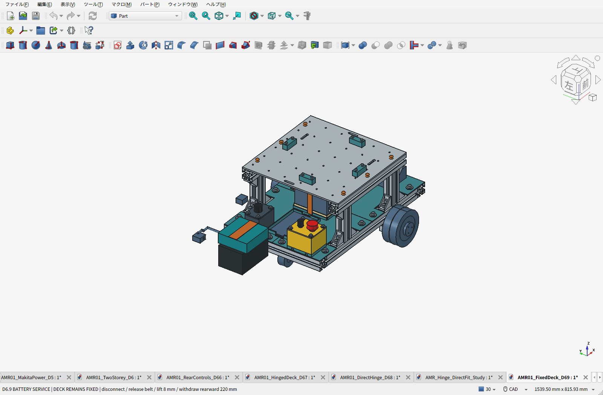

# D6.9：6点ボルト固定のアルミ天板

**天板を左右の上段3030へM6×12で3本ずつ、計6本固定する構成へ変更しました。** ヒンジ、専用L金具、蝶ボルトは廃止。後方の非常停止・主電源箱は、D6.8の床支持・各4本固定を維持しています。

**電装は車載Linux計算機を含む最小手動走行構成E2.1へ縮小しました。** 車載LinuxミニPC＋USB–RS485と必要な給電部材、電池＋ヒューズ＋非常停止による駆動電源遮断を基本にします。二重リレー・独立監視・ARM・追加センサーは初回必須から除外。部品型番と配線は選定中です。CADの旧非常停止・ARM・主スイッチと電装容積は配置参考のままです。[最小構成とBOM](../electrical-buildability/README.ja.md)。

[BOM・費用割合](BOM.ja.md) ／ [全明細Markdown](BOM-details.ja.md) ／ [CSV](BOM.csv)

| 項目 | 現行仕様 |
|---|---|
| 天板 | アルミ6061-T6、300×300×4mm、下面229／上面233mm |
| 支持 | 上段3030レール2本の上面に直接載せる |
| 固定 | M6×12六角穴付きボルト6本＋HNTT6-6溝ナット6個。片側3点 |
| 座面 | ボルト頭をアルミ天板へ直接着座。スペーサー・座金・皿加工なし |
| 固定位置 | X=−105、0、105mm × Y=−135、135mm。X前後／Y左右、後方は−X |
| 拡張穴 | 50mmピッチのφ4.5通し穴36個。新しいヒンジ穴4個は除去 |
| その他の穴 | φ6.6固定穴6個、荷物止めφ4.5穴8個、ベルト用長穴4個 |
| 整備 | 電池は天板を外さず後方へ。天板全体は6本を外して上へ持ち上げる |
| 車体推計 | 10.384kg。D6.8比−0.231kg、実測前 |
| 積載条件 | 通常10kgの設計目標、静的構造比較15kg・安全率2。実機確認前 |
| 費用 | 計上済み小計71,548円＋120.90 USD＝参考90,562円＋未計上分。Linux計算機・電源・通信・非常停止・配線等は未計上 |

## 固定方法と設計理由

積載の下向き荷重は、板から2本のアルミレール、4本の支柱、下段フレームへ伝えます。6本のボルトは板の浮き・ずれを抑えます。左右のレールへ均等に3点ずつ置き、中央の格子穴を使えるようにしました。

下の画像では、**橙色が固定ボルト6本**です。見えるように板とレールを半透明にしており、実部品の色指定ではありません。

M6×12は板厚4mmを貫通し、溝内への公称突出は8mm、モデルの溝底まで1mmです。頭は板より6mm上に出ます。既定の中央200×200mmの荷物座面の外側へ配置しています。通常の5mm六角レンチで上から締められ、6点すべてで頭上φ12×70mmの工具空間を検査済みです。実際の締付トルク・ねじ込み・底付き・溝ナットの着座は、選んだ実品の寸法と指定条件で確認します。

格子穴36個は、φ8×19mmの取付空間を置いたCAD検査で全て他部品と非干渉でした。うち30穴は裏ナット、Y=135mmの6穴は3030の溝ナットを使う想定です。穴へ載せる機器・個別ねじ長さ・工具は、追加機器ごとに確認します。

## 組み立てと取り外し

1. 上段3030を組む際、HNTT6-6を上側の溝へ各3個入れます。後入れ可能か未確認のため、端部を塞ぐ前に入れる手順にします。
2. 下段の配線・操作箱を組み、ナットを固定穴位置へ寄せます。天板を2本のレールに載せ、M6×12を6本とも軽く掛けます。
3. 板の着座を確認し、左右へ交互に締めます。ボルト頭は板の上から届き、板の裏で工具を持つ必要はありません。
4. 天板を外す整備では、荷物・荷締めベルトを外して電源を切り、6本を抜き、板を上へ持ち上げます。荷物止め4個は板に付けたまま外せます。

電池交換では天板を外しません。電源を切り、コネクタ・電池保持ベルトを解除して、電池モジュールを8mm持ち上げ、後方へ220mm抜く既存経路を維持しました。計算機も8mm持ち上げ後に横へ230mm抜ける予約空間を維持しています。

## 費用と検証結果

ヒンジ案D6.8から参考**15,663円削減**。ヒンジ・L金具・専用M4締結材・蝶ボルト等の購入を削除し、固定用M6ボルト／ナットは計上済みパックの余りを使います。天板は、以前JLCCNCで実自動見積を取ったD3と同一の製造形状です。今回のCADとの形状差が許容比較閾値以下であることを確認して、既存の天板28.67 USD＋日本宛送料9.98 USDの記録を再使用しました。価格の再取得はしていません。[見積の証拠・条件](MACHINING_QUOTE.ja.md)

円換算は記録済みの2026-09-21参考為替157.2672円/USDです。PC・その電源・基板・配線等は未計上、モーター価格は仮予算を含み、完成車の確定購入額ではありません。

329物理部品。変更部品を含む4,186組の静的検査、機器外形との干渉、電池・計算機・天板の直線取り外し、工具・操作部への接近を確認しました。変更しない部品のBRep形状はD6.8と一致しています。14個のPLA部品の形状はそのままで、既存STLの閉じた形状・体積と256mm以内の外形も照合しました。

今回の変更はCADと計算上の確認です。ねじの締付・レール溝の保持、板の局所変形、印刷PLAの強度・クリープ、車体実測重量・走行試験は未完了です。通常10kg・静的15kgは設計条件として維持し、実証済み定格にはしていません。[荷重計算と範囲](PAYLOAD_REVIEW.ja.md)

## データ

- [組立FCStd](AMR01_FixedDeck_D69.FCStd) ／ [機器外形付きSTEP](AMR01_FixedDeck_D69.step) ／ [構造STEP](AMR01_FixedDeck_D69-structure.step)
- [天板の製造STEP](../aluminum-direct-deck/AMR_GridDeck_C45_D3.step) ／ [寸法図PDF](../aluminum-direct-deck/AMR_GridDeck_C45_D3.pdf)
- [現行PLA試作14個ZIP](D69-print-prototypes.zip) ／ [元STLの照合表](print_manifest.json)
- [要件](requirements.json) ／ [配置パラメータ](parameters.json) ／ [干渉・整備検査](validation.json) ／ [保存物検査](saved_artifact_validation.json)
- [電源・停止回路と試験条件](../ELECTRICAL_AND_VALIDATION.ja.md)

再生成順：FreeCAD Pythonで`build_d69.py`、`validate.py`。通常Pythonで`check_design.py`、`build_bom.py`、`build_bom_view.py`、`sync_electrical.py`。GUIで`capture_screens.py`を読み、`configure(kind)`と`capture(kind)`を別々の呼び出しで実行して描画を待ち、最後に`save_normal()`。FreeCAD Pythonで`export_and_check.py`、通常Pythonで`release.py`を実行します。
