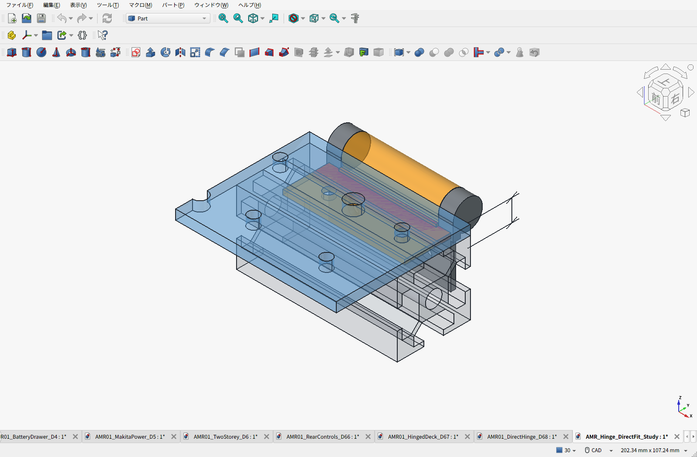
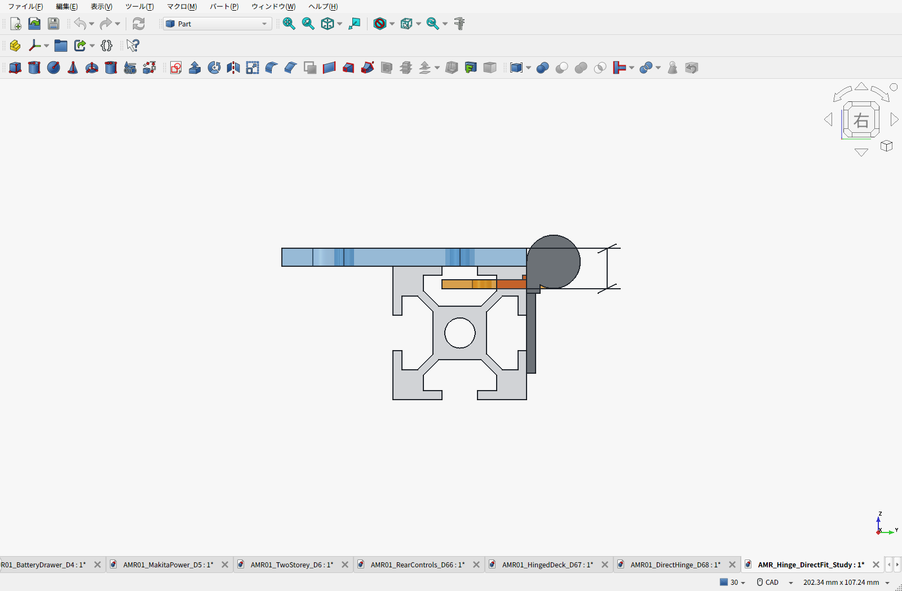

# 追加接続金具を省くトルクヒンジの調査

確認日：2026-09-23。対象：D6.8の3030フレームと300×300×4mmアルミ天板。

**3030へ直付けできるヒンジは確認できた。一方、今の天板位置を維持し、天板側の接続金具まで省ける製品は採用確定に至っていない。** 「専用L金具が絶対必要」とする結論でもない。下表は再選定用の調査結果であり、新しい完成設計・購入リストではない。

## 条件と寸法

- フレームのT溝へ金属接触で固定する。樹脂製のヒンジ支持や長いスペーサーを使わない。
- 天板の高さ・積載面積・格子穴をできるだけ保ち、閉鎖中の荷物は天板からフレームへ伝える。
- 空天板の開閉だけを保持対象とする。現行D6.8は1.201kg、最大重力モーメント1.621N·m。候補変更後は可動部の重量・重心を再計算する。
- 開き止めを追加しない。初期保持トルクだけでなく、使用角度・メーカーの取付条件も照合する。
- 個人調達と費用を優先する。Amazon掲載があってもPrime対象・送料・品番が未確認なら確定しない。

上段3030の上面はZ229、外側T溝中心はZ214。天板はZ229〜233なので、**T溝中心から天板上面までは19mm**。平型ヒンジを外側溝に固定し、可動葉を内側へ水平に向ける配置では、軸と穴列の距離だけでなく、軸から取付面への距離も差し引く必要がある。

## 候補比較

価格は税込・ヒンジ2個分。メーカー掲載価格とAmazonでの購入観測価格を区別した。送料・締結材・新たな加工費は含まない。表示価格は完成取付費用ではない。

| 候補 | 2個の初期下限トルク | 2個分の価格と根拠 | 取付について確認したこと | 現時点の判定 |
|---|---:|---:|---|---|
| スガツネ HG-TP20 | 3.00N·m | 2,618円：D6.8のAmazon価格記録 | メーカーが30mm角フレーム対応を明記。現在も固定葉は直付け。可動葉を水平にすると取付面Z224、天板上面との差9mm | **金具だけを外す配置はCADで却下** |
| スガツネ HG-KNT16L/R | 2.56N·m | 5,500円：メーカー掲載、2,750円/個 | 30mm角フレーム対応の抜き差し型。横方向の穴列間隔32mm、軸と取付面の距離6mmで、同じ外側溝取付ではHG-TP20と同じ9mm差 | フレーム対応だけでは天板側金具を省けない |
| スガツネ HG-TA20L/R | 3.20N·m | 2,860円：メーカー掲載、1,430円/個 | 両側が折曲げ足で、保持力と価格は候補になる。ただし固定足の2穴は軸に直角方向へ13mm間隔。同じ横T溝へ2本とも締結する配置には合わない | 取付方向・支持面の変更が必要。現行配置への直付けは未成立 |
| スガツネ HG-TB20L/R | 3.20N·m | 3,080円：メーカー掲載、1,540円/個 | 片側が折曲げ足、反対側が軸に直角の立ち上がり板。立ち上がり板の穴方向と平らな天板の穴方向は一致しない | L字に見えるだけでは選定できない。現行配置への直付けは未成立 |
| スガツネ HG-TMH1530-CR | 軸A：2.40N·m、軸B：4.80N·m | 12,100円：メーカー掲載、6,050円/個 | 軸間14mmの二軸型。各軸のトルクは足し合わせない。二軸の動作順序と両取付面の位置を合わせる必要がある | 組付け未検証。価格面でも優先度は低い |
| タキゲン B-158-1 | 出荷設定で2.192N·m | 未確認 | 一体の曲げ足を持つ調整型。固定穴列と軸の距離15mm、曲げ足の外面と軸の距離10mm。軸の上下・取付面の向きを含めて配置する必要がある | 現行位置へ無加工で置き換える根拠は得られていない |
| 栃木屋 TH-144-1A | 2.34N·m | 2,080円：メーカー通販、1,040円/個 | アルミケース＋金属曲げ足。固定穴列と軸の距離20mm、可動足の外面と軸の距離10mm | 安価だが取付面の段差が現行天板に一致せず、採用未確定 |

初期下限トルクはメーカー公表値から計算した比較値。使用後の保持力や取付強度を認定する値ではない。HG-TA/TBは左右一対、HG-KNTは抜き差し方向も組立時に検討する。

## CADで確認した不適合

現行HG-TP20の固定葉・フレーム・天板をそのまま使い、可動葉だけを水平に回した。専用L金具は表示・モデルに含めていない。

`可動葉の取付面 = T溝中心214 + 穴列から軸まで16 − 軸から取付面まで6 = Z224mm`

天板上面Z233とは9mm違う。再構成した公称CADでは、**可動葉と3030の重なりは714.8mm³**。穴を追加するだけでは直付けにならない。[計算結果](fit_result.json)

青が天板、灰色がフレーム、橙が水平にした可動側、赤が重なり。表示は一か所を切り出した取付検討用モデル。メーカーSTEPではなく、D6.8の公開寸法図に基づく公称形状を使用しており、葉厚2mm等の仮定がある。**この検査は一つの配置案を却下したもので、直付け製品全般が存在しないことを証明したものではない。**

[検討FCStd](AMR_Hinge_DirectFit_Study.FCStd)／[生成スクリプト](build_fit_study.py)／[実画面取得スクリプト](capture_fit_study.py)

## 費用への判断

D6.8の比較基準は、ヒンジ2個2,618円＋専用L金具2個63.38USD。記録済み換算157.26718886円/USDで、**ヒンジと金具の小計は約12,586円**。うち金具は約9,968円、約79%。[既存の実加工見積・証拠](../direct-hinge/MACHINING_QUOTE.ja.md)

これは天板・送料・締結材を除く同じ範囲の比較。専用金具を省く価値は大きいが、安いヒンジ本体を見つけただけで削減額を確定しない。二軸型のメーカー掲載価格は2個12,100円で、現行のヒンジ＋金具との差は約486円にとどまる。Amazonにはより安い掲載もあったが、品番・送料・Prime条件を揃えた購入価格としては未確定。

**調査結果：完成配置が確認できた代替品はまだない。** 固定側の直付けと、天板側を含めた接続金具の省略を両方満たすことを、今後の選定条件にする。現行D6.8のCAD/BOMは置き換えていない。

## 一次資料

- HG-TP20：[メーカー製品ページ](https://search.sugatsune.co.jp/product/g/gHG-TP/)／[寸法図・30mmフレームへの取付](https://www.sugatsune.com/content/site-assets/201B_PDF/HGTP-Hinge-042020.pdf)／[Amazon商品](https://www.amazon.co.jp/dp/B08PYP16SL)／[D6.8価格観測](../direct-hinge/research/HGTP20-price.png)
- HG-KNT：[メーカー製品・価格・CAD案内](https://search.sugatsune.co.jp/product/g/gHG-KNT/)
- HG-TA：[メーカー製品・価格・図面](https://search.sugatsune.co.jp/product/g/gHG-TA/)
- HG-TB：[メーカー製品・価格・図面](https://search.sugatsune.co.jp/product/g/gHG-TB/)
- HG-TMH：[メーカー製品・価格](https://search.sugatsune.co.jp/product/g/gHG-TMH/)／[寸法図](https://www.sugatsune.com/content/page-files/HG-TMH-Catalog-Page.pdf)
- B-158：[メーカー寸法・仕様](https://cad.takigen.co.jp/pdf/catalog/27208910100.pdf)
- TH-144：[メーカー通販](https://tochigiya.jp/shop/g/gTH-144-1A/)／[寸法・仕様](https://tochigiya.jp/pdf/TH-144.pdf)

上記以外にHG-TS、HG-IT、HG-TU/TUWA/TQU、タキゲンのB-1109/1159/1209/1509、BP-150/148などの寸法資料も確認した。価格・強度・取付を総合して採用できる根拠には至っていないため、比較表の採用候補とは分けた。
