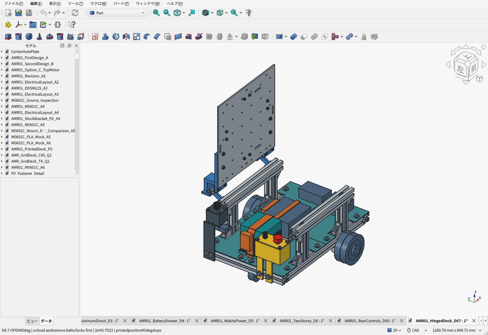
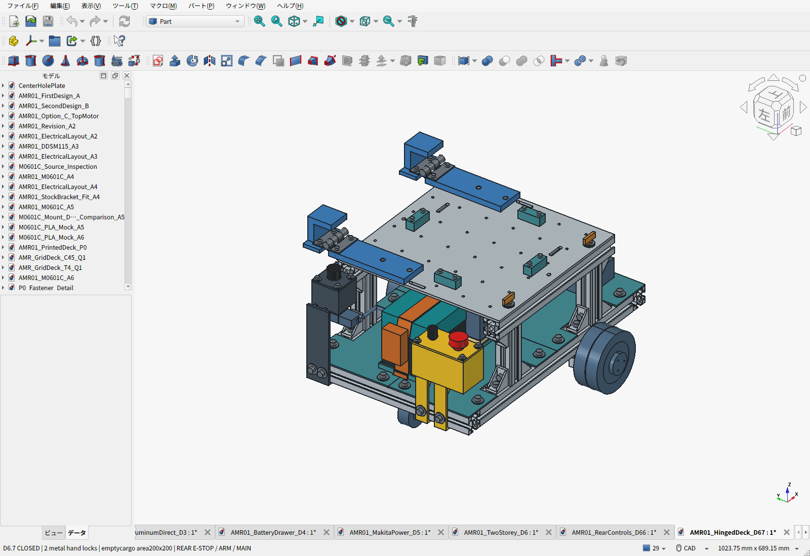
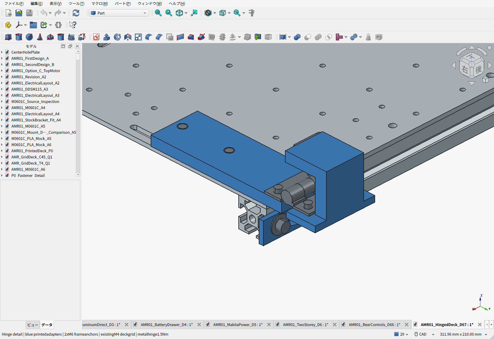
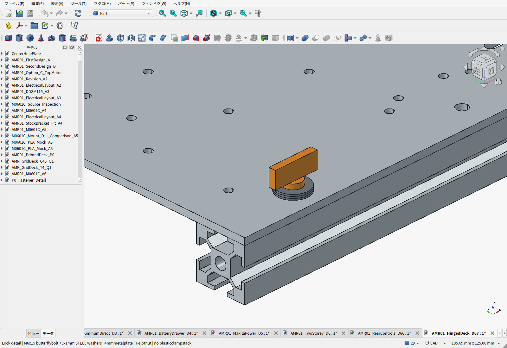
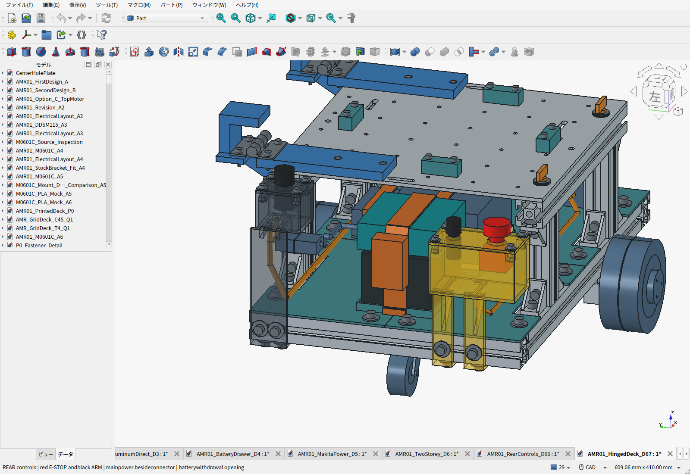
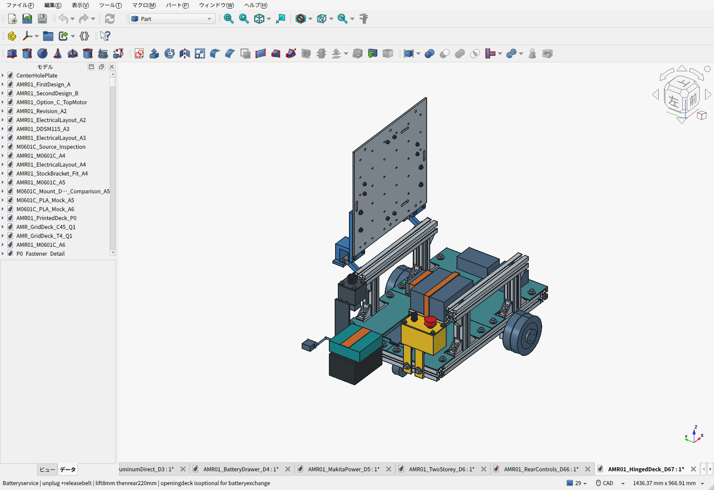
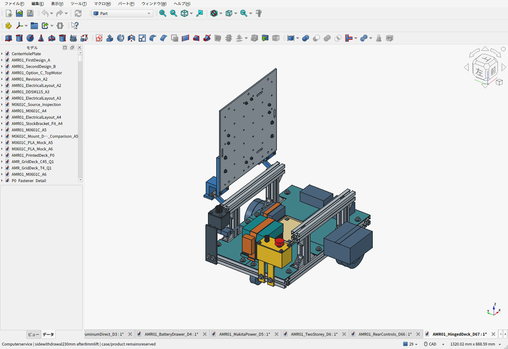

> **旧D6.7：現行は[D6.8](../direct-hinge/README.ja.md)。本案のPLAヒンジ支持・開き止め・操作部の片持ち支持は不採用です。以下は変更履歴として保持しています。**

# D6.7：開閉するアルミ天板・後方操作部

**アルミ天板を横へ0〜90°開き、工具なしのM6蝶ボルト2本で閉鎖固定する構成へ変更した。非常停止・ARM・主電源は後ろ側。** 天板の300×300×4mm、上面233mm、元の加工形状を維持する。追加フレーム・金属穴加工は不要。

**[BOM概要](BOM.ja.md) ／ [全明細Markdown](BOM-details.ja.md) ／ [CSV](BOM.csv)** — 車体推計**10.927kg**、途中小計**約102,882円＋未計上分**。

[FreeCAD画面による開閉GIF](cad-opening.gif)。これはCADの配置アニメーションで、動力学・強度・実機試験ではない。

## 開閉の構成と設計理由

| 部位 | 採用内容 | 理由 |
|---|---|---|
| 天板 | 既存6061-T6、300×300×4mm | 見積済みの板・格子穴をそのまま使う |
| ヒンジ | スガツネHG-TS15×2、各1.5N·m | 保持トルクと初期公差が公開され、Amazonで単品購入可能 |
| ヒンジ方向 | +Y側、軸X方向、中心X=±126／Y=172.5／Z=249.5mm | 上段側面の溝へ固定でき、前側へ追加する横フレームが不要 |
| 可動側アダプター | PLA、各2本のM4で既存格子穴X=±125／Y=35,85へ固定 | 荷物の200×200mm領域と既存ベルトを避ける。φ4.5の通し穴を維持 |
| 固定側アダプター | PLA、各2本のM6で3030外側溝へ固定 | 左右に離した金属ボルト・溝ナット。既存天板から4組を移して利用 |
| 閉鎖ロック | M6×15蝶ボルト×2、X=±105／Y=−135mm | 金属板を金属レールへ直接締める。1本につきt1鋼製座金3枚で突出8mm、溝底余裕1mm |
| 開き止め | 固定アダプターに90°ストッパーを一体化 | 90°より先へ回して配線や取付部を傷めないため。無理に押し込む用途ではない |

ヒンジは**空の天板を保持する部品**。閉じたときの下向き積載荷重は、従来の2本のアルミレールへ面で伝える。荷物は元の固定ベルトで保持する。PLAのヒンジ取付部だけで荷物15kgの衝撃を支える設計とは扱わない。

中央の200×200mm荷物外形とベルトのCAD干渉は解消済み。格子穴36個のうち、アダプター取付に4個を使い、同じ列の2個を覆う。残る30個の格子穴は形状として残るが、実際の追加機器は工具空間・天板の開閉荷重を再確認する。

## 保持トルクと使い方

メーカーの[HG-TS15仕様](https://www.sugatsune.com/stainless-steel-torque-hinge-hg-ts15/)と[寸法図](https://www.sugatsune.com/content/site-assets/501_PDF/HG-TS_HG-DTA.pdf)は、1個1.5N·m、初期公差−20%〜＋40%、1枚の扉に2個以上を示す。CADはこの寸法から作った公称外形で、ログインが必要なメーカーSTEPは取得していない。

空の天板・ストッパ・可動アダプター・締結材・ヒンジ可動側の推計は**1.302kg**。重力モーメントは水平位置で1.912N·m、重心が軸より低いため開き角6.2°で最大**1.923N·m**となる。ヒンジ2個の初期下限は2.4N·mなので、比較余裕は**1.25倍**。重い荷物を載せたまま保持できる値ではない。初期上限4.2N·mを含めた端部の開操作力は円弧の接線方向で約19N。

1. 平坦な床で停止し、主電源を切る。
2. 荷物と、天板をまたぐ固定ベルトを外す。
3. 蝶ボルト2本と座金を外し、無くさない場所へ置く。現版のロックは脱落防止式・鍵式ではない。
4. 天板の−Y側を持ち、0〜90°で開く。取付ストッパーより先へ押し込まない。
5. 閉じて金属レールへ着座したことを確認し、2本を締め、荷物とベルトを戻す。

ヒンジは速度を抑えるダンパーではなく摩擦保持用。経年・温度・造形のクリープを実機で確認する。理論上の追加固定物の余裕は中心位置で約0.28kgしかないため、天板へ計算機や重い機構を常設して開く場合は再選定する。開放状態で走行しない。蓋開検知の電気インターロックは未実装。

## 後ろ側の操作と整備

非常停止XA1E-BV302Rはパネル中心`[-213,-119,206]`、黒ARM3212は`[-213,-71,206]`、主電源3214は`[-203,+120,237]`。前進は+X、後ろは−X。後ろの中央は電池口として残す。[ケース固定・配線経路](../control-layout/README.ja.md)。

電池は8mm上げて後方220mm、計算機は8mm上げて側方230mm抜く既存経路を維持。電池の通常交換は天板を閉じたままでも行える。1階の計算機・回路に上から触るときに開閉天板が役立つ。

## 追加費用

| 開閉天板化による追加 | 金額 |
|---|---:|
| HG-TS15×2 | 2,344円 |
| M6蝶ボルト18個パック（使用2） | 527円 |
| M4ナットの追加20個パック | 273円 |
| M4座金の追加20枚パック | 430円 |
| PLA材料消費参考 | 614円 |
| **D6.6からの小計増** | **4,188円** |

M4×16は予定60本、M6座金は予定30枚の余りを使い、ヒンジ用M6ボルト4本・溝ナット4個は旧天板固定から移す。購入パック全額を計上し、使用数で安く見せる按分をしない。新しいヒンジ部PLAは中実CADで約307g。印刷の支持材・失敗・電力・工賃は別。

[Amazon送料込み比較・証拠](../control-layout/PROCUREMENT.ja.md)。Pico流用と購入先変更による1,313円減は別に反映済み。モーター14,000円等の旧仮予算、未計上の計算機・専用基板・配線などは残るため、102,882円を完成車の確定価格とは扱わない。

## 検証範囲

[CAD検査](validation.json)は新旧の実体干渉、機器・荷物・ベルト、電池交換、0〜90°の連続した開閉包絡、操作工具、ロックに触れる空間を確認する。新たな形状に関係する組み合わせを再検査し、既存物は元の検証済みCADとの全BRepトークン比較で継承を確認した（数値丸め許容1e−10）。軸付近は回転半径の解析も使い、単なる数コマの画像確認とは分けた。

購入品の実寸、印刷強度・クリープ、ねじ緩み、過大な開操作力、回路実装・停止動作の確認は残る。**印刷ファイルは試作版**。旧D6.5床FEMは床の検討として残すが、旧6点締結の天板FEMを新しい2ロックの強度証明には使わない。[重量・荷重・天板の計算範囲](PAYLOAD_REVIEW.ja.md)。

[FCStd](AMR01_HingedDeck_D67.FCStd)／[機器外形付きSTEP](AMR01_HingedDeck_D67.step)／[構造STEP](AMR01_HingedDeck_D67-structure.step)／[印刷部品一式ZIP](D67-print-prototypes.zip)／[保存物再検査](saved_artifact_validation.json)。

## 再生成

FreeCADの独立プロセスで`../control-layout/build_controls.py`→`build_hatch.py`を実行する。元のD6.5組立は変更しない。FreeCAD GUIで`capture_screens.py`を実行すると、実画面8枚・開閉用10コマを保存し、閉鎖状態へ戻してFCStdを保存する。未保存の編集がある文書は上書きせず、退避してから実行する。

通常Pythonで`make_animation.py`、`check_design.py`、`sync_electrical.py`、`build_bom.py`、`../two-story/build_bom_view.py cad/amr07/hinged-deck`、`build_docs.py`を実行する。`build_bom_view.py`の引数はリポジトリルートからのパス。D6.6側BOMの変更時は、そのフォルダの`build_bom.py`も先に実行する。

最後にFreeCAD独立プロセスで`validate_saved.py`、通常Pythonで`../two-story/release.py`→`release.py`を実行する。[成果物のSHA-256一覧](release_manifest.json)で、ネイティブCAD、STEP、18個の印刷部品、検査・価格証拠・BOMの対応を確認できる。スライス済みデータや完成ハーネスは含まない。
