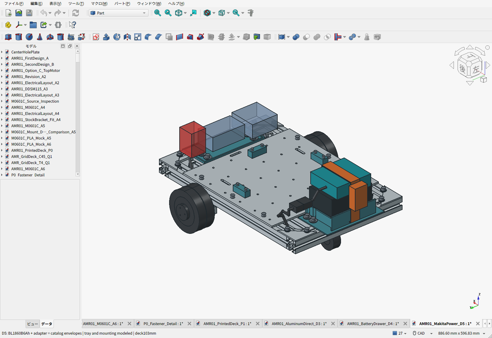
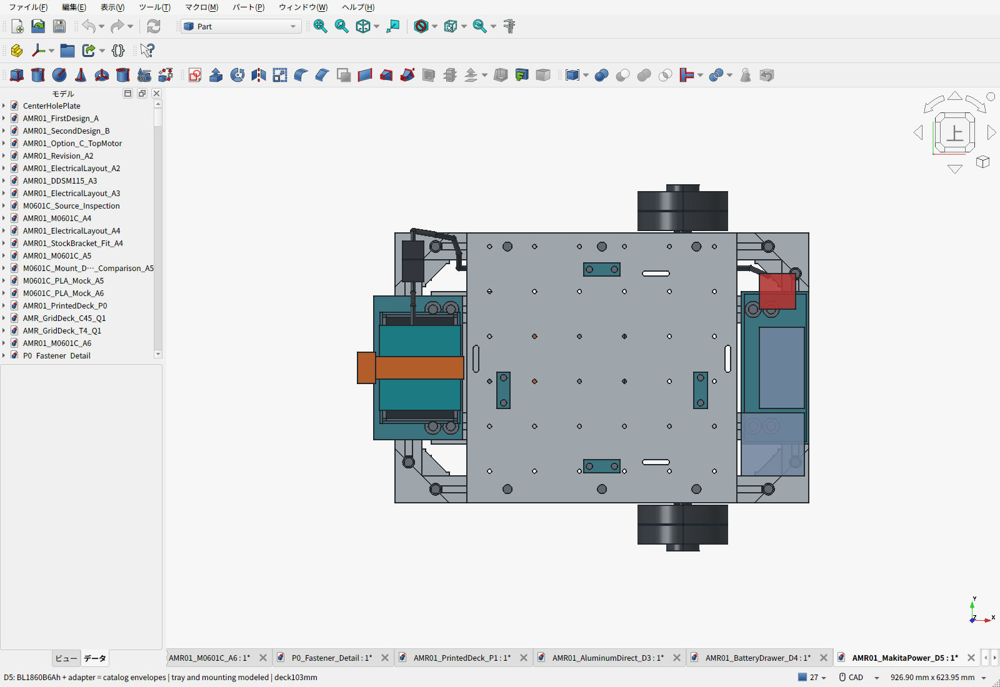
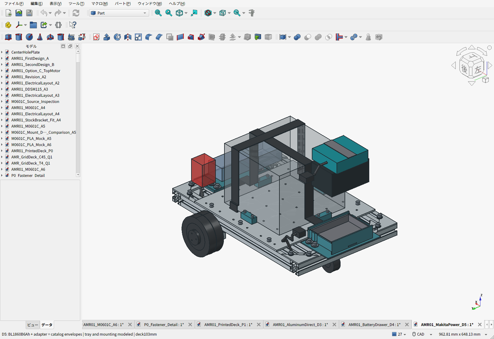
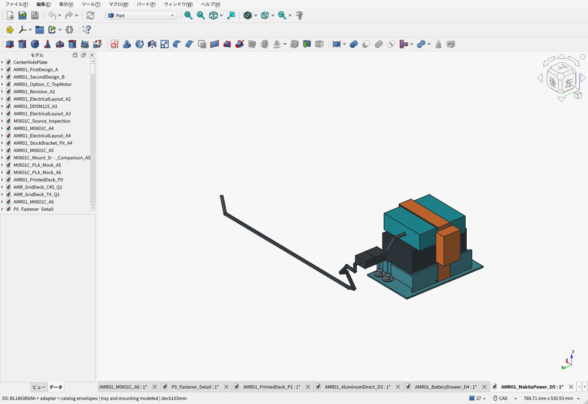
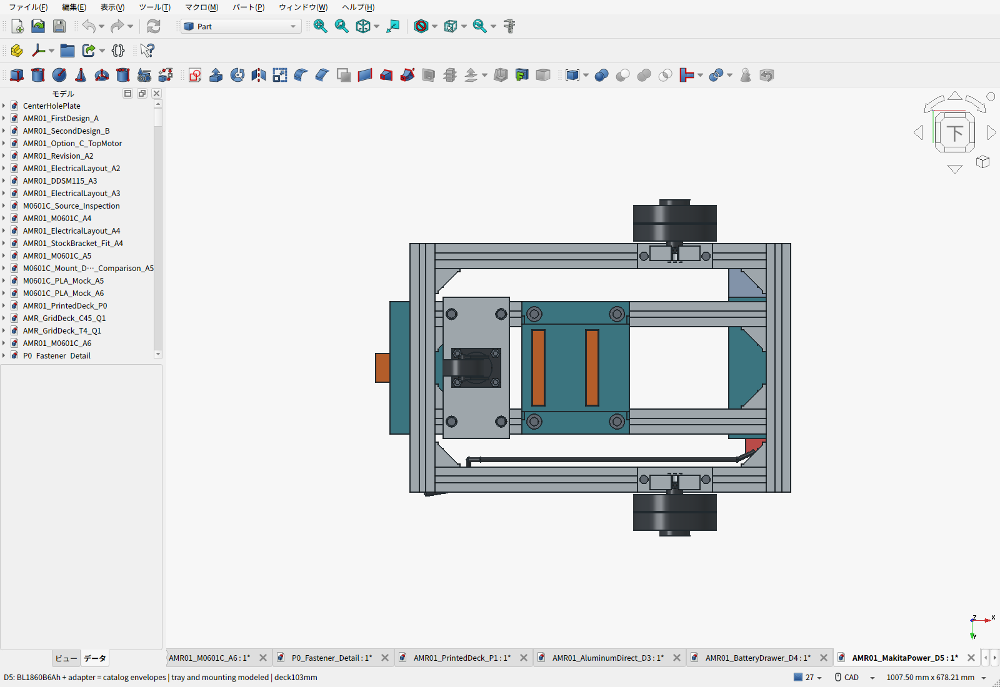

# D5：マキタ18V電源と、天板を外さない後端交換

> **配置は[D6：1階電装・2階荷台](../two-story/README.ja.md)へ更新済み。** 以下のD5配置は履歴。電池・充電器・アダプターの選定はD6へ引き継ぐ。

2026-09-22。**純正BL1860B（18V・6Ah）＋純正DC18RF充電器を選定した。** ユーザーは電池・充電器とも未所有なので、両方を新規購入費へ計上する。電池の厚さ36mmというD4の条件は撤回した。電池を後端へ、計算機を低い中央区画へ移し、300×300×4mmの格子穴アルミ天板を床上103mmで使う。

黒い部分がBL1860B、青緑の上部が接続アダプター、橙が保持ベルト。**電池・アダプターは公開寸法による外形包絡モデルで、メーカーの嵌合CADではない。** 小さい青色の透過箱は未選定の電装予約。印刷する受け、ねじ、座金、溝ナットは形状を入れている。

## 電源の選定と費用

| 品目 | 選定・条件 | 税込表示額 |
|---|---|---:|
| 電池＋充電器 | 純正BL1860B A-60464 ×1＋DC18RF JPADC18RF ×1、新品セットばらし・化粧箱なし | 19,800円 |
| 上記送料 | 販売ページの東京都表示 | 600円 |
| 電源アダプター | Netkey `diy-adapter03`、14AWG線・スイッチ・ヒューズ付き | 2,180円 |
| アダプター送料 | 販売ページの東京都表示 | 800円 |
| **選定した電源部品の小計** | 電池・充電器・アダプター＋上記送料 | **23,380円** |

出典は[高橋本社の純正セット](https://store.shopping.yahoo.co.jp/takahashihonsha/0088381464031-0088381523394-s.html)、[ネットキーのアダプター](https://store.shopping.yahoo.co.jp/netkey-store/diy-adapter03.html)。2026-09-22確認。ポイントを引かず、ユーザー住所での送料・最終納期は未確認。購入はしていない。アダプターは発送予定のある商品なので、即納扱いにはしない。

比較した[純正3Ah＋DC18RFセット](https://store.shopping.yahoo.co.jp/esuwantool/bl1830b-dc18rf-1.html)は17,860円＋送料756円＝18,616円。今回見つけた6Ahセットは**差額1,784円で電力量が2倍**なので6Ahを採る。市場全体の最安値という意味ではない。薄型ラジコン電池は、容量と充電器・保護の総費用を解決しないまま36mmへ合わせる案になっていたため、現行案から外した。[選定情報と比較記録](power_selection.json)。

BL1860Bは[マキタ公式](https://www.makita.com.hk/en/products/detail/1028/)で113×75×62mm・108Wh・0.66kg。[NZ公式](https://www.makita.co.nz/products/model/BL1860B)の0.68kgを大きい側の質量枠として使う。国内購入品の実測前で、地域型番の外装差まで保証された寸法とは扱わない。DC18RFによる6Ahの満充電は[日本公式](https://www.makita.co.jp/product/detail/?gmodel=HR182D_DV)で約40分。充電器は車体へ載せない。

108Whの80%を使えるという仮定なら、平均消費60Wで約1.44時間、80Wで約1.08時間。使用時間は実測前。モーター2台の定格入力を18V×1.25A×2＝45W、拘束時比較を97.2W、補機枠25Wとしており、運転中に常にその値になるという意味ではない。

## 配置をこの案にした理由

| 比較案 | 取り出しやすさ・天板 | 重心・製作上の判断 |
|---|---|---|
| 従来の下側横引出し | フレーム下面69mmと床上25mmの間は44mm。電池単体の厚さ62mmも通らない | D4の薄さ条件は不採用 |
| 前端の縦置き | 車軸やキャスターを避けて低く置けるが、電池＋アダプターの厚さ方向で約92mmを使い、天板を約50mm後方へ移す検討が必要 | 荷物位置・ストッパ・ベルト位置・前方電装をまとめて変更する負担が大きい。今後の比較候補 |
| **後端の上向き交換：採用** | ベルト1本とコネクタを外し、電池＋アダプターを一緒に上へ抜く。天板と荷物を残せる | 計算機を床上30〜70mmへ下げて重心上昇を抑える。小さい印刷部品2点で対応 |
| 既存3030の上を横に通す箱型 | 92mmの組電池をフレーム上99mmより上で横抜きし、5mm余裕と4mm板を加える具体案では天板約200mm | 現案103mmより97mm上がる。10kgの荷物も同じだけ上がるので今回は選ばない。フレーム構成を変える箱型全般が200mm必要という意味ではない |

電池本体はX=-240〜-165、Y=±56.5、床上112〜174mm。アダプターは約95×90×30mmを向きを変えて上へ配置し、嵌合で重なる高さを差し引かず上端204mmで検査した。天板端からアダプターまで7.5mm、ベルトまで3.5mm。後端バックル包絡がフレームより42mm出るため、CAD上の前後外形は約502mmとなる。フレーム自体は460×300mm。

公称外形だけでは実際の嵌合位置やスイッチの位置まで決まらない。購入した電池とアダプターを通常どおりラッチでつなぎ、全体の外形、配線出口、ヒューズ・スイッチの操作場所を確認する。特に天板側へ寄るずれは、CADの7.5mm余裕以内か確認する。既製アダプターの穴位置を推測して取付穴を作る構成にはしていない。

## 固定と交換

1. 平らな床で停止し、主電源を切る。
2. 後端の主コネクタを切り離し、車体側の線を抜出し経路からよける。
3. 後端のカムバックル付きベルト1本を開き、電池上からよける。
4. 電池＋アダプターを一緒に持ち上げる。CADでは140mm持ち上げる全経路を検査した。交換のためのねじ脱着はない。
5. 車外でアダプターを電池のラッチから外し、DC18RFで充電する。

電池受けは底で重量を受け、側面の軟質パッドで位置を決め、ベルトで浮上りを抑える。ベルトは受けの座面下の通路を通る。[メーカー資料](https://www.fujiwarasangyo-markeweb2.com/DispDetail.do?itemID=t000100214475&volumeName=00017)はベルト一式125g・外形奥行き18mmなので、重量は未切断125g、バックルの厚さは余裕を付け20mmで見込む。パッド25gと電装ベルト等30gを加えて0.18kgを計上した。電池の回りだけに巻いているわけではない。バックルと余長は後端側に置く。電池の外装・端子へねじを押し当てず、アダプターの改造も行わない。1本のベルトは電池とアダプターの両方を保持するが、実物のスイッチや通風口を塞がない位置への調整が必要。

3030との接続は従来の後電装トレイ用M6ボルト・大径座金・溝ナット4組を使う。座面下の2列×2点で固定し、後横材でも底を支持する。追加の金属穴加工はない。ねじ頭・座金が側壁へ当たらない逃げを設けた。後端42mmの張り出しに電池全重量を片持ちする構造ではない。

主電源線は後端のコネクタからフレーム内側の通路を通し、荷物固定ベルトを避けて前の電源分配区画へ回す。CADの配線は直径6mmの経路包絡で、圧着端子、曲げ半径、結束・引張り止め、ヒューズや基板の実装完成図ではない。

## 重量・重心・輪荷重

| 質量項目 | 見込み |
|---|---:|
| BL1860B | 0.680kg |
| 接続アダプター | 0.123kg |
| 保護・電源変換／計算機／配線／監視の既存枠 | 1.350kg |
| 新しい電池受け・低位置電装受け | 0.249kg、中実PLA換算 |
| 電池・電装の追加ベルト・パッド枠 | 0.180kg |
| その他の骨格・天板・足回り・保持部品等 | 約5.971kg |
| **車体合計** | **約8.553kg、10kgまで約1.447kg** |

旧D3の電池0.75kg枠と旧印刷2部品0.175kgを引いてから追加しており、電池・充電器や旧受けを二重計上していない。充電器は車外。実測重量ではなく、電装の枠と中実CAD重量を含む見積もりである。[質量差分の計算](validation.json)。

計算機0.50kgは中心高さ126→50mm、監視部0.05kgは127→52.5mmへ移した。旧D3重心高さを85〜110mmと仮定すると、D5は約89.6〜113.7mm、差は約3.7〜4.6mm。実重心を算出できたという意味ではない。箱案で10kgの荷物を97mm上げると総18.55kgの重心はそれだけで約52.3mm上がるため、今回は電池だけの後端区画を選ぶ。

前後重心の条件付き範囲は約-20.48〜-1.20mm。以前の±10mmをそのまま合格扱いにせず、現行の受入れ範囲を**前後±25mm・左右±10mm・高さ115mm以下**へ見直して輪荷重を再計算した。荷物重心は前後左右±30mm・高さ220mm以下を維持する。

再計算では平地10kg積載の最小接地反力22.32N、駆動輪最大89.53N。構造15kgでは駆動輪最大109.83N。キャスターはトレール公差を含む最大130.02Nで、カタログ許容300Nとの比較を行った。正の反力やカタログ値以内という結果は、摩擦・衝撃・熱・車体SF2の認定ではない。[現行の荷重計算](../load_calculations.json)／[キャスター公差確認](../caster_load_check.json)。

## CAD・印刷・電気の確認範囲

208物理部品と電源・電装・荷物・ベルト・配線包絡を検査し、公称の体積干渉は0。電池の上方140mmは保守的な連続包絡で検査し、保存ファイルを開き直して10mm刻みでも確認した。キャスター旋回、タイヤ外向き交換、格子穴36点のねじ領域、指のアクセス用包絡も検査した。[検査](validation.json)／[保存物の再検査](saved_artifact_validation.json)。

交換する印刷部品は電池受け99×160×36mmと低位置電装受け130×160×44mmの2個。P1Sの256mm造形範囲に収まり、保存STLは閉じたメッシュとして確認した。造形向きは底面を下にする候補。電池受けの座面下・ベルト通路はサポートやブリッジの処理をスライサで確認する。旧D3の前トレイと荷物ストッパ4個は継続使用する。

PLAはまずダミーで仮合わせする。電池＋アダプター＋受け・ベルト等を最大1.1kgとして、2g相当×係数2を切り上げた**45N**を上下・前後・左右へ加える保持試験、50回の交換、想定温度で24時間の保持・クリープ確認を行う。これは試験計画で、合格実績ではない。計算機ケースと冷却も実機器決定後に確認する。

**電池・充電器・接続アダプターの選定と、電源保護回路の完成は別工程。** 選定アダプターで純正工具と同じセル・温度・低電圧保護が働く根拠は得られていない。車体側で警告17.5V、停止要求17.0V、独立全負荷遮断16.5V、再投入18.0V以上＋手動ARMを初期設計値とし、セル・温度保護の成立と実負荷遮断を確認する。総電圧だけでは各セルの保護を保証できない。付属30Aヒューズを今回の小ハーネスの保護根拠とせず、主ヒューズ10Aを出発点に協調を確認する。回生は既存D0・車体側クランプへ流し、電池への回生充電は想定しない。[電源設計の更新](../ELECTRICAL_AND_VALIDATION.ja.md)。

## 全車費用とファイル

途中小計は**69,633円＋120.90USD＋未確定分**。既存の予算枠を含み、参考為替157.2671889円/USDでは約88,650円。保護回路、コネクタ、計算機、未価格の締結材、送料差額・税・決済料・工賃等が残るので、完成車の購入総額ではない。[全車BOM](BOM.csv)／[小計と未確定品](cost_summary.json)。

アルミ天板のSTEP/PDFとモーター金具を変更していないので、既存の実加工見積をそのまま参照できる。新しい取付部は印刷品で、新規CNC加工費を推定で追加していない。天板の見積済みSHA256と組立内形状の一致も再確認した。

- [組立FCStd](AMR01_MakitaPower_D5.FCStd)
- [構造部品STEP](AMR01_MakitaPower_D5.step)／[電池・アダプター外形包絡入りSTEP](AMR01_MakitaPower_D5-with-power-envelopes.step)
- [交換する印刷2部品ZIP](D5-power-print-files.zip)
- [電源の選定記録](power_selection.json)／[寸法・方針](parameters.json)
- [継承するD3天板と実見積](../aluminum-direct-deck/README.ja.md)

再生成はFreeCAD Pythonで`build_d5.py`、通常Pythonで`build_bom.py`、FreeCAD GUIで`capture_screens.py`、FreeCAD Pythonで`validate_saved.py`、通常Pythonで`release.py`。D3元CADはコミット`099686bacaad0f72e8bc4ce15005cd708a5b2f83`へ固定している。
