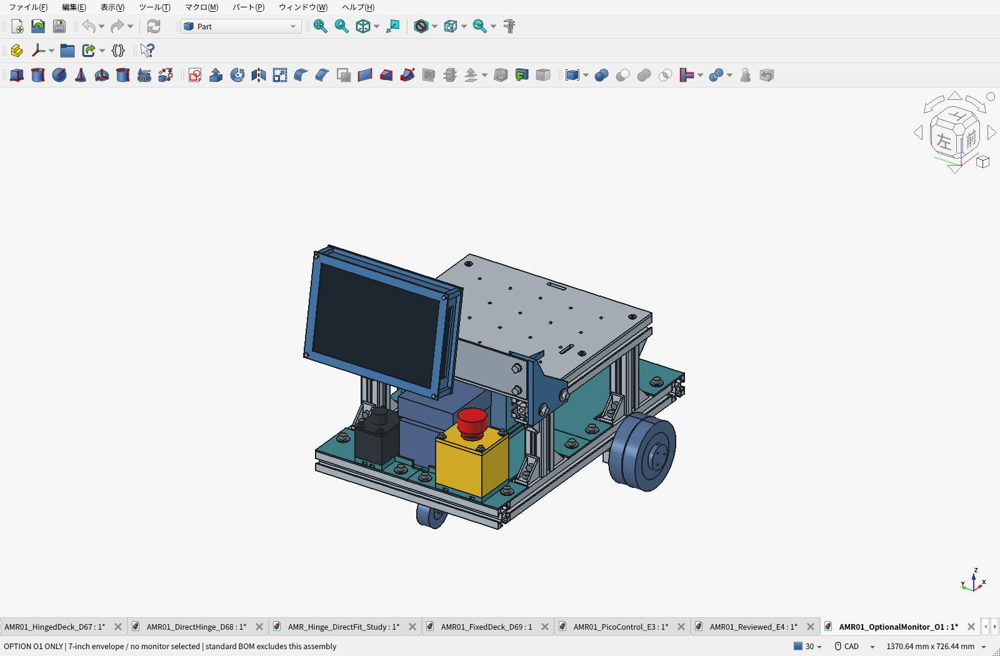
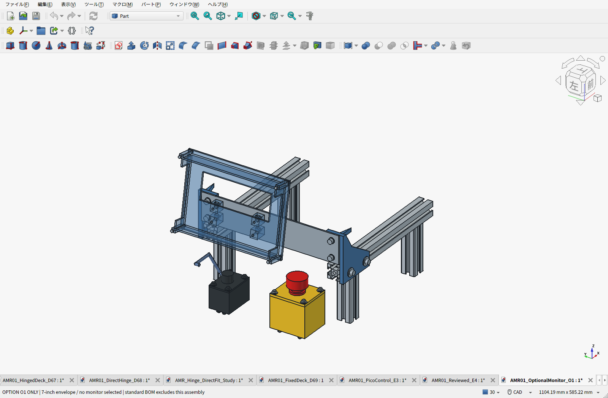

# O1：着脱式7インチモニターのオプション案

**標準装備ではない。標準E4のCAD・BOM・電源予算にはモニターも取付部品も含めない。** このフォルダだけがモニター付き構成。現時点は機種未選定の取付モックで、購入・加工確定版ではない。

画面は後ろ向きで上へ10°傾け、左右中心から主電源側へ65mm寄せる。赤い非常停止の上方と後方に手の進入空間を残す。想定モニターは**外形200×135×30mm以内、質量0.60kg以下**。この寸法と質量は設計条件で、特定商品の実寸ではない。例えば[Waveshareのケース付き7型HDMI製品](https://www.waveshare.com/7inch-HDMI-LCD-H-with-case.htm)のようなHDMI/USB方式を調達候補とするが、同製品がこのケースへ入ると確認したわけではない。Amazon Primeの型番・価格は未確定。

## 固定方法

左右の上段3030の外側溝へ各2本、計4本のM6×18で支持部を取り付ける。4個の追加HNTT6-6は標準BOMの余りを勝手に流用せず別計上。先入れナットなので、初回は天板を外してレール端から入れられる組立順を確認する。

左右のPLA支持部を、300×60×3mmのアルミ平板で連結する。平板はφ6.6を4穴、φ4.5を4穴とし、切断・穴加工・バリ取り済みで依頼する想定。中実角棒の自宅加工は求めない。製造費は未見積。左右の支持部から既存フレームへ荷重を流し、荷台板へモニター重量を載せない。

モニターはPLAの受けと着脱式前枠で**製品ケースの縁**を保持する。ガラスへ締付荷重をかけない。開口・端子・通気口・ケース縁は購入機種に合わせて修正するため、現STLは仮合わせ用。4個のPLA部品は最大220mmでP1Sの造形範囲内。

## 電源・整備・荷重

映像はLinux PCのHDMI、タッチを使う場合はUSBを接続する。電源は選定品の指定に従い、PCのUSB給電能力が足りなければ適合する完成済み給電部材をオプションへ追加する。18Vをモニターへ直結する前提ではない。最小手動走行には不要なので、未装着でも標準システムは成立する。

配線は主電源側の上段レールから支柱沿いに1階へ。CAD経路はガイドで、端子と曲げ半径の検証は未完。画面側とフレーム側で引張止めを設ける。着脱は電源を切り、HDMI/USB等を外し、左右4本のフレーム固定を外して一式を取り外す。**天板を持ち上げる際は、先にモニターオプションを外す。** 電池の通常交換は装着したまま可能な配置を確認した。

取付部のCAD推計0.667kg＋画面上限0.60kg＋配線/パッド枠0.08kg＝**追加最大約1.35kg**。標準車体との合計は約11.71kg。既存の通常総重量21.5kgの検討枠に収める場合、画面付きは積載**9.5kgを暫定上限**とし、画面なしの10kg条件と分ける。実秤量・重心・走行確認前。

追加部品18,225組で新規干渉なし。非常停止の上/後方、主電源後方、電池取り出し、25格子穴の短い取付空間を確認した。取付部は3g相当と画面への10N操作力を仮定して予備計算したが、印刷層方向・クリープ・衝撃・保持・実走行の試験は未完。持ち手として使用する設計ではない。

[専用BOM Markdown](BOM.ja.md) ／ [CSV](BOM.csv) ／ [FreeCAD](AMR01_OptionalMonitor_O1.FCStd) ／ [STEP](AMR01_OptionalMonitor_O1.step) ／ [取付平板STEP](OptionalMonitorBridge_300x60x3.step) ／ [PLA試作ZIP](O1-print-prototypes.zip) ／ [検証](validation.json)
