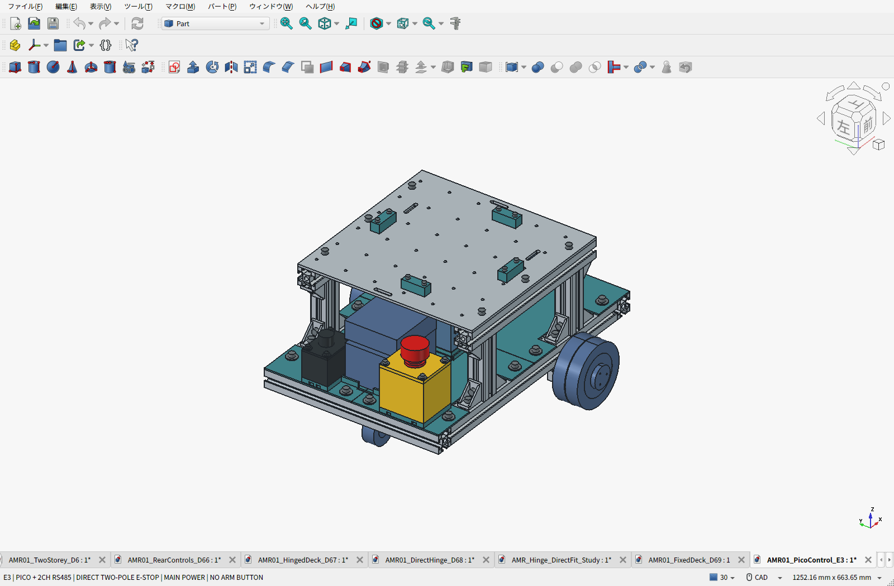
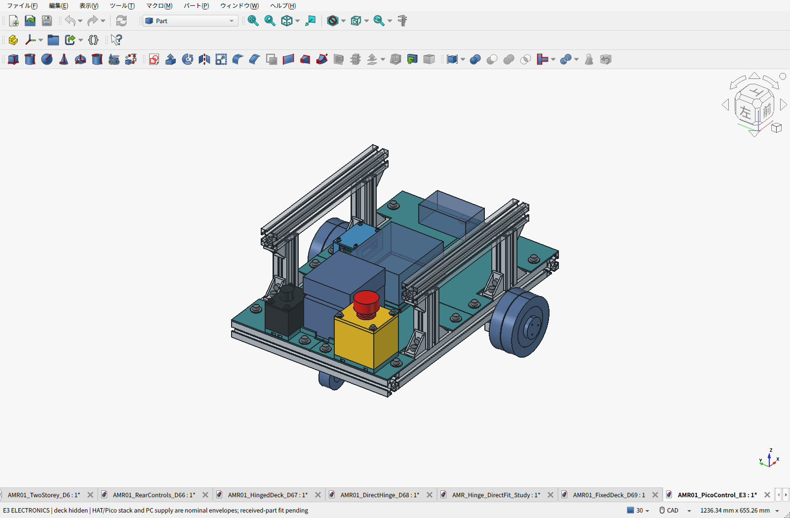
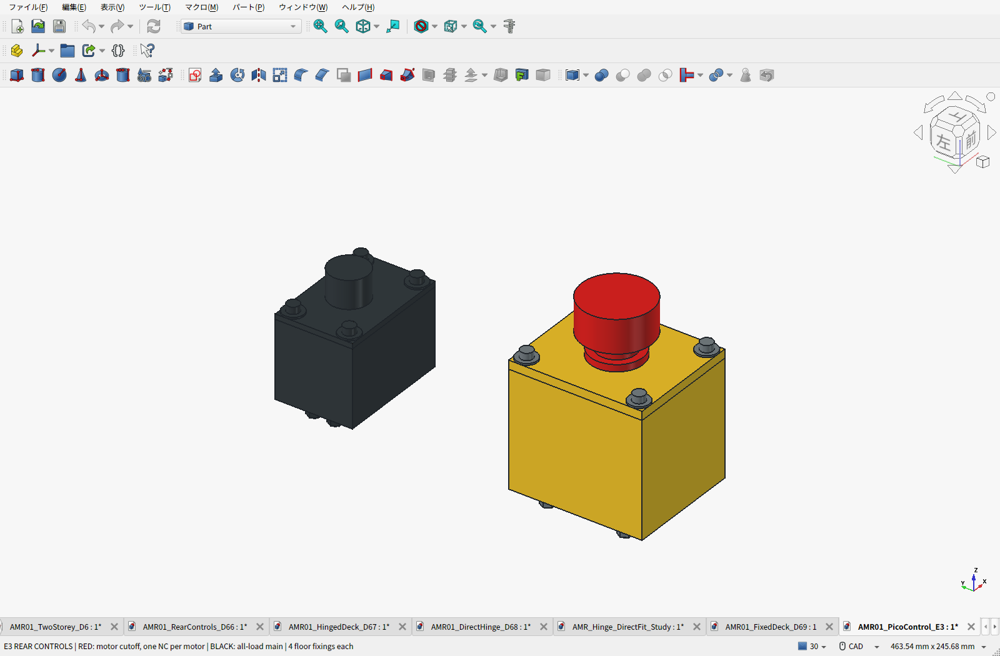
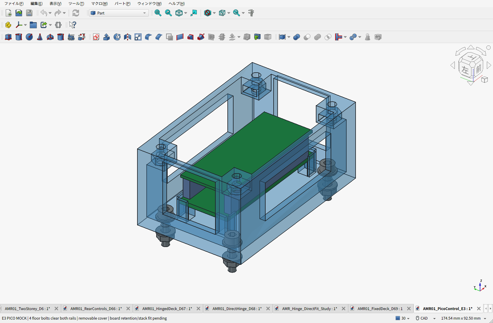

# E3：Pico＋2CH RS485と直接遮断の非常停止

2026-09-23。**車載LinuxミニPC → USB → 手持ちPico → 完成済み2CH RS485基板 → 左右M0601C_111** へ設計を更新した。二重リレー、外部監視基板、専用ARMボタン、別のUSB–RS485変換器は購入対象から外す。自作PCBやユーザーのはんだ付けを前提にしない。

[配線構成](WIRING.ja.md) ／ [BOMと費用割合](../fixed-deck/BOM.ja.md) ／ [全明細Markdown](../fixed-deck/BOM-details.ja.md) ／ [CSV](../fixed-deck/BOM.csv)

## 変更した配置

| 部分 | 構成と理由 |
|---|---|
| 後方の赤ボタン | IDEC HW1B-V402R、2NC・ねじ端子。1接点につき1台のモーター正電源を遮断する |
| 黄色の非常停止ケース | PLA床上の従来位置で4本のM4固定。66×76mm、箱高さ66mm、リブ付き5mm蓋。接点奥行49.4mmを確保 |
| 黒い主電源 | amon3214を維持。計算機を含む全電源を切る用途。ARMボタンではない |
| Picoケース | 床へ四隅のM3×12で固定し、蓋もM3×12を4本。取付ボルト・座金・ナットは下の3030に当たらない |
| 基板保持 | 樹脂の受け・横ガイド・蓋裏の押さえで保持するモック。金属座金を基板上へ直接当てない |
| Linux計算機と給電部材 | 1階に予約容積を確保。機種・コネクタ・冷却空間を含む実品形状は未確定 |

非常停止操作面の中心は後方X=−196、Y=−85、Z=180.4mm。赤い頭の最上点は212.4mmで、天板下面229mmより下かつ荷物範囲外。箱の底は床の座へ載り、4本で保持する。蓋には支持リブとケース側の受けを設けた。押下150Nの簡易梁計算は応力7.05MPa、たわみ0.189mm（PLA弾性率1800MPa・短期許容10MPaを仮定）。実際の印刷物の強度保証ではなく、試作後の押下・締結確認が必要。

## Picoケースと組立

ケース外形70×45×34.4mm。床固定位置はXY=(11,85)、(69,85)、(11,114)、(69,114)mm。床1枚にφ3.4穴を4か所追加した。床自体のフレームへの従来の4点固定は維持する。

床裏のナットへ手が届く段階でケースを固定し、Pico/HATを仮合わせして配線、最後に蓋を付ける。基板受けの横隙間0.3mm、蓋裏押さえとの上隙間0.2mmは公称の初期値。基板の部品・はんだ・ソケットに押さえが当たらないか、現物で確認して修正する。USBとRS485用の開口を設けたが、コネクタの実位置と曲げ半径は未検証。

[Waveshare公式](https://www.waveshare.com/wiki/Pico-2CH-RS485)の基板外形52.5×21mm、UART0 GP0/GP1・UART1 GP4/GP5を参照した。ユーザー提示の[Amazon商品](https://www.amazon.co.jp/dp/B0GKHKCZV3)は写真が同じとの申告を前提とし、回路改訂・積層高さ・部品配置は未確認。手持ちPicoのヘッダー実装有無も未確認で、未実装ならユーザーにはんだ作業を求めず、実装済み品または加工手配を選ぶ。

## 費用・重量・検証

- 非常停止は国内掲載2,387円＋表示送料780円＝3,167円を計上。取り寄せ品、送料は表示先条件の参考値で、Amazon Prime価格ではない。[掲載ページ](https://store.shopping.yahoo.co.jp/angelhamshopjapan/hw1b-v402r.html)
- 主電源621円は従来参考価格、手持ちPicoは0円。HAT、M3追加締結材、PC・給電部材、最終ヒューズ・配線は未計上。HATのAmazon表示価格は取得できていない。
- 計上済み小計75,452円＋120.90 USD＝参考94,466円。既存為替157.26718886円/USDを継承した途中小計で、完成車の総額ではない。
- 車体推計10.456kg、D6.9から機械部品で約72g増。未確定電装の重量枠は減らしていない。実測値ではない。通常積載10kg、車体設計枠11.5kg、静的比較積載15kg・安全率2を継承する。
- 変更部に関する17,125組で新規干渉なし。ねじ山省略による公称ボルト／ナットの重なり8組は記録して除外。電池の8mm持ち上げ＋後方220mm取り出し経路も新規干渉なし。
- 3030骨格、モーター金具、300×300×4mmの6点固定アルミ天板と36格子穴は元形状を継承。既存加工見積の対象形状は変更していない。
- 変更したPLA5部品と継承11部品、計16部品を試作パックへ収録。各STLは閉じた形状で、P1Sの256mm造形範囲内。スライス、実印刷強度、実配線、走行試験は未実施。

非常停止のDC定格だけでドライバーの突入適合まで保証しない。直接遮断構成は選定案であり、突入・遮断時過渡の確認が残る。ソフト停止と内蔵電気ブレーキは通電中の機能。電源断後の制動・坂道保持を約束しない。Picoファームウェアは[動作仕様](WIRING.ja.md)のみで未実装。

## データ

- [FreeCAD](AMR01_PicoControl_E3.FCStd) ／ [機器外形付きSTEP](AMR01_PicoControl_E3.step)
- [PLA試作16部品ZIP](E3-print-prototypes.zip) ／ [印刷部品一覧](print_manifest.json)
- [配置・重量](geometry.json) ／ [干渉と蓋の簡易計算](validation.json) ／ [保存物照合](saved_artifact_validation.json) ／ [配布ファイル照合](release_manifest.json)
- [変更元D6.9の機械設計](../fixed-deck/README.ja.md) ／ [継承した荷重計算](../fixed-deck/PAYLOAD_REVIEW.ja.md) ／ [加工見積](../fixed-deck/MACHINING_QUOTE.ja.md)

再生成はFreeCAD Pythonでbuild_e3.py、GUIでcapture_e3.pyのsetup/capture、保存後にcheck_e3.py、export_e3.pyの順。費用更新後、通常Pythonでrelease_e3.pyを実行する。STLは仮合わせ・評価用で、現物確認前の製造確定版ではない。
