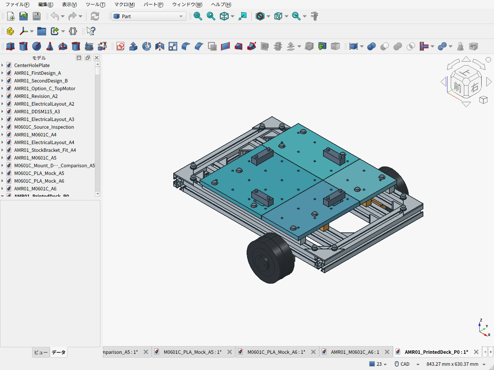
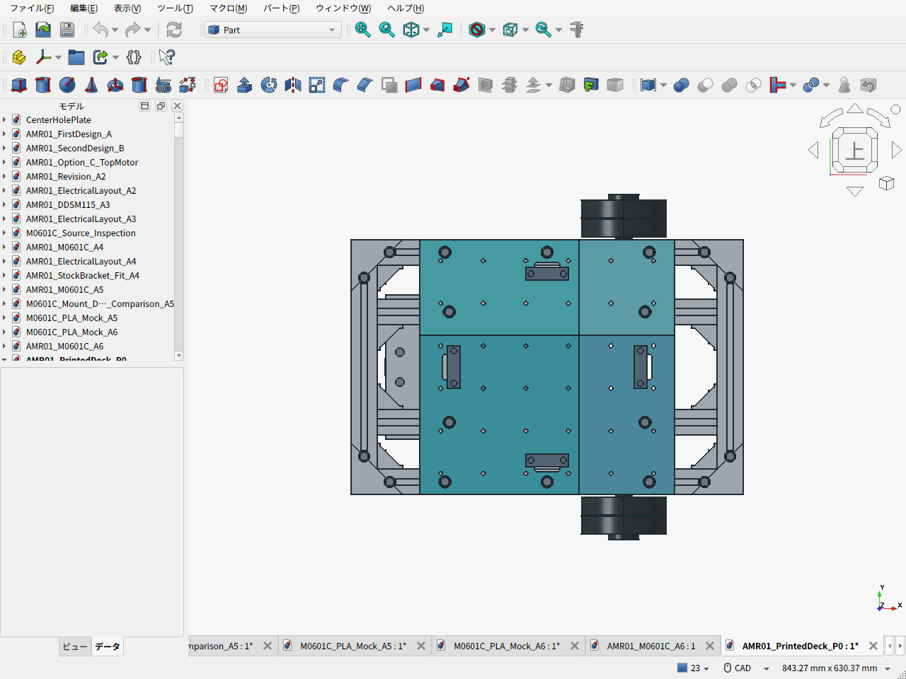
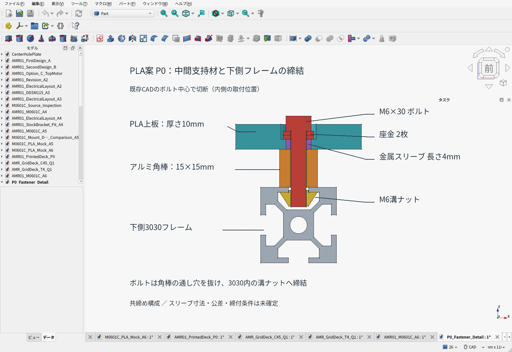

# 格子穴付きPLA上板 P0 — 強度評価前の試作案

> **2026-09-22：角棒の切断・穴あけが必要な支持構成はユーザー判断で不採用。** このページのP0 CAD・画像・費用は比較履歴として残す。加工なしで締結できる既製フレーム・金具への置換を検討する。D2荷台の同じ角棒から作る支持ブロック・ストッパーも見直し対象。

**上板の3Dプリント化は候補にできる。今回、50mmピッチ・M4用の格子穴36個を持つ4分割板をCADにした。** 既存A6のアルミ板を同じ厚さのPLAへ置き換える構成は採らず、内側3030にも金属支持棒を追加し、板厚を10mmとした。通常積載10kg、構造検証15kg・安全率2という要求は維持するが、PLA案での達成は未確認。

[組立FCStd](AMR01_PrintedDeck_P0.FCStd) / [組立STEP](AMR01_PrintedDeck_P0.step) / [印刷・比較資料ZIP](printed-deck-P0.zip) / [費用差分CSV](comparison_bom.csv) / [形状検査](validation.json) / [計算](screening.json)



## 穴と分割

| 項目 | P0 |
|---|---|
| 上板全体 | 300×300、上面z124mm。旧上面118mmから6mm上がる |
| 板厚 | 10mmの中実形状。8mm案との比較から選んだ試作開始値 |
| 格子穴 | 50mmピッチ、6×6＝36か所。原点は板中央、x/y＝−125,−75,−25,25,75,125mm |
| 穴径 | φ4.5通し穴、M4用。底面に対辺7.3×深3.4mmの六角ナット用ポケット |
| 分割位置 | x/y＝37.5mm、隙間0.4mm。格子穴・ベルト長穴・ストッパ穴を継ぎ目で切らない位置 |
| 4枚の外形 | 187.3角、187.3×112.3、112.3×187.3、112.3角。いずれも厚10mm |
| 支持 | 既存外側2本＋追加内側2本の15角金属棒。下の3030へ荷重を伝える |
| 締結 | 元の外側6か所＋内側4か所。金属スリーブ10個で、ボルトの締付力を金属支持棒へ伝える |

手持ちP1Sの公式造形範囲は256×256×256mm。全パネルがこの範囲に収まる。[メーカー仕様](https://store.bblcdn.com/7032c40b1ca64c70bcb3239d46cc72aa.pdf)

格子穴のナットは使う位置だけ入れる。取り付ける部品・座金の厚さに合わせてねじ長さを決め、先端を上板下面より下へ出さない。ナットは組付け前に裏から入れる。支持棒に近い穴のナット交換にはパネルを外す。小径ねじの機器にはプリントした変換プレートを使えるが、個々の機器が50mm格子へ直接取り付く意味ではない。

格子穴に固定した部品の重量・重心は車体と積載の条件へ算入する。アームの曲げモーメントや吊上げ荷重を、この穴配置だけで許容したものではない。荷台に荷物を置く場合、荷物直下にボルト頭や機器を残さない。



## 支持・ねじ・配線との取り合い

内側支持棒はy＝±65、外側は±135mm。追加の内側取付ねじはx＝±115mmとして200角の平底荷物から外した。旧電装トレイ2枚とその締結材は追加支持棒に干渉するので、P0では外している。前後の新電装予約は維持したが、実部品の取付と配線の確定は残る。

座金下面を従来のz118mmに置くため、厚い上板にφ14の座ぐりを設ける。厚さ1.6mmの座金を2枚入れ、ボルト頭下面はz121.2mmとなる。圧縮スリーブは外径10・内径6.6・長さ4mmの候補で、金属座金→スリーブ→金属支持棒という締付力の伝達経路を作る。スリーブの購入型式、実寸、プリント穴との嵌合、座面の高さ、公差と締付力は未確定。公称形状で接触していることだけで締結成立とは扱わない。

### 中間の支持棒と下側3030の締結

中間材は**15×15×300mmのアルミ角棒4本**。M6×30ボルトを上から入れ、座金2枚、金属スリーブ、角棒のφ6.6通し穴を経由して、下側3030の上向き溝に入れたHNTT6-6ナットへ締める。外側は1本あたり3か所、内側は1本あたり2か所で、合計10か所。角棒へのタップ加工はない。



[断面のFreeCADファイル](P0_Fastener_Detail.FCStd) / [切断位置と元部品の記録](fastener-section.json) / [画像の再生成スクリプト](capture_fastener_detail.py)

これは上板と角棒を同じボルトで保持する**共締め構成**。上板用ボルトを外すと、その角棒の固定も解ける。支持棒を独立固定するねじは現状のP0にはない。断面画像は内側の取付位置x115・y65mmを既存CADから切り出した説明用で、P0の形状や締結方法を変更したものではない。スリーブとPLAの残り厚さは公称でともに4mmのため、実寸差によるPLAの圧縮やがたつきは未検証。

ベルトが内側支持棒を横切る位置には、**PLA側**の下面に26×32×深2mmの逃げを設けた。支持棒を追加で削る形にはしていない。実ベルト・保護材の厚さと、張力下の擦れを確認する。ストッパは元の金属品を使い、固定ねじ8本をM4×30へ変更した。

CADでは227物理形状がvalid、体積干渉0、参照形状との干渉0。36個の各格子穴についてM4ねじ・ナットの公称形状が入ることを確認した。工具の回転、印刷誤差、変形、実機取付を保証する検査ではない。

## 強度・たわみの比較

Bambu PLA Basicの比較用曲げ弾性率は2,750MPa。元のアルミ計算70,000MPaと比べ、同じ形状なら線形計算のたわみは約25倍になる。メーカーの試験片は100%充填と熱処理・乾燥を行った条件で、手持ちPLAや今回のプリントの許容応力には直接使えない。耐熱変形の掲載値54〜57℃も、荷台の連続使用温度の保証ではない。[メーカーTDS](https://store.bblcdn.com/s7/default/b189de92249a4b9ebed28b8ea1f080f0/Bambu_PLA_Basic_Technical_Data_Sheet.pdf)

継ぎ目で曲げを伝達しないものとして、最も張出しが長いパネルを2支点の梁で比較した。中央200角への荷重、板側自重1.6kg枠、ベルト4脚×20Nを含む。ナット穴とベルト逃げについて、全厚の帯を失った扱いにして有効幅を86.0mmまで減らした。外側支持に浮上り反力が出るため、固定ねじで押さえられることが前提である。

| 条件 | 8mm板 | 10mm板 |
|---|---:|---:|
| 通常10kg：短期たわみ、E＝2,750MPa | 1.67mm | 0.86mm |
| 構造15kg：短期たわみ、E＝2,750MPa | 2.09mm | 1.07mm |
| 構造15kg：柔らかい側の感度E＝2,000MPa | 2.88mm | 1.47mm |
| 構造15kg：外力2倍の公称曲げ応力 | 9.50MPa | 6.08MPa |

E＝2,000MPaは感度を見る仮定で、材料の保証下限ではない。上の数値は短期の簡易比較で、穴や長穴の局所応力、接触、締結、層間、クリープ、温度、衝撃を含む安全率2の証明ではない。10mmを初回の試作候補とし、実材料・造形条件による長時間荷重、孔まわりの抜け、支持部の浮上りと締結を確認してから常用の判断をする。

## 費用と重量

| 費目 | 比較用の額 |
|---|---:|
| PLA4枚の固体形状、約1,072g | 約2,143円（既存仮枠2円/g） |
| 追加支持棒用995mm定尺1本 | 1,507円（既存販売記録） |
| 上記2項目の比較額 | 約3,650円 |
| 置換対象のアルミ板1枚 | 4,521円（既存販売記録、穴加工前） |
| スリーブ・ねじ差額・新送料・工具・印刷諸費 | 未確定 |

**板と追加支持材だけなら約871円低いが、完成構成で安くなるとはまだ確定できない。** 格子穴とナットポケットを印刷で作れる利点を含めて比較する。100%形状の材料量であり、スライサー算定、パージ、失敗分、電力、作業時間はまだ計上していない。手持ち材料も消費評価し、0円とはしていない。元のPLAトレイ減少分の費用はこの表で相殺していない。

支持棒は元の1本から残った短材では足りず、追加の995mm材を1本購入する。そこから300mm×2本を切り出して穴を4か所加工する。[既存の販売参照](https://store.shopping.yahoo.co.jp/akibaoo/4977720061511.html)。価格は今回再取得した加工見積ではない。外すトレイの溝ナット8個のうち4個を追加支持部へ転用できる。

車体重量は元のA6推計を基に**約9.047kg**。10kgまで約0.953kgだが、スライス・実測前であり、今後の機器追加を無条件に許容する余りではない。[計算内訳](validation.json)

## 印刷データの位置付け

4枚のSTLは、上面を下にして造形台へ置く向きで出力した。最初に小片でφ4.5穴・六角ナット・圧縮スリーブの嵌合を確認する。形状の比較は中実相当を前提としており、任意の低充填率に変えて同じ強度計算を使わない。実スライス、反り、印刷品質、長時間荷重の検証は未実施。

既存A6のCAD・見積済みモーター金具・購入BOMは比較基準として保持した。P0は格子穴と樹脂化を検討する別の試作候補で、現時点の購入BOMへ二重計上しない。

```sh
python3 cad/amr07/printed-deck-concept/screening.py
# build_concept.py は独立したFreeCADのheadlessプロセスで実行
```

P0を再生成する際の元車体・荷台パラメータはgit改訂`7f6bf0501322def11120138fecc62a40ea970170`へ固定した。現在のD2を旧P0の支持構成へ混ぜない。履歴を含むgitチェックアウトが必要。
