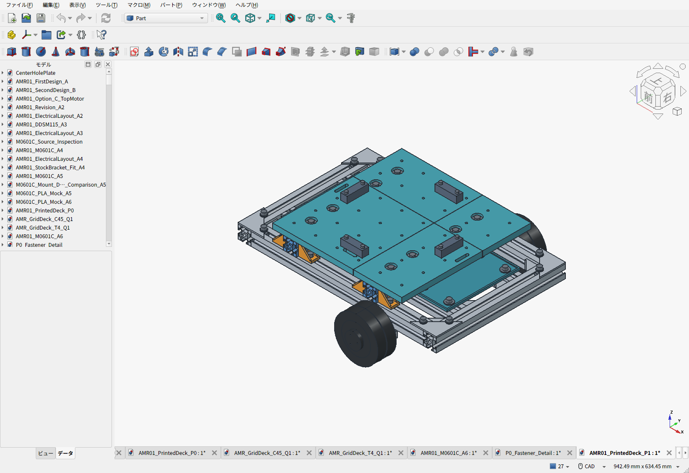
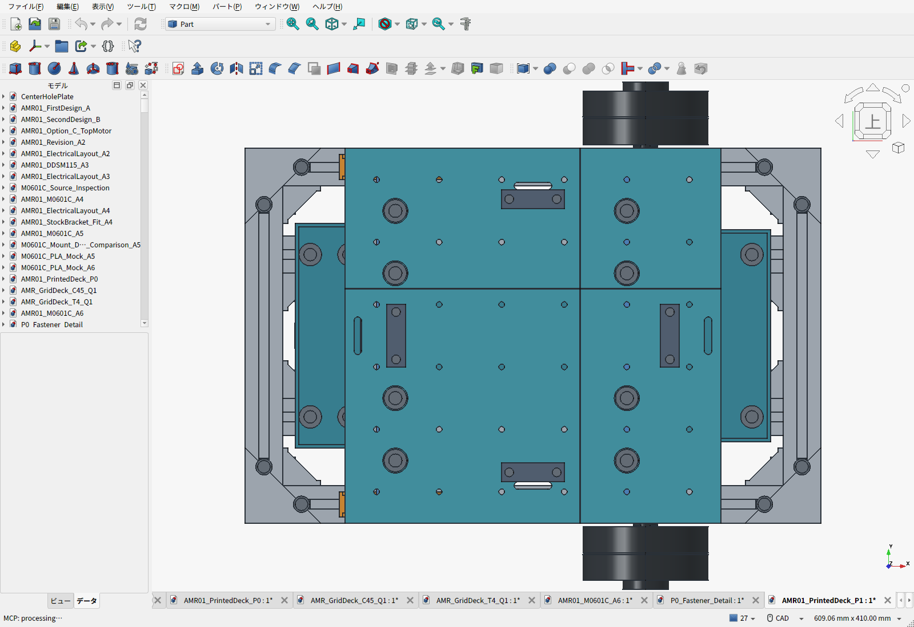
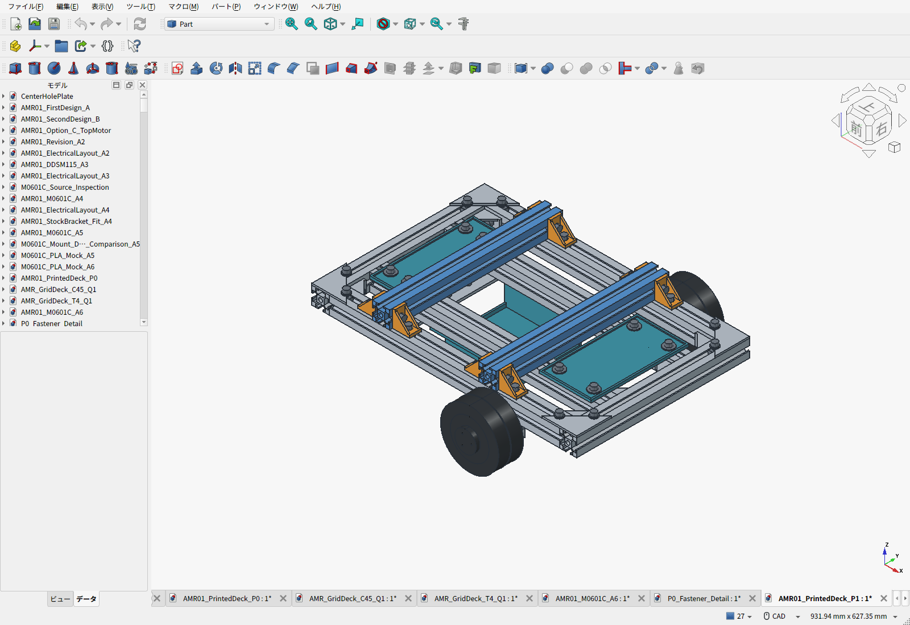
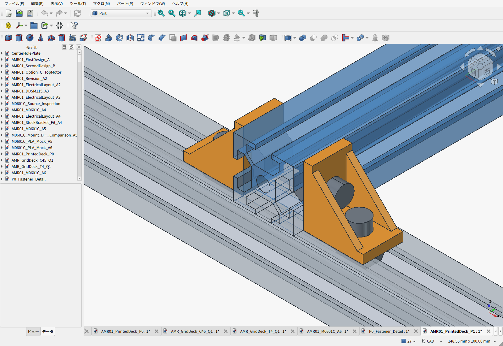

# P1：切断済み3030と既製金具で支える分割PLA荷台

> **P1は比較履歴です。** ユーザー指示により[直付け一枚アルミ天板D3](../aluminum-direct-deck/README.ja.md)へ変更しました。上段フレームを廃止し、干渉修正・再見積・BOM更新まで反映済み。

> **継ぎ目レビュー：支持・連結の修正が必要。** 各板にM6固定2本はあるが、隣接板は0.4mmの隙間で突き合わされ、継ぎ目同士の連結はない。最長132.3mmの片持ち部分があり、板端の相対段差・変形は未検証。[確認結果と修正条件](SEAM_REVIEW.ja.md)。以下のCAD・STLは修正前のP1。

2026-09-22。「三角フレーム」は**溝付きフレーム**というユーザーの補足を反映した。旧P0の中実角棒4本を、300mmの3030フレーム2本とミスミHBLFSN6ブラケット8個へ置き換えた。**荷台支持用の金属材を自宅で切断・穴あけする工程はない。** モーター支持の見積済み専用金具、下段の既存取付板は別の製作範囲。

これは公称寸法で組付けを確認した試作設計。通常積載10kg、構造検証15kg・安全率2は設計目標として維持するが、**P1のPLA荷台の強度・クリープ・実荷重試験は未完了**。旧アルミD2の解析結果をP1の耐荷重として使わない。

**格子穴付き上板はこのP1にも組付け済み。** 300×300mmの4分割PLA板に、50mmピッチ・φ4.5の拡張用穴を6×6＝36か所残している。M4ボルトと裏側のナット用ポケットで機器を固定できる。下の締結説明図だけは、支持部分を見せるため上板を非表示にしている。

## 上下フレームの締結

青色が追加した溝付き3030、橙色が購入する反転ブラケット。色はCAD上の識別用で、製品の塗装指定ではない。

- 上段はNFSL6-3030-300を2本、Y方向に配置。中心X=-110/+75mm、下面Z99/上面Z129mm。
- それぞれの上段材は、下段の4本の400mm材に直接載る。荷重は接触面から下段へ伝わる。
- 外側の下段材との交差部4か所を、両側からHBLFSN6で固定する。計8個、M6×12とHNTT6-6各16個を追加。
- ブラケットの縦面は上段の側面溝、足は下段の上面溝に固定する。フレームに追加穴を開けない。
- PLA荷台のM6固定8本と、フレーム接合のM6固定16本を分けた。板を取り外しても、上下フレームの接合は残る。

メーカーはHBLFSN6のL字・クロス接続への対応、M6×12/HNTT6-6、質量15gを公開している。[メーカー仕様](https://jp.misumi-ec.com/vona2/detail/110300442340/) / [接続例と寸法図](https://jp.c.misumi-ec.com/book/MSM1_F24/pdf/0304.pdf)。CADは30×30×20mmと穴位置から再構成した簡略形状で、鋳造丸み・溝位置決め突起は省略した。壁厚を4.5mmの包絡で扱い、実物が4mmの座面の場合もM6×12先端と溝底に公称1mmの余裕がある。製品CADそのものではないため、突起の向き、実ねじ長さ、ねじ込み、公差は現物で照合する。カタログ1176Nを今回の車体全体の保証荷重に換算しない。

## 寸法・印刷・整備

| 項目 | P1 |
|---|---|
| 下段フレーム | 外形460×300mm、床上69～99mm。変更なし |
| 上段 | 切断済み3030×300mmを2本、床上99～129mm |
| 荷台 | 300×300×12mm、4分割、上面**床上141mm** |
| 旧P0との差 | 上面124→141mm、**17mm上昇**。30mmの支持高さと12mm板厚による |
| 格子穴 | 50mmピッチ、φ4.5の36穴。底面にM4ナット用対辺7.3×深さ3.4の印刷ポケット |
| 印刷サイズ | 最大187.3×187.3mm。全10個の新規STLがP1Sの256mm角に収まる |
| ストッパ | 15×15×50mmの交換可能なPLA部品4個。穴も印刷。荷物の主固定は既存の交差ベルト2本 |
| 車体重量 | **推計9.419kg**、10kgまで約0.581kg。電池・電装2.10kg枠、ベルト等0.280kgを各1回含む |

板の固定には既製のアルミカラー（外径12/内径6.2/長さ5mm）を印刷部内へ入れ、その上に外径18×厚さ1.6mmの座金2枚を置く。M6×16ボタンボルトの頭は上面より公称0.5mm低く、ねじ先端はフレーム溝底から公称1.2mm離す。12mm厚は、この沈め込み寸法と曲げ剛性を考えた試作値であり、強度計算による認定厚さではない。カラーと印刷した座面の段差・座金厚さを試験片で測り、板が遊ぶ/PLAを強く潰す組合せを避ける。カラーは高さ追加用ではなく、板内の締結座として使用する。

2本の横桟で4枚を個別に支えるため、各パネルは2本のM6で固定する。最も長い片持ち部分は、左フレーム内側端X=-95から分割端X=37.3までの132.3mm。旧P0の支持条件とは違う。分割端、薄くなるナットポケット・固定座、ベルト溝、ボルトによる浮上り拘束、PLAの時間/温度依存を含む検証が必要。中実形状の板4枚は約1.275kg。低いインフィル率へ変えて同じ耐荷重を仮定しない。

左横桟をX=-110にしたのは、電池の120×80×65mm予約を削らず、側方5mmの公称隙間と上向き取り出し経路を確保するため。電装トレイは前90×170mm・後55×180mmに再印刷し、内側固定穴も移した。トレイの固定は各4本を維持した。電装はまだ予約外形であり、実際の基板・コネクタの取付確認は残る。

荷物とベルトを外し、上板のM6×16を8本抜いて4枚を取り外すと、電池を真上へ取り出せる。上段3030と8個のブラケットを外す必要はない。ベルトX方向の穴は左右X=±140に移動し、横桟を越える部分だけPLA裏面に48×26×深さ2mmの溝を印刷した。金属フレームには切欠きを作らない。

荷物CG上限は床上220mm、車体CG上限目標は110mmのまま。板が高くなったため、同じ容器を置けば荷物CGも上がる。CADの例示荷物は200×200×150mmで、均一密度ならCG216mm。実際の荷物・機器配置についてこの値を保証しない。

## 費用と購入単位

300mm材は、既存BOMの**4本入り1組1,467円**を下段2本＋上段2本で使い切る。上段のためにもう1組買う必要はない。すでに所有しているという意味ではなく、初回購入するパック内の割当変更。[Amazonの300mm材](https://www.amazon.co.jp/dp/B0DKDZ8G9G)

2026-09-22に商品名と商品価格を確認。送料・配送先別Prime条件・最終会計は別。

| 部品 | P1全車の使用数 | 購入数量・表示価格 |
|---|---:|---:|
| [HBLFSN6](https://www.amazon.co.jp/dp/B0DKF1FCD6) | 下段8＋上段8＝16個 | 10個917円×2＝1,834円。ねじ・ナット別売 |
| [HNTT6-6](https://www.amazon.co.jp/dp/B0DK9C99YH) | 基礎44＋追加24＝68個 | 50個2,556円×2＝5,112円 |
| [アルミカラー12×6.2×5](https://www.amazon.co.jp/dp/B0GWMC8ZY9) | 8個 | 10個580円 |
| [M6×16ボタンボルト](https://www.amazon.co.jp/dp/B0C2CDH79R) | 8本 | 10本410円 |
| [大径座金18×6.4×1.6](https://www.amazon.co.jp/dp/B0G2X4FSQX) | 荷台固定用16枚 | 50枚845円 |
| ブラケット用M6×12 | 全車32本 | 販売パック・強度区分・価格未確定 |
| ストッパ用M4×30/M4ナット | 各8個 | 販売パック・価格未確定。既存D2のナットがあれば再使用 |
| 車体のPLA全11部品 | 中実換算約1.535kg | 手持ち材料2円/gの参考消費評価、切上げ3,072円。実スライス未実施 |

P1ではCNCアルミ荷台板・その送料・角棒材料・角棒送料を削除した。購入型番が違う商品へ遷移した検索結果は見積根拠にしなかった。価格が未確定のねじを0円と扱って完成価格を作らない。途中小計は**54,074円＋82.25 USD＋未確定分**。USD分は従来のモーター金具加工とその表示送料。[P1全車BOM CSV](BOM.csv) / [途中小計・未計上項目・価格記録](cost_summary.json)。従来BOMの予算枠も引き継ぐため、完成車の確定見積ではない。

## CAD検査とファイル

273物理部品・37,128ペアで公称体積干渉なし。36穴のM4ナット/ねじ包絡、M6用工具の直線進入、荷台と電池の上向き180mm連続取り出し、変更部品とキャスター旋回包絡を検査した。ブラケットの足を締める工具は上板を付ける前の状態で確認した。下段と駆動系の変更していない部分は、固定したD2リビジョン3417383の形状・検査に依存する。タイヤ変形や未モデル化した突起・実公差・配線全長まで検証したという意味ではない。

- [組立FCStd](AMR01_PrintedDeck_P1.FCStd) / [組立STEP](AMR01_PrintedDeck_P1.step)
- [全検査結果・質量内訳](validation.json) / [設計値](parameters.json)
- [印刷ファイルとサイズ](print_manifest.json)：同じフォルダの10個のSTL。荷台4枚は上面を下にした配置。座ぐりのブリッジ/支持材・穴精度はスライサーと試験片で確認する。P1S用の確定印刷プロファイルではない。
- [印刷用STL一括ZIP](P1-print-files.zip) / [CAD・画像・STLのハッシュ](release_manifest.json)
- [再生成スクリプト](build_p1.py) / [BOM生成](build_bom.py) / [CAD画面撮影](capture_screens.py)

旧P0とアルミD2のファイルは履歴として保存する。新しい支持構成の試作にはこのP1を参照する。
