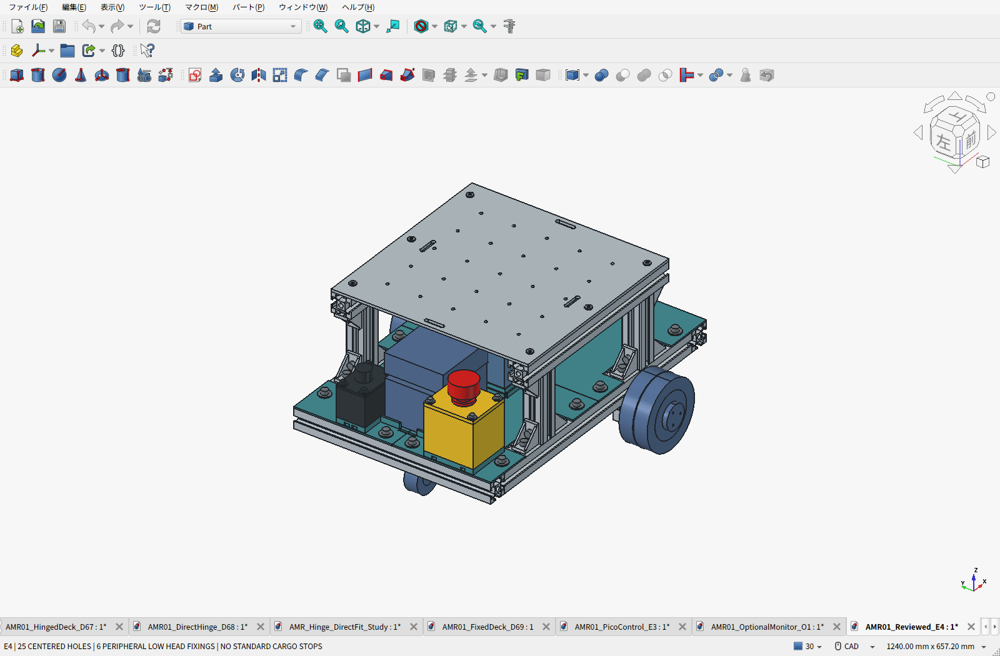
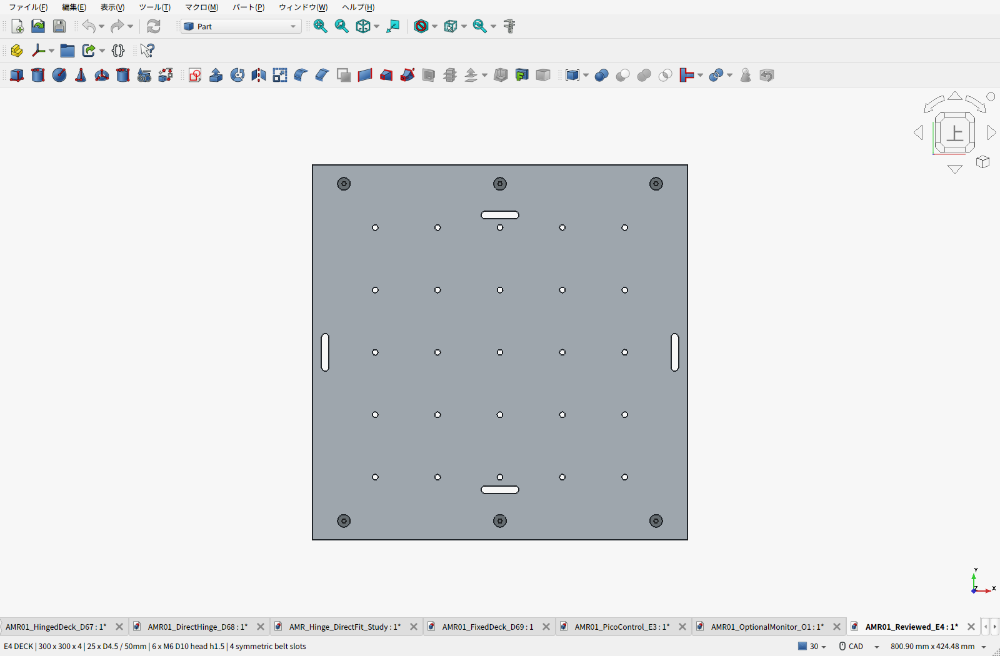
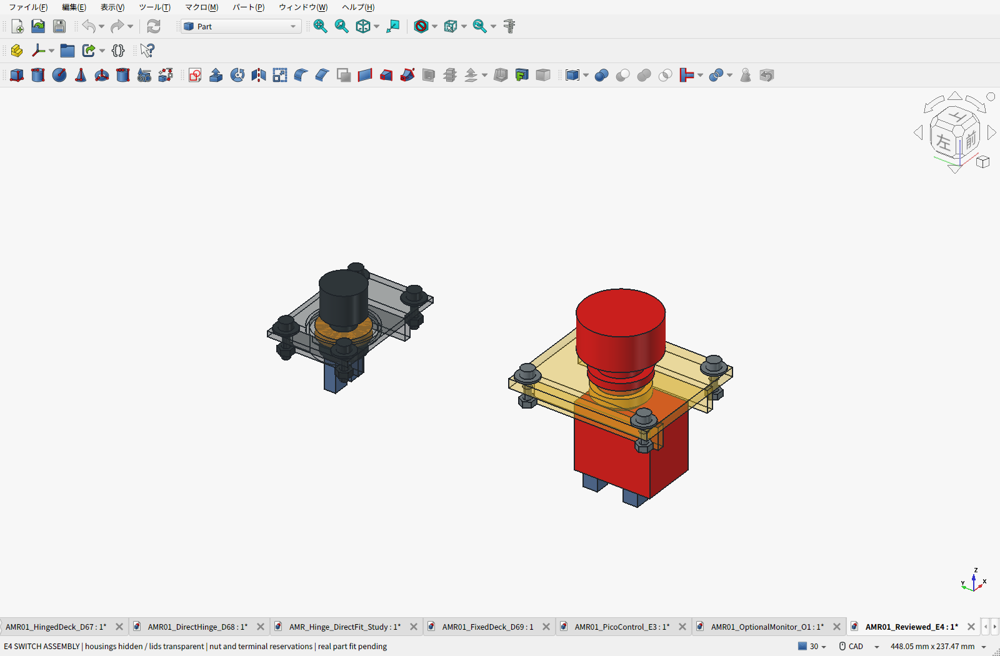

# E4：レビュー反映後の標準設計

**機構設計とロボット・電装の2つの独立AIレビューを受領してから修正した。** 人間専門家の認証や実機試験ではない。3030骨格・二階構造・電池の後方交換は維持し、天板の使いやすさとスイッチの組立・整備を改善した。モニターは[別のオプション](../monitor-option/README.ja.md)であり、標準CAD・重量・BOMに含めない。

[標準BOM](BOM.ja.md) ／ [全明細Markdown](BOM-details.ja.md) ／ [CSV](BOM.csv) ／ [配線・復帰仕様](WIRING.ja.md) ／ [レビューと対応表](../design-review-e3/README.ja.md)

## 天板の変更

| 項目 | E4 |
|---|---|
| 板 | 6061-T6、300×300×4mm、上面233mm |
| 拡張穴 | φ4.5通し穴25個。X/Yとも−100、−50、0、50、100mm。原点あり、50mmピッチ |
| フレーム固定 | X=−125、0、125mm×Y=±135mm、計6点。φ6.6通し穴 |
| 固定ボルト | NBK SSH-M6-12、頭径10・頭高さ1.5mm・六角3mm。従来の頭高さ6mmから低頭化 |
| 荷面 | 常設の15mm高ストッパ4個を標準から撤去。中央250×250mmの箱を置く例をCAD確認 |
| ベルト長穴 | 30×6mm、端R3を4個。X±140/Y0に長手Y、X0/Y±110に長手Xで対称配置 |
| 取外し | 荷物とベルトを外し、上から6本を外して天板を持ち上げる。ヒンジなし |

穴数を36から25へ減らしたのは、旧配置の12穴にあったフレーム付近の裏側工具制約を避け、全穴で同じ貫通締結を使えるようにするため。25mmピッチ81穴案も比較したが、追加加工と費用未確定を避けるため標準には採らず、小物はPLA変換板で対応する。極低頭を使い、板の皿加工は追加しない。天板全体が完全な平面になるわけではなく、外周には1.5mmの頭が残る。

電池を外した状態で全25穴の下面φ12×40mm工具空間を確認。**電池装着時はX=−100/Y=−50,0,50の3穴の下面工具がアダプターに当たる。** これらは電池を外して作業する。固定ボルトの工具空間と、250角の荷物例は標準状態で干渉なし。実際の取付ねじ長さは機器ごとに決め、1階機器へ長いねじを突き出させない。

[メーカーSSH寸法](https://www.nbk1560.com/products/specialscrew/nedzicom/socketheadcapscrew/SSH/)に基づく。メーカーの6.3N·mは参考上限で、推奨作業値ではない。通常M6の締付値をそのまま使わない。[天板の追加強度レビュー](../design-review-e3/DECK_REVISION_CHECK.ja.md)では通常10kg・静的15kg×荷重係数2の簡易比較を実施。板全体の曲げには余裕があるが、長穴周り・ベルト張力・接触・締結・実物の強度確認は残る。

## スイッチの変更

二つの箱は中央の電池交換口を挟んで維持する。非常停止はHW1B-V402Rの2NCで左右モーター電源を別接点で遮断する案、主電源は計算機を含む全負荷用のamon3214。箱の高さを決める接点・端子があるため、外観だけで箱を縮小しない。

- 非常停止：メーカー掲載のφ28.4×5mmロックナットを別部品としてCADへ追加。φ29の工具確認空間を設け、蓋裏リブへ当たらないことを確認した。
- 主電源：中心は従来のX=−201/Y=64mmを維持。ナット周辺にφ31のリブ逃げとφ34の補強環を設けた。φ26×5mmナットとφ30工具は**設計上確保する仮寸法**で、実測ではない。
- 250型端子とHW配線の確保空間を色分けした。端子形状・向き・絶縁・曲げは現物未確定で、製作承認には使わない。
- 両箱に配線の結束橋を追加。蓋・箱・床は各4本のM4による既存固定を維持する。

組立は電池を外し、蓋を机上に置いて「スイッチ挿入→ナット締付→HW接点ブロック/付属レバーストッパ装着→端末加工済み線の接続→線保持→蓋を閉じる」の順。主電源の樹脂ナットも蓋裏から締める。表示は黄色面の赤ボタン付近にMOTOR STOP、黒い箱のスイッチ脇にMAIN POWERとし、実品ON/OFF方向を確認して付ける。

ナットの持続締付を受けるPLAは、押下150Nの梁計算とは別にクリープ・回転解除・繰返し押下を実機確認する。指定締付を勝手に下げて合格扱いにしない。主電源ナット/端末の実寸と、非常停止の実負荷・突入適合は未解消事項として残す。

## 確認結果と費用

車体推計**10.363kg**（E3比約93g減、実測前）。通常積載10kg・静的比較15kg/SF2の条件を維持する。標準PLAは12部品。

変更部8,697組で新規干渉なし。天板・電池取り外し、上方/後方の非常停止操作、主電源操作、ナット工具、蓋50mm取外しを確認した。蓋は5mm刻み、ハーネス移動は2mm刻みの検査であり、実配線の連続変形や曲げを検証したものではない。スイッチ蓋の整備は電池を外す条件。

**新天板は未見積。** 旧D3の28.67USD＋送料9.98USDは穴配置が違うため流用しない。現在の計上済み小計は約88,560円＋新天板・送料・PC・給電・HAT・最終配線等の未計上分。旧小計との差を節約額と説明しない。低頭ボルトはメーカー参考528円/10本、個人購入先・送料・Prime適用は未確定。

- [標準FreeCAD](AMR01_Reviewed_E4.FCStd) ／ [STEP](AMR01_Reviewed_E4.step)
- [新天板加工用STEP](E4_Deck_300x300x4.step) ／ [穴配置図](deck-layout.svg)
- [PLA試作12部品ZIP](E4-print-prototypes.zip) ／ [干渉検査](validation.json) ／ [保存物照合](saved_artifact_validation.json)
- [設計要件](requirements.json) ／ [寸法・重量](geometry.json) ／ [元E3](../pico-control/README.ja.md)

ファームウェアは仕様のみで未実装。停止後の古い指令破棄、片輪異常時の両輪禁止、ゼロでの再接続と明示RUNを仕様へ追加した。短時間電源断の検出保証・接点突入適合・完成ハーネス・Pico実装状態は、CAD修正だけで完了にできない。
