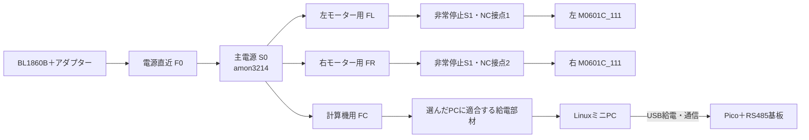

# E4 配線構成と制御の役割

**車載LinuxミニPC → USB → 手持ちPico → 完成済み2CH RS485基板 → 左右モーター。** PCとPicoの両方を同じRS485バスのマスターにしない。USB–RS485変換器、裸の変換IC、専用監視基板は購入しない。

## 電源

S1は**HW1B-V402R 1個の2NC接点を左右へ1つずつ使う**。同じボタンで両方を開く。2接点を並列につないで電流定格を増やす構成ではない。S0は全電源の通常操作用で、Linuxを終了してから切る。S1を押してもPC/Picoは給電を維持する。

電池マイナスから、左右モーターの電源GNDとPC給電部材の入力GNDへ、それぞれ電力用の帰路を用意する。信号GNDの細線やUSBシールドをモーター電流の帰路にしない。PC給電部材が絶縁型の場合の0V接続も、その製品決定時に図へ反映する。

| 接続 | 接続先・端子 | 線材の設計目安／残る確認 |
|---|---|---|
| 電池＋ → F0 → S0 → 分岐 | アダプター出力＋、S0の2接点 | 幹線1.25mm²を初期目安。付属線・250型端子・突入適合を確認 |
| S0後 → FL → S1のNC1 → 左モーター＋ | NC1の両ねじ端子、モーター電源コネクタVCC | 延長幹線0.75mm²目安。モーター付属細線／コネクタへの変換は完成ハーネスで確定 |
| S0後 → FR → S1のNC2 → 右モーター＋ | NC2の両ねじ端子、モーター電源コネクタVCC | 左と同様 |
| 電池− → 左右モーターGND | 電源コネクタGNDへ独立した支線 | ＋線に対応した線径。付属ケーブルの許容電流が優先 |
| S0後 → FC → PC給電部材 → PC | 選定機種の入力＋／−、出力端子 | PC機種未選定。電圧・コネクタ・極性を決めてから接続 |
| PC → Pico | USBデータケーブル | 通信と給電を兼用。別電源をPicoへ重複接続しない |

NC1/NC2は**この設計で左右を識別する名前**で、メーカー刻印の端子番号を創作したものではない。公開資料の端子図・適合電線に基づく製作配線表への展開、端末型式・線長の確定は未完。M3.5ねじ端子は、メーカー指定の接続方法または端末加工済み線で使い、ユーザーのはんだ付けを前提にしない。

電源予算はモーター入力の参考3A×2台、PC側30W、最低電圧16.5V、変換効率仮定85%で約8.14A。S0のDC24V10A表示を超えない設計枠だが、**突入の適合証明ではない**。F0 10A、FL/FR/FC各3Aは選定開始値であり、ヒューズ特性・線材・コネクタ・起動挙動に合わせて確定する。30A付属ヒューズだけで細線を保護できるとは扱わない。

HW接点はメーカー表でDC24V・DC-12 10A／DC-13 5A。1接点1モーターに分けるのは、この範囲に余裕を取りやすくするため。ドライバーの入力コンデンサ突入や遮断時過渡は別に確認する。[IDEC資料](https://www.tdcjapan.com/wp-content/uploads/2017/06/P5204A-HW-with-RemovableContactBlock.pdf)

## 通信

| 系統 | Pico | RS485基板 | モーター |
|---|---|---|---|
| 左 | UART0：GP0 TX／GP1 RX | CH0 A／B／GND | 左A(DATA+)／B(DATA−)／信号GND、ID1 |
| 右 | UART1：GP4 TX／GP5 RX | CH1 A／B／GND | 右A(DATA+)／B(DATA−)／信号GND、ID2 |

115200bps・8N1・10バイトのメーカー独自プロトコルを使う。Modbusではない。基板はPicoソケットから給電し、**モーター用18Vを基板の信号端子へ入れない**。基板両側の同一CH端子は別チャンネルとして数えない。終端抵抗・A/Bの表示・送受信切替動作は購入基板とモーターで確認し、抵抗を無条件に追加しない。[基板の公式配線](https://www.waveshare.com/wiki/Pico-2CH-RS485)／[モーター説明書](https://d2air1d4eqhwg2.cloudfront.net/media/files/a48110eb-432c-4083-a159-9e0f35913b23.pdf)

## Picoのソフト設計

- 左右それぞれ100Hzを初期設定として指令送信・応答取得。左右の回転方向符号は車輪を浮かせて確認する。
- 起動時は速度ゼロ。PCの明示的な走行開始操作を受けてから動かす。
- PC指令が200ms途絶える、またはモーター応答に異常が出た場合、ゼロ指令を送り、走行指令を禁止する。復帰後は新しい開始操作を要求する。
- 通常停止は速度指令をゼロへ下げる。内蔵電気ブレーキは速度モードの0x64指令DATA[7]=0xFFで作動させ、効き方を実機確認する。
- 非常停止による直接電源断は、上記のソフト処理を待たない。電源断後の制動・坂道保持は保証しない。

これは**ソフトの設計であり、ファームウェア実装・動作試験済みではない**。専用ARMボタンは設けない。非常停止検出用の追加接点もないため、短時間の電源遮断など全事象をPicoが検出する保証はなく、独立した再始動防止回路とは異なる。Pico自身の故障時はソフト停止を保証せず、物理的な電源遮断が別経路として残る。

## 「不要」と決めていないもの

電池・アダプターの保護、減速・遮断時の電源電圧、モーター入力突入は確認項目として残す。低電圧遮断器や回生抵抗を未確認のまま購入必須にはせず、既存構成で不足が判明した場合に対策を選ぶ。裸ICを並べた未完成回路をユーザーに製作させる方針には戻さない。

## E4レビュー反映：復帰と配線製作

停止・起動・通信異常後には、USB受信待ちやモーター送信待ちに残る古い指令を破棄する。左右どちらかの応答異常/ドライバー故障でも両輪への走行指令を禁止する。復帰は両輪へゼロ指令で通信を再確立し、新しい明示的なRUN操作を受けてから行う。非常停止を解除する前にPC側のRUNを解除する。短い断電を必ず検出する機構はなく、独立した再始動防止回路の実装完了を意味しない。

非常停止の表示は「MOTOR STOP／モーター電源停止」、黒い主電源は「MAIN POWER／PC終了後OFF」。実品のON/OFF方向と一致する表示を付ける。表示の製作方法・位置はREADMEの操作面図を参照し、CADで電気的なON向きを保証しない。

| 配線 | 製作方法 | 現時点 |
|---|---|---|
| PC–Pico USB | 既製データケーブル | 両端型式・長さ未確定 |
| モーター電源/RS485 | モーター付属線を優先、不足は端末加工済みハーネスを購入または加工依頼 | コネクタ型式・線径・端末表未完 |
| 主電源250型端子 | 絶縁付きメス端子の加工済みリード | 250型適合はメーカー指定済み。接続端子/完成リードの購入型式未選定 |
| HWねじ端子 | メーカー指定端末処理済み線を調達 | 適合端末と刻印端子番号の照合待ち |
| 分岐/ヒューズ | DC定格の既製ホルダーと適合配線 | 最細線・突入に合わせる最終型式未確定 |

箱の内側に配線結束橋を追加した。端子に引張荷重をかけず、側面開口には縁保護を付ける。蓋を50mm上へ動かすための配線余長は初期設計目安100mmを確保し、ループの曲げ・蓋閉鎖時の挟み込みを実配線で確認する。配線加工設備をユーザーが所有する前提にはしない。
