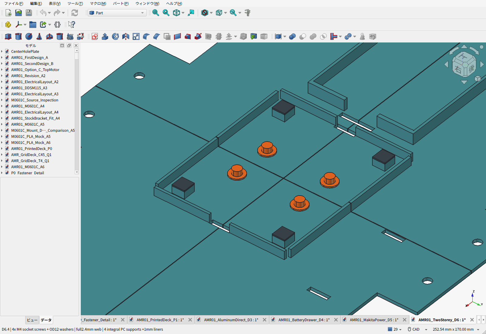
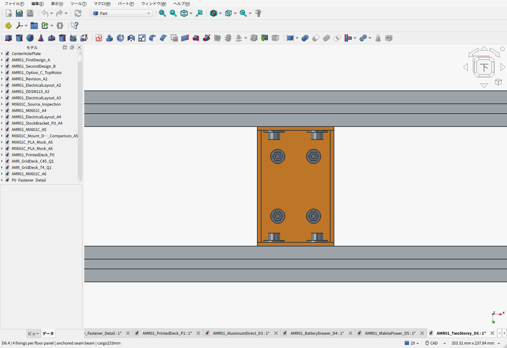

# D6.4：皿穴をなくし、通常ねじと大径座金で固定

旧D6.1は各板3点、内側2本の間隔20mm、中央継ぎ目の張り出し約50mmだった。**各板4点・計16点へ変更し、固定位置をX方向200mm、Y方向115mmに分散した。**

| 板 | 外側400mmレール・M6 | 外側400mmレール隅・M6 | 端300mmレール・M6 | 中央支持梁・M4通常ねじ |
|---|---|---|---|---|
| 後左 | (-25, 135) | (-185, 135) | (-215, 20) | (-15, 25) |
| 後右 | (-25, -135) | (-185, -135) | (-215, -20) | (-15, -25) |
| 前左 | (25, 135) | (185, 135) | (215, 20) | (15, 25) |
| 前右 | (25, -135) | (185, -135) | (215, -20) | (15, -25) |

座標はmm、車体中心を原点、X前方・Y左方。**3点は3030へ直接固定し、4点目は両端を3030へ固定した支持梁を介して留める。** 隣の板だけを相手にしたねじ留めではない。

支持梁はPLA製64×100×25mm。両端の各2本、合計4本のM6×12・OD18大径座金・溝ナットで内側3030の側面溝へ固定する。床から梁へはM4×16六角穴付きねじ・上下OD12×t1平座金・M4六角ナットで貫通締結する。φ4.5の通し穴で、皿加工はなくし、穴周囲に床厚2.4mmを残す。外周の角は従来からM6通常ねじ＋OD18座金であり、その構成を維持する。

PCは床と一体の10×10×5.6mm受け4個（中心X±50・Y±40）と1mm軟質パッドで支持する。PC下面は104→108mm、ねじ頭上端106.4mmとの差は1.6mm。パッドが完全に縮んでも硬い受け上面107mmとの間に0.6mmを残す。PCのケース・脚形状は未選定であり、現物公差と床の変形を含む最終確認は残る。

各板の継ぎ目沿いに高さ15mmの裏リブを追加した。継ぎ目端からリブ開始まで14.6mm。リブは中央支持梁から端レールまで続き、既存金具の手前25mmで浅くして0.8mmの公称隙間を残す。中央梁のベルト溝は幅17mm・深さ2.5mm。PCベルトとの最小隙間0.5mm、電池ベルトと裏リブの隙間2.3mmをCADで確認した。

四隅の切欠きと、平面の三角補強板4枚をD6.3で廃止した。フレームは既存の内側HBLFSN6金具8個で接合し、PLA床は別に固定する。内側レール上にあった4本の床ねじを外側の隅へ移し、追加部品を使わずに延長した角を固定する。[三案の比較と締結詳細](CORNER_REVIEW.ja.md)

## 組立と印刷

1. 内側3030へ梁の溝ナットを入れ、支持梁のM6を先に固定する。
2. 基礎フレームのHBLFSN6金具8個を各2本のM6で締める。4枚の床を載せ、各板のM6を3本、中央のM4通常ねじを1本、上下のOD12座金各1枚と共に取り付ける。M4は上から3mm六角レンチ、下から7mmナット用ソケットを入れる。PCを載せる前に締める。
3. 機器・パッド・ベルトを取り付ける。梁のM6を再調整する場合は床とM4を先に外す。

PLAを挟む部分へ金属同士と同じM6締付トルクを使わない。締付けと緩みの保持は現物で確認する。CADでは上記工程の梁ねじ用ドライバー4経路とM4ナット用ソケット4経路も検査した。

印刷対象は床4枚＋梁1個。最大229.8×149.8×26mmでP1Sの256mm範囲に収まる。5部品の中実CAD体積換算は約559g。荷物ストッパ4個はD3のSTLを継承する。STLは配置座標から原点移動したデータで、印刷姿勢は未設定。床はリブを下にしてサポートを使うか、中央継ぎ目を下に立ててブリムと位置決め壁の局所サポートを検討する。梁は広い上面をベッド側とし、ベルト溝のブリッジを確認する。実スライス・サポート量・印刷試験は未完了。

## 確認した範囲

保存CADから16固定点、上下座金の座面・φ4.5通し穴の全厚2.4mm、3030への支持面、梁と各板の当たり、両端2本ずつの固定、工具経路、ベルト隙間を独立検査した。車体全体の体積干渉と、電池・PC交換の連続包絡も合格した。

リブ単独・梁単独へそれぞれ50Nを中央集中させた短時間の単純梁比較を行った。リブは床幅40mmだけを有効幅とし、端のテーパーを1mm刻みの断面積分に含めた。弾性率1000MPaと仮定したたわみは、リブ1.02mm、梁0.16mm。1000MPaは感度確認用の仮定で、許容値ではない。[メーカー資料](https://store.bblcdn.com/s1/default/58b85d0f3db94878854a28fdb8a0006e/Bambu_PLA_Basic_Technical_Data_Sheet.pdf)のXY曲げ弾性率2750±160MPaも比較値として記録した。

実CADの床4枚＋支持梁について、電装2.4kgとPLA自重を与えた二次四面体解析も追加した。100%充填の均質体・E=1000MPaを仮定し、機器を10mm角の脚4個で受ける場合、最大たわみは重力だけで0.20mm、ベルト張力10N／脚で0.61mm、30N／脚で1.51mm。粗細2メッシュを比較し、荷重と反力のつり合いを検査した。局所応力は収束未確認。[計算条件・応力・ねじ締付け・改善点](pla-strength/README.ja.md)

このPLA床は電装用で、荷物15kgを支える上段の金属構造とは別。D6.4で中央の皿穴をなくした。大径座金の床接触面は約97.19mm²、旧皿頭34.24mm²の約2.84倍。ただし全体たわみは同程度で、ベルト反力と締付けの検証が必要。印刷方向・長期クリープ・機器温度・締付け軸力まで含む安全率2は未確認。実物の既知重量・測定したベルト張力で解析を照合し、実機相当温度での保持を確認して使用範囲を決める。暫定の印刷条件は上記計算書に記載した。

前版D6.2との重量差は約12g増。PLA材料消費の参考増額は6円（2円/gの既存基準）。今回の金具・ねじの追加は0個。三角板4枚とM6ねじ・座金・溝ナット各8個を削除し、床ねじ4組を隅へ移設する。三角板の素材仮枠500円を除き、計上小計は410円減。ねじ類の購入パック価格は未確定のため、16点のねじ・座金削減による金額効果を追加で差し引かない。従来の未計上価格は残るが、今回の追加金属切断・穴加工・CNC見積は発生しない。

[全検査値](floor_support_review.json)／[検査スクリプト](review_floor_support.py)／[印刷ZIP](D6-first-floor-print-files.zip)／[全車BOM](BOM.ja.md)
