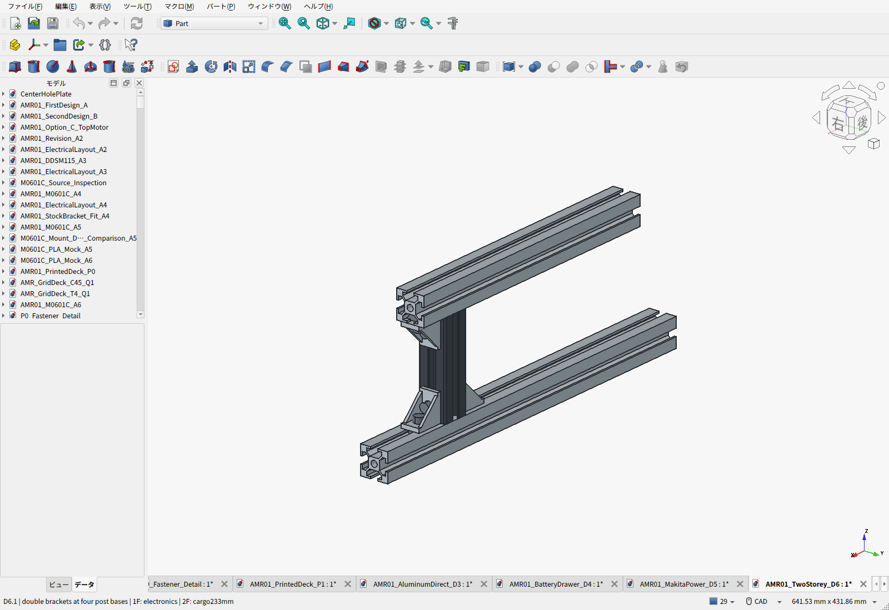

# D6.1：1階に電池・計算機、2階に格子穴アルミ荷台

2026-09-22。計算機を基礎フレーム下へ吊るD5案を撤回し、**電池・計算機・電源回路を1階、荷物を2階**へ分けた。ロボコン機体の4支柱支持、機能部の分離、電池専用の交換口を参考にした。[参照した機体と設計への反映](REFERENCE_DESIGNS.ja.md)

**D6.1では承認された根元4箇所の両側金具を採用。車体推計9.895kg、通常積載の設計目標10kgを維持。** 車体10kgまでの余裕は約105gしかなく、未選定機器・ケース・追加装備の重量余裕が十分という判断ではない。[重量増と積載の確認](PAYLOAD_REVIEW.ja.md)

**[費用の割合と読みやすいBOM](BOM.ja.md)** — 部位別金額、購入数、購入先、価格根拠、未計上品をまとめた。

黒い大きな箱が選定済みBL1860B電池、上の青緑が接続アダプター。青い透過箱は計算機・回路の予約スペース、橙色は保持ベルト。**下の緑色の床板はPLA製、厚さ2.4mmの4分割**。電池・アダプターは販売寸法による外形モデル、計算機は未選定の予約モデルである。ラッチやコネクタまでメーカー形状を再現したものではない。

| 項目 | D6 |
|---|---|
| 1階 | PLA床下面99／上面101.4mm。電池・PCの座面104mm、基礎3030の上 |
| 計算機 | 120×100×60mm、床上104–164mm。上方15mmの通風予約と横30mmのコネクタ空間 |
| 電池 | BL1860B 113×75×62mm＋アダプター95×90×30mm。92mmを全て確保 |
| 2階 | 既存の6061-T6格子板300×300×4mm、上面233mm |
| 上段支持 | 100mm溝付き3030支柱4本＋300mm上段レール2本＋HBLFSN6金具12個。支柱下端各2個、上端各1個 |
| 電池交換 | 電源OFF、コネクタ・ベルト解除→8mm持上げ→後方220mm抜出し。荷台・荷物は残す |
| 計算機交換 | ケーブル・ベルト解除→8mm持上げ→側方230mm抜出し。荷台は残す |
| 格子穴 | φ4.5、50mmピッチ36穴。30穴は通常M4ナット、Y=135の6穴はHNTT6-4を使用 |
| 重量 | **推計9.895kg**。10kgまで0.105kg。電池・電装・荷台込み、実測前 |
| 費用差 | D5から小計**4,066円増**（金物3,968円＋PLA材料参考98円）。追加ねじ・送料差額等は別 |

## 1階の配置と固定

電池は後部、PCは中央、監視回路は側部、電源回路・非常停止は前部。電池交換の通路とPCの取出し通路を別方向に設ける。電源線は1階外周へ沿わせ、PC上の通風空間を空けた。配線形状は経路予約であり、線材・端子・曲げ半径の最終設計は機器選定後に行う。

電装床は4枚に分割し、**各床をM6ねじ3本・大径座金・溝ナットで個別固定**する。以前の電池受け4組と前後電装トレイ8組の締結材を再利用する。継ぎ目で荷物を支える構造にはしない。電池・PCの低い位置決め壁とベルト穴を床へ一体化し、ベルトを通す箇所は3030の間へ置く。荷物の重量は上段の金属支持が受ける。

印刷部品は最大**229.8×149.8×11mm**で、P1Sの256×256mm造形面内。STLは中実形状で、4枚合計約339gの材料体積。実際のスライス量・時間は未計算。平らな下面をベッドへ向け、穴・ベルト通路を実物で確認する。PLAの保持力・温度・クリープ試験は残る。

## 上段と下段の締結

[下側金具の拡大](cad-screen-frame-joint-lower.png)／[上側金具の拡大](cad-screen-frame-joint-upper.png)

支柱は**切断済み100mmのSUS SF2-30・30**。上段と基礎レールの間に端面を直接当て、荷台→上段レール→支柱端面→基礎レールの短い経路で鉛直荷重を伝える。各支柱の**下端は前後両側にHBLFSN6を2個、上端は1個**とし、M6×12と溝ナットで締結する。支柱用は金具12個・ボルト24本・ナット24個。主支持にPLAや長いスペーサーを挟まない。端面タップや追加の金属穴加工も不要。

上段レール2本は、以前から購入予定の300mm・4本セットの未使用2本。SUS支柱とMISUMI金具・ナットの公称溝寸法を照合し、メーカー支柱CADで名目干渉を検査した。**メーカーの混用認定は確認していないため、最初の1組で金具の突起・座面・ねじ底付きを照合する。** 接合部の滑り・横揺れは実物試験が必要。

**締結レビューへの対応：** 根元へ反対側金具4個を追加する案をCAD・STEP・BOMへ反映した。約167g増で、購入予定パックの余りを使用する。鉛直部材の計算や金具の追加だけでは接合部の安全率を確認できないため、上端の片側締結、左右方向の剛性、現物の滑り・残留変形の確認は残る。[補強前のレビューと採用記録](JOINT_REVIEW.ja.md)

## 交換動作と検査

275物理部品・37,675組の体積干渉、予約機器との干渉、電池・PCの連続した抜出し包絡、キャスター旋回、タイヤの外向き抜出し、36格子穴の締結部、支柱金具24本の工具経路を確認した。保存したFCStd・STEPを再読込し、交換途中の位置でも検査した。STL4枚は閉じた形状。荷物ストッパ4個の印刷形状はD3から継承する（[XN](../aluminum-direct-deck/PrintedStopXN.stl)・[XP](../aluminum-direct-deck/PrintedStopXP.stl)・[YN](../aluminum-direct-deck/PrintedStopYN.stl)・[YP](../aluminum-direct-deck/PrintedStopYP.stl)）。工具の検査は金属フレームを先に組む工程を対象とする。

電池交換時の上端と格子穴締結部の最低位置の余裕は16.3mm。電池の厚さを架空の36mmへ縮めず、アダプターとパッド・ベルトまで含めた。現物のラッチ・スイッチ・ケーブルの方向、手での把持はダミー部品で確認する。

[幾何・質量検査](validation.json)／[保存物の独立再検査](saved_artifact_validation.json)／[側面図](cad-screen-side-layout.png)／[1階平面図](cad-screen-first-floor-top.png)

## 荷重・重心

通常の荷物10kg、静的構造比較15kg・安全率2という目標を継続する。荷台を上げたため、現行の許容配置条件を**車体CG：X±25、Y±15、Z160mm以下、荷物CG：X/Y±30、Z330mm以下**へ更新して輪荷重を再計算した。荷物は連続平底200×200mmを想定する。描画した高さ160mmの均一荷物ならCGは床上313mm。

条件内の輪荷重はカタログ単独値との数値比較を通る。キャスター最大反力は約130N、表示許容300N。モーター・タイヤ・キャスターの実組合せ、衝撃、接合部を認定した結果ではない。[現行荷重計算](../load_calculations.json)／[キャスター公差比較](../caster_load_check.json)

上段レールは支柱間210mm。15kg荷物＋板等1.6kg＋ベルト張力80Nで、全外力2倍の単純梁比較は応力7.13MPa・たわみ0.0253mm。支柱1本へ上段全荷重を集中した圧縮比較は1.56MPa。**これらは部材の比較計算で、車体全体の安全率2を確認したものではない。** 上下金具の締付け・滑り・横揺れ、PLA床の保持は別途試験する。[計算と残る確認](structure_screening.json)

D3天板の既存解析は同じ6箇所を固定する板単体モデルで、内側レールの連続支持は元から含めていなかった。その限定範囲では同じ板・同じ固定位置として参照できる。旧結果の最大たわみ0.183mm、2倍荷重応力比較36.36MPaは、新しい支柱・接合部の柔軟性まで含む結果ではない。

質量内訳：

| 内訳 | kg |
|---|---:|
| D3の残る下段骨格・足回り・締結材等 | 4.653 |
| アルミ荷台 | 0.955 |
| 新しい上段レール・支柱・金具・締結材 | 1.293 |
| PLA全体（電装床・荷物ストッパ） | 0.382 |
| 電池0.680＋アダプター0.123＋その他電装1.350 | 2.153 |
| 荷物ベルト・端部保護 | 0.280 |
| 電池・PCの保持ベルト／パッド追加枠 | 0.180 |
| **合計** | **9.895** |

丸め前の台帳はJSONに保存。車体CGの差分見積は、D3の仮定を引き継ぐとX−8.9～7.8、Y−7.3～9.3、Z123.1～144.0mm。未選定機器や配線の実配置を考慮して、上記の受入範囲には余裕を取った。実測重量・重心は未確認。車体重量の残り約105gは、推計誤差や追加ケースを十分に吸収できると確認した余裕ではない。通常荷物10kgを維持しながら車体へ装備を追加する場合、既存の重量枠内で置換・軽量化し、重心も再確認する。

## 費用と成果物

追加購入の表示額は、[100mm支柱4本](https://www.amazon.co.jp/dp/B0CB5N6ZJJ)495円、[HBLFSN6の追加10個パック](https://www.amazon.co.jp/dp/B0DKF1FCD6)917円、[HNTT6-6の追加50個パック](https://www.amazon.co.jp/dp/B0DK9C99YH)2,556円、計3,968円。D6.1の使用金具は全車20個、ナット74個なので、購入後余りはそれぞれ0個・26個。D6.1の補強で金具・ナットの購入パックは増えない。追加M6×12はD5から24本、D6から8本、価格未確定。表示価格と未確定分を分けた。[商品観測記録](purchase_observations.json)

全車小計は**73,699円＋120.90 USD＋未確定分**。既存の参考為替157.2671889円/USDなら約92,713円。D5比4,066円増は金物とPLA材料参考の差。電装の未選定品、送料差額、税・決済料、加工工具等を含む完成購入総額ではない。電池・充電器・アダプターの23,380円は一度だけ含む。

荷台は設置高さだけ変更し、製造用D3 STEP/PDFのハッシュと形状一致を確認した。既存のJLCCNC表示見積38.65 USD（送料含む）と、モーター金具82.25 USDをそのまま同じ加工品の記録として引き継ぐ。新しい加工品の価格を推測していない。未発注・担当者審査前という見積条件も継続する。

- [FreeCAD](AMR01_TwoStorey_D6.FCStd)／[構造STEP](AMR01_TwoStorey_D6.step)／[電池・計算機の外形付きSTEP](AMR01_TwoStorey_D6-with-equipment-envelopes.step)
- [読みやすいBOM・費用の割合](BOM.ja.md)／[費用集計CSV](BOM-summary.csv)／[全明細CSV](BOM.csv)／[費用集計](cost_summary.json)
- [1階床4枚の印刷ZIP](D6-first-floor-print-files.zip)／[寸法・材料体積](print_manifest.json)
- [製作・配置パラメータ](parameters.json)／[電源選定](../makita-power/power_selection.json)／[現行設計要件](../requirements.json)
- [ビルド](build_d6.py)／[保存物検証](validate_saved.py)／[部材計算](check_structure.py)／[画面撮影](capture_screens.py)／[成果物ハッシュ](release_manifest.json)

充電器は車外で使う。車体側の電源保護・基板実装と、実物の固定・温度・停止試験は残る。初号機の運用範囲は平坦な屋内床で、荷物を載せての走行はまだ検証していない。
