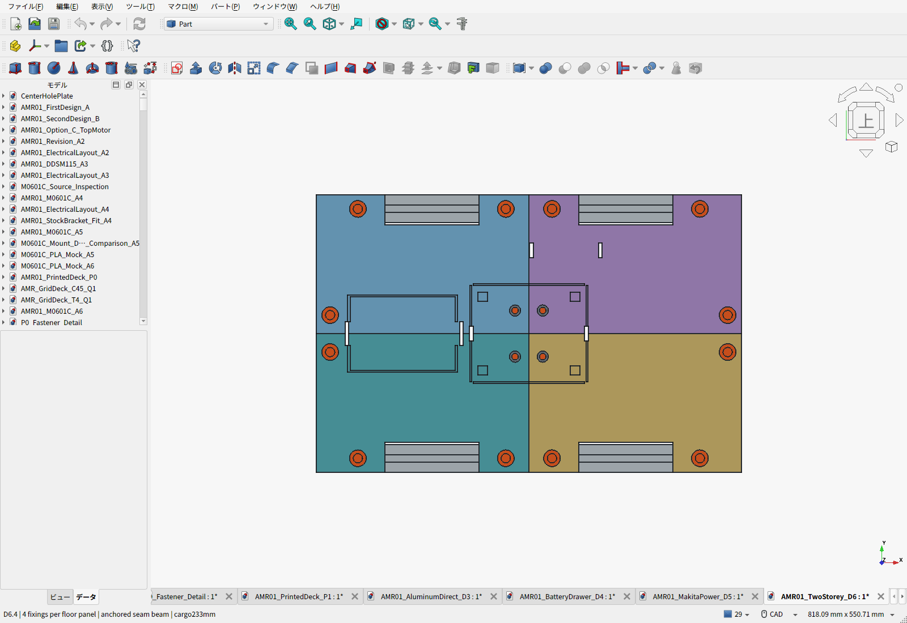
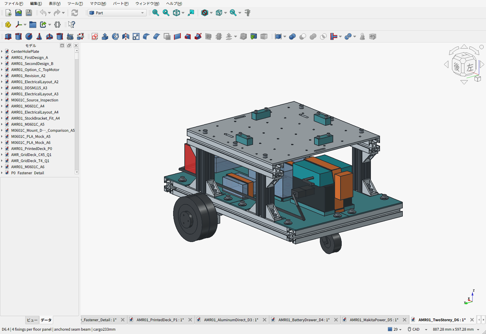
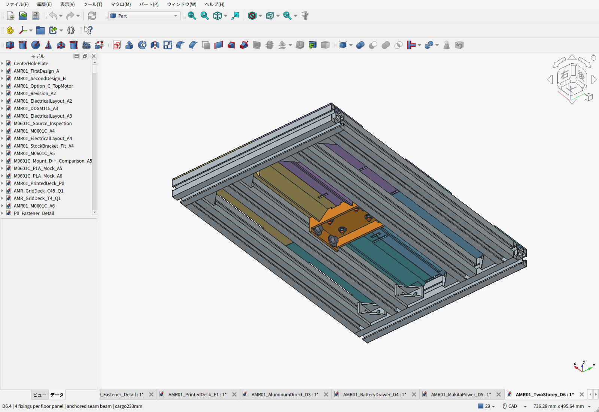
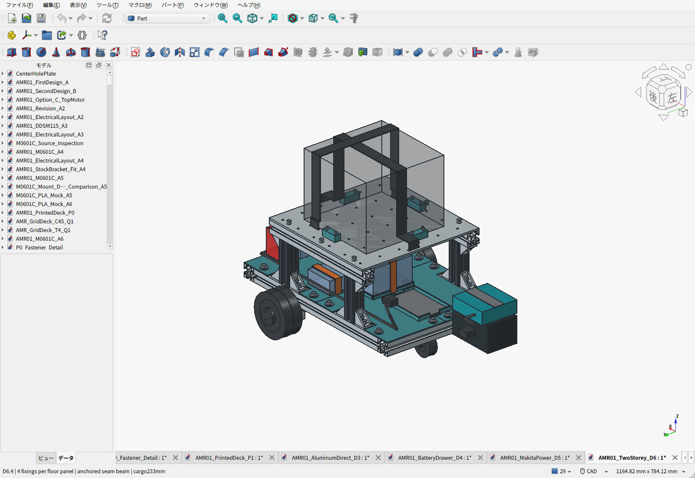
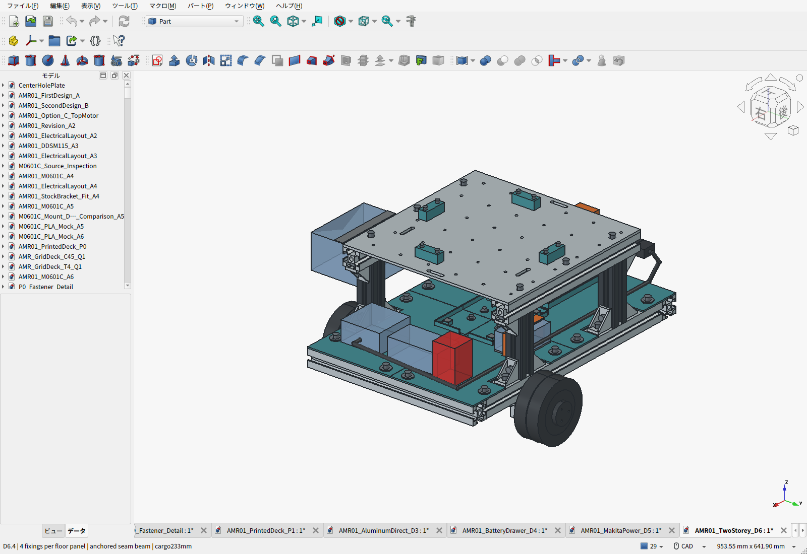
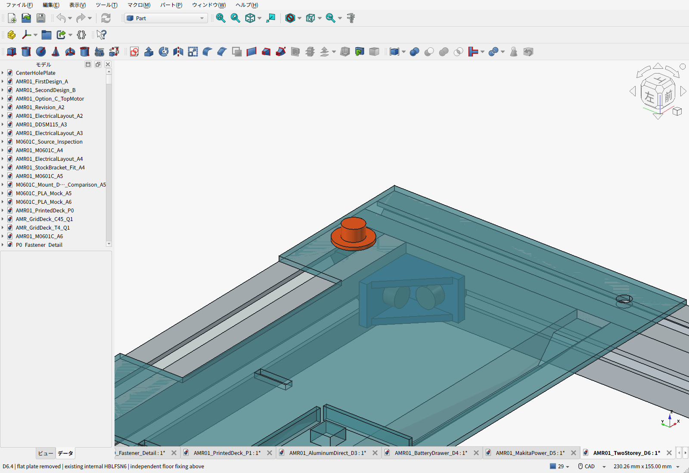

# D6.4：PLA床の皿穴を廃止、通常ねじ＋大径座金へ

**PC下の中央4本をM4通常ねじ＋上下OD12座金へ変更し、皿穴周辺の0.65mmの薄肉をなくした。PC受けを床に一体印刷し、PC座面だけ4mm高くする。** 各床4点・計16点固定、角のM6＋大径座金、中央の両端支持を維持する。 車体推計10.029kg、前版から約12g増。車体10kgは目安とし、通常積載目標10kgを継続する。

[床の見直し・座標・組立順](FLOOR_REVIEW.ja.md)／[重量・積載の計算](PAYLOAD_REVIEW.ja.md)／[読みやすいBOM](BOM.ja.md)

電池・計算機・電源は基礎3030上の1階、格子穴アルミ荷台は2階。[参照したロボコン機体と設計理由](REFERENCE_DESIGNS.ja.md)。青い箱は未選定機器の予約外形。電池とアダプターもカタログ寸法の包絡であり、ラッチまで再現したCADではない。

| 項目 | 現行構成 |
|---|---|
| 1階床 | PLA4分割、基本厚2.4mm・裏リブ15mm、床上面101.4mm |
| 床固定 | 各板3本のM6＋OD18座金、中央1本のM4通常ねじ＋上下OD12座金 |
| 中央支持梁 | PLA64×100×25mm、両端を各2本のM6で内側3030へ固定 |
| 電池 | BL1860B113×75×62mm、アダプター95×90×30mm、座面104mm |
| PC | 120×100×60mm・0.5kgの予約、座面108mm、硬い受け4か所＋1mmパッド、上15mm通風・横30mmコネクタ空間 |
| 荷台 | 6061-T6・300×300×4mm、上面233mm、φ4.5格子穴36個・50mmピッチ |
| 上段支持 | 切断済100mm3030支柱4本＋300mm上段レール2本。下端金具各2個・上端各1個 |
| 電池交換 | 電源OFF・配線とベルト解除→8mm持上げ→後方220mm、荷台を残す |
| PC交換 | 配線・ベルト解除→8mm持上げ→側方230mm |

上下段の鉛直荷重はアルミ部材の端面で受ける。上段支柱用金具12個・M6×12ねじ24本・溝ナット24個というD6.1の根元両側補強は継続する。SUS支柱とMISUMI金具の公称寸法はCADで照合済みだが、混用の現物座面・ねじ底付き・締付け・横揺れは未検証。[上下締結画面](cad-screen-frame-joint.png)／[下端](cad-screen-frame-joint-lower.png)／[上端](cad-screen-frame-joint-upper.png)／[前回の接合部レビュー](JOINT_REVIEW.ja.md)

## 配置・交換・検査

276物理部品・37,950組の体積干渉、予約機器、連続交換包絡、キャスター旋回、タイヤの外向き抜出し、36格子穴、支柱金具の工具経路を検査した。保存FCStd・STEPの体積と形状を再照合し、印刷5部品の閉じたSTLを確認した。床固定の座面と工具経路も別スクリプトで検査する。電池交換上端と荷台裏締結部の余裕は16.3mm。

通常荷物10kg、構造比較荷物15kg/SF2は設計目標で、実機認定ではない。今回の比較範囲は車体10.5kgまで。車体CGはX±25・Y±15・Z160mm以下、荷物CGはX/Y±30・Z330mm以下。追加機械ブレーキなし、平坦な屋内床を対象とする。

上段レールの2倍荷重比較は応力7.13MPa・たわみ0.0253mm、支柱1本へ集中する圧縮比較は1.56MPa。天板は同じ加工形状・6固定点なので従来の板単体解析を限定的に参照する。接合部の柔軟性、PLAの長期保持、実機温度・停止性能は含まない。[部材計算と限界](structure_screening.json)

1階PLAは実形状5部品の解析を追加した。電装2.4kg＋PLA自重・100%充填相当・E=1000MPaの仮定で、脚4個の機器を載せた最大たわみは0.20mm、ベルト10N／脚では0.61mm。皿穴をなくして全厚2.4mmを残し、座金の支持面積を増やした。ベルト反力の課題は残る。局所応力の収束、締付けと長期保持は未確認。[PLA計算書・解析画像](pla-strength/README.ja.md)

## 四隅の見直し

四隅の61mm角の逃げを廃止し、床を外周まで伸ばした。平面三角板は廃止し、既存の内側HBLFSN6金具8個でフレームを接合する。延長した床は上から独立して締める。[上面配置・撤去・下面配置の比較](CORNER_REVIEW.ja.md)

## 費用・データ

全車の途中小計は**75,472円＋120.90USD＋未計上分**、記録済み参考為替では約94,486円。今回のPLA材料消費参考は前版より6円増。中央ねじ60本770円・座金50枚288円・2店舗送料参考775円で1833円を計上した。使用するのはねじ4本と座金8枚で、新たに増える物理部品は上座金4枚。下座金4枚は交換。旧皿ねじ代は未計上だったため架空の節約分を差し引かず、途中小計は1839円増。配送先・まとめ買いで送料は再確認する。[販売ページ記録](plain_hole_fastener_observations.json)。溝ナットは70/100個使用し、追加パック不要。PLA単価2円/gは材料消費基準で、実スライス・サポート・失敗分・工賃は含まない。

荷台の製造STEP/PDFは既存D3と同一。JLCCNCの天板38.65USD、モーター金具82.25USDという実サイト見積記録を、同じ加工品として継承する（送料込み、未発注・担当者審査前）。今回の床支持で追加金属加工は不要。

- [FreeCAD](AMR01_TwoStorey_D6.FCStd)／[構造STEP](AMR01_TwoStorey_D6.step)／[電池・PC外形付きSTEP](AMR01_TwoStorey_D6-with-equipment-envelopes.step)
- [床4枚＋支持梁1個の印刷ZIP](D6-first-floor-print-files.zip)／[寸法・材料体積・印刷注意](print_manifest.json)
- [BOM・費用割合](BOM.ja.md)／[全明細CSV](BOM.csv)／[費用JSON](cost_summary.json)
- [CAD検査](validation.json)／[保存物再検査](saved_artifact_validation.json)／[床支持検査](floor_support_review.json)
- [設計要件](../requirements.json)／[電源選定](../makita-power/power_selection.json)／[成果物ハッシュ](release_manifest.json)
- [D6.4 URDF・Isaac Sim5向け手順とMuJoCo走行GIF](../../../sim/isaac_sim/README.ja.md)

実物の印刷・組立・通電・積載走行は未実施。3DプリントはP1S寸法内だが、スライサー設定と実物確認が必要。荷物ストッパはD3の[XN](../aluminum-direct-deck/PrintedStopXN.stl)・[XP](../aluminum-direct-deck/PrintedStopXP.stl)・[YN](../aluminum-direct-deck/PrintedStopYN.stl)・[YP](../aluminum-direct-deck/PrintedStopYP.stl)を継承する。
