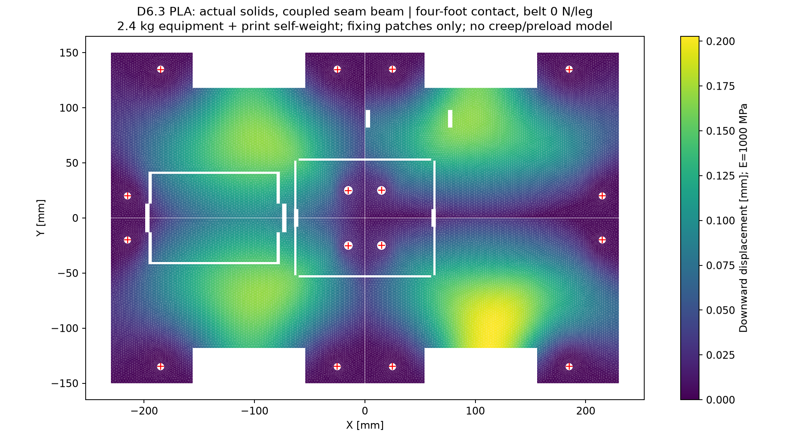
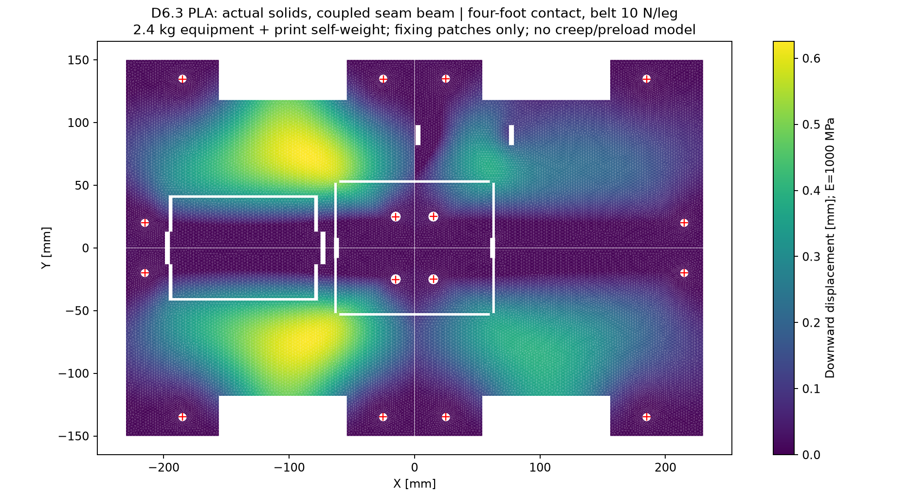

# D6.3 PLA床：実形状の強度・たわみ計算

**PLAも計算できる。床4枚と中央支持梁の実CADを解析し、電装の自重よりも、機器の接触面積・ベルト締付け・皿ねじ座面を優先して見直すべきことが分かった。** これは短時間の線形弾性比較で、印刷物の安全率2や長期耐久を認定する結果ではない。

## 荷重と材料条件

1階電装2.4kg（電池・アダプター等0.953kg、PC等0.525kg、通信0.055kg、保護0.2kg、電源0.2kg、配線等0.467kg）に、床4枚＋支持梁の中実換算自重0.556kgを加えた。上段の荷物10kg／構造比較15kgは金属支柱と3030で受けるため、この床荷重に混ぜていない。

機器下面が面で荷重を伝える場合と、各機器が10×10mmの脚4個で接する場合を比較した。電池・PC・通信機器の3本の閉じたベルトをモデル化し、各脚の張力を0・10・30Nとした。1本のベルトは機器へ2Tを下向き、床裏へ各Tを上向きに加えるため、全体への追加鉛直力はゼロだが、局所的な曲げが増す。張力は実測値ではなく感度確認用で、0Nは重力だけの比較条件である。

銘柄未回答のためPLA Basic相当・100%充填を仮定。弾性率E=1000MPa、ポアソン比0.35の均質等方体とした。E=1000MPaは低剛性側を比較するための仮定で、あらゆる印刷方向の下限保証ではない。内部空隙を含む実印刷形状はモデル化していない。

[Bambu TDS V3.0](https://store.bblcdn.com/s1/default/58b85d0f3db94878854a28fdb8a0006e/Bambu_PLA_Basic_Technical_Data_Sheet.pdf)の引張強さはXY35±4MPa・Z31±3MPa、ヤング率はXY2580±220MPa・Z2060±170MPa。ただし100%充填・55°Cで8時間処理した試験片の代表値で、今回の部品の許容値ではない。曲げ強さを引張許容値に流用していない。

## 結果

下表は細かいメッシュの結果。引張値は積分点の最大主応力で、局所ピークを除外していない。

| 機器の接触 | ベルト1脚の張力 | 最大下向きたわみ | 最大引張主応力 | 荷重を全て2倍にした引張要求値 |
|---|---:|---:|---:|---:|
| 面支持 | 0N | 0.177mm | 1.39MPa | 2.77MPa |
| 面支持 | 10N | 0.363mm | 3.08MPa | 6.16MPa |
| 面支持 | 30N | 0.888mm | 12.33MPa | 24.66MPa |
| 10mm角の脚4個 | 0N | 0.203mm | 1.42MPa | 2.83MPa |
| 10mm角の脚4個 | 10N | 0.626mm | 6.44MPa | 12.88MPa |
| 10mm角の脚4個 | 30N | 1.545mm | 20.17MPa | 40.35MPa |

「2倍」は重力・ベルト張力をともに2倍にした線形計算上の要求値で、材料がそれを満たすと確認した値ではない。実機衝撃や締付け軸力は別。全PLAのEを一様に変える場合、たわみは1000/E倍となるが、異方性や部品ごとに異なる剛性はこの倍率では扱えない。





色は変位量、赤い＋は各床の固定位置。形状を変形させたCAD画像ではなく、解析結果の分布図。

### メッシュ・境界条件の限界

[Gmsh](https://gmsh.info/doc/texinfo/)4.15.0で最大辺長4mmと2.5mmの二次四面体C3D10を作り、CalculiX2.21を1スレッドで実行した。各床5ケース・梁5ケースの単位応答から、中央4接合点の並進を梁の4×4柔軟性行列で連成した。全25ケースの反力・モーメントのつり合い、柔軟性行列の相反性、全体荷重のつり合いを検査した。

各床の3本のM6は座金相当範囲の鉛直変位を拘束し、中央M4も小範囲の鉛直変位をそろえる。梁端は4本のM6周辺を理想固定。レール上の連続接触を省く一方、座面や梁端を理想拘束しているため、全ての応力・たわみの安全側上限とはいえない。中央接合の回転とモーメント伝達、ボルト接触・締付け軸力・すべりは未解析。

| 条件 | 粗→細の最大たわみ変化 | 粗→細の最大引張ピーク変化 |
|---|---:|---:|
| 面支持・0N | -0.6% | -0.2% |
| 面支持・10N | +1.6% | +9.3% |
| 面支持・30N | +1.8% | +32.7% |
| 脚4個・0N | -0.1% | +8.0% |
| 脚4個・10N | -1.8% | +18.9% |
| 脚4個・30N | -1.6% | +18.9% |

局所ピークは皿ねじ近傍やベルト穴端などに出る。粗細2段階の比較だけでは収束を証明できず、最大値を除いた99パーセンタイルを合否値として置き換えることもしない。大きなたわみの条件は、接触・幾何学非線形も含む追加評価が必要。部品別の位置・反力・応力と各誤差は[result.json](fine/result.json)に記録した。

## ねじの締付けは別に計算する

CADからM6座金の投影座面約220.26mm²、M4皿頭の投影座面約34.24mm²を取得した。皿穴の小径端付近には公称0.65mmの肉厚しか残らない。これは破損を実証したという意味ではないが、局部評価を省けない形状である。

[NASA Fastener Design Manual](https://ntrs.nasa.gov/api/citations/19900009424/downloads/19900009424.pdf)の簡易式T=KFdを使い、K=0.15〜0.30を仮定した感度比較を行った。このK範囲はPLA締結の実測範囲ではなく、トルクの推奨値でもない。投影平均圧縮p=F/Aは、皿面の局所接触・くさび作用・裏面の支持圧を含まない。

| 座面 | 仮定トルク | 軸力 | 投影平均圧縮 |
|---|---:|---:|---:|
| M6座金 | 0.2N·m | 111〜222N | 0.5〜1.0MPa |
| M6座金 | 0.5N·m | 278〜556N | 1.3〜2.5MPa |
| M6座金 | 1.0N·m | 556〜1111N | 2.5〜5.0MPa |
| M4皿頭 | 0.2N·m | 167〜333N | 4.9〜9.7MPa |
| M4皿頭 | 0.5N·m | 417〜833N | 12.2〜24.3MPa |
| M4皿頭 | 1.0N·m | 833〜1667N | 24.3〜48.7MPa |

特にM4皿では、小さな締付トルクでも機器重量による反力を大きく上回る軸力になり得る。引張強さ31MPaから圧縮や長期クリープの許容値を決めることはできない。金属同士のM6トルクをPLAにそのまま適用しない。

## 設計判断と残る確認

電装重量だけで直ちにPLAをやめる結果ではない。まず機器の脚下に剛性のある受け板・パッドを置くこと、ベルト反力をリブ／3030へ近づけること、中央皿ねじ周辺の局部増肉・裏当て・圧縮カラーを比較することを優先する。柔らかいスポンジを敷くだけで面支持になるとは仮定しない。今回の計算だけから「ベルト10N以下なら安全」という使用限界も設定しない。

暫定印刷案は0.4mmノズル、0.2mm積層、壁6周、上下6層、100%充填。床は水平・裏リブ下向き＋サポート、中央梁は広いフランジをベッド側として溝のブリッジを確認する。実スライス・サポート量・造形・熱処理は未実施。この条件でもTDSの再現は保証されない。20%などの充填率へ変更した場合は中実モデルの結果を流用しない。

長期変形は弾性率と短時間強度だけでは算出できない。同じ材料・造形・荷重・温度に対応するクリープデータが必要。[PLAの長期曲げ実験](https://arxiv.org/abs/2302.11240v2)でもガラス転移温度より低い温度で時間依存変形が報告されている。まず実物に既知重量と測定したベルト張力を与え、たわみ・残留変形・ねじの保持を照合し、その後に実機温度と保持時間で確認する。

下部3030の四角形が横荷重でひし形に変形する剛性は、このPLA解析に含まれない。PLAをフレームの筋交いとして計上せず、8個のHBLFSN6接合部のすべり・回転・締付け条件を別に確認する。メーカー1176Nという金具の掲載値は、現車全体のねじりや接合モーメントの許容値ではない。[金属構造の計算と未確認点](../structure_screening.json)。

## 再現・成果物

[総合JSON](summary.json)／[粗メッシュ](coarse/result.json)／[細メッシュ](fine/result.json)／[解析スクリプト](analyze.py)。STEP5点は保存済みD6.3 FCStdから直接抽出し、[geometry.json](geometry.json)のSHA256で紐付けた。CAD・STL・BOMの形状／金額は今回変更していない。中実換算556gは既存計上と一致するが、サポート材等の印刷費は実スライスまで未確定。

各メッシュの部品別solver.zipは入力INP・メッシュMSH・GEO・実行ログを収録。大容量の生DATはリポジトリへ重複保存せず、SHA256を結果JSONに記録した。INPをCalculiXで実行すれば再計算できる。使用した2.21配布バイナリでは2スレッド時に荷重つり合いの不一致を検出したため、その結果は採用せず、全ケースを1スレッドで計算し直した。RF出力は反力＋節点荷重なので、拘束節点のCLOADを差し引いて反力を評価している。

```sh
python analyze.py --size 4 --name coarse --work /tmp/pla-coarse --gmsh /path/to/gmsh --ccx /path/to/ccx --ccx-lib /path/to/ccx-libraries
python analyze.py --size 2.5 --name fine --work /tmp/pla-fine --gmsh /path/to/gmsh --ccx /path/to/ccx --ccx-lib /path/to/ccx-libraries
python review.py
```

Python依存：numpy・meshio・matplotlib。既存結果の再集計は`--reuse`を付ける（生成入力の一致とつり合いを再検査する）。形状を変えた場合は新しい作業ディレクトリでメッシュから再作成する。
