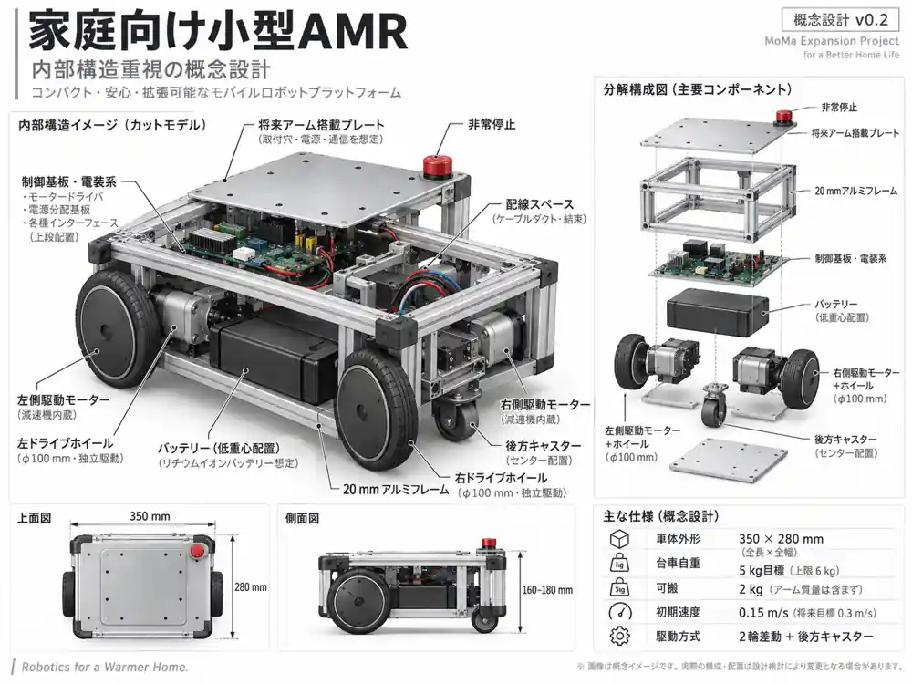

# AMR-01 設計案 v0.2.1 — 内部構造優先・外装意匠不要

更新日：2026-09-20  
更新元：AMR-01 v0.2（数値設計・計算条件を継承）  
**段階：概念設計。製作図・発注用部品表・実機性能保証ではない。**

本版を現行の設計基準とする。v0.2.1では内部構造図と設計方針を追加し、v0.2の寸法・重量・駆動・安定性の計算条件は変更していない。旧版の大型アーム・40kg級台車を前提にした寸法、駆動仕様、把持条件は適用しない。数値を小さく置き換えるだけでなく、重量予算・支持領域・運転範囲・未決定事項を定義し直した。

## 内部構造の参考図



**図1：会話で作成した内部構造の概念イメージ。** 外観用のコンセプトボードは本版に採用しない。図は閲覧用に縮小・圧縮しており、原図の「v0.2」表記をそのまま残している。製作CAD、実部品の寸法、干渉検証、強度検証の結果ではない。

図の左右・前後、寸法矢印、フレーム段数、アームプレートの大きさ、駆動軸支持等を、そのまま加工・調達の根拠にしない。**食い違う場合の優先順位は、本設計書の要求と数値表 → `design_parameters.json` → 参考図。** 本文とJSONに相違が生じた場合は、製作を止めて両者を同じ版へ修正する。

## 1. 目的と確定条件

目標は将来のMoMa（移動マニピュレータ）化。その入口として、家庭内で使う小型AMRを製作する。

**ユーザーが今回明確にした条件は「前案は大きく重すぎる」「運搬物は2kgでよい」「運搬物の質量はアーム自重とは別枠」である。** 家の通路幅・収納寸法・床条件はまだ実測していないため、家庭内への適合が確認できたとは扱わない。

| 区分 | 現行条件 | 状態 |
|---|---|---|
| 運搬物 | 合計2kg以下。荷台の物体と把持中の物体を合算 | ユーザー要求。合算方法は設計上の定義 |
| アームとの区別 | アーム系の自重は運搬物2kgに含めない | ユーザー要求 |
| 小型化・軽量化 | 家庭内に収まり、前案より軽い機体を優先 | ユーザー要求 |
| 外装・外観 | **見た目を整える外装・化粧カバー・装飾は不要**。内部構造を優先 | ユーザー要求 |
| 機能上の保護 | 巻き込み・挟み込み・電気接触・鋭利部等への必要な保護は残す | 設計上の必須条件 |
| 外形 | 長さ350×幅280mm、車輪・ガード・収納した持ち手込み | 本版の設計目標 |
| 台車高さ | 160〜180mm、アーム・センサーポールを除く | 本版の設計目標 |
| 台車自重 | 目標5kg、上限6kg。搭載電池・計算機・センサー・保護回路を含む | 重量予算。実測値ではない |
| 将来のアーム系 | アーム、グリッパー、専用取付板、専用電装・電源等を合計2kg以内 | 仮の拡張予算。採用機種なし |
| 最大構成の総質量 | 台車5kg時は9kg、上限6kg時は10kg | 上記から計算 |
| アームが持ち上げる物体 | **未確定** | 運搬2kgを、そのまま把持能力と解釈しない |

アーム系に別バッテリーや制御箱を追加する場合も、その質量を上記のどちらかへ必ず計上する。荷物と別だからといって、アーム用機器を無制限に追加しない。

寸法・質量に収まらないときは、まず部品・配置・構造・搭載機能を見直す。可搬2kgや停止・保護機能を無断で削らず、車体拡大・重量上限引上げにも自動的に戻さない。

### 1.1 初期運用の範囲

屋内の乾燥した水平な硬い床、監督者のいる隔離された試験区画から開始する。初期速度は0.15m/s以下、初期旋回角速度は0.3rad/s以下。検証後の目標上限は0.3m/s・0.6rad/s、並進加速度は0.2m/s²以下とする。

坂5°は駆動力の計算条件であり、走行許可ではない。段差の高さ・形状、ラグ、敷居、コード、床への傷、キャスターの向き直しは実物で確認する。階段、濡れ床、屋外、無監督で人やペットと共有する運用は初期範囲外。

アームは移動時に収納し、水平床で停止・保持成立を確認してから正面を操作する。初期は移動とアーム動作を同時に行わない。

### 1.2 外装意匠を設計対象から外す

**外面をよくする必要はない。見栄えのための外装・化粧カバー・装飾は設計・購入・製作の対象に含めず、フレームと機器が見える試作機を基本とする。** 優先するのは、構造上の荷重の伝達経路、車輪支持、内部機器の配置、電池の低位置固定、配線、放熱、調整・交換のしやすさである。

見栄えのための樹脂シェル、装飾パネル、光沢塗装、化粧用の角カバーは不要。外観を整えるためだけに質量、外形、予算を増やさない。天板や側板は、荷物の支持・構造補強・機器取付・安全保護等の役割がある場合のみ設ける。

**外装不要は、安全保護不要という意味ではない。** 車輪・ベルト等の巻き込み防止、電装端子・基板の接触保護、配線の擦れ対策、鋭い端部の保護、電池保持は別扱いとする。全面の化粧外装で覆う必要はないが、リスクのある箇所には最小限の局所ガードを取り付ける。通電・走行試験時のガードを、見やすさのために外したまま運転しない。

## 2. 機械構成と配置

### 2.0 内部構造図の読み方と配置方針

図1から採用するのは部品の役割と配置の考え方であり、描画された形状の全採用ではない。

| 内部要素 | 採用する考え方 | 製作前の確認・未確定事項 |
|---|---|---|
| 20mm角フレーム | 低い外周フレームと横梁を主構造にし、必要箇所を補強 | 図の上下二段の箱型フレームを新しい必須条件としない。部材本数・切断長は本文の仮構成を基準とする |
| アーム取付部 | 専用プレートから横梁、左右主梁、車輪支持部へ荷重を流す | 大きな全面天板をアームプレートとして確定しない。140×180×4mm・中心(60,0,170)は暫定値 |
| 左右駆動部 | 左右独立の減速機付きモーター、エンコーダ、車輪 | 図の軸直結を採用決定しない。減速機の許容支持荷重を確認できなければ独立軸受と伝達部を設ける |
| 電池 | 下部に機械的に固定し、取り外し経路を確保 | 図の黒い箱は体積イメージ。マキタの特定型番・専用電池の採用を示すものではない |
| 電装・制御基板 | モーター付近の駆動段、保護・電源分配、マイコン等を保守可能に配置 | 基板の実寸、端子保護、絶縁、放熱、工具アクセスを確認。図の基板を実在の採用品とみなさない |
| 後方キャスター | 後部中央の1輪支持 | 旋回軸(-110,0)、車輪径50、トレール15以下等は暫定。図で駆動輪近くに見える位置を採用しない |
| 配線 | フレームに沿って固定し、可動部・駆動部から離す | 電池着脱、コネクターの抜き差し、曲げ余裕、引張止め、電力線と信号線の経路を実配置で決める |
| 非常停止・持ち手 | 構造部に取り付け、手が届く位置とする | 荷物や収納アームで非常停止を隠さない。図の穴位置や取付方法は未確定 |

#### 2.0.1 高さ方向・保守空間

下部を電池・駆動部の配置候補、中上部を電装の配置候補とするが、上下二段の全面板を固定条件としない。重量・配線・熱・電池取り外しが成立する範囲で、電装も低い位置へ配分する。アーム取付部を支える構造と、電子基板の取付スペーサーを混同しない。

電池取り外し、主ヒューズ・コネクター点検、車輪固定ねじへのアクセスを、機体全体の分解なしに行える配置を目標にする。点検用の開口と、通電・走行中の安全保護を両立する。図にない安全部品や固定金具の質量も重量予算へ含める。

#### 2.0.2 図から確定しないもの

全ての実部品の型番・形状、モーター長、電池寸法、フレームの穴位置、プレート厚の最終値、車輪軸の荷重支持、制動方式、冷却性能は未確定。採用品の寸法で配置を確認するまでは、本図を実寸組立図・製作図として扱わない。

### 2.1 寸法・座標の暫定値

車体中心の床面を原点、xを前、yを左、zを上とする。以下の単位はmm。寸法は部品選定前の配置案であり、切断・穴加工の指示ではない。

| 部位 | v0.2の配置・寸法 |
|---|---|
| 車体外形 | 350×280、高さ160〜180 |
| 主フレームの平面外寸 | 320×200 |
| 主構造材 | 20×20、低い外周フレーム＋横梁＋必要な支柱・補強板 |
| 駆動輪 | 直径100、幅25を仮置き、左右2輪 |
| 左右駆動輪接地点 | (90, +120)、(90, -120) |
| 車輪中心間隔 | 240 |
| 後方キャスター | 直径50を仮置き、旋回軸(-110, 0) |
| キャスターのトレール | 15以下を目安、採用品で確認 |
| キャスター金具込み旋回半径 | 45以下を目安、採用品で確認 |
| 最低地上高 | 25を目標、キャスター・モーター金具を含めて確認 |
| アーム取付中心 | (60, 0, 170)を仮置き |
| アーム用プレート | 前後140×左右180×厚さ4の初期案。アーム系の重量へ計上 |
| 電池 | 低い位置で固定、機体を大きく分解せず取り外せる配置 |
| 持ち手 | 収納時は外形内、台車を持ち上げるための構造部へ接続 |

計算上、車輪外端はy=±132.5で幅280の内側に入る。キャスター包絡の後端はx=-155で長さ350の内側に入る。ただし、これは単純な外形計算だけであり、ハブ、配線、ベルト、モーター、ねじ、カバー、タイヤ変形まで収まることの確認ではない。

### 2.2 2輪差動駆動＋後方1キャスター

前寄りの左右輪を独立駆動し、後方中央の1キャスターで支持する。初期はサスペンションを設けない案とする。

**支持領域は長方形の車体外形ではなく、接地点による三角形。** 後方・側方にアームを伸ばしてよいとは扱わない。キャスターの向きで接地点が変わるため、静的計算ではトレール15mmを全周1440方向でサンプリングする。有限サンプリングであり、連続全方位の厳密保証ではない。

前面中央にはアームが床へ向かう経路を確保する。車輪・伝達部・鋭い端部を覆い、電池・荷物が動かないよう固定する。アームの実軌道が決まるまでは、カメラ等の前面突出位置を確定しない。

### 2.3 旋回スペース

車体が左右対称でも、旋回中心は車体中央ではなく、x=90の車軸中央になる。

その場旋回時に車体矩形が通る範囲の直径は、

```text
D = 2 × sqrt((350/2 + 90)^2 + (280/2)^2)
  = 599.4 mm
```

**保管時は350×280mm、理想的なその場旋回では車体だけで直径約600mm。** 壁との余裕、制御誤差、物体、収納アームのはみ出しは別に加える。幅280mmの隙間で旋回できるという意味ではない。

最小通路幅、曲がり角、収納高さ、運搬経路、電池を抜く方向は実測して照合する。室内寸法の確認前に「家に入る」と確定しない。

## 3. 重量予算

目標5kgを次のように配分する。**以下は調達済み部品の積上げではなく、部品選定時の配分目標。** 特に駆動・保持機構、搭載計算機、電池の組合せで成立するかは未検証。

| 区分 | 台車への配分 |
|---|---:|
| フレーム・構造板・締結材 | 1.50kg |
| モーター・減速機・エンコーダ・車輪・支持軸・キャスター・保持機構 | 1.15kg |
| 電池・取付アダプター | 0.75kg |
| 電源変換・保護・非常停止 | 0.40kg |
| 搭載計算機・センサー・冷却 | 0.50kg |
| 配線・機能保護カバー・持ち手（化粧外装を除く） | 0.40kg |
| 未配分余裕 | 0.30kg |
| **目標合計** | **5.00kg** |

上限6kgは部品選定時の再配分枠であり、追加1kgを最初から重りに使う意味ではない。ラジコン段階は上位計算機等を未搭載でもよいが、将来追加する際に再計量する。Jetsonの特定機種やLiDARが0.50kg枠内に入ることは未確認であり、型番は固定しない。

アーム系2kgの予算は別管理し、取付板や専用電源も含める。大型アームに備えたバラストは標準装備しない。軽く完成した場合は、その実質量で安定性を再計算し、予算上限まで載っていると仮定しない。

## 4. フレーム・車輪支持

### 4.1 20mm角へ変更

参照材はMISUMI HFS5-2020。メーカーの現行Web規格表では、質量0.5kg/m、断面二次モーメント0.742×10⁴mm⁴。フレーム、ブラケット、溝ナットのシリーズ互換性を確認する。[S1]

質量概算用の構成は320mm×2本、160mm×4本、100mm×4本。合計1.68m、押出材だけで0.84kgとなる。長手材と横梁で低い主フレームを作り、支柱は上面支持に使う。30mm角の上下二段フレームは採用しない。

アーム荷重は専用取付板→横梁2本→左右主梁→車輪支持部へ流す。必要箇所に側板・ガセットを設ける。薄い汎用天板や樹脂カバーだけにアームを取り付けない。プレート厚4mmは初期案であり、実アームの曲げ・ねじりモーメント、ボルト配置を確認して決める。

### 4.2 梁単体の参考計算

スパン160mmの単純支持梁2本に合計100Nを等分し、ヤング率69,000N/mm²を仮定すると、1本の中央たわみは、

```text
delta = P × L^3 / (48 × E × I)
      = 50 × 160^3 / (48 × 69000 × 7420)
      = 0.00833 mm
```

100Nは計算例であり、取付部の許容荷重ではない。ねじ接合部の滑り、板のたわみ、車体のねじれ、アームの曲げモーメントを含まないため、この値だけで「20角なら十分」と判断しない。旧版の鉛直500N・曲げ100N·m等の取付条件は撤回し、実アームの荷重包絡から再設定する。

### 4.3 軽量な駆動ユニットを選定する条件

車輪軸の荷重をモーター減速機が受ける場合は、ラジアル荷重・アキシャル荷重・許容片持ち長さを確認する。確認できなければ独立軸受で車輪を支持し、ベルト等で伝達する。旧版の大型の独立軸・ブレーキ・伝達部をそのまま流用しない。

車輪・キャスターの支持荷重を総質量/3で選定しない。各積載・アーム姿勢の接地反力、偏荷重、床の継ぎ目、制動時荷重を求めて定格と照合する。キャスター径50mmも暫定であり、家庭の敷居・ラグで適すると保証しない。

## 5. 駆動系の再計算

| 計算入力 | 値 |
|---|---:|
| 最大構成の総質量 | 10kg |
| 車輪半径 | 0.05m |
| 並進加速度 | 0.2m/s² |
| 勾配 | 5°、計算用 |
| 転がり抵抗係数 | 0.03、仮定 |
| 車輪数 | 左右の駆動輪2輪 |
| トルク余裕係数 | 1.5 |

```text
F = m a + m g sin(theta) + Crr m g cos(theta)
  = 13.482 N
T = F r / 2 = 0.337 N·m / 輪
T × 1.5 = 0.506 N·m / 輪
```

部品選定の目標は**車輪軸で連続0.8〜1N·m程度、最低使用電圧で負荷回転数約80rpm**。カタログの最大値・拘束トルクを連続値として使わない。24V表記のモーターを18V系で使うなら、その動作点の回転数・トルク・発熱を確認する。伝達損失は車輪より上流の選定時に加算する。

0.3m/s直進には57.3rpm、0.3m/sと0.6rad/s旋回を同時に要求すると、車輪間隔240mmの場合の外輪は71.0rpmとなる。このため80rpmを探索目安にする。ただし、坂での直進トルクと旋回回転数を別々に計算しただけで、坂での旋回抵抗まで検証したものではない。

ピークトルク、ピーク電流、許容時間は未確定。電流制限とタイヤ摩擦も設計する。トルクが大きければ安全とは扱わず、必要以上の押し付け力を生じない設定にする。

## 6. 将来のアームと転倒条件

### 6.1 運搬と把持を分離する

**2kgを荷台に載せて運ぶことを目標とし、2kgをアームで持ち上げるとは定義しない。** 500g等の把持重量もまだ採用条件ではない。旧版の「床から物体2kgを把持」「600mm級・自重10kgアーム」は本版では適用しない。

アームの採用条件は、系全体2kg以内、収納時の平面外形が原則350×280mm以内、必要な手先姿勢、床と車体との干渉回避、取付部強度、停止中の保持、全軌道の転倒余裕が成立すること。これらが成立する機種を未選定である。

参考として、肩を(60,0,240)、手先を(280,0,30)と置くと直線距離は304.1mm。リーチの公称値がこの距離を超えるだけで到達できるとは扱わず、逆運動学、肘の逃げ、グリッパー姿勢、特異姿勢を確認する。

### 6.2 軽量化後の静的感度計算

重い台車の安定性計算を流用せず、台車5kgと6kgの両方で計算する。以下は実アームではない仮の姿勢。荷台の物体をカウンターウェイトとして使わない。

| 構成物 | 質量 | 重心x | 重心z |
|---|---:|---:|---:|
| 台車 | 5kgまたは6kg | 0mm | 85mm |
| アーム・取付・専用機器を仮集約 | 1.7kg | +160mm | 240mm |
| グリッパー | 0.3kg | +280mm | 40mm |
| 把持物の感度計算 | 0 / 0.5 / 2kg | +280mm | 40mm |

前方転倒の支点は駆動輪接地点を結ぶx=90mmの線。復元側モーメントと転倒側モーメントを各質量の重心位置から計算する。

| 台車質量 | 仮の把持物 | 復元/転倒モーメント比 | 前方支持辺までの重心距離 | 読み方 |
|---|---:|---:|---:|---|
| 5kg | なし | 2.557 | +39.1mm | 仮の姿勢では内側。作業許可ではない |
| 5kg | 0.5kg | 1.661 | +23.9mm | 内側だが余裕は小さくなる。把持能力の保証ではない |
| 5kg | 2kg | 0.809 | **-11.8mm** | 仮の姿勢では前方転倒側。採用不可 |
| 6kg | 0.5kg | 1.993 | +31.6mm | 仮の姿勢の参考値。把持能力の保証ではない |
| 6kg | 2kg | 0.971 | **-1.6mm** | 仮の姿勢では前方転倒側。採用不可 |

負の距離は重心投影が支持辺の外にあることを示す。比が1を上回っても、十分な動的余裕があるという意味ではない。実アームが軽い、重心が後ろ、物体が近い等の場合は結果が変わる。

運搬時の例も同梱計算に含む。台車5kg、アーム収納2kg、荷台2kgの仮配置では、キャスター全周サンプリングの最小静的支持余裕は約51.0mm。ただし、荷物の移動、横張り出し、高い重心、傾斜、加減速、非常停止、接地の弾性は未検証。

必要な静的余裕の数値、動的許容範囲、把持重量は、実部品・使用場面・誤差を含めて別途決める。**本計算は運転許可判定を出さず、全ケースを未承認として出力する。**

不足時は、まずアームの軽量化、取付位置、リーチ、作業範囲を見直す。車体拡大やバラスト追加で解決することを既定路線にしない。

## 7. 電源・停止・保持

### 7.1 電源モジュール

マキタ18V電池の流用方針は残すが、採用品・容量・重量は未確定。MakitaのSTAR Protectionは工具と電池間で情報を交換する方式と説明されており、単純な2端子アダプターだけで同等の保護が成立するとは扱わない。[S2]

機外で正規充電器を使用し、パックを加工しない。主ヒューズ、過電流、過放電、温度異常、個別セル保護、配線・コネクター定格の成立を確認する。総電圧監視だけで個別セル保護を代用したと判断しない。これらを確認できない構成で走行試験を開始しない。

電池→主ヒューズ→分岐を基本構成とし、走行系と計算機・制御系を分ける。走行系には停止経路、駆動段、必要な回生エネルギー対策を設ける。実際の回生有無・母線電圧上昇を採用ドライバーの仕様で確認する。回生型ドライバーのメーカー仕様を参照資料として残すが、旧版のSabertooth 2x32を採用決定したものではない。[S3]

満充電、電池側遮断、主電源開放、電源装置での試験時も確認する。保護回路・回生吸収の電圧や電流定数は部品選定後に決める。

将来アームに別電源が必要なら、重量と外形に含めて再配分する。18V電池でアームまで必ず動くとは定義しない。

### 7.2 停止と位置保持

機体上にラッチ式非常停止を設け、PC・ROSを経由しないハードウェア経路を持たせる。解除しても自動再始動させず、明示的な運転再許可を必要とする。

**駆動禁止は停止完了と同じではない。** 駆動を切ったときに惰行する、保持が失われる等の挙動を調べ、制動と保持を合わせて設計する。PCの停止指令、PWMゼロ、減速機の摩擦だけで停止・保持を保証しない。

保持方式は軽量なブレーキ等を含めて未選定。保持専用品を走行中の非常制動に使う場合は対応定格が必要。方式未確定のまま坂道やアーム操作を解禁しない。アームは電源喪失時の重力落下・物体落下も別途考慮する。

遅延0.2s、減速度0.5m/s²を仮定した理想化された制御停止距離は、初期0.15m/sで52.5mm、上限0.3m/sで150mm。これは非常停止の性能保証ではなく、実際の停止距離は床・積載・制動方式別に測定する。

### 7.3 稼働時間は未確定

計算例として18V・6Ah、使用可能率80%、平均消費30Wなら2.88時間、50Wなら1.73時間。電池も電力も仮定であり、採用電池の重量予算適合、実測稼働時間、アーム込みの稼働時間を意味しない。容量を増やす前に台車質量・収納寸法と照合する。

## 8. 制御と段階的拡張

初期構成はラジコン受信器→マイコン→左右ドライバー。エンコーダで車輪速度を閉ループ制御し、受信途絶、PC通信途絶、マイコン異常、電圧異常を検出する。ラジコンとPCの指令を同時に採用しない。

USBを初期接続候補、CANを拡張候補とする。エンコーダ、車輪速度、電流、電圧、許可状態、故障を記録できる構成にする。制御周期・通信タイムアウトは機器の能力と停止距離から定め、ROSの既定値を安全性の根拠としてそのまま採用しない。

ROS化では`ros2_control`の`diff_drive_controller`を候補とする。車体速度指令から車輪指令を生成し、実測フィードバックによるオドメトリ、速度・加速度等の制限、指令タイムアウトを扱える。[S4]

車輪オドメトリとIMUの統合には`robot_localization`を候補とする。[S5] 上位計算機とセンサーを追加して地図・自己位置推定・Nav2へ進む。ROSディストリビューションやJetson型番はここで固定しない。

設計寸法の原点は車体中心だが、差動駆動の運動学の基準は車軸中央である。`base_link`等の基準座標を選ぶ際は、両者の90mmオフセットをURDF/TFへ正しく反映する。車体中心にあると仮定してオドメトリ・旋回を設定しない。

Nav2の`Collision Monitor`はセンサー情報を使う補助停止・減速層として検討する。[S6] 床際の障害物、段差、透明面、人・ペットとの接触をすべて検出できるとは扱わず、ハードウェア停止経路を残す。

アーム搭載後は「移動時は収納確認」「操作時は車輪停止・保持確認」という相互排他を下位制御にも設ける。学習モデルを導入しても、この制限と停止経路は迂回させない。

## 9. 製作・検証の順序

| 段階 | 実施すること | 次へ進む前の確認 |
|---|---|---|
| 0：室内・部品配置 | 通路・旋回・収納寸法の確認。モーター、電池、キャスター、保持機構のCAD配置と重量積上げ | 外形350×280内、台車6kg以下、部品干渉・電池脱着・配線が成立 |
| 1：台車の試作 | 車輪浮かせ試験→無積載0.15m/s以下→固定した運搬物2kg | 異常停止、意図しない再始動なし、固定・支持・発熱・床への影響が許容内 |
| 2：制御・記録 | エンコーダ/電流ログ、ROS指令、オドメトリ校正 | 実測車輪径・間隔・座標が一致。通信途絶と指令制限が動作 |
| 3：自律移動 | 重量枠内で計算機・センサーを追加 | 複数方向の停止距離、障害物検出範囲、監督下での動作を確認 |
| 4：アーム搭載 | 全姿勢の荷重・干渉・転倒解析後に、許可した小負荷から試験 | 把持重量・姿勢・作業範囲・保持成立を個別に確定 |

将来の最大構成試験は総質量だけでなく重心も再現し、試験治具で転倒・落下を防ぐ。旧版の34〜40kgを載せる試験は実施しない。上限10kgは設計計算枠であり、台車が完成しただけで自動的に載せてよいという意味ではない。

強度・停止・保護の検証前に、家庭内で無監督運用しない。軽量化のために非常停止、配線保護、挟み込み防止、電池保護を削除しない。

## 10. 未決定事項・次に確定するもの

| 項目 | 現状・確定方法 |
|---|---|
| 家庭内への適合 | 通路幅、曲がり角、収納高、床の実測が必要 |
| モーター・減速機・エンコーダ | 連続0.8〜1N·m級/約80rpm、最低使用電圧、寸法・発熱・質量を同時に確認 |
| 車輪支持・保持機構 | 荷重定格と停止・保持挙動を含めて選定 |
| フレーム加工・プレート | 採用部品のCADとアーム荷重で穴位置・厚さ・接合を確定 |
| 電池・保護・ドライバー | 保護成立、回生時電圧、質量・脱着スペースを確認 |
| アーム・把持重量 | 系全体2kg以内で全軌道の到達・干渉・転倒条件を検証 |
| 調達金額 | 見積未取得。旧版の15万円は本版の見積金額・確定予算として引き継がない |

**直近の設計確定点は、350×280mm・台車6kg以下を守れる駆動/保持ユニットと電池配置。** 本版では部品型番・製作CAD・URDFを生成していない。部品が未選定の状態で、それらが完成したとは扱わない。

## 11. 同梱ファイルと再計算

| ファイル | 内容 |
|---|---|
| `DESIGN.ja.md` | 本設計書 |
| `design_parameters.json` | 単位と未確定事項を付けた計算入力。把持上限は`null` |
| `check_design.py` | 重量、外形、旋回、駆動力、梁たわみ例、静的支持領域を計算 |
| `calculation_results.json` | 同梱入力による再計算結果 |
| `test_check_design.py` | 計算関数、制約、旧前提の混入を確認するテスト |
| `CHANGELOG.ja.md` | v0.1以降の変更点 |
| `assets/amr_internal_structure.webp` | 内部構造の参考図。製作図ではない |
| `TEST_RESULTS.txt` | 実行した24件の計算・文書構成テストの出力。実機試験ではない |
| `README.ja.md` | 実行方法とファイルの役割 |

Python 3.10以降の標準ライブラリのみを使用する。

```bash
cd docs/amr-01  # ZIP展開後は cd amr_v0_2_1
python3 check_design.py
python3 -m unittest -v test_check_design.py
```

入力値を変更する場合は`design_parameters.json`を編集して再実行する。設計書の表は自動更新されないため、結果が変わったら本文も同じ版として更新する。計算テストの合格は実機安全性の認定ではない。

## 参考一次資料

参照日は元のv0.2記載の2026-09-20。本更新では下記の参考資料を継承し、仕様の再調査はしていない。部品購入の決定ではない。

**[S1] MISUMI：アルミフレーム 5シリーズ 正方形20×20mm。** HFS5-2020の現行Web規格表で質量・断面二次モーメント・シリーズを確認。  
https://jp.misumi-ec.com/vona2/detail/110302683830/

**[S2] Makita：STAR Protection説明。** 公式ドメインの検索結果にある工具と電池間の保護通信の説明を確認。特定電池の保護回路・2端子流用時の仕様は未取得。  
https://makitatools.com/

**[S3] Dimension Engineering：Sabertooth 2x32 regenerative dual motor driver。** 回生型ドライバーの参考。採用部品ではない。  
https://www.dimensionengineering.com/products/sabertooth2x32

**[S4] ros2_control：diff_drive_controller。** 差動駆動の指令変換、フィードバック、制限、指令タイムアウト。  
https://control.ros.org/jazzy/doc/ros2_controllers/diff_drive_controller/doc/userdoc.html

**[S5] Nav2：Smoothing Odometry using Robot Localization。** 車輪オドメトリとIMU等の統合。  
https://docs.nav2.org/rolling/configuration_and_development/first_time_robot_setup_guide/odom/setup_robot_localization/

**[S6] Nav2：Collision Monitor。** 近傍センサーを用いた速度制限・停止の補助層。  
https://docs.nav2.org/rolling/configuration_and_development/configuration_guide/core_servers/collision_monitor/
