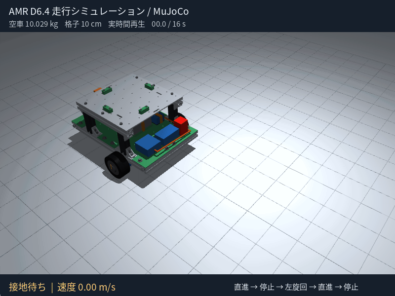

# AMR D6.4 → URDF / Isaac Sim 5

現行の2階建てD6.4を、左右駆動輪と後方キャスターが動くURDFにしました。**Isaac Sim 5.0 / 5.1向けのデータと取込スクリプトです。Isaac Sim本体での実行は未確認です。** この作業環境には本体がなく、URDF読込・幾何検査とMuJoCoでの補助走行確認を実施しました。

[ダウンロード：URDF・メッシュ・スクリプト一式](amr_d64_isaac5.zip)

| ファイル | 用途 | 合計質量 |
|---|---|---:|
| [amr_d64.urdf](amr_d64.urdf) | 空車。電池・計算機・電装の予算を含む | 10.029kg |
| [amr_d64_payload_10kg.urdf](amr_d64_payload_10kg.urdf) | 空車＋固定した10kgの荷物 | 20.029kg |
| [import_isaac_sim.py](import_isaac_sim.py) | Isaac Sim 5で取込・物理設定・USD保存・短時間走行 | — |
| [simulation_config.json](simulation_config.json) | 車輪寸法、初期速度、摩擦・制御ゲインの仮定 | — |
| `meshes/` | CADから変換した21個の表示用STL。単位m | — |

**URDFと`meshes/`を同じフォルダー構成のまま置いてください。** ROS、xacro、ROSパッケージの設定は不要です。D6.4では中央M4の皿穴を廃止した床、上下のOD12座金、床と一体のPC受けを取り込みました。PC座面は4mm上がって108mm、車体は約12g増です。各床4点固定、中央支持梁と裏リブ、内側の金属フレーム金具を維持します。変換処理自体はCADを保存し直しません。

下のGIFは、このURDFをMuJoCoで物理演算して描画した走行です。空車10.029kgで、**直進→停止→左旋回→直進→停止**を16秒・等速で再生します。格子は10cm間隔。車輪の金色の線は回転を見やすくする表示上のマークで、形状・質量・接触判定は変更していません。



[GIF単体（約3.4MB）](amr_d64_motion_mujoco.gif) ／ [描画条件・時系列・停止確認](motion_gif_manifest.json) ／ [静止画](urdf_preview_mujoco.png)

映像の生成元はMuJoCoです。Isaac Simでの実行映像や実機映像ではありません。

**Isaac Sim 5の画面から取り込む場合**

1. ZIPを展開し、Isaac Simの`File > Import`で`amr_d64.urdf`を開きます。表示されない場合は`Window > Extensions`で`isaacsim.asset.importer.urdf`を有効にします。
2. 基準単位はm、Z軸上向き。`Moveable Base`を選び、固定ベースを無効にします。`Import Inertia Tensor`を有効、`Collision From Visuals`・`Self Collision`・`Replace Cylinders with Capsules`を無効にします。固定関節の結合も無効とすると、積載版の荷物を別リンクで確認できます。
3. Joint Configurationで下表の2輪だけを速度駆動にし、キャスター2関節は`None`にします。Drive Typeは`Force`、位置剛性は0です。
4. 車体の最上位Xformを`Z=0.05235m`へ移動し、`Z=0`にGround Planeを置きます。タイヤ底面に初期2mmの隙間を設けています。車体原点は車軸中心なので、`Z=0`のままではタイヤが床に埋まります。

| 関節 | 軸 | 設定 |
|---|---|---|
| `left_wheel_joint` | +Y | Velocity / Force、最大0.96N·m |
| `right_wheel_joint` | +Y | Velocity / Force、最大0.96N·m |
| `caster_swivel_joint` | +Z | None、自由首振り |
| `caster_wheel_joint` | +Y | None、自由回転 |

左右輪の正回転で前進します。表示メッシュから衝突形状を作ると細かいねじ・溝まで計算するため、URDFに入れた箱・円柱の衝突形状を使います。インポート設定の説明は[NVIDIA公式5.0](https://docs.isaacsim.omniverse.nvidia.com/5.0.0/importer_exporter/ext_isaacsim_asset_importer_urdf.html)／[5.1](https://docs.isaacsim.omniverse.nvidia.com/5.1.0/importer_exporter/ext_isaacsim_asset_importer_urdf.html)に対応します。

**設定とUSD保存をまとめて行う場合**

Isaac Simインストール先の`python.sh`で、次を実行します。通常のPythonではIsaac Simのモジュールを読み込めません。`/path/to/amr_d64_isaac5`は展開したフォルダーへ置き換えます。リポジトリをcloneした場合は`amr-pj/sim/isaac_sim`です。

```bash
./python.sh /path/to/amr_d64_isaac5/import_isaac_sim.py --seconds 8
```

起動した専用画面で、1秒接地待ち→0.10m/sへ加速→減速停止を実行して終了します。実行前の停止状態を`output/amr_d64_scene.usda`へ保存し、関節数・総質量・実行時の位置を隣の`.validation.json`へ書きます。同名出力がある場合は`--output`で別名を指定します。

```bash
# 積載10kg、取込とUSD保存のみ
./python.sh /path/to/amr_d64_isaac5/import_isaac_sim.py \
  --payload 10 --seconds 0 --output /path/to/amr_loaded.usda

# 画面なしで、左旋回と停止を補助確認
./python.sh /path/to/amr_d64_isaac5/import_isaac_sim.py \
  --headless --speed 0 --yaw-rate 0.3 --output /path/to/amr_turn.usda
```

スクリプトは5系の`URDFCreateImportConfig`と`URDFParseAndImportFile`を使い、自由ベース、明示した慣性、キャスターの駆動解除、左右輪のトルク上限、1mmの接触オフセット、床の摩擦を設定します。参照した[5.0 API](https://docs.isaacsim.omniverse.nvidia.com/5.0.0/py/source/extensions/isaacsim.asset.importer.urdf/docs/index.html)と[5.0実装の引数](https://github.com/isaac-sim/IsaacSim/blob/v5.0.0/source/extensions/isaacsim.asset.importer.urdf/python/impl/commands.py)に合わせて作成しました。実際の環境で生成される`.validation.json`が、Isaac Sim上での確認記録になります。

**単位と運動の設定**

- `base_link`は左右車軸の中点。CAD座標では`(90, 0, 50.35)mm`、+X前方、+Y左、+Z上です。床投影の原点ではありません。
- 駆動輪径100.7mm、輪幅43mm、トレッド349mm。キャスター径50mm、トレール16mm。3輪の公称接地高さは一致します。
- 左右輪速度は`left=(v−ω×0.349/2)/0.05035`、`right=(v+ω×0.349/2)/0.05035`、単位rad/s。0.10m/s直進は左右とも約1.986rad/sです。
- 初期指令は並進±0.15m/s・旋回±0.3rad/sまで。各輪の接線速度変化を0.2m/s²で制限します。モーターの定格115rpmと車体の初期運用速度は別の制限です。
- USDのAngular Driveへ直接入れる速度は**deg/s**、IsaacのArticulation Controllerは**rad/s**です。0.10m/sは約113.79deg/s。スクリプトの速度制御ゲイン0.4N·m/(rad/s)は、USDで`Damping=0.006981317`、`Stiffness=0`、`Max Force=0.96`となります。[NVIDIAの角度・ゲイン換算](https://docs.isaacsim.omniverse.nvidia.com/5.0.0/robot_setup_tutorials/tutorial_rig_legged_robot.html)、[Articulation Controllerの単位](https://docs.isaacsim.omniverse.nvidia.com/5.0.0/robot_simulation/articulation_controller.html)

**重量・慣性の扱い**

合計は[現行D6.4の重量内訳](https://github.com/sige0002/amr-pj/blob/main/cad/amr07/two-story/payload_budget.json)と一致します。部品ごとの質量、根拠、重心、慣性テンソルを[export_manifest.json](export_manifest.json)へ保存しました。

| リンク | 空車時の質量 | 扱い |
|---|---:|---|
| 車体固定部分 `base_link` | 9.004875kg | フレーム、天板、電装、モーター固定側、キャスター取付座等 |
| 左駆動輪 | 0.450000kg | ローター仮定0.200kg＋タイヤキット予算0.250kg |
| 右駆動輪 | 0.450000kg | 同上 |
| キャスター首振り部 | 0.088716kg | キャスター全体165gを形状と材料比で配分 |
| キャスター車輪 | 0.035507kg | 同上。固定取付座の質量は車体側へ配分 |

公開モーターSTEPは内部のローター・ステーターを分離したモデルではありません。外観を取付端と外周缶に分け、1個485gのうち回転側200g・固定側285gと仮定しています。**慣性の分布には双方ともモーター全体のCAD形状を使い、固定側の質量を細い取付端だけに集中させていません。** 実測したローター慣性が得られたら更新します。タイヤキット250gも従来からの予算値です。

電池680g・アダプター123g、計算機500g等は従来の選定値／予算値。配線やベルトは質量を二重計上せず、別途分布を仮定しています。空車の荷物ベルトは天板上へ収納した質量位置、積載版は従来設計の高さ310mmへ移します。幾何から求めた空車重心はCAD座標で約`(3.13, -0.74, 122.29)mm`ですが、未測定の電装・質量分布に依存するシミュレーション値です。

積載版は200×200×160mm・10kgの一様な箱を、天板上面233mmへ固定した例です。荷物重心は313mmで、設計上の330mm以内。固定関節なので、ベルトの緩みや荷滑りは表現しません。

**実施した検証と残っている範囲**

[URDF検査結果](urdf_validation.json)：2モデルの読込、リンク木、21メッシュのパス・単位・ハッシュ、正定値かつ物理的な慣性、総質量、3輪の接地高さ、キャスター90°旋回時の軸位置、駆動方向を確認しました。

[MuJoCoの補助確認](mujoco_smoke_validation.json)：空車／積載10kgで直進・左旋回を各8秒実行し、停止、転倒なし、タイヤ以外の床接触なしを確認しました。直進距離は両方とも約0.500m。旋回角は空車約1.087rad、積載時約0.827radでした。理想運動学の1.5radより小さく、幅のあるタイヤの横滑りと仮の速度制御ゲインによる追従差が残っています。旋回方向と動作成立の確認で、旋回精度の合格判定ではありません。

摩擦係数・速度制御ゲイン・内部重量配分は初期仮定です。転がり抵抗、タイヤの変形、RS485の遅延、電源・回生・温度制限、停電をモデル化していません。速度0の駆動輪は通電中の速度制御です。機械ブレーキは追加していません。天板の穴・フレーム溝・小ねじ等は表示形状にあり、接触判定では省略しています。追加した床リブは保守的な矩形、支持梁はベルト溝を残す複数の箱で近似します。このモデルの走行結果から、実機の可搬認定、登坂能力、金具の安全率は判定しません。

**再生成・再検証**

リポジトリの元CADがある環境で、FreeCADのPythonコンソールから実行します。保存済みCADを読んで変換し、元CADは保存し直しません。

```python
import runpy
runpy.run_path('/path/to/amr-pj/sim/isaac_sim/export_urdf.py', run_name='__main__')
```

通常Pythonの隔離環境で検証します。Isaac SimのPython環境へ検査用パッケージを追加する必要はありません。

```bash
python3 -m venv /tmp/amr-urdf-check
/tmp/amr-urdf-check/bin/pip install -r sim/isaac_sim/requirements-validation.txt
/tmp/amr-urdf-check/bin/python sim/isaac_sim/validate_urdf.py
MUJOCO_GL=egl /tmp/amr-urdf-check/bin/python sim/isaac_sim/smoke_mujoco.py --render
python3 sim/isaac_sim/package.py
```

描画環境がない場合は`--render`を省略できます。検証用の浮遊ベース・床・制御器はMuJoCo実行時にだけ追加し、配布URDFは変更しません。[MuJoCo公式のURDF対応](https://mujoco.readthedocs.io/en/stable/modeling.html)

GIFは同じ検査用Python環境に加え、`ffmpeg`と日本語フォントを使います。下のコマンドで走行・描画・GIF変換を再実行し、240フレームのデコード、16秒の再生時間、転倒・タイヤ以外の床接触がないこと、最後の停止も検査します。フォントの場所が異なる場合は`--font /path/to/font.ttc`を指定します。

```bash
MUJOCO_GL=egl /tmp/amr-urdf-check/bin/python sim/isaac_sim/render_motion_gif.py
python3 sim/isaac_sim/package.py
```
